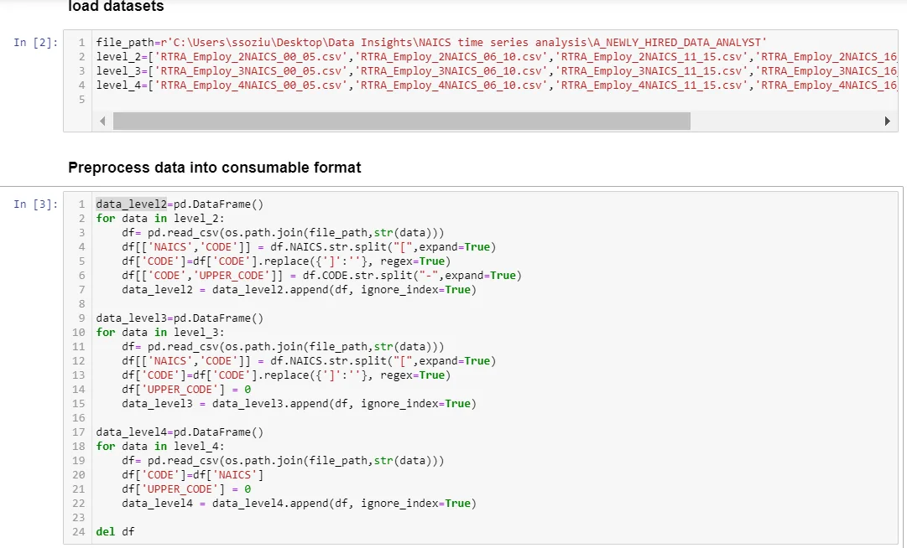
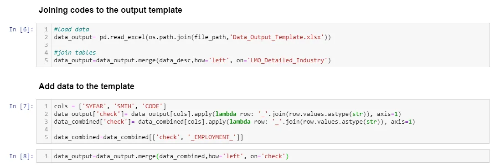
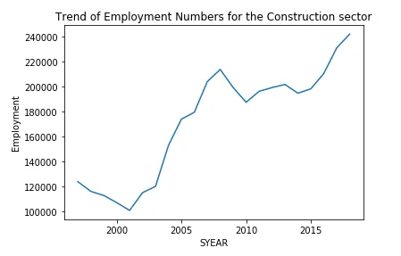
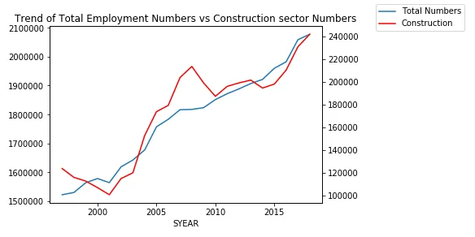
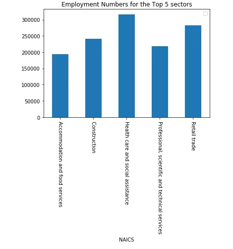
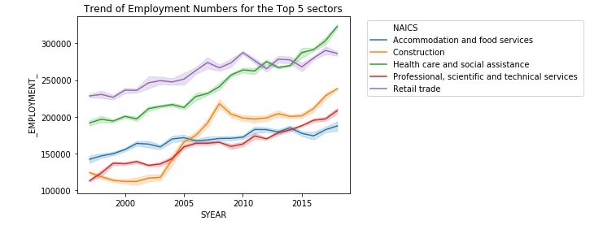
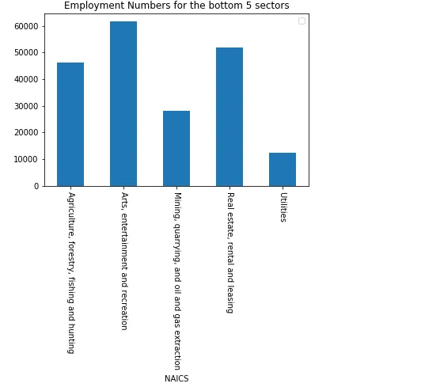
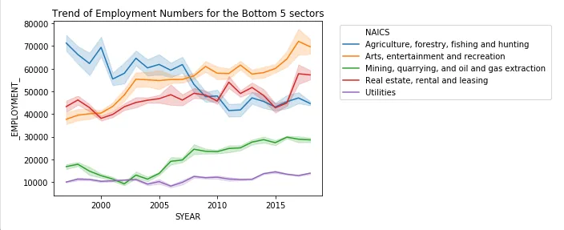
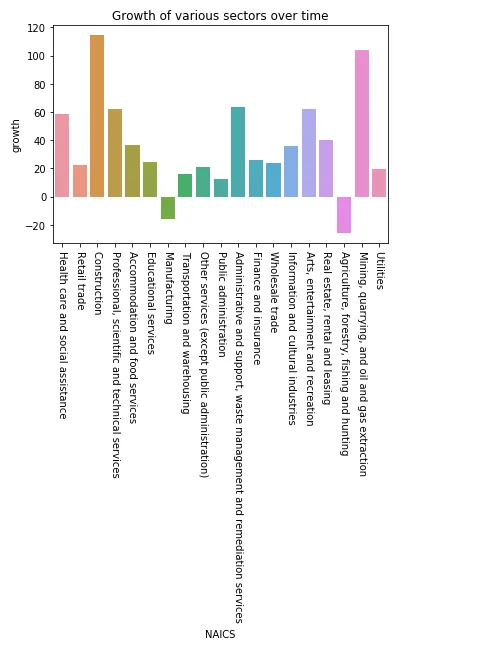

A Data Analyst is someone who munges information using data analysis tools. The meaningful results they pull from raw data help their employers or clients make important decisions by identifying various facts and trends.

Dubbed one of the sexiest jobs of the 21st century, it is indeed a job with lots of benefits to companies and the entire data ecosystem not to forget the Analysts themselves. With Data Analysis data is turned into information which propels business decisions and in part informs the future through looking at growing trends.

Data Analysts work in a multitude of sectors from agriculture to Financial sector to NASA to science laboratories and the benefits of such analyses have huge profound benefits in any of the sectors.

Next we look at the NAICS Analysis we undertook to take a deep dive into the employment sectors around the NAICS member states and the key observations we noticed.

**About the data**

The North American Industry Classification System(NAICS) is an industry classification system developed by the statistical agencies of Canada,Mexico and the United States. NAICS is designed to provide common definitions of the industrial structure of the three countries and a common statistical framework to facilitate the analysis of the three economies. Data is collected every month on the number of employees in over 50 sectors and the hundreds of sub sectors and saved for reference and Analysis by various stakeholders.

The data contains employment data by industry at different level of aggregation; 2-digit NAICS, 3-digit NAICS, and 4-digit NAICS

The data consists of the following columns:

(i) SYEAR: Survey Year

(ii) SMTH: Survey Month

(iii) NAICS: Industry name and associated NAICS code in the bracket

(iv) _EMPLOYMENT_: Employment Numbers

**Loading the data and consolidation.**

Let's start with loading required packages

We load the various data sets and combine them into one

Once our data is in consumable format we join the data together into a combined dataframe that has all data for the different aggregation levels. We then join the NAIC codes onto the data and append it to the data output template as we see below.

Next we look at the Exploratory Analysis.

We performed 5 analyses and we will look at each and the key take aways from each.

**1. How has the employment in Construction evolved overtime?**

We notice a couple of changes in employment numbers over the period. A reduction in the numbers of workers in the construction sector was evident at the end of the 20th Century, it has been growing exponentially over the years with a spike during the 2008 recession period. We also note that in the last decade the construction sector suffered a slight deep from around 2009 to 2015 and has been growing since to record growths of over 100%.

This is seen in the line graph below

**2. Employment in Construction vs the total employment across all industries.**

We see that at the end of the 20th century as construction jobs where steadily reducing the general market was enjoying an increase in the number of jobs. This can be attributed to the internet boom during those days.However the construction sector recovered in the mid 2000's with a spike in 2008 compared to a slow down in total employee numbers during the same period. In the last 5 years however the construction sector has been growing at a slower rate compared to the general employment sector.

**3. What are the top 5 sectors with most employee numbers currently and investigate their evolution?**

We look at the top 5 sectors as at 2018 end of year using the graph below

Next we look at the evolution over time

The construction sector has the most noticeable bump in growth since the early 2000's to date.

In the last decade however we have noticed that the Health care sector overtook the Retail sector to become the top sector

,the construction and Professional sectors also have a noticeable growth over the decade.

**4. What are the 5 sectors with lowest numbers of Employees currently and investigate their evolution?**

We look at the bottom 5 sectors from the graph below.

Next we look at the evolution over time.

**5. Which sectors are showing the highest growth in employees over the last decade?**

The various sectors have various growth rates over time. We look at the rates below.

We See majors enormous growth in the Construction,Mining with over 100% growth over time, the Admin,professional services and Healthcare sectors have over 50% growth with notable reductions in the agricultural and Manufacturing sectors. Generally most of the sectors have a somewhat positive growth over time, which is very impressive comparing the over time growth in population.

**Conclusion**

The Analysis of the Employment numbers in various sectors provides a great insight into the areas to watch for the coming period like construction,Healthcare and professional services and those where keen interest is required to revive them like Manufacturing and Agriculture.

Thank you for your time, the full code can be accessed using the link below;

<https://github.com/ussozi/data_insights_NAICS_timeseries>
