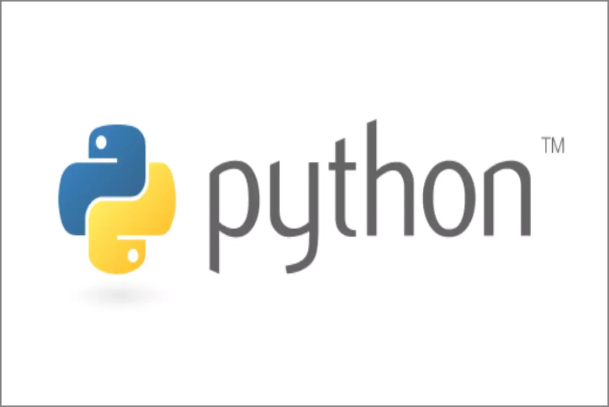

Designing applications in Python is very fast because some aspects of programming are handled automatically, such as memory resource management and data typing,

Thanks to very powerful basic types and high-level primitives, a Python program is simple to design and concise.

These qualities make Python an ideal language in many areas, as described in data science .

Finally, the standard Python library is very complete, and allows to meet

common programming needs.
