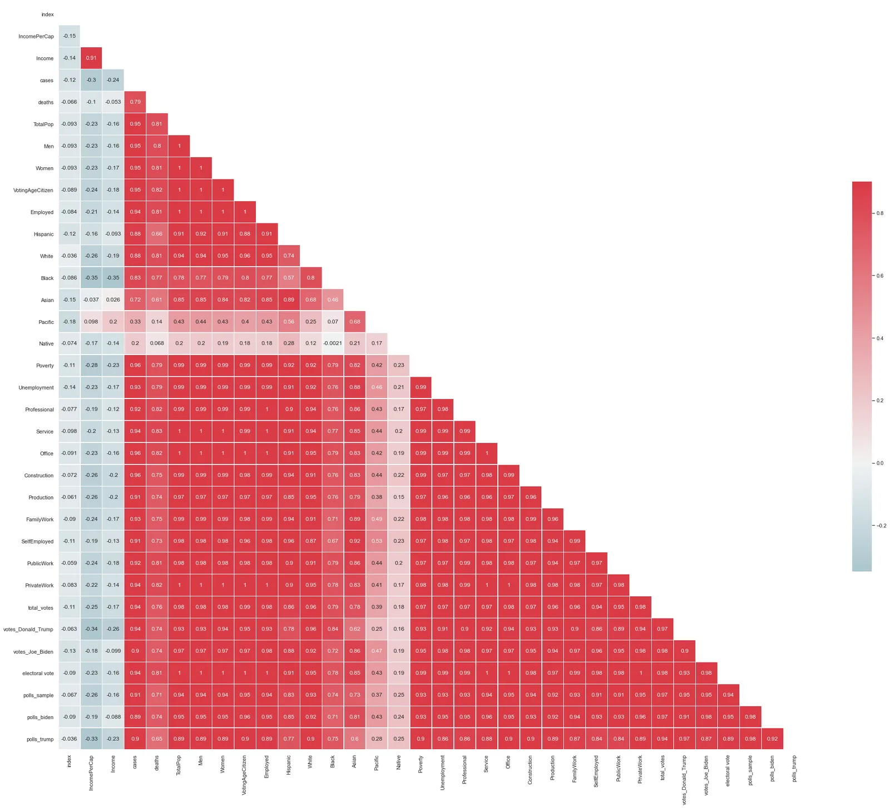

## Introduction to US Elections and Electoral Vote

The United States of America holds Presidential elections every four years on the 1st of November, this event is regarded as one of the most important political events all over the globe, due to the gravity of the US Political influence.

The United States of America holds Presidential elections in a unique system called "The United States Electoral College".

## Introduction to The United States Electoral College.

The United States Electoral College is the group of presidential electors required by the Constitution to form every four years for the sole purpose of electing the president and vice president. Each state appoints electors according to its legislature, equal in number to its congressional delegation (senators and representatives). Federal officeholders cannot be electors. Of the current 538 electors, an absolute majority of 270 or more electoral votes is required to elect the president and vice president. If no candidate achieves an absolute majority there, a contingent election is held by the United States House of Representatives to elect the president, and by the United States Senate to elect the vice president.

Currently, the states and the District of Columbia hold a statewide or districtwide popular vote on Election Day in November to choose electors based upon how they have pledged to vote for president and vice president, with some state laws against faithless electors. All jurisdictions use a winner-take-all method to choose their electors, except for Maine and Nebraska, which choose one elector per congressional district and two electors for the ticket with the highest statewide vote. The electors meet and vote in December and the inauguration of the president and vice president takes place in January.

The appropriateness of the Electoral College system is a matter of ongoing debate. Supporters argue that it is a fundamental component of American federalism by preserving the constitutional role of the states in presidential elections. Its implementation by the states may leave it open to criticism; winner-take-all systems, especially in populous states, may not align with the principle of "one person, one vote". Almost 10% of presidential elections under the system have not elected the winners of the nationwide popular vote.

### Sources
- [Wikipedia](https://en.wikipedia.org/wiki/United_States_Electoral_College)
- [Census](https://data.census.gov/cedsci/)
- [CNN](https://edition.cnn.com/election/2020/results/president)
- [Kaggle](https://www.kaggle.com/etsc9287/2020-general-election-polls)

### Datasets
- Election, COVID, and Demographic Data by County [Kaggle](https://www.kaggle.com/etsc9287/2020-general-election-polls) by Ethan Schacht
- US Census Data [US Census](https://data.census.gov/cedsci/) by US Census Data
- This dataset is updated on annual basis by US Census Data
- US Census Demographic Data [Kaggle](https://www.kaggle.com/muonneutrino/us-census-demographic-data) by MuonNeutrino

## Table of Content :
- Introduction to US Elections and Electoral Vote

  - Introduction to The United States Electoral College.
  - Sources
  - Datasets
- Enabling Widget Extensions in NB
- Importing Libraries
- Defining Functions Used
- Importing Datasets from Local files
- Exploring Imported Datasets
- Preprocessing of Datasets

  - Cleaning, Feature Engineering and Merging Datasets

    - Filtering and simplifying Datasets
    - Defining columns aggregates
    - Fixing aggregating columns formating
    - Pivoting and grouping statistics by state for further analysis
    - Defining Mean and Median columns
    - Joining temp data frames
    - Merging states with their corresponding electoral college votes
    - Feature engineering election results column (answer)
    - Pivoting polling data to states
    - Feature engineering calculating sample size
    - Fixing column names
    - Merging both main data frames and geo locations
    - Creating colour column to visualize candidates parties
    - Saving Dataframe for easier recall
  - Exploring Cleaned Datasets
- Statistical Analysis of US Elections

  - Correlation analysis of cleaned data

    - Eliminating Location data columns
    - Setting Graph Style
    - Calculating Correlation
    - Formating Graphical Output
  - Plotting CDF for confirmed cases counts

    - Income
    - Poverty
    - Unemployment
    - Employment
    - Men
    - Women
- General Data Analysis

  - Exploratory Data Analysis
  - Total Votes Per State
  - Total Electoral Votes
  - Election total votes & Total Electoral Votes Per US State
  - Election total votes & Total COVID-19 Cases Per US State
  - Election total votes & Total Unemployment Per US State
  - Election total votes & Poverty Per US State
  - Election total votes & Income Per US State
- 3D Geospatial Maps

  - Parsing data to JSON
  - Executing Maps from JSON file
  - US Elections 2020 VS Income and Total population
  - US Elections 2020 VS Unemployment and Poverty
- Machine Learning Process

  - Subsetting ML Dataset
  - Redefining Categorical Data
  - Cleaning Data and setting Target column
  - Feature selection
  - Splitting Data into Training and Testing Data
  - Defining Pipeline used

    - The average CV score on the training set was: 0.975
    - Using GradientBoostClassifier
  - Fitting Data to the pipeline
  - Appending Results to variable
- Testing ML Model

  - Defining list of results
  - Testing Model nth times
  - Predicting Data
  - Grouping Results
  - Formating Data Output
  - Printing Percentage Result
- Conclusion
- Final Thoughts

## Libraries Used:-
- Pandas: for dataset handling
- Numpy: Support for Pandas and calculations
- GradientBoostingClassifier: for Machine Learning
- train_test_split: for Machine Learning
- make_pipeline: for Machine Learning
- Normalizer: for Machine Learning
- Math: for mathematical operations
- Matplotlib: for visualization (basic)
- JSON: for JSON Manipulation
- CSV: for CSV Manipulation & import
- pydeck: for 3D Map visualization
- ast: for JSON parsing
- jinja2: templating syntax library
- HTML: for HTML Parsing
- Seaborn: for visualization and plotting (Presentable)
- pycountry: Library for getting continent (name) to from their country names
- plotly: for interactive plots

## Defining Functions
- ***create_legend() :*** for HTML Legend Creation
- ***ecdf() :*** for CDF calculation

```python
def create_legend(labels: list) -> HTML:
    """Creates an HTML legend from a list dictionary of the format {'text': str, 'color': [r, g, b]}"""
    labels = list(labels)
    for label in labels:
        assert label['color'] and label['text']
        assert len(label['color']) in (3, 4)
        label['color'] = ', '.join([str(c) for c in label['color']])
    legend_template = jinja2.Template('''
    <style>
      .legend {
        width: 300px;
      }
      .square {
        height: 10px;
        width: 10px;
        border: 1px solid grey;
      }
      .left {
        float: left;
      }
      .right {
        float: right;
      }
    </style>
    
    <div class='legend'>
      <div class="square left" style="background:rgba({{ label['color'] }})"></div>
      <span class="right">{{label['text']}}</span>
      <br />
    </div>
    
    ''')
    html_str = legend_template.render(labels=labels)
    return HTML(html_str)

def ecdf(data):
    #credits DataCamp Justin Bois
    """Compute ECDF for a one-dimensional array of measurements."""
    # Number of data points: n
    n = len(data)

    # x-data for the ECDF: x
    x = np.sort(data)

    # y-data for the ECDF: y
    y = np.arange(1, n+1) / n

    return x, y
```

## Importing Datasets from Local files
### US Elections Datasets:-
- ***actual votes.csv :*** Actual US Election results
- ***trump_biden_polls.csv :*** US Polling Results

### Supplementary Datasets:-
- ***country_statistics.csv :*** US Demographic Statistics
- ***electoral_votes.csv :*** US Electoral Collage Counts per state
- ***locations.csv :*** US States Geographical centers
- ***states_names.csv :*** US States ANSI Codes

## Exploring Imported Datasets
```python
Using .head(),.describe() and .info() methods of pandas

After Exploring the datasets and identifying major problems and missing data, the cleaning process is in order to clean and engineer a few features facilitating the analysis process.

# Filtering and simplifing Datasets
country_statistics = country_statistics[['state','cases','deaths','TotalPop','Men','Women','VotingAgeCitizen','Income','IncomePerCap','Employed','Hispanic','White','Black','Asian','Pacific','Native','Poverty','Unemployment','Professional','Service','Office','Construction','Production','FamilyWork','SelfEmployed','PublicWork','PrivateWork']]
elections = elections[['state','total_votes','votes_Donald_Trump','votes_Joe_Biden']]

# Defining columns aggregates
percentage_of_total= ['Hispanic','White','Black','Asian','Pacific','Native','Poverty','Unemployment']
percentage_of_employment = ['Professional','Service','Office','Construction','Production','FamilyWork','SelfEmployed','PublicWork','PrivateWork']

# Fixing aggregating columns formating
for i in percentage_of_total:
    for j in range(len(country_statistics)):
        country_statistics[i][j] = (country_statistics[i][j] / 100) * country_statistics['TotalPop'][j]

for i in percentage_of_employment:
    for j in range(len(country_statistics)):
        country_statistics[i][j] = (country_statistics[i][j] / 100) * country_statistics['Employed'][j]


# Pivoting and grouping statistics by state for further analysis

# Grouping by summing

# Defining Mean and Median columns
mean_columns = country_statistics[['state','IncomePerCap','Income']]
sum_columns = country_statistics.drop(['IncomePerCap','Income'],axis=1)

temp1 = mean_columns.groupby('state').min()
temp2 = sum_columns.groupby('state').sum()

# Joining temp dataframes
states_df = temp1.join(temp2).reset_index()

elections = elections.groupby('state').sum()
states_df = states_df.merge(elections,how='left',on='state').reset_index()

# Merging states with their corresponding electoral collage votes
states_df = states_df.merge(electoral_votes,how='right',on='state')

# Feature engineering election results column (answer)
states_df['answer'] = 'Tie'

for i in range(len(states_df)):
    if ((states_df.votes_Joe_Biden[i]) > (states_df.votes_Donald_Trump[i])):
        states_df.answer[i] = 'Biden'
    if ((states_df.votes_Joe_Biden[i]) < (states_df.votes_Donald_Trump[i])):
        states_df.answer[i] = 'Trump'


# Merging Polling Data with main dataframe
polls = polls.merge(states_names,on = 'state',how = 'left')
polls = polls[['state2','sample_size','pct','answer']]

# Filtering polls for most important candidates
polls = polls[(polls.answer == 'Biden') | (polls.answer == 'Trump')]
polls.reset_index(inplace=True,drop=True)

# Feature engineering vote counts from pct
polls['votes'] = 0
for i in range(len(polls)):
    polls.votes[i] = (polls.pct[i] / 100) * (polls.sample_size[i])
polls = polls[['state2','sample_size','votes','answer']]

# Pivoting polling data to states
polls = polls.pivot_table(values=['sample_size','votes'],index='state2',columns='answer',aggfunc=np.sum).reset_index()
polls.columns = polls.columns.map('_'.join)

# Feature engineering calculating sample size
polls['sample_size'] = 1
for i in range(len(polls)):
    polls.sample_size[i] = (polls.sample_size_Biden[i] + polls.sample_size_Trump[i])/2
polls = polls[['state2_','sample_size','votes_Biden','votes_Trump']]

# Fixing column names
polls.rename(columns={'state2_':'state','sample_size':'polls_sample','votes_Biden':'polls_biden','votes_Trump':'polls_trump'},inplace=True)

# Merging both main dataframes and geo locations
merged_df = states_df.merge(polls,on='state',how='right')
merged_df = merged_df.merge(locations,on='state',how='left')

# Creating color column to visualize candidates parties
color = {'color':['[255, 20, 20]','[20, 138, 255]']}
color = pd.DataFrame(color,index=['Trump','Biden']).reset_index()
color = color.rename(columns={'index':'answer'})
df = merged_df.merge(pd.DataFrame(color),on='answer',how='left')

# Saving Dataframe for easier recall
df.to_csv(r'df.csv')
```

## Statistical Analysis of US Elections Dataset
### Correlation analysis of cleaned data

Using sns.corr() method to find correlations between data knowing that correlation does not necessarily mean causation.

```python
# Elimnating Location data columns
df2 = df.loc[:, ((df.columns != 'lat')&(df.columns != 'long'))]

# Setting Graph Style
sns.set(style='white')

# Calculating Correlation
corr = df2.corr()

# Formating Graphical Output
mask = np.zeros_like(corr, dtype=np.bool)
mask[np.triu_indices_from(mask)] = True
f, ax = plt.subplots(figsize=(35, 30))
cmap = sns.diverging_palette(220, 10, as_cmap=True)
sns.heatmap(corr, mask=mask, cmap=cmap, vmax=.9, center=0, square=True, linewidths=.5, annot=True,cbar_kws={'shrink': .5});
```



### *Correlation shows:*
- A strong positive correlation between almost every element is to be expected.
- A strong positive correlation between covid-19 cases and votes for trump columns.
- A weak positive correlation between income and general votes.

### Plotting **CDF for most correlated features**

Using ecdf() function and plotly library to plot CDF for statistical distribution.

### *CDF shows:*
- 80% of the States has average Income Below 41K with a maximum of 65K, Which shows an almost even distribution of income.
- 90% of the States has Poverty Counts Below 1.74M with a maximum of 5.9M, Which shows that 10% of the states have 5 times more poverty than the rest of the states, Yet this could be an effect of the total population.
- 90% of the States has Unemployment Counts Below 833K with a maximum of 3.02M, Which shows that 10% of the states have 4 times more Unemployment than the rest of the states, Yet this could be an effect of the total population.
- 90% of the States has Employment Counts Below 6.09M with a maximum of 18M, Which shows that 10% of the states have 2 times more Employment than the rest of the states, Yet this could be an effect of the total population.
- Gender distribution in most states is almost equal in the count.

## General Data Analysis
### Exploratory Data Analysis

1 - Exploring total votes for both candidates with an average indicator for both parties.

```python
# Creating bar plot of the total votes for both candidates
fig = go.Figure(data=[
    go.Bar(name='Biden', x=df.state, y=df.votes_Joe_Biden),
    go.Bar(name='Trump', x=df.state, y=df.votes_Donald_Trump)
])

# Adding average indicator line for Trumps total votes
fig.add_shape(
        go.layout.Shape(
            type="line",
            x0=0,
            y0=df.votes_Donald_Trump.mean(),
            x1=len(y),
            y1=df.votes_Donald_Trump.mean(),
            line=dict(
                color="red",
                width=1,
                dash="dash"
            ),
    ))

# Adding average indicator line for Bidens total votes
fig.add_shape(
        go.layout.Shape(
            type="line",
            x0=0,
            y0=df.votes_Joe_Biden.mean(),
            x1=len(y),
            y1=df.votes_Joe_Biden.mean(),
            line=dict(
                color="blue",
                width=1,
                dash="dash"
            ),
    ))

# Change the bar mode
fig.update_layout(barmode='group',height=600,width=950,title='Total Votes Per State',xaxis_title="States",
                  yaxis_title="Total Votes",
                  legend_title="Candidates")
```

### *Figure shows:*
- Bidens Average total votes are slightly higher than Trumps with less than 100K indifference.
- Biden excels over Trump with a huge difference in California.

2 - Exploring Total Electoral votes for both candidates with the average indicator shown for summary overview.

### *Figure shows:*
- Bidens Average total Electoral votes are slightly higher than Trumps with less than 5 electoral votes indifference.
- Biden excels over Trump with California 55 Electoral votes.

3 - Creating Scatter Plot elaborating on the total votes vs electoral votes, emphasizing how electoral votes factor in elections.

```python
# Creating Scatter plot illustrating
fig = go.Figure()

# Defining Sets of Data for each candidate
trump = df[df.answer == 'Trump']
biden = df[df.answer == 'Biden']

# Adding Trumps Total Votes vs Electoral vote (size) per State
fig.add_trace(go.Scatter(
    x=trump.state,
    y=trump['votes_Donald_Trump'],
    text=trump['electoral vote'],
    marker=dict(color="red",size=trump['electoral vote']),
    showlegend=True,
    mode='markers',
    name='Trump',
    opacity=0.7
))

# Adding Bidens Total Votes vs Electoral vote (size) per State
fig.add_trace(go.Scatter(
    x=biden.state,
    y=biden['votes_Joe_Biden'],
    text=biden['electoral vote'],
    marker=dict(color="blue",size=biden['electoral vote']),
    showlegend=True,
    mode='markers',
    name = 'Biden',
    opacity=0.7
))

# Updating Title and axis names
fig.update_layout(title='Election total votes & Total Electoral Votes Per US State',
                  xaxis_title="States",
                  yaxis_title="Total Votes",
                  legend_title="Candidates")

# Showing Final Figure
fig.show()
```

### *Figure shows:*
- Again Bidens CA winning is the main feature of this graph.
- Yet Trumps manages to win TX and FL which are the second most awarding states with electoral votes.
- The figure shows a general advantage to Bidens Point sizes indicating more electoral votes on average.

4 - Creating scatterplot exploring the relation between the elections and COVID-19.

### *Figure shows:*
- States who voted for Biden seem to have fewer COVID-19 Cases than those who voted for Trump.
- Does this indicate more educated states voted for Biden? further analysis is required in this area.

5 - Creating scatterplot exploring the relation between the elections and the Unemployment rate.

### *Figure shows:*
- States Unemployment Rates seems to have almost no impact on total votes for each candidate.

6 - Creating scatterplot exploring the relation between the elections and the Poverty rate.

### *Figure shows:*
- On average poverty rate in states voting for Biden are less than that of Trumps voting States.

7 - Creating scatterplot exploring the relation between the elections and the Income rate.

### *Figure shows:*
- States Income Rates seems to have almost no impact on total votes for each candidate.

## 3D Geospatial Maps

Exploring relationships between most correlated data through 3-dimensional Maps, using JSON and PyDeck.

1 - Creating a 3D Geospatial Map exploring the relation between the elections, total population and Income.

```python
# HTML Legend Creation
legend_l = [{'text': 'Trump', 'color': [255, 20, 20]},{'text': 'Biden', 'color': [20, 138, 255]},{'text': 'Income', 'color': [230, 230, 230]}]
legend = create_legend(legend_l)

# Load in the JSON data
DATA_URL = r'Final Data\\1.geojson'
json = geojson

# Defining View State for PDK
view_state = pdk.ViewState(
    longitude=df.long[5],
    latitude=df.lat[5],
    zoom=3,
    min_zoom=3,
    max_zoom=4,
    pitch=45,
    bearing=0)

# Defining First Layer of PDK Map
Totalpop = pdk.Layer(
    'ColumnLayer',
    df,
    get_position=['long', 'lat'],
    get_elevation='TotalPop',
    auto_highlight=True,
    elevation_scale=0.02,
    pickable=True,
    elevation_range=[0, 10],
    extruded=True,
    coverage=5,
    get_fill_color=[216, 243, 212],
    radius=5000)

# Defining Second Layer of PDK Map
states = pdk.Layer(
    "GeoJsonLayer",
    json,
    opacity=0.5,
    stroked=False,
    filled=True,
    extruded=True,
    wireframe=True,
    get_elevation=0,
    get_fill_color="properties.color",
    get_line_color=[255, 255, 255],
)

# Defining Third Layer of PDK Map
Income = pdk.Layer(
    "ScatterplotLayer",
    df,
    opacity=0.4,
    stroked=True,
    filled=True,
    radius_scale=800,
    radius_min_pixels=1,
    radius_max_pixels=100,
    line_width_min_pixels=1,
    get_position=['long','lat'],
    get_radius="Income/80000",
    get_fill_color=[230, 230, 230],
    get_line_color=[0, 0, 0],
)

# Defining Tooltip Layer of PDK Map
tooltip = {"html": "<b>N Cases:</b> {cases} K <br /><b>N Deaths:</b> {deaths} K"}

# Initializing Map PyDeck
r = pdk.Deck(
    [Totalpop,states,Income],
    initial_view_state=view_state,
    map_style=pdk.map_styles.LIGHT,
    tooltip=tooltip,
    mapbox_key='YOUR_MAPBOX_TOKEN'
)

# Displaying Title
display(HTML("""
   <strong>US Elections 2020 VS Income and Total population</strong>
   (Data from <a href="https://www.kaggle.com/etsc9287/2020-general-election-polls">Kaggle</a>)
"""))

# Displaying Legend
display(legend)
```

### *Figure shows:*
- Figure Shows states where Biden claims tend to have more income on average.

2 - Creating a 3D Geospatial Map exploring the relation between the elections, Unemployment and Poverty.

### *Figure shows:*
- Figure Shows states with high unemployment rate seem to have more poverty.
- States with the highest unemployment rate and poverty seem to vote for Biden.

## Machine Learning Process

Exploring Machine Learning Pipeline to predict election winner based on current countries demographical statistics such as race, population, unemployment, poverty and sickness.

Yet these features are not inclusive of everything that factor into the selection process. Thus further analysis of historic data is required in a later stage due to inaccessible data.

```python
# Subsetting ML Dataset
machine_learning_df = df[['state','total_votes','polls_sample','polls_biden','polls_trump','cases','deaths','TotalPop','Men','Women','VotingAgeCitizen','Income','IncomePerCap','Employed','Hispanic','White','Black','Asian','Pacific','Native','Poverty','Unemployment','Professional','Service','Office','Construction','Production','FamilyWork','SelfEmployed','PublicWork','PrivateWork','answer','electoral vote']]

# Redefining Categorical Data
machine_learning_df = pd.get_dummies(machine_learning_df)

# Cleaning Data and setting Target column
data = machine_learning_df.drop(['answer_Biden'],axis=1)
data.rename(columns={'answer_Trump':'target'},inplace=True)

# Feature selection
features = data.drop('target', axis=1)

# Splitting Data into Training and Testing Data
training_features, testing_features, training_target, testing_target = \
            train_test_split(features, data['target'], random_state=4)

# Defining Pipeline used

# Average CV score on the training set was: 0.975
pipe = make_pipeline(
    Normalizer(norm="max"),
    GradientBoostingClassifier(learning_rate=0.1, max_depth=7, max_features=0.2, min_samples_leaf=8, min_samples_split=5, n_estimators=185, subsample=0.65)
)

# Fitting Data to the pipeline
pipe.fit(training_features, training_target)

# Appending Results to variable
results = pipe.predict(testing_features)
```

### Testing ML Model
```python
# Defining list of results
Percent = []

# Testing Model nth times
for i in range(10000):
    # Subsetting ML Dataset
    machine_learning_df = df[['state','total_votes','polls_sample','polls_biden','polls_trump','cases','deaths','TotalPop','Men','Women','VotingAgeCitizen','Income','IncomePerCap','Employed','Hispanic','White','Black','Asian','Pacific','Native','Poverty','Unemployment','Professional','Service','Office','Construction','Production','FamilyWork','SelfEmployed','PublicWork','PrivateWork','answer','electoral vote']]

    # Redefining Categorical Data
    machine_learning_df = pd.get_dummies(machine_learning_df)

    # Cleaning Data and setting Target column
    data = machine_learning_df.drop(['answer_Biden'],axis=1)
    data.rename(columns={'answer_Trump':'target'},inplace=True)

    # Feature selection
    features = data.drop('target', axis=1)

    # Splitting Data into Training and Testing Data
    training_features, testing_features, training_target, testing_target = \
                train_test_split(features, data['target'], random_state=4)

    # Defining Pipeline used

    # Average CV score on the training set was: 0.975
    pipe = make_pipeline(
        Normalizer(norm="max"),
        GradientBoostingClassifier(learning_rate=0.1, max_depth=7, max_features=0.2, min_samples_leaf=8, min_samples_split=5, n_estimators=185, subsample=0.65)
    )

    # Fitting Data to the pipeline
    pipe.fit(training_features, training_target)

    # Defining Test Data
    data = machine_learning_df.drop(['answer_Biden'],axis=1)
    data.rename(columns={'answer_Trump':'target'},inplace=True)

    datatest = data.drop('target',axis=1)

    # Predicting Data
    trump = pipe.predict(datatest)
    biden = 1-trump
    datatest['trump'] = trump
    datatest['biden'] = biden

    # Grouping Results
    answer = datatest[['trump','biden','electoral vote']].groupby(['trump','biden']).sum()

    # Formating Data Output
    if answer.iloc[0]['electoral vote'] > answer.iloc[1]['electoral vote']:
        Percent.append(1)
    else:
        Percent.append(0)
# Printing Percentage Result
print(f"{sum(Percent)/100}%")
```

**\*\*Model Shows accuracy rate of 94%**

## Conclusion** ***EDA Shows:-*
- A strong positive correlation between almost every element is to be expected.
- A strong positive correlation between covid-19 cases and votes for trump columns.
- A weak positive correlation between income and general votes.
- 80% of the States has average Income Below 41K with a maximum of 65K, Which shows an almost even distribution of income.
- 90% of the States has Poverty Counts Below 1.74M with a maximum of 5.9M, Which shows that 10% of the states have 5 times more poverty than the rest of the states, Yet this could be an effect of the total population.
- 90% of the States has Unemployment Counts Below 833K with a maximum of 3.02M, Which shows that 10% of the states have 4 times more Unemployment than the rest of the states, Yet this could be an effect of the total population.
- 90% of the States has Employment Counts Below 6.09M with a maximum of 18M, Which shows that 10% of the states have 2 times more Employment than the rest of the states, Yet this could be an effect of the total population.
- Gender distribution in most states is almost equal in the count.
- Bidens Average total votes are slightly higher than Trumps with less than 100K indifference.
- Biden excels over Trump with a huge difference in California.
- Bidens Average total Electoral votes are slightly higher than Trumps with less than 5 electoral votes indifference.
- Biden excels over Trump with California 55 Electoral votes.
- Again Bidens CA winning is the main feature of this graph.
- Yet Trumps manages to win TX and FL which are the second most awarding states with electoral votes.
- The figure shows a general advantage to Bidens Point sizes indicating more electoral votes on average.
- States who voted for Biden seem to have fewer COVID-19 Cases than those who voted for Trump.
- Does this indicate more educated states voted for Biden? further analysis is required in this area.
- States Unemployment Rates seems to have almost no impact on total votes for each candidate.
- On average poverty rate in states voting for Biden are less than that of Trumps voting States.
- States Income Rates seems to have almost no impact on total votes for each candidate.
- Figure Shows states where Biden claims tend to have more income on average.
- Figure Shows states with high unemployment rate seem to have more poverty.
- States with the highest unemployment rate and poverty seem to vote for Biden.

### Final Thoughts:-

Further Data gathering is required to reach a solid conclusion. Historical data of past elections is needed yet inaccessible due to insufficient demographic data of this time. Behavioural science and input are also required to further understand the inclination of the demographic public.

Simple analysis done seems to suggest that Biden won as a result of bad management as a result of low income and other factors such as poverty and unemployment.

***And Finally, Thank you for reading.***

***Please feel free to check the full analysis*** [***here***](https://github.com/osos96/USA-Elections-Analysis-ML)***.***
