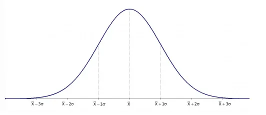
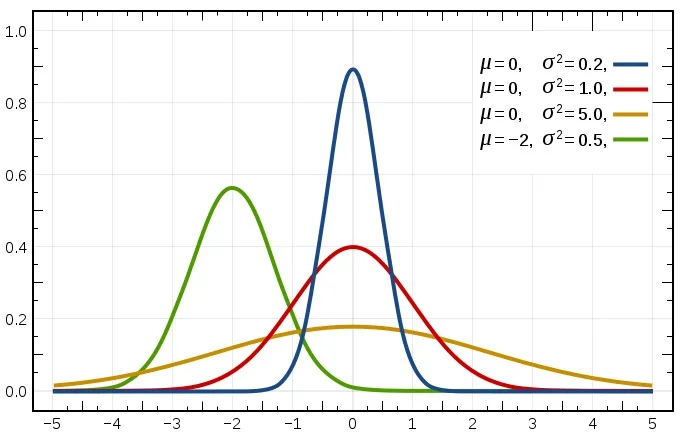
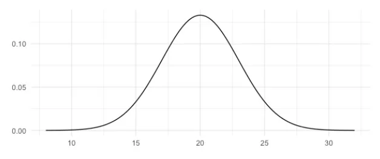
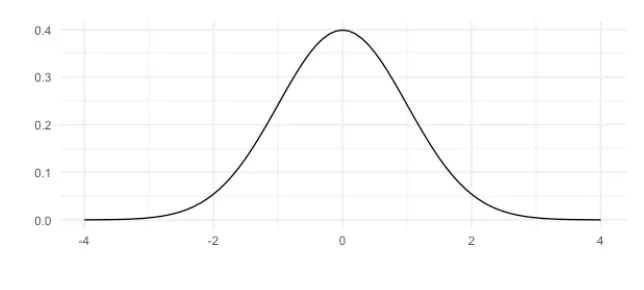
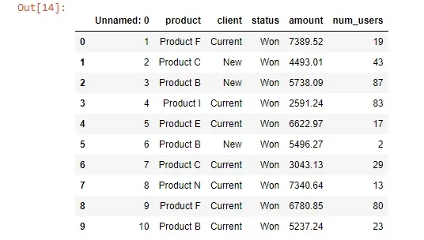
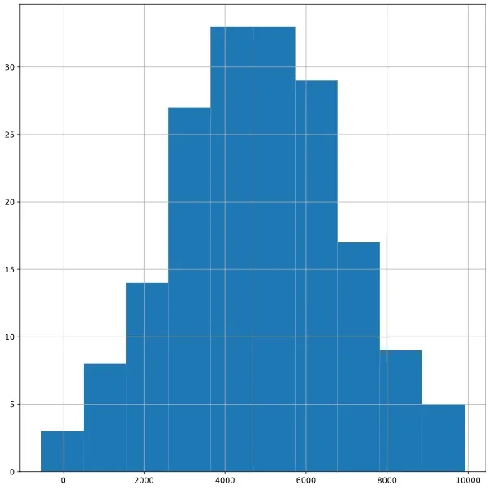

In this article, we will be talking about one of the most important and most widely used of all probability distributions which is the **Normal distribution,** also called **Gaussian distribution.** There are a large number of phenomena in the real world are following that distribution. we will go through this distribution by examples from the real world and also implement it using python to see in reality how this works.

If we looked around we will see many things that follow the normal distribution, some examples for those are as follows: heights and weights of people, the lifetime of an item, scores of an examination and speed measures, and more.



That is the shape of the normal distribution.

it has some important properties:

*- its shape is bell-shaped or "bell curve"*

*- it is symmetric so the left side is a mirror image of the right*

*- the total area under the curve is 1, representing the total probability*

*- the probability never hits zero*

*- it is described by its mean and standard deviation, the mean and standard deviation of it called the "parameters" of the normal distribution.*

it is denoted by: ~N(µ,σ²)

> standard deviation is a measure of how spread out the probability density is. as it determines if the curve concentrates more or less probability density around the mean.

*Notice**:*

*As the normal distribution is symmetric so the mean will be equal to the median and mode.*

We need to make a distinction here, As there is a family of normal distribution curves. Each different set of values of µ and σ gives a different normal distribution. The value of µ determines the center on the horizontal axis, and the value of σ gives the spread of the curve like that:



Also, we can see from that figure that the lower the value of the standard deviation the more concentrated the probability density is around the mean.

For that, we have a special case of the normal distribution when µ=0 and σ=1 called **Standard Normal distribution.** The random variable that possesses the standard normal distribution is denoted by **Z** and called **Z values, Z scores, standard units**, or **standard scores**.

Note that: these Z scores considered as the number of standard deviations removed from the mean.



Normal distribution



Standard Normal distribution

let's use some data to see the previous in action using some code.

```python
df.head(10)
```



Now if we look at the distribution of the "amount" column it will look like that:

```python
df['amount'].hist(bins=10)
 plt.show()
```



As we see It follows the normal distribution.

let's build on top of that and calculate some probabilities.

The normal distribution has continuous distribution so its function will be probability density function.

if we want to calculate the probability to get less than a certain number we will use the cumulative distribution function as follows:

the probability that the amount that we get is less than 5000 :

```python
prob_less_5000 = norm.cdf(5000,5000,2000)
print(prob_less_5000)
```

```python
0.5
```

it is 0.5 because the mean here is 5000, As we said before that the distribution is symmetric.

Another example:

```python
prob_less_6500 = norm.cdf(6500,5000,2000)
print(prob_less_6500)
```

```python
0.7733726476231317
```

If we want to calculate the probability to get greater than a certain number we will just do the previous step but we will subtract it from 1, which is the total probability:

```python
prob_over_1000 = 1-norm.cdf(1000,5000,2000)
print(prob_over_1000)
```

```python
0.9772498680518208
```

Also another use for that is that We can also calculate percentiles for our data like that:

```python
pct_25 = norm.ppf(0.25,5000,2000)
print(pct_25)
```

```python
3651.0204996078364
```

Here we got the 25th percentile of the data.

```python
pct_50 = norm.ppf(0.50,5000,2000)
print(pct_50)
```

```python
5000.0
```

As we that was the 50th percentile of the data or the median which is the same as the mean as the distribution is symmetric.

some resources used in this article: [here](https://www.spcforexcel.com/knowledge/basic-statistics/normal-distribution)

the GitHub repo is [here](https://github.com/Abdelrahman7000/statistical_concepts_for_data_science/blob/main/Normal%20distribution/Normal_distribution.ipynb)

*That was part of the Data Insight's Data Scientist Program.*
