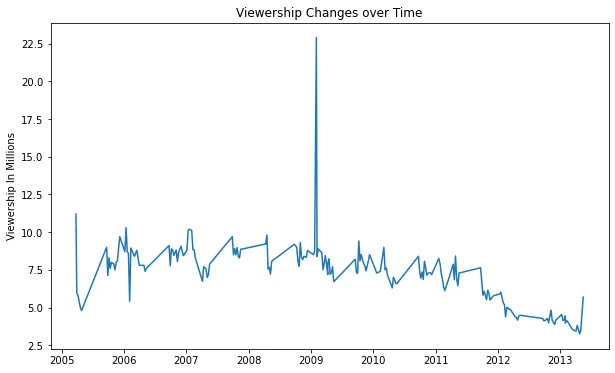
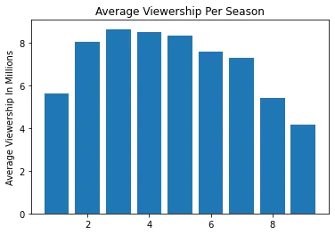
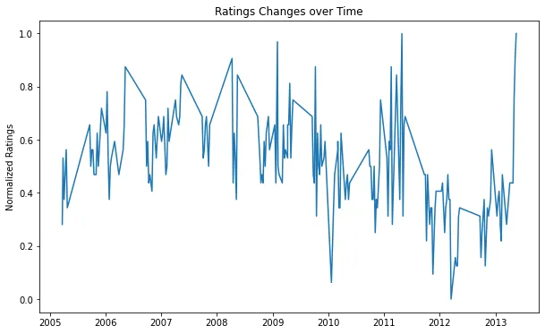
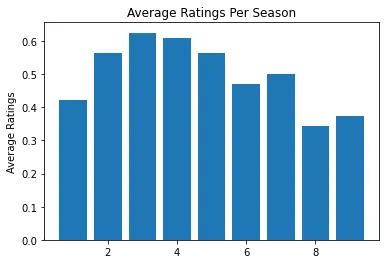

The office as I heard was a sitcom in the US. Apparently very popular as the views ran into millions on every episode.

I examined the Viewership and Ratings changes over time through all nine seasons of the series. This analysis started out of course with me downloading the dataset of Kaggle into a local folder on my system. [(https://www.kaggle.com/nehaprabhavalkar/the-office-dataset)](https://www.kaggle.com/nehaprabhavalkar/the-office-dataset)

I imported this excel dataset into python and parsed the date column as shown below and got familiar with it.

After this on more inspection, I noticed the data was already fairly cleaned and needed little work. I then proceeded to do some exploration to see how the popularity varied over time.

I plotted a trend line showing this below;

I was curious about this peak value so I looked further into it with the following piece of code.

On further analysis, I realized that this high view was because three guest stars appeared here and that caused a lot of traction.

For a more summarized view of the viewership over the seasons, I used median as a summary statistic to show the changes over time. Using the median was to ensure that the outlier wasn't reflected here.

**Insights**

From the plot above, it can be observed that there as been a slow but gradual decline in the viewership of the shout, with a some fluctuations in between. The viewership was unusually high in an episode in 2009, and on deeper inspection it was observed that that number of views was recorded because were three guest stars present there!

The first episode of the show started out averaging about 11 million views, but it maintained an average of about 8 million views till 2009 )of course with some fluctuations which may have been due to guest stars or advertisement changes). From 2009 it saw a continuous decline to less than 5 million, which might have marked that it was time to end the series. For the final episode however, the viewership built up to about 5 million.

**Exploratory data analysis to see how the quality of the show varied with time**

The ratings would be the main parameter to judge the quality of the show. From observing the ratings column, I realized that the maximum rating was 9.8 and the minimum was 6.6. I though it best to normalize this values so the differences could be clearly seen, such that the minimum value would be zero and the maximum one. This is shown in the code snippets below.

After this, I pretty much followed the same processes I used to analyze the popularity of the show. The code snippets can be seen below.

**Insight**
The rating follows a trend similar to that of the viewership, The ratings peak between 2007 and 2008 and becomes really low between 2011 and 2013 at the latter seasons.

**Conclusion**
Both the ratings and viewership have shown a gradual downward trend and it might have been the best decision to end the series or revamp and re-strategize
