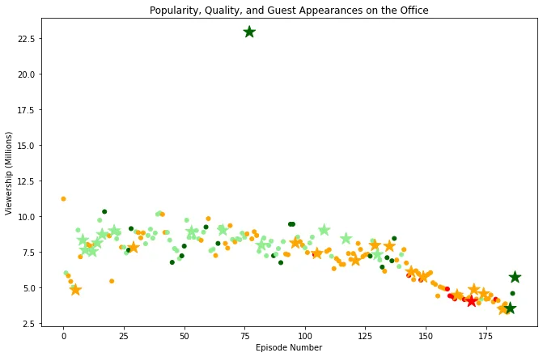

NBC's smash hit sitcom The Office captivated audiences as it unfolded in a nine-season run from 2005 to 2013. During that eight-year stretch, the simple premise of the series — documenting life in a typical American workspace — grew into a massive story with numerous twists, subplots, romances, and side characters. When all was said and done, the show boasted more than 200 episodes, all filled to the brink with storytelling at its finest.

In this project, we will take a look at a dataset of The Office episodes, and try to understand how the popularity and quality of the series varied over time. To do so, we will use the following dataset: datasets/office_episodes.csv, which was downloaded from Kaggle:

[here](https://www.kaggle.com/nehaprabhavalkar/the-office-dataset)

The main goal of this project will be to create a scatter plot of the data!

First, we start by reading our csv file into a dataframe using the pandas function: read_csv() :

```python
# Use this cell to begin your analysis, and add as many as you would like!
import matplotlib.pyplot as plt
import pandas as pd
plt.rcParams['figure.figsize'] = [11, 7]
office_df=pd.read_csv('datasets/office_episodes.csv')
office_df.info()
```

This dataset contains information on a variety of characteristics of each episode. In detail, these are:

```python
<class 'pandas.core.frame.DataFrame'>
RangeIndex: 188 entries, 0 to 187
Data columns (total 14 columns):
 #   Column          Non-Null Count  Dtype
---  ------          --------------  -----
 0   episode_number  188 non-null    int64
 1   season          188 non-null    int64
 2   episode_title   188 non-null    object
 3   description     188 non-null    object
 4   ratings         188 non-null    float64
 5   votes           188 non-null    int64
 6   viewership_mil  188 non-null    float64
 7   duration        188 non-null    int64
 8   release_date    188 non-null    object
 9   guest_stars     29 non-null     object
 10  director        188 non-null    object
 11  writers         188 non-null    object
 12  has_guests      188 non-null    bool
 13  scaled_ratings  188 non-null    float64
dtypes: bool(1), float64(3), int64(4), object(6)
memory usage: 19.4+ KB
```

Then, we'll be exploring our data and uncovering insights by plotting the number of episodes along the x-axis and the viewership along the y-axis.

We will add a color scheme reflecting the scaled ratings and a sizing system: how are we going to do that? ... Let's find out!

**1-** **Creating our color scheme**: reflecting the **scaled ratings** (not the regular ratings) of each episode, such that:

- Ratings < 0.25 are colored "red"
- Ratings >= 0.25 and < 0.50 are colored "orange"
- Ratings >= 0.50 and < 0.75 are colored "lightgreen"
- Ratings >= 0.75 are colored "darkgreen"

We use a for loop to go through our office_df and add a color to our list (which was intialized empty) when its condition is verified:

```python
#list of colors
col=[]
for ind,row in office_df.iterrows():
       if row['scaled_ratings'] < 0.25:
           col.append("red")
       elif row['scaled_ratings'] < 0.50:
           col.append("orange")
       elif row['scaled_ratings'] < 0.75:
           col.append("lightgreen")
       else:
           col.append("darkgreen")
print(col)
```

**2-** **Creating our sizing system****:** such that episodes with guest appearances have a marker size of **250** and episodes without are sized **25**

```python
#list of size
size[]
for ind,row in office_df.iterrows():
     if row['has_guests']==False:
          size.append(25)
     else:
          size.append(250)
print(size)
```

**3-** **The scatter plot****:**

**x-axis:** episode_number

**y-axis:** viewership_mil

**Color scheme:** Our color list **c=col**

**Sizing system:** our size list **s= size**

**Title:** "Popularity, Quality, and Guest Appearances on the Office"

**x-axis label:** "Episode Number"

**y-axis label:** "Viewership (Millions)"

```python
fig=plt.figure()
plt.scatter(x=office_df['episode_number'],y=office_df['viewership_mil'],c=col,s=size)
plt.title("Popularity, Quality, and Guest Appearances on the Office")
plt.xlabel("Episode Number")
plt.ylabel("Viewership (Millions)")
plt.show()
```

Here's Our output:


We can see that over time, the viewership of the episodes as long as the scaled rating got worst and worst and that it was never beyond 12 millions! The final episodes, even though they didnt have a high viewership it did get a high scaled rating.

There is one and only episode that was a big hit with 22.5 millions viewership and this was the most popular one. We can see that there was Guest stars too, this made us wondering: Who were they?

To figure this out, we're gonna go one more time through our office_df with a for loop and display the guest stars of the most watched episode:

```python
for ind,row in office_df.iterrows():
     if row['viewership_mil']>20:
           top_star=row['guest_stars']
 print (top_star)
```

Here they are :

```python
Cloris Leachman, Jack Black, Jessica Alba
```

You can find the code here:

[Github](https://github.com/asmakrl/datacampstd/blob/main/Investigating%20Guest%20Starsin%20the%20office%20%20notebook.ipynb)

**Bonus Step!**

A useful skill for visualizing different data points is to use a different marker. We'll try to differentiate guest appearances not just with size, but also with a star!

How are we going to do that?

Easy!... First, we create a column in the office_df for the colors and sizes we created earlier, because we can't have more than one marker in the plot.

```python
#let's add a column for both col and size in our DFoffice_df["colors"]=col
office_df["sizes"]=size

office_df.info()
```

Than we split our office_df into 2 Dataframes: one with guests and the other with no guests, so they can be differeciated by the marker

```python
#we split ou dataframe into 2 DF's
no_guest_df=office_df[office_df["has_guests"]== False]
guest_df=office_df[office_df["has_guests"]== True]
```

Now, here's the plot: we make two scatter plots for both of our dataframes, and add a different marker to one of them: here we add the '\*' marker to the guest_df

```python
fig = plt.figure()
plt.scatter(x=no_guest_df['episode_number'],
            y=no_guest_df['viewership_mil'],
            c=no_guest_df["colors"],
            s=no_guest_df["sizes"])

plt.scatter(x=guest_df['episode_number'],
            y=guest_df['viewership_mil'],
            c=guest_df["colors"],
            s=guest_df["sizes"],
            marker='*')

plt.title("Popularity, Quality, and Guest Appearances on the Office")
plt.xlabel("Episode Number")
plt.ylabel("Viewership (Millions)")
plt.show()
```

And this is our Final Plot:



You can find the code for the bonus step here:

[Github](https://github.com/asmakrl/datacampstd/blob/main/Investigating%20Guest%20Stars%20in%20the%20office%20notebook.ipynb)

Acknowledgement: This is a Datacamp Project, you can find it :

[Here](https://app.datacamp.com/workspace/w/ceeef26a-c579-4017-a71c-3077731eb8d7)

Thanks for reading
