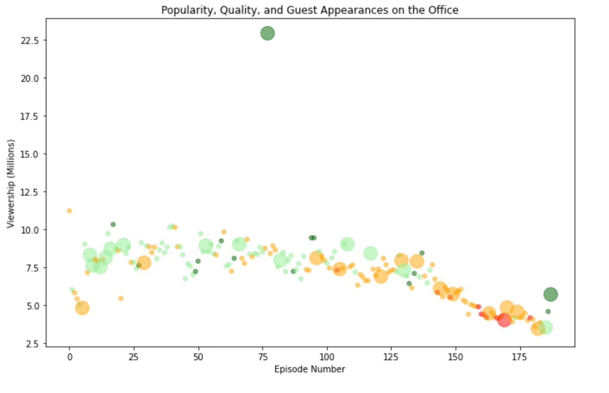
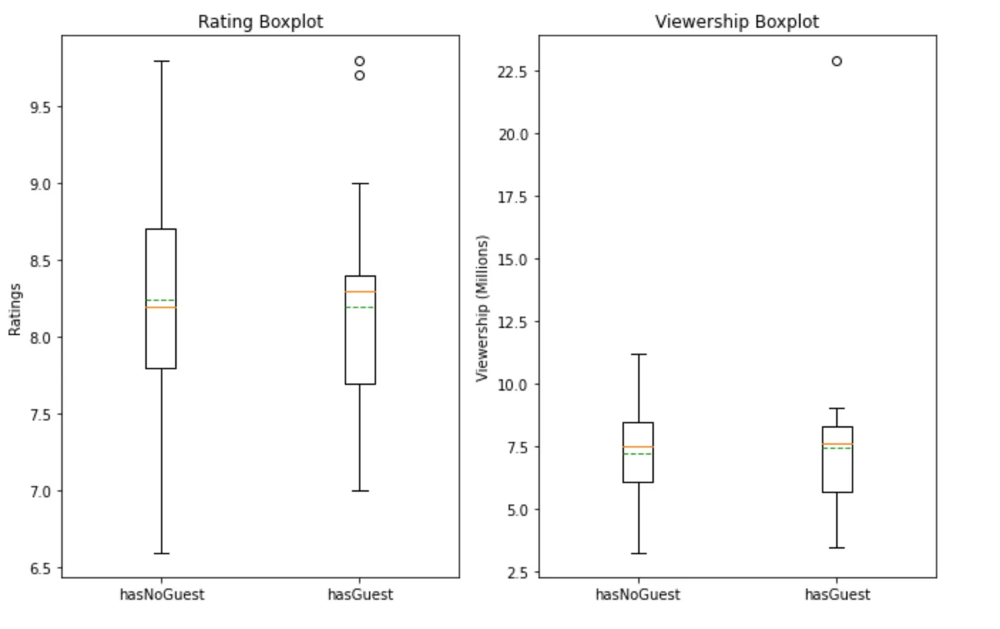
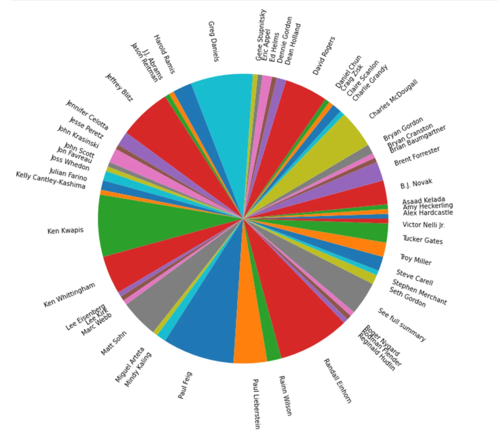
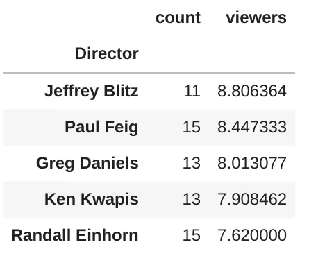
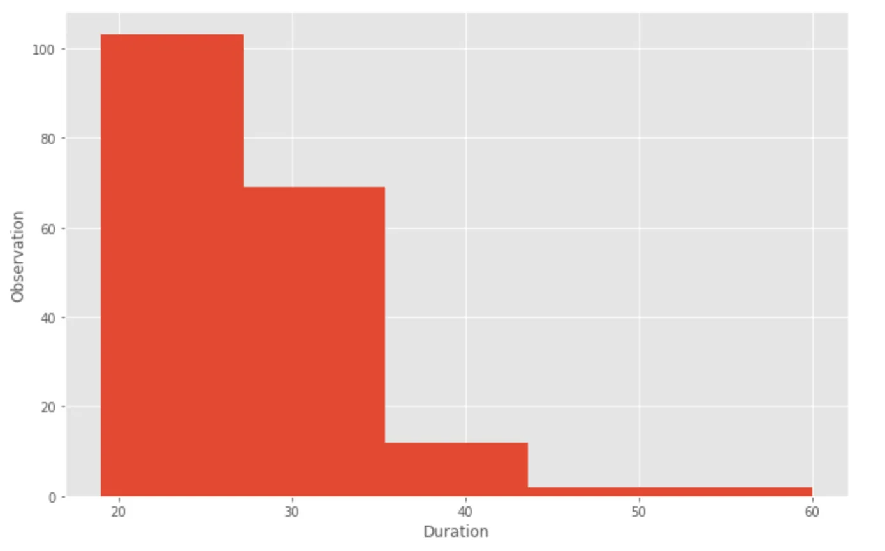
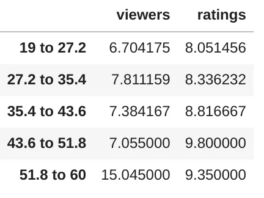
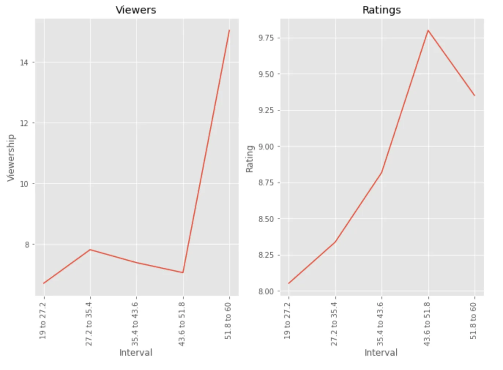

**The office** is an American humoristic television series broadcast between March 24, 2005 and May 16, 2013.

In this project, we will take a look at a dataset of The Office episodes, and try to understand how the popularity and quality of the series varied over time. To do so, we will use the following dataset: **datasets/the_office_series.csv**, which was downloaded from Kaggle [here](https://www.kaggle.com/nehaprabhavalkar/the-office-dataset).

The dataset contains information on a variety of characteristics of each episode. In detail, these are:

- **Season:** Number of seasons.
- **EpisodeTitle:** Title of the episode.
- **About:** Description of the episode.
- **Ratings:** Ratings given to the episode.
- **Votes:** Votes given to the episode.
- **Viewership:** Number of viewers in USA (in millions).
- **Duration:** Duration in the number of minutes.
- **Date:** Date on which the episode was released.
- **GuestStars:** Guest stars appeared on that episode.
- **Director:** Names of directors.
- **Writers:** Names of writers.

## Import librairies and read dataset

```python
import pandas as pd
import matplotlib.pyplot as plt

office_df = pd.read_csv("datasets/the_office_series.csv")
office_df.info()
```

First we import the library that we used during our study, then we will retrieve all of the data contained in the dataset to assign it to the **office_df** variable.

Once the data is retrieved in **office_df** we have tried to preview the data, the result is as follows.

```python
<class 'pandas.core.frame.DataFrame'>
RangeIndex: 188 entries, 0 to 187
Data columns (total 12 columns):
 #   Column        Non-Null Count  Dtype
---  ------        --------------  -----
 0   Unnamed: 0    188 non-null    int64
 1   Season        188 non-null    int64
 2   EpisodeTitle  188 non-null    object
 3   About         188 non-null    object
 4   Ratings       188 non-null    float64
 5   Votes         188 non-null    int64
 6   Viewership    188 non-null    float64
 7   Duration      188 non-null    int64
 8   Date          188 non-null    object
 9   GuestStars    29 non-null     object
 10  Director      188 non-null    object
 11  Writers       188 non-null    object
dtypes: float64(2), int64(4), object(6)
memory usage: 17.8+ KB
```

In view of the previous analysis we need to change the format of the **"Date"** column so that it is datetime, so only the **"GuestStars"** column has nullable values.

In order to be able to use the **"GuestStars"** field we are going to create a little processing in our data.

## Data Processing
```python
office_df['Date'] = pd.to_datetime(office_df['Date'])
print(office_df['Date'].dtype) #output datetime64[ns]
```

First we change the "**Date**" column to **datetime64** more appropriate.

Now let's create a new **hasGuest** column which will be True if the **GuestStars** column is not empty.

```python
office_df['hasGuest'] = list(map(lambda x: not x,  office_df['GuestStars'].isna()))
```

finally let's rename the column "**Unnamed: 0**" to "**episodeNumber**"

```python
office_df = office_df.rename(columns = {'Unnamed: 0': 'episodeNumber'})
```

## Exploratory Data Analyse (EDA)
In this part we will try to answer some questions

- **Can Guest Stars during an episode have an impact on the number of views?**

For this task we will again create a new column "**scaledRatings**" which is a scaling between 0 and 1 of the rating of each episode. This will allow us to assess the impact of this episode.

```python
office_df['scaledRatings'] = office_df['Ratings'].apply(lambda x:(x -min(office_df['Ratings']))/(max(office_df['Ratings'])-min(office_df['Ratings'])))
```

Now let's choose a color that reflects the scale for each episode.

```python
colors = []

for _, row in office_df.iterrows():
    if row['scaledRatings'] < 0.25:
        colors.append('red')
    elif row['scaledRatings'] < .5:
        colors.append('orange')
    elif row['scaledRatings'] < .75:
        colors.append('lightgreen')
    else:
        colors.append('darkgreen')
```

Then a size for each point following the fact that a **hasGuest** is True.

If **hasGuest** is True then the size will be 250 otherwise it will be 25.

```python
sizes = list(map(lambda x: 250 if x == True else 25, office_df['hasGuest']))
```

let's visualize what it gives.

```python
plt.rcParams['figure.figsize'] = [11, 7]
plt.scatter(x=office_df['episodeNumber'], y=office_df['Viewership'], c=colors, s=sizes, alpha=.5)
plt.title("Popularity, Quality, and Guest Appearances on the Office")
plt.xlabel("Episode Number")
plt.ylabel("Viewership (Millions)")
plt.show()
```



Looking at the point cloud we notice that only one point in episode really stands out from the others, in conclusion we can say that the presence of guest start in an episode does not improve its popularity.

But to be clear on this question we will look at a last chart.

```python
fig, ax = plt.subplots(1,2)

ax[0].boxplot([office_df[office_df['hasGuest'] == False]['Ratings'], office_df[office_df['hasGuest'] == True]['Ratings']],
                          showmeans = True,
                          meanline=True,
                          labels= ['hasNoGuest', 'hasGuest'] )
ax[0].set_title('Rating Boxplot')
ax[0].set_ylabel('Ratings')

ax[1].boxplot([office_df[office_df['hasGuest'] == False]['Viewership'], office_df[office_df['hasGuest'] == True]['Viewership']],
              showmeans = True,
              meanline=True,
              labels= ['hasNoGuest', 'hasGuest'])
ax[1].set_title('Viewership Boxplot')
ax[1].set_ylabel('Viewership (Millions)')

plt.show()
```



**\* Ratings**

Regarding the ratings we can say that the episodes with a guest star are slightly more appreciated by the spectators even if the average of the ratings is practically the same.

Regarding the episodes with guest stars there are clearly 2 episodes that stand out. These have a score greater than 9.

```python
office_df[office_df['hasGuest'] == True][office_df['Ratings'] > 9]['EpisodeTitle']
```

```python
77     Stress Relief
187           Finale
Name: EpisodeTitle, dtype: object
```

**\* Viewership**

Regarding the number of views we can we have the same average views and an episode that stands out as in the first chart.

```python
office_df[office_df['hasGuest'] == True][office_df['Viewership'] > 20]['EpisodeTitle']
```

```python
77     Stress Relief
Name: EpisodeTitle, dtype: object
```

On the whole we can say that the presence of a guest star did not particularly improve the popularity or the quality of the episodes except for one episode which comes back several times.

- **Is an episode more appreciated under the direction of a particular director ?**

To answer this question we will have to regroup the directors.

```python
director_df = office_df.groupby('Director')['EpisodeTitle'].agg(['count'])

plt.pie(director_df['count'], labels=director_df.index, radius=2, rotatelabels=True, normalize=True)
plt.show()
```



as we can see, a number of directors have directed the series, we will be particularly interested in those who have a minimum of 10 appearances as a director of the series.

```python
director_df = director_df[director_df['count'] > 10 ].sort_values('count', ascending=False)
director_df
```


Let's add the average of the views to our data.

```python
directorMean_df = office_df.groupby('Director')['Ratings'].agg(['mean'])
new_df = pd.merge(director_df, directorMean_df, left_index=True, right_index=True)
new_df.sort_values('mean', ascending=False)
```


**Paul Feig** and **Ken Kwapis** are rated higher by other directors. They obtained an average above **8.5** in the rating.

But if we look at looking at the number of people who watch the episodes on average, we have a turnaround.

```python
viewer_df = office_df.groupby('Director')['Viewership'].agg(viewers='mean')
new_df = pd.merge(director_df, viewer_df, left_index=True, right_index=True)
new_df.sort_values('viewers', ascending=False)
```



We can conclude from this question that among the directors it is **Paul Feig** who tries to get his pin out of the game, because he is one of those who attract the most people during episodes and these are quite appreciated by the spectators.

- **Can the length of an episode make it less interesting ?**

Let's take a look first at the episodes distribution.

```python
plt.style.use('ggplot')
fig, ax = plt.subplots()
res = ax.hist(office_df["Duration"], bins=5)
ax.set_xlabel("Duration")
ax.set_ylabel("Observation")
plt.show()
```



In view of the histogram we can group the episodes according to 5 criteria.

1. 18 to 27.2 minutes episodes
2. episodes over 27.2 to 35.4 minutes
3. episodes over 35.5 to 43.6 minutes
4. episodes over 43.6 to 51.8 minutes
5. episodes over 51.8

```python
res[1]
```

```python
array([19. , 27.2, 35.4, 43.6, 51.8, 60. ])
```

Get the number of views and the average for each of these intervals.

```python
def rangeGetData(column, df):
    return df[column].mean()

mean_viewers_19___27__2 = rangeGetData('Viewership', office_df[(office_df['Duration'] >= 19) & (office_df['Duration'] < 27.2)])
mean_ratings_19___27__2 = rangeGetData('Ratings', office_df[(office_df['Duration'] >= 19) & (office_df['Duration'] < 27.2)])

mean_viewers_27__2___35__4 = rangeGetData('Viewership', office_df[(office_df['Duration'] >= 27.2) & (office_df['Duration'] < 35.4)])
mean_ratings_27__2___35__4 = rangeGetData('Ratings', office_df[(office_df['Duration'] >= 27.2) & (office_df['Duration'] < 35.4)])

mean_viewers_35__4___43__6 = rangeGetData('Viewership', office_df[(office_df['Duration'] >= 35.4) & (office_df['Duration'] < 43.6)])
mean_ratings_35__4___43__6 = rangeGetData('Ratings', office_df[(office_df['Duration'] >= 35.4) & (office_df['Duration'] < 43.6)])

mean_viewers_43__6___51__8 = rangeGetData('Viewership', office_df[(office_df['Duration'] >= 43.6) & (office_df['Duration'] < 51.8)])
mean_ratings_43__6___51__8 = rangeGetData('Ratings', office_df[(office_df['Duration'] >= 43.6) & (office_df['Duration'] < 51.8)])

mean_viewers_51__8 = rangeGetData('Viewership', office_df[office_df['Duration'] >= 51.8])
mean_ratings_51__8 = rangeGetData('Ratings', office_df[office_df['Duration'] >= 51.8])

duration_df = pd.DataFrame(
    data={
        'viewers': [mean_viewers_19___27__2, mean_viewers_27__2___35__4, mean_viewers_35__4___43__6, mean_viewers_43__6___51__8, mean_viewers_51__8],
        'ratings': [mean_ratings_19___27__2, mean_ratings_27__2___35__4, mean_ratings_35__4___43__6, mean_ratings_43__6___51__8, mean_ratings_51__8]
        },
    index = ['19 to 27.2', '27.2 to 35.4', '35.4 to 43.6', '43.6 to 51.8', '51.8 to 60']
)

duration_df
```



Against all expectations, it seems that viewers enjoy the longer episodes, especially those longer than 51 minutes. These episodes attracted an average of 15 million views and have a rating of over 9.

```python
fig, ax = plt.subplots(1,2)
ax[0].plot(duration_df.index, duration_df.viewers)
ax[0].set_title('Viewers')
ax[0].set_xticklabels(duration_df.index, rotation=90)
ax[0].set_ylabel('Viewership')
ax[0].set_xlabel('Interval')
ax[1].plot(duration_df.index, duration_df.ratings)
ax[1].set_xticklabels(duration_df.index, rotation=90)
ax[1].set_ylabel('Rating')
ax[1].set_xlabel('Interval')
ax[1].set_title('Ratings')
plt.show()
```



## Reference
1. DataCamp's Unguided Project: "Investigating Netflix Movies and Guest Stars in The Office" [**here**](https://projects.datacamp.com/projects/1170)**.**
2. This article was originally written by Kossonou Kouamé Maïzan Alain Serge, as part of the Data Insight [**data scientist program**](https://www.datainsightonline.com/data-scientist-program)**.**
