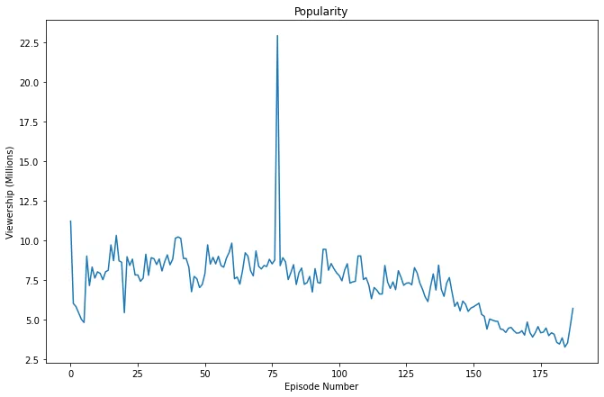
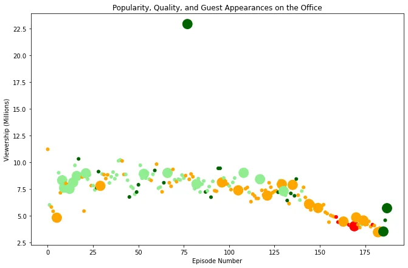

Although fairly famous, I only watched a few cutscenes here and there of the show. First things first, what's it about? It's an American TV series that depicts the everyday work lives of office employees in the Scranton, Pennsylvania, branch of the fictional Dunder Mifflin Paper Company. There is a piece of interesting information. It ran through 9 seasons to air 201 episodes! The show is also famous to the point where the stars and celebrities want a piece of the cake. I guess we'll explore the effect of a show running that long and whether or not the stars can boost its viewership.

In the presented dataset "**datasets/office_episodes.csv**", we take interest in some of the most important fields:

- **episode_number:** Canonical episode number.
- **viewership_mil:** Number of US viewers in millions.
- **guest_stars:** Guest stars in the episode (if any).
- **has_guests:** True/False column for whether the episode contained guest stars.
- **scaled_ratings:** The ratings scaled from 0 (worst-reviewed) to 1 (best-reviewed).

The question now is: What is the best way to show the chronological viewership of the show? **Plots!** A picture is worth 1000 words.

Let's load our data and follow that with a plot showing the viewership of each episode:

```python
import pandas as pd
import matplotlib.pyplot as plt
plt.rcParams['figure.figsize'] = [11, 7]

data = pd.read_csv('datasets/office_episodes.csv')
#Plot views of each episode
fig = plt.figure()
plt.title("Popularity")
plt.xlabel('Episode Number')
plt.ylabel('Viewership (Millions)')
plt.plot(data['episode_number'], data['viewership_mil'])
```

**The resulting plot is the following:**



Okay, so we get a first view of the fact that over time the clear trend is that the views are getting lower. It shows more clearly towards the 75 episodes. But, why? This plot doesn't answer any questions. Is it the ratings? or maybe something else? Let's add some more information to the plot. Also, the lines are fairly misleading. Let's change our plot type along the way to a scatter plot. Points show the information more clearly.

A bit of information we can add to the plot would be the ratings and whether it had guest stars or not. Let's start by running through our dataset and create some filters for these two bits of information.

For the ratings, we can display that as the color. ranging from **red to green (Red** being the worst range of ratings **<0.25** and **Green** being the best range **>0.75**)**.** "Wait what are you talking about? 0.75? 0.25? Both of these are under 1 star!" These are **scaled ratings.** if it's 0 then it's the **lowest** rating an episode has ever gotten. and that can be for example 6 or 7 stars for example. if it's 1 then it's the highest rating ever an episode has ever gotten. I'm mentioning this just in case you missed it in the column's description.

For whether or not an episode has guests, we will simply make the point's size bigger if the episode has guests.

Let's see how this plays out as code:

```python
colors = []
st = 'scaled_ratings'
for i,r in data.iterrows():
    if r[st] < 0.25:
        colors.append("red")
    elif r[st] >= 0.25 and r[st] < 0.50:
        colors.append("orange")
    elif r[st] >= 0.50 and r[st] < 0.75:
        colors.append("lightgreen")
    else:
        colors.append("darkgreen")

sizes = []
for i,r in data.iterrows():
    if r['has_guests'] == True:
        sizes.append(250)
    else:
        sizes.append(25)

#Plot the data using the new information

fig = plt.figure()
plt.title("Popularity, Quality, and Guest Appearances on the Office")
plt.xlabel('Episode Number')
plt.ylabel('Viewership (Millions)')
plt.scatter(x=data['episode_number'],y=data['viewership_mil'],c=colors,s=sizes)
```

This will create the arrays containing each episode's information based on the ratings and whether it has guests or not and finally plot our data. The plot should look much better with this information at hand. Let's see how it turned out.



Let's digest this plot bit by bit:

1. **the downtrend of the viewership seems to be even clearer now.**
2. **The ratings overall also showed a decline over time:** This is true except for the last 3 episodes or so. I strongly believe this is simply due to the nostalgia wrapping a series brings to the users specially after 9 seasons.
3. **From the start, having guest stars didn't seem any effect on the viewership whatsoever:** After all, it makes sense that the viewers are engaged with the actors they see in every episode as they watch them progress and develop their characters over time.
4. **There is one episode that stood out from the rest:** It had double the viewership you normally see and an almost perfect rating of 9.7 stars! What's so special about this? This is more up to you to answer! Comment below what makes you think that episode stood out(the last part of the article might contain spoilers for this question!).

Finally, let's hunt for the guest stars that got the most views. Let's filter out for this episode and see if it had any guest stars in it. First, we do a descending sort by viewership which gets us the first row having the most views, and we go down checking the first row that has any guest stars in it.

```python
d = data.sort_values(by='viewership_mil',ascending=False)
for i,r in d.iterrows():
    if r['has_guests'] == True:
        print(r['guest_stars'].split(','))
        print(r['viewership_mil'])
        break
""" Output
    ['Cloris Leachman', ' Jack Black', ' Jessica Alba']
    22.91
"""
```

So it was more like a combination of stars that got the most views in a single episode. Wait... it had 22.91 Million views, that so happens to be the episode standing out in our previous plot! My guess is even though am not knowledgeable in actors, the name Jack Black still rings a bell to me. He's famous! Could that be the reason this episode was such a hit? Tell me what you think below!

Thank you for your time reading this article. I hope it was worth it!

You can find the notebook to play with via this [link](https://github.com/zqngetsu96/DataInsight_Assignments_and_projects/blob/main/Investigating%20Netflix%20Movies%20and%20Guest%20Stars%20in%20The%20Office/Guest%20stars.ipynb).
