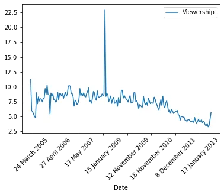
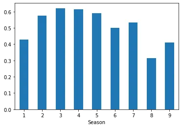
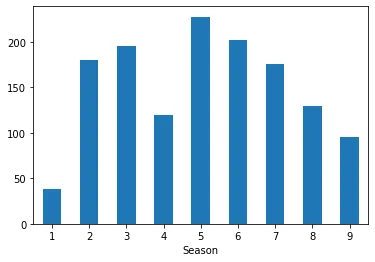
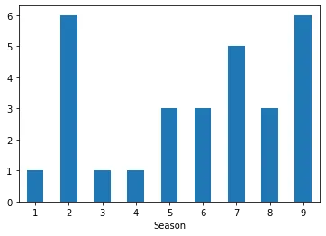
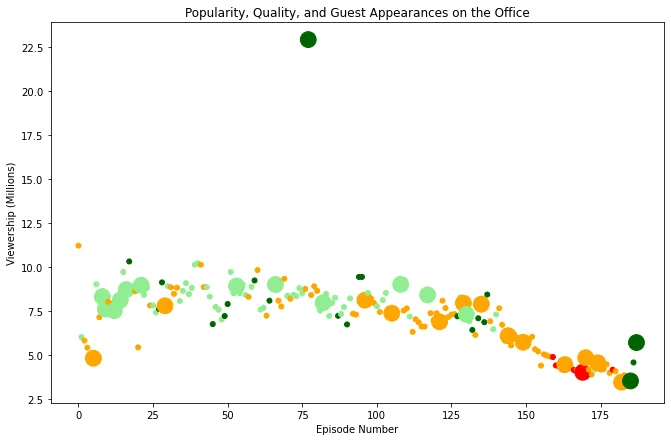

## Introduction

According to Netflix “The Office (US)” is nine seasons situation comedy with 201 episodes. The sitcom was in air from 2005 to 2012 on NBC. Wikipedia indicated that the office is presented in a mockumentary format, portraying the daily lives of office employees in the Scranton, Pennsylvania branch of the fictitious **Dunder Mifflin Paper Company.**

We will try to learn different data manipulation activities using the given data set step by step.

## Step One...Importing and Reviewing the Data Set
Let us see the procedure how we can import the dataset in to jupyter notebook. We need to import NumPy and Pandas libraries to have smooth data manipulation. NumPy is a Python library used for working with arrays whereas, **pandas** are a fast, powerful, flexible, and easy to use open-source data analysis and manipulation tool, built on python.

We used the following code to import pandas and numpy.

```python
#Procedure to import numpy and pandas
import pandas as pd
import numpy as np
```

After downloading the dataset, with CSV format, from [The Office Dataset | Kaggle](https://www.kaggle.com/nehaprabhavalkar/the-office-dataset) in your local machine importing then converting to data frame will continue as follows.

```python
#Importing CSV data using backslash to call the file path
Office_Data = pd.read_csv(r"C:\Users\Yosef\Downloads\the_office_series.csv")
```

Be informed that when we state the file path if \(backward arrow) is used "r" mentioned before the path to avoid python error. The other option is changing \ arrow with / without adding letter "r" as follows. "r" tells python not to read the backslash.

```python
#Importing CSV data using forward slash to call the file path
Office_Data = pd.read_csv("C:/Users/Yosef/Downloads/the_office_series.csv")
```

After importing the data set reviewing of what it contains is the next task to make sure that the data is imported correctly. To do so, we have different options and let us see them one by one.

- The head() method helps us to show top few rows of the data set as follows.

```python
Office_Data.head()
```

Output

```python
nnamed: 0	Season	EpisodeTitle	About	Ratings	Votes	Viewership	Duration	Date	GuestStars	Director	Writers
0	0	1	Pilot	The premiere episode introduces the boss and s...	7.5	4936	11.2	23	24 March 2005	NaN	Ken Kwapis	Ricky Gervais |Stephen Merchant and Greg Daniels
1	1	1	Diversity Day	Michael's off color remark puts a sensitivity ...	8.3	4801	6.0	23	29 March 2005	NaN	Ken Kwapis	B. J. Novak
2	2	1	Health Care	Michael leaves Dwight in charge of picking the...	7.8	4024	5.8	22	5 April 2005	NaN	Ken Whittingham	Paul Lieberstein
3	3	1	The Alliance	Just for a laugh, Jim agrees to an alliance wi...	8.1	3915	5.4	23	12 April 2005	NaN	Bryan Gordon	Michael Schur
4	4	1	Basketball	Michael and his staff challenge the warehouse ...	8.4	4294	5.0	23	19 April 2005	NaN	Greg Daniels	Greg Daniels
```

To see summarized information about the dataset, each columns data types we used [dataframe.info()](http://dataframe.info).

```python
Office_Data.info()
```

Output

```python
<class 'pandas.core.frame.DataFrame'>
RangeIndex: 188 entries, 0 to 187
Data columns (total 12 columns):
 #   Column        Non-Null Count  Dtype
---  ------        --------------  -----
 0   Unnamed: 0    188 non-null    int64
 1   Season        188 non-null    int64
 2   EpisodeTitle  188 non-null    object
 3   About         188 non-null    object
 4   Ratings       188 non-null    float64
 5   Votes         188 non-null    int64
 6   Viewership    188 non-null    float64
 7   Duration      188 non-null    int64
 8   Date          188 non-null    object
 9   GuestStars    29 non-null     object
 10  Director      188 non-null    object
 11  Writers       188 non-null    object
dtypes: float64(2), int64(4), object(6)
memory usage: 17.8+ KB
```

The above summary information indicated that there are a total of 12 columns in the office data set. The data set has 188 non-null rows in most of the columns, but GuestStarts has only 29 non-null values.

we can confirm the number of rows and columns by running datafarame.shape.

```python
Office_Data.shape
```

Output

```python
(188, 12)
```

## Step Two...Cleaning the Data Set
It is noticed that the column GuestStars has null values, denoted as NaN, and needs to be managed by some way. For example, we can add new column called Guests_participated. Guests_participated will be float with True or False values and if GuestStars column contains name of the star the output will be True otherwise it will be False.

```python
#manage Null Values by creating similar column without missing values
Office_Data["Guests_participated"] = np.where(Office_Data.GuestStars.isnull(), False, True)
print(Office_Data.info())
```

Output

```python
<class 'pandas.core.frame.DataFrame'>
RangeIndex: 188 entries, 0 to 187
Data columns (total 13 columns):
 #   Column               Non-Null Count  Dtype
---  ------               --------------  -----
 0   Unnamed: 0           188 non-null    int64
 1   Season               188 non-null    int64
 2   EpisodeTitle         188 non-null    object
 3   About                188 non-null    object
 4   Ratings              188 non-null    float64
 5   Votes                188 non-null    int64
 6   Viewership           188 non-null    float64
 7   Duration             188 non-null    int64
 8   Date                 188 non-null    object
 9   GuestStars           29 non-null     object
 10  Director             188 non-null    object
 11  Writers              188 non-null    object
 12  Guests_participated  188 non-null    bool
dtypes: bool(1), float64(2), int64(4), object(6)
memory usage: 17.9+ KB
None
```

We need to rename Unnamed column in the data set to have easily understandable data set. We used rename function to do so as follows and the renamed column is Episode_Number.

```python
#Rename unnamed column as Episode_Number
Office_Data = Office_Data.rename(columns={"Unnamed: 0" : "Episode_Number"})
```

Let us check whether we successfully changed the column name or not by using dataframe.columns function.

```python
#To See columen names in the Office Data Set.
Office_Data.columns
```

Output

```python
Index(['Episode_Number', 'Season', 'EpisodeTitle', 'About', 'Ratings', 'Votes',
       'Viewership', 'Duration', 'Date', 'GuestStars', 'Director', 'Writers',
       'Guests_participated'],
      dtype='object')
```

We can set the renamed column as an index of the office data set using set index function. The code will looks like the following.

```python
#Change the index from the first column to Episode_Number
Office_Data = Office_Data.set_index("Episode_Number")
print(Office_Data.info())
```

The final thing we did in cleaning of the data is changing of the film ratings from a scale of 0 to 10 to 0 to 1. The reason behind normalizing the ratings of each episode is that we must be sure that ratings are not affected by votes and viewership. There are different ways of normalizing the data set.

Ebrahim Nasir introduced very simple normalization method in his article published in data insights [EDA for The Office TV Show (datainsightonline.com)](https://www.datainsightonline.com/post/eda-for-the-office-tv-show) and we used that code to define our new column called Ratings_Normal. The method used is called MinMax scalers which which transforms the given input in to a range value of 0 and 1. The Transforming code looks like the following.

```python
#import MinMax Scaler and Normalize the New column Ratings_Normal
from sklearn.preprocessing import MinMaxScaler
scaler = MinMaxScaler()
Office_Data[["Ratings_Normal"]] = scaler.fit_transform(Office_Data[["Ratings"]])
print(Office_Data.info())
```

Output:

```python
<class 'pandas.core.frame.DataFrame'>
RangeIndex: 188 entries, 0 to 187
Data columns (total 14 columns):
 #   Column               Non-Null Count  Dtype
---  ------               --------------  -----
 0   Episode_Number       188 non-null    int64
 1   Season               188 non-null    int64
 2   EpisodeTitle         188 non-null    object
 3   About                188 non-null    object
 4   Ratings              188 non-null    float64
 5   Votes                188 non-null    int64
 6   Viewership           188 non-null    float64
 7   Duration             188 non-null    int64
 8   Date                 188 non-null    object
 9   GuestStars           29 non-null     object
 10  Director             188 non-null    object
 11  Writers              188 non-null    object
 12  Guests_participated  188 non-null    bool
 13  Ratings_Normal       188 non-null    float64
dtypes: bool(1), float64(3), int64(4), object(6)
memory usage: 19.4+ KB
None
```

**Step Three...Data Descriptions and Visualizations**

Before we directly proceed to the maps for visualizations describing the available data using different methods of summary statistics. Grouping of the dataset by season review average ratings per season will help us to review which season has the highest or the lowest average ratings.

```python
#To get mean value of each Seasons Ratings.
Office_Data.groupby("Season")["Ratings_Normal"].mean()
```

Output

```python
Season
1    0.427083
2    0.575284
3    0.620924
4    0.613839
5    0.590144
6    0.498798
7    0.533854
8    0.313802
9    0.410326
Name: Ratings_Normal, dtype: float64
```

Based on the output the average ratings per season ranges from 0.31 to 0.62. We can review minimum and maximum ratings per each season using agg() function as follows.

```python
#To get mean value of each Seasons Ratings.
Office_Data.groupby("Season")["Ratings_Normal"].agg([min, max, np.median, np.mean])
```

Output

```python
min     max     median  mean
Season
1       0.28125 0.56250 0.421875        0.427083
2       0.37500 0.87500 0.562500        0.575284
3       0.40625 0.84375 0.625000        0.620924
4       0.37500 0.90625 0.609375        0.613839
5       0.43750 0.96875 0.562500        0.590144
6       0.06250 0.87500 0.468750        0.498798
7       0.25000 1.00000 0.500000        0.533854
8       0.00000 0.46875 0.343750        0.313802
9       0.12500 1.00000 0.375000        0.410326
```

Let us see the relationship between viewership and season of films using bar graph. The first thing is importing of matplotlib in to our working environment.

```python
import matplotlib.pyplot as plt
Office_Data.plot(x="Date", y="Viewership", kind="line", rot=45)
plt.show()
```



The above figure clearly indicates that the sitcom has passed through ups and downs from 2005 to 2013, the viewers declined in number consistently since 2008.

Let us see bar chart which can show us the mean values of normalized ratings per each season of the film. This kind of view helps to see which season has the highest acceptance rate and vise versa.

```python
Office_Data.groupby("Season")["Ratings_Normal"].mean().plot.bar(rot=0)
```

Output



According to the above figure season eight has the worst ratings from all seasons. Season three has the highest record of ratings.

Sum of viewers per each season varies and to know which season has highest viewers let us depict bar graph which is grouped by season.

```python
Office_Data.groupby("Season")["Viewership"].sum().plot.bar(rot=0)
```

Output



Season one has recorded least number of viewers.

To see how many guest stars participated in each season of the film we can plot sum of gust stars group by season as follows.

```python
Office_Data.groupby("Season")["Guests_participated"].sum().plot.bar(rot=0)
```



In seasons two and nine a total of six guest stars participated and that is the highest number of guest stars per season. There is no season with zero guest stars participated.

Now let us plot a scatter plot which has color representation and size for each episode of the film and its viewers. The graph will have a title, label for both x and y axis. Color representation and size will be managed by creating a column called colors and using function of for loop. For Loop is used to iterate over a sequence.

```python
# create a column called colors
colors = []
for lab, row in Office_Data.iterrows():
    if row['Ratings_Normal'] < 0.25:
        colors.append("red")
    elif 0.25 <= row['Ratings_Normal'] < 0.50:
        colors.append("orange")
    elif 0.50 <= row['Ratings_Normal'] < 0.75:
        colors.append("lightgreen")
    else:
        colors.append("darkgreen")
 #Create a column called SIZE
sizes = []

for lab, row in Office_Data.iterrows():
    if row['Guests_participated'] == True:
        sizes.append(250)
    else:
        sizes.append(25)
```

After the for loop for color and size representation let us proceed to creating a scatter plot.

```python
#Create Scatter Plot
fig = plt.figure(figsize=(11,7))
plt.scatter(Office_Data["Episode_Number"], Office_Data["Viewership"], c = colors, s = sizes)
plt.title('Popularity, Quality, and Guest Appearances on the Office')
plt.xlabel('Episode Number')
plt.ylabel('Viewership (Millions)')
plt.show()
```

Output:



To see the guest stars who have highest viewers we used the code mentioned below.

```python
#Answer for the Guest Stars with Higest Viewers
Most_Watched = max(Office_Data["Viewership"])
most_watched_film = Office_Data.loc[Office_Data["Viewership"] == Most_Watched]
top_star = most_watched_film[["GuestStars"]]
print(top_star)
top_star = 'Jack Black'
print(top_star)
```

Output

```python
GuestStars
77  Cloris Leachman, Jack Black, Jessica Alba
Jack Black
```

Finally, we can conclude that millions of people enjoyed watching the office sitcom for many years with varied ratings. Most of the time the ratings ranges from 0.25 to 0.50. Number of viewers declined time to time through years.

N.B. You can get the code here. https://github.com/Zeru-Yosef/The-Office...What-the-Data-Revels-about-its-acceptance-

References

<https://stackoverflow.com/>

<https://www.datainsightonline.com/>

[datacamp.com](http://datacamp.com)

[wikepedia.org](http://wikepedia.org)

Acknowledgement

[Data Scientist Program | Data Insight (datainsightonline.com)](https://www.datainsightonline.com/data-scientist-program)
