In this blog we will explain how pandas is powerful library for data scientist.

**At the first What is The Pandas ?**

**pandas** is a fast, powerful, flexible and easy to use open source data analysis and manipulation tool, built on top of the [Python](https://www.python.org/) programming language.

**History of pandas**

In 2008, *pandas* development began at [AQR Capital Management](https://www.aqr.com/). By the end of 2009 it had been [open sourced](https://en.wikipedia.org/wiki/Open_source), and is actively supported today by a community of like-minded individuals around the world who contribute their valuable time and energy to help make open source *pandas* possible. Thank you to [all of our contributors](https://pandas.pydata.org/about/team.html). Since 2015, *pandas* is a [NumFOCUS sponsored project](https://numfocus.org/sponsored-projects). This will help ensure the success of development of *pandas* as a world-class open-source project.

**How to install pandas ?**

1. Download [Anaconda](https://www.anaconda.com/distribution/) for your operating system and the latest Python version, run the installer, and follow the steps. Please note:

   - It is not needed (and discouraged) to install Anaconda as root or administrator.
   - When asked if you wish to initialize Anaconda3, answer yes.
   - Restart the terminal after completing the installation.

Detailed instructions on how to install Anaconda can be found in the [Anaconda documentation](https://docs.anaconda.com/anaconda/install/).

2-In the Anaconda prompt (or terminal in Linux or MacOS), start JupyterLab:

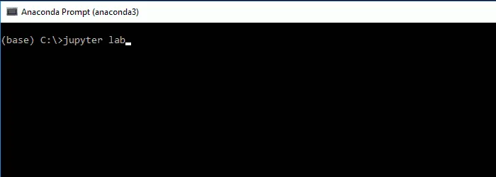

3-In JupyterLab, create a new (Python 3) notebook:

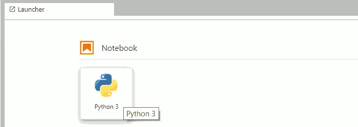

4-In the first cell of the notebook, you can import pandas and check the version with:

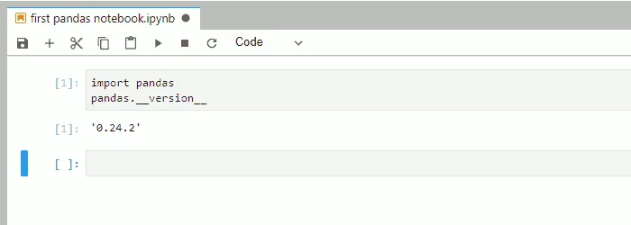

Now we ready to use pandas so let's learn more techniques with pandas.

**Importing Pandas library**

At the first we import pandas library

```python
import pandas as pd
```

now we ready to use pandas in our code.

**Reading Csv Files**

CSV(comma separated files) files are a straightforward way to store large data collections. pandas make us read csv file data easily

in this article I use Titanic Data from Kaggle

```python
df=pd.read_csv('train.csv')
```

we can also take a look in our data by using .head()

```python
df.head()
```

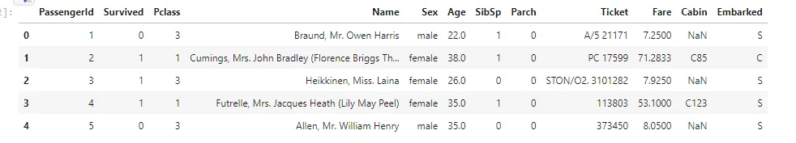

**Getting information**

we can getting information about our data by using .info()

```python
df.info()
```

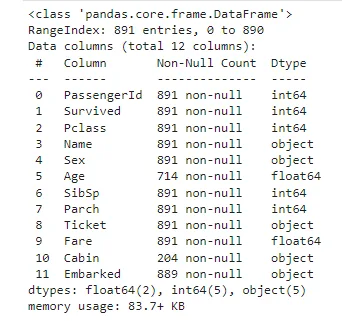

**Working with null values**

as we see there is some null value in Age & cabin columns. pandas working with null values easily.

Pandas treat None and NaN as essentially interchangeable for indicating missing or null values. To facilitate this convention, there are several useful functions for detecting, removing, and replacing null values in Pandas DataFrame :

- isnull()

we use isnull() function this function return dataframe of Boolean values which are True for NaN values.

- notnull()

In order to check null values in Pandas Dataframe, we use notnull() function this function return dataframe of Boolean values which are False for NaN values.

- dropna()

In order to drop a null values from a dataframe, we used dropna() function this function drop Rows/Columns of datasets with Null values in different ways.

- fillna()

function replace NaN values with some value of their own

in our data we use .fillna() to resolve cabin problem

```python
df["Cabin"].fillna("No Cabin", inplace = True)
```


as we shown the null value disappear

**Pivot table**

Pivot table in pandas is an excellent tool to summarize one or more numeric variable based on two other categorical variables.

```python
df.pivot(index='PassengerId', columns='Sex')['Age']
```

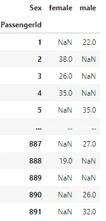

**Check duplicates**

pandas make us to check duplicates in our data by using **.**duplicated()

```python
df.duplicated()
```

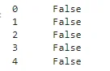

**Quick statistics**

Pandas .describe() is used to view some basic statistical details like percentile, mean, std etc.of a data frame or a series of numeric values.

```python
df.describe()
```

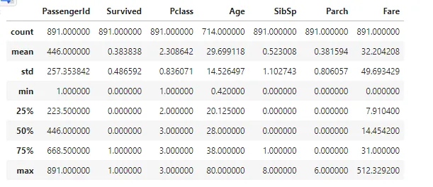

**Visualization with pandas**

pandas can also used to visualize data by using .plot()

```python
df['Sex'].apply(pd.value_counts).plot(kind='bar', subplots=True)
```

**Data Frames in Pandas**

**what is the Data frames?**

Data Frame is a 2-dimensional labeled data structure with columns of potentially different type. You can think of it like a spreadsheet or SQL table, or a dict of Series object

```python
data = {'Brand': ['HH','TT','FF','AA'],
'Price': [22000,25000,27000,35000],
'Year': [2015,2013,2018,2018]}
df = pd.DataFrame(data, columns=['Brand','Price','Year'])
print (df)
```

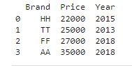

we can sorting data that stored in data frame by using pandas

```python
df.sort_values(by=['Brand'], inplace=True)
print (df)
```

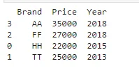

## Iterating over rows of Data Frame
we can iterate over rows in Pandas Dataframe by using different methods .

1-*Using index attribute of the Dataframe*

```python
data = {'Name': ['Ali', 'Ahmed', 'Alaa'],
'Age': [21, 19, 20],'Stream': ['Math' , 'Arts', 'Biology'],
'Percentage': [88, 92, 95]}
# Convert the dictionary into
DataFramedf = pd.DataFrame(data, columns = ['Name', 'Age', 'Stream', 'Percentage'])
print("Given Dataframe :\n", df)
print("\nIterating over rows using index attribute :\n")
# iterate through each row and select # 'Name' and 'Stream' column respectively.
for ind in df.index:print(df['Name'][ind], df['Stream'][ind])
```

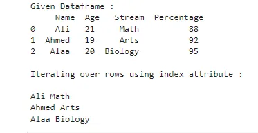

2-*Using loc[] function of the Dataframe.*

```python
data = {'Name': ['Ali', 'Ahmed', 'Alaa'],
'Age': [21, 19, 20],
'Stream': ['Math' , 'Arts', 'Biology'],
'Percentage': [88, 92, 95]}
# Convert the dictionary into
DataFramedf = pd.DataFrame(data, columns = ['Name', 'Age', 'Stream', 'Percentage'])
print("Given Dataframe :\n", df)
print("\nIterating over rows using loc function :\n")
# iterate through each row and select
# 'Name' and 'Age' column respectively.
for i in range(len(df)) :print(df.loc[i, "Name"], df.loc[i, "Age"])
```

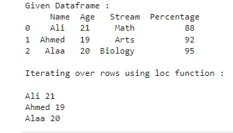

3-*Using iloc[] function of the DataFrame.*

```python
data = {'Name': ['Ali', 'Ahmed', 'Alaa'],
'Age': [21, 19, 20],
'Stream': ['Math' , 'Arts', 'Biology'],
'Percentage': [88, 92, 95]}
# Convert the dictionary into
 DataFramedf = pd.DataFrame(data, columns = ['Name', 'Age', 'Stream', 'Percentage'])
 print("Given Dataframe :\n", df)
 print("\nIterating over rows using iloc function :\n")
 # iterate through each row and select
 # 0th and 2nd index column respectively.
 for i in range(len(df)) :print(df.iloc[i, 0], df.iloc[i, 2])
```

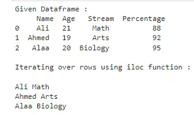

**Conclusion**

Python is a great language for doing data analysis, primarily because of the fantastic ecosystem of data-centric Python packages. **Pandas** is one of those packages and makes importing and analyzing data much easier.

At the end of articles I hope it was useful for you thank you for your time.

**Resources:**

**-kaggle**

<https://www.kaggle.com/rahulsah06/titanic>

-pandas documentation

-Geeks for Geeks
