#### Statistical concepts for Data Science

Understanding fundamental statistical concepts is essential for doing data science. In this article, we will discover together some important notions used by data scientists.

1. Population and sample
2. Binomial distributions
3. Poisson distribution
4. Normal distributions
5. Measures of central tendency
6. Measures of dispersion
7. Covariance and correlation
8. Percentiles, outliers, and box plots
9. Empirical Cumulative Distribution Function
10. Bootsrap

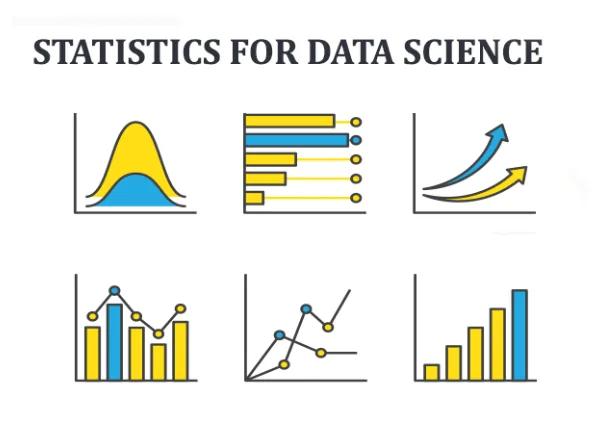

#### Libraries used in this article
```python
import numpy as np
import pandas as pd
from scipy.stats import norm, binom
import matplotlib.pyplot as plt
import statistics
import seaborn as sns
from scipy.special import factorial
```

## Population and sample

When we want to study a large set of data, we can extract a specific group and analyse it. That will be easier and help us obtain a general and approximate idea of the whole population. So the sample is the specific group of elements used to draw conclusions about the population. Obviously, the size of the sample is less than the total size of the population. For instance, to measure the variation of the height of people in a country we should select a sample in order to facilitate the operation.

## Binomial distribution

The binomial distribution is a probability distribution of the number of successes in a sequence of independent trials. For example, we want to know how many times we get head if we flip 3 coins 10 times. The below code calculates the total number of heads from each set of flips of a perfect coin.

```python
binom.rvs(3, .5, size=10)
```

output: array([2, 3, 0, 1, 2, 2, 2, 2, 3, 2])

## Poisson distribution

A poisson precess is a process where events appear to happen at a certain rate, but completely at random. For example, The number of cases of a disease in different towns is a poisson process. The poisson distribution is described by a value called lambda which represents the average number of events per time period. The poisson distribution's shape varies with lambda.

```python
t = np.arange(0, 10, 0.1)
d1 = np.exp(-1)*np.power(1, t)/factorial(t)
d5 = np.exp(-5)*np.power(5, t)/factorial(t)
d8 = np.exp(-8)*np.power(8, t)/factorial(t)

plt.plot(t, d1)
plt.plot(t, d5)
plt.plot(t, d8)

plt.xlabel('Number of events')
plt.ylabel('Probability')
plt.legend(['labmda = 1', 'labmda = 5', 'labmda = 8'])

plt.show()
```

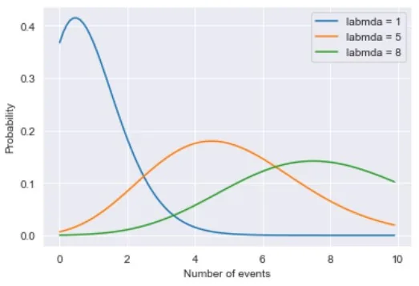

## Normal distribution

Normal distribution is also known as Gaussian Distribution. It's one of the most important probability distributions that is used to model many real world situations. The probability density function is shown below. The graph appears as a bell curve. It is symmetrical. The normal distribution is described by its mean and standard deviation. Here is a normal distribution with a mean of 0 and standard deviation of 1.

```python
sns.set_style("darkgrid")
fig, ax = plt.subplots(1, 1)
mean, var, skew, kurt = norm.stats(moments='mvsk')
x = np.linspace(-2, 2, 100)
ax.plot(x, norm.pdf(x),
       'r-', lw=5, alpha=0.6, label='norm pdf')
plt.show()
print(var)
```

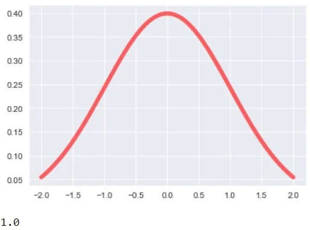

## Measures of central tendency

For this task, we will use a [kaggle](https://www.kaggle.com/burnoutminer/heights-and-weights-dataset) dataset. It contains the height (inches) and weights (pounds) of 25,000 different humans of 18 years of age

```python
df = pd.read_csv("SOCR-HeightWeight.csv")
heights = df["Height(Inches)"] # np.round(df["Height(Inches)"]).astype(int) #floor the heights series
plt.hist(heights, color = "red", lw=2)
plt.xlabel('Height(Inches)')
plt.ylabel('Frequency')
```

output: Text(0, 0.5, 'Frequency')

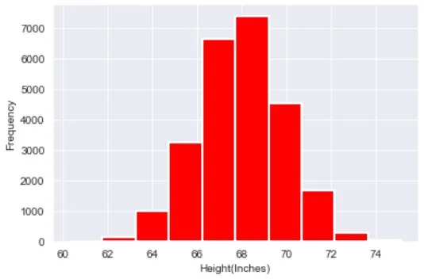

Typically, when we want to measure the center value of a data, we use either mean, median or mode. The mean, often called average, is the most common ways of summarizing data. To calculate the mean we need to sum up all the numbers and divide by the total number of data points.

```python
mean = np.mean(heights)
print("The heights mean is {} inches".format(mean))
```

output: The heights mean is 67.99311359679979 inches

Another measure of center is the median. The median is the value where 50% of the data is higher than it and 50% of the data is lower. We can calculate that by sorting all values and taking the one of the middle index.

```python
heights = heights.sort_values()#inplace=True)
heights.reset_index(drop=True, inplace=True,)
middle_index = int(len(heights)/2)
median = heights.iloc[middle_index]
print("The calculated median is: {}\nThe numpy median function result: {}".format(median, int(np.median(heights))))
```

output: The calculated median is: 67.99592
 The numpy median function result: 67

The mode is the most frequent value in the data.

```python
print(heights.value_counts())
print("The most frequent height is {}".format(statistics.mode(heights)))
```

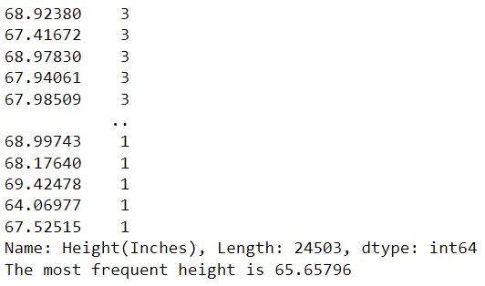

## Measures of dispersion

In order to better understand our data, we need to have an idea about measures of spread. Spread describes how spread apart or close together the data points are. We will begin with the first measure of spread: Variance which is the average distance from each data point to the data's mean.

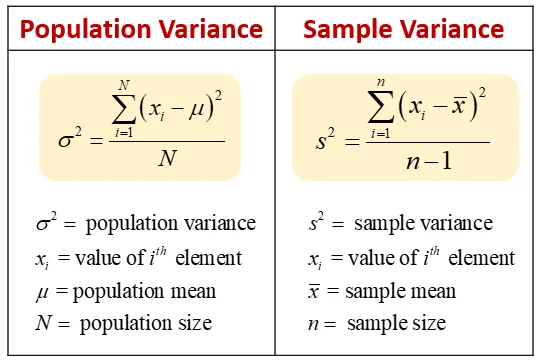

```python
dists = heights - np.mean(heights)
sq_dists = dists ** 2
sum_sq_dists = np.sum(sq_dists)
n = len(heights)
variance = sum_sq_dists / (n-1)
print("The calculated variance = {}\nThe numpy variance = {}" \
      .format(variance, np.var(heights, ddof=1)))
# Without ddof=1, population variance is calculated instead of sample variance
```

output: The calculated variance = 3.616382148854081
 The numpy variance = 3.6163821488540733

The unit of the variance is squared, so we need an easier measurment of dispersion: The standard deviation. It is simply the square root of the variance.

```python
print("STD: {}".format(np.sqrt(variance)))
```

output: STD: 1.9016787712056105

Another measure of despersion similar to the standard deviation Mean Absolute Deviation. It takes the absolute value of the distances to the mean and then takes the mean of those differences.

```python
dist = heights - np.mean(heights)
np.mean(np.abs(dists))
```

output: 1.5179448356838294

## Covariance and correlation

Let us now visualize the relationship between height and weight in our dataset. We will need a scatter plot.

```python
weights = df["Weight(Pounds)"] # np.round(df["Weight(Pounds)"]).astype(int)
_ = plt.plot(heights, weights, marker='.', linestyle='none', color="red", alpha=1)
plt.xlabel('Height(Inches)')
plt.ylabel('Weight(Pounds)')
```

output: Text(0, 0.5, 'Weight(Pounds)')

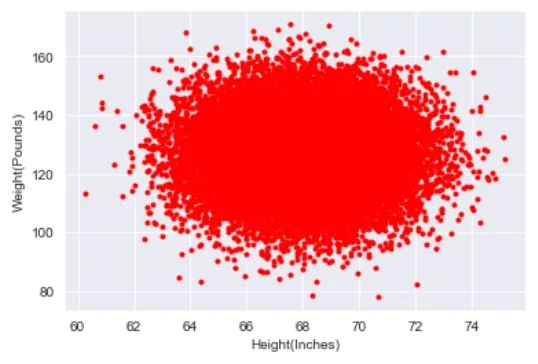

Now, We need a number that summerizes how height varies with weight. One such statistics is the covariance. If the covariance is positive, our two variables are positivly correlated. Conversly, if the covariance is negative, our two variables are negatively correlated. As for the case of variance, we need a numbre that doesn't have any unit so we can divide the covariance by the product of the std of height and weight. Hence, we obtain the Pearson correlation coefficient.

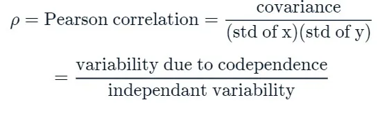

```python
covariance_matrix = np.cov(heights, weights)
print(covariance_matrix)
```

output: [[ 3.61638215 -0.17537673]
 [ -0.17537673 135.97653199]]

```python
print("Covariance: {}".format(covariance_matrix[0,1]))
```

output: Covariance: -0.17537672618776684

```python
corr_mat = np.corrcoef(heights, weights)
print("Correlation: {}".format(corr_mat[0,1]))
print(heights.corr(weights)) # 2nd method
```

output: Correlation: -0.007908658448136563
 -0.007908658448136563

Here the pearson correlation coefficient is almost null. We can't say anything about the dependency of the two variables.

## Percentiles, outliers, and box plots

Percentiles are useful summary statistics. It is a score below which a given percentage k of scores in its frequency distribution falls.

```python
np.percentile(heights, [25, 50, 75])
```

output: array([66.7043975, 67.9957 , 69.2729575])

Let's move to graphical exploring and introduce the boxplots. They can show us many informations about the data, such as the median which is the 50th percentile, the edges of the box (the 25th and the 75th percentile). Points outside of the whiskers are plotted as individual points, they are also known as outliers. Usually, points being more than 2 IQRs (the length of the box) away from the median are outliers.

```python
c = 'red'
sns.boxplot(x=heights, flierprops=dict(color=c, markeredgecolor=c),medianprops=dict(color=c))
plt.show()
```

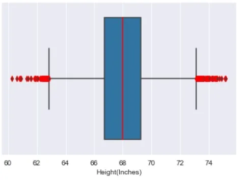

## Empirical Cumulative Distribution Function
In statistics, an empirical distribution function is the distribution function associated with the empirical measure of a sample. In the graph of an ECDF, the y value is the fraction of data points that have value smaller than the corresponding x value.

```python
x = np.sort(weights)
y = np.arange(1, len(x)+1) / len(x)
plt.plot(x, y, marker='.', linestyle='none', color='red')
plt.xlabel('Weight')
plt.ylabel('ECDF')
plt.margins(0.02) # Keeps data off plot edges
plt.show()
```

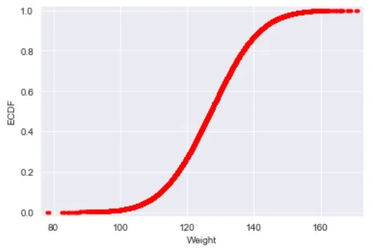

## Bootstrap

Bootstrapping replicate from a set of data refers to random sampling with replacement. Bootstrapping estimates the properties of an estimator (such as its mean) by measuring those properties when sampling from an approximating distribution. One standard choice for an approximating distribution is the empirical distribution function of the observed data.

```python
for i in range(50):
    bs_sample = np.random.choice(heights, size=len(heights))

    # Compute and plot ECDF from bootstrap sample
    x = np.sort(bs_sample)
    y = np.arange(1, len(x)+1) / len(x)

    _ = plt.plot(x, y, marker='.', linestyle='none',
                 color='grey', alpha=0.1)

# Compute and plot ECDF from original data
x = np.sort(heights)
y = np.arange(1, len(x)+1) / len(x)
_ = plt.plot(x, y, marker='.')

plt.margins(0.02)
_ = plt.xlabel('Height(Inches)')
_ = plt.ylabel('ECDF')

# Show the plot
plt.show()
```

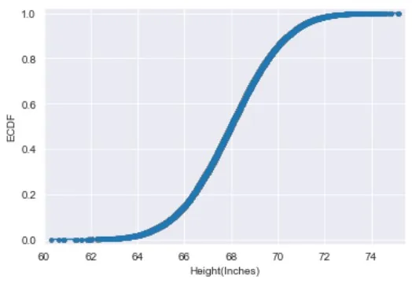

## Thanks for your attention !

## [**Github**](https://github.com/Jihed503/Data_Science_Notebooks/blob/main/Statistical_Concepts_for_Data_Science/Statistical_Concepts_for_Data_Science.ipynb)
