## Introduction
**Data Analysis (DA)** is the process of cleaning, transforming, and modeling data to discover useful information for critical decision-making. The purpose of Data Analysis is to extract useful insights from data and then taking the appropriate decisions based upon those insights. **Data cleaning** is the process of fixing or removing incorrect, or incomplete data within a dataset.

When making a dataset as a result of combining multiple data sources, there are many opportunities for data errors and inconsistencies. If there is something wrong with the data, it negatively affects the process of decision making because our analysis will be unreliable, even though they might look correct!

An important thing to mention here, is that there is **NO** one absolute way to prescribe the exact steps in the data cleaning process because the processes varies from dataset to other. **However,** it is important to create a template for your data cleaning process so you know what issues you are looking for. **In this blog post** we will discuss three important data cleaning processes that you have to check during your data analysis journey, which are: **data type constraints, inconsistent categories, and cross-field validation.** Let's dive in!

## Data Type Constraints
Data can be of various types. We could be working with text data, integers, decimals, dates, zip codes, and others. Luckily, Python has specific data type objects for various data types. This makes it much easier to manipulate these various data types in Python. Before start analyzing data, we need to make sure that our variables have the correct data types, other wise we our insights of the data would be totally wrong.

With regards to data type constraints we will work with a dataset about ride sharing, the data contains information about each ride trip regarding the following features:

- rideID
- duration
- source station ID
- souce station name
- destination station ID
- destination station name
- bike IDF
- user type
- user birth year
- user gender

And it looks like this:

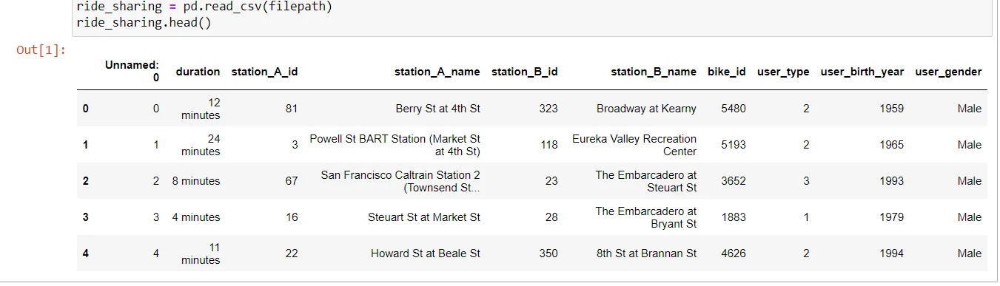

### String to Numerical

The very first thing to spot as a data analyst is the **duration** column, as you can see, the values contains "minutes", which is not appropriate for analysis. We need this feature to be pure **numerical** data type, not **string!**

Let's Handle this!

#### First: remove the text "minutes" from every value
- We will use the function **strip** from the **str** module
- and store the new values in a new column: **duration_trim**

```python
ride_sharing['duration_trim'] = ride_sharing['duration'].str.strip('minutes')
```

#### Second: convert the data type to integer
- We will apply the **astype** method on the column **duration_trim**
- and store the new values in a new column: **duration_time**

```python
ride_sharing['duration_time'] = ride_sharing['duration_trim'].astype('int')
```

#### Finally: check with as assert statement
```python
assert ride_sharing['duration_time'].dtype == 'int'
```

If this line of code produces no output, things are fine!

#### Done!
We can now derive insights from this feature, like what is the average duration for the rides?

```python
print("Average Ride Duration:")
print(str(ride_sharing['duration_time'].mean()) + ' minutes')
```

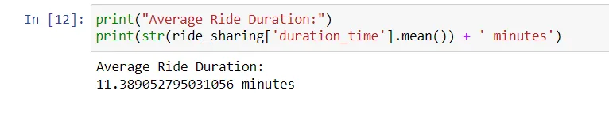

### Numerical to Categorical

If you look at the **user_type** column, it looks fine, however, let's try a deeper look!

```python
ride_sharing['user_type'].describe()
```

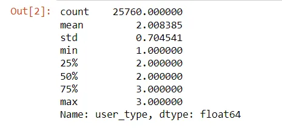

Oops! pandas is treating this as **float!** However, it is **categorical!**

The user_type column contains information on whether a user is taking a free ride and takes on the following values:

- (1) for free riders.
- (2) for pay per ride.
- (3) for monthly subscribers.

We can fix this by changing the data type of this column to **categorical** and store it in a new column: **user_type_cat**

```python
ride_sharing['user_type_cat'] = ride_sharing['user_type'].astype('category')
```

Let's check with an assert statement:

```python
assert ride_sharing['user_type_cat'].dtype == 'category'
```

Let's double check by deriving an insight about what is the most frequent user type

```python
ride_sharing['user_type_cat'].describe()
```

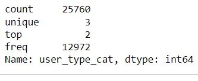

Great! it seems that most users are **pay per ride** users because the top category is 2.

Problems with data types are solved!

## Inconsistent Categories
As you already know, categorical variables are where columns need to have a predefined set of values. When cleaning categorical data, some of the problems we may encounter include value inconsistency, and the presence of too many categories that could be collapsed into one

Let's say that we have a dataset that contains survey's responses about flights, information available are:

- response ID
- flight ID
- day
- airline
- destination country
- destination region
- boarding area
- departure time
- waiting minutes
- how clean the plan was
- how safe the flight was
- satisfaction level of the flight

And the it looks like this:

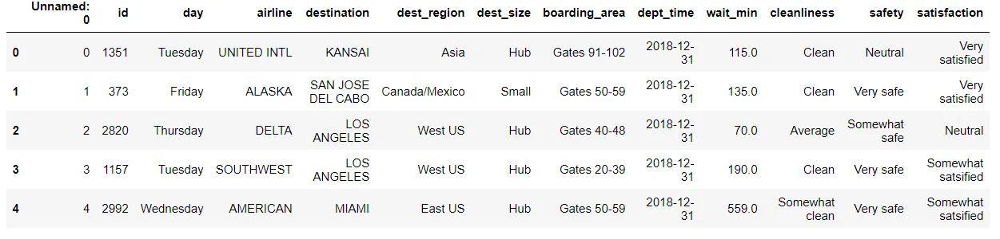

### How to check categorical inconsistencies?

#### First: Create a list of all categorical variables

```python
categorical_features = ['day', 'airline', 'destination', 'dest_region',
       'dest_size', 'boarding_area', 'cleanliness',
       'safety', 'satisfaction']
```

#### Second: Build a function to check the uniqueness

```python
def check_unique(col):
    print('------------------------------------------------')
    print(f"Column: {col}")
    print(airlines[col].unique())
```

#### Finally: Loop over the list

```python
for col in categorical_features:
    check_unique(col)
```

### Capitalization

Let's start with making sure our categorical data is consistent. A common categorical data problem is having values that slightly differ because of capitalization. Not treating this could lead to misleading results when we decide to analyze our data. This problem exists in the column **dest_region** with regards to our dataset

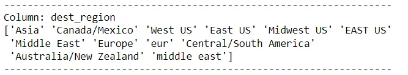

To deal with this, we can either capitalize or lowercase the **dest_region** column. This can be done with the **str.upper()** or **str.lower()** functions.

```python
airlines['dest_region'] = airlines['dest_region'].str.lower()
airlines['dest_region'].unique()
```

Notice that there is another error, "europe" and "eur" are two values belong to the same category. We can fix this by replacing all "eur" to "europe" or vice versa.

```python
airlines['dest_region'] = airlines['dest_region'].replace({'eur':'europe'})

airlines['dest_region'].unique()
```

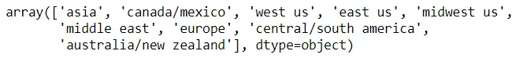

**dest_region** problems have been addressed!

### Spaces

Another common problem with categorical values are leading or trailing spaces. We can spot this in the **dest_size** attribute.

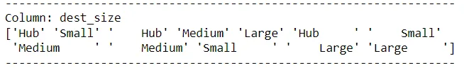

To handle this, we can use the **str.strip()** method which when given no input, strips all leading and trailing white spaces.

```python
airlines['dest_size'] = airlines['dest_size'].str.strip()
```

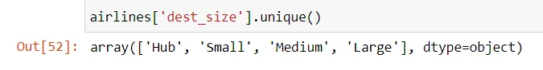

Problems with inconsistent categories are solved!

Let's see our last data cleaning method.

## Cross-Field Validation
Cross field validation (CFV) is the use of multiple fields in your dataset to sanity check the integrity of your data.

Let's have a look at this banking dataset:

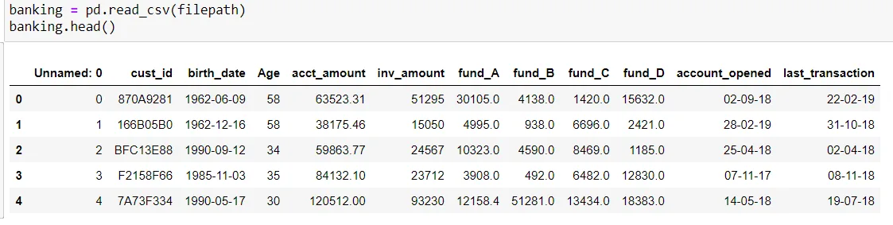

The dataset contains information about bank accounts investments providing the following attributes:

- ID
- customer ID
- customer birth date
- customer age
- account amount
- investment amount
- first fund amount
- second fund amount
- third fund amount
- account open date
- last transaction date

### Where CFV can be applied?

We can apply CFV on two columns:

1. Age

We can check the validity of the age column values by computing it manually using the birth date column and check for inconsistencies.

2. investment amount

We can apply CFV to the whole amount by manually sum all of the four funds and check if they sum up to the whole.

### CFV for Age

#### First, let's convert the datatype to datetime

```python
banking['birth_date'] = pd.to_datetime(banking['birth_date'])
```

#### Then we can compute ages

```python
import datetime as dt
today = dt.date.today()
ages_manual = (today.year - 1) - banking['birth_date'].dt.year
```

#### Finally, find consistent and inconsistent ages

```python
age_equ = ages_manual == banking['Age']
consistent_ages = banking[age_equ]
inconsistent_ages = banking[~age_equ]
```

These eight data points are inconsistent:

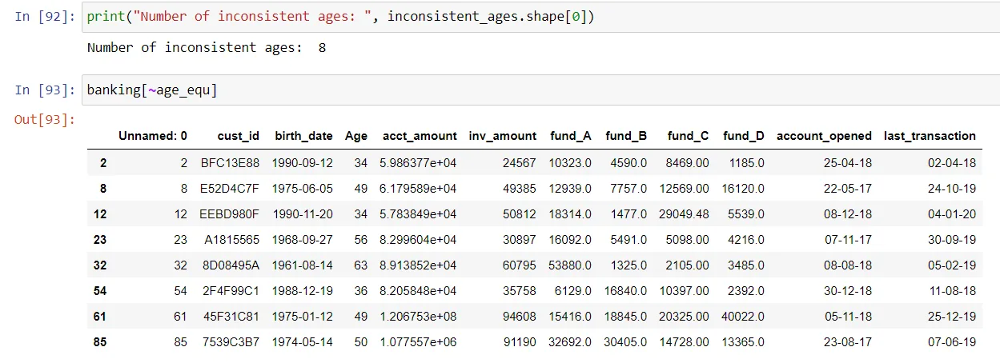

### CFV for investment amount

#### First, store the partial amount columns in a list

```python
fund_columns = ['fund_A', 'fund_B', 'fund_C', 'fund_D']
```

#### And then we can find consistent and inconsistent investments

```python
# Find rows where fund_columns row sum == inv_amount
inv_equ = banking[fund_columns].sum(axis = 1) == banking['inv_amount']

# Store consistent and inconsistent data
consistent_inv = banking[inv_equ]
inconsistent_inv = banking[~inv_equ]
```

These data points are inconsistent when it comes to cross field validation for the whole investment amount:

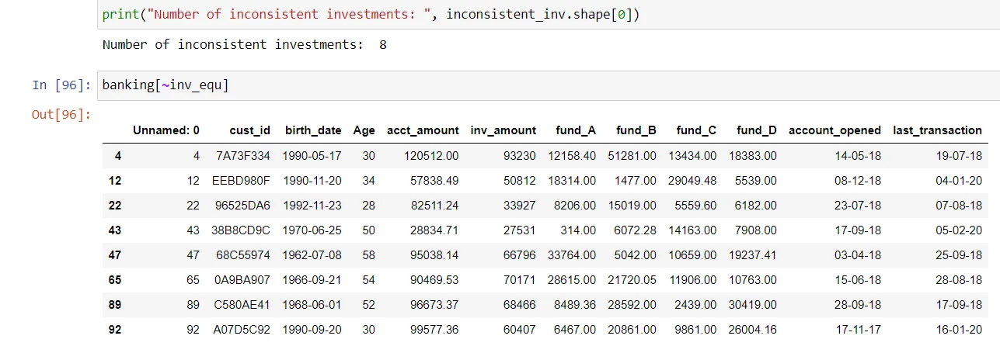

### What to do with those 16 inconsistent data points?

There is **NO** *one size fits all solution*, the best solution requires an in-depth understanding of the dataset. We can decide to either

- Drop inconsistent data
- Deal with inconsistent data as missing and impute them
- Apply some rules due to domain knowledge

## Conclusion!
And here you are reaching the end of this blog post!

In this blog, we discussed three important data cleaning methods. We learned how to diagnose dirty data, and how to clean it. We talked about common problems such as fixing incorrect data types, and problems affecting categorical data. We have also discussed more advanced data cleaning processed, such as cross field validation.

Thank you for reading this! And don't forget to apply what you learned in your daily data tasks!

Best Regards, and happy learning!

**Note:**

You can find the source code and the datasets in my [GitHub](https://github.com/96ibman/cleaning_data_python).

## Acknowledgment
This blog is part of the [Data Scientist Program by Data Insight.](https://www.datainsightonline.com/data-scientist-program)

## References
1. [guru99.com](https://www.guru99.com/what-is-data-analysis.html)
2. [tableau.com](http://tableau.com)
3. [datacamp.com](https://app.datacamp.com/learn/courses/cleaning-data-in-python)
