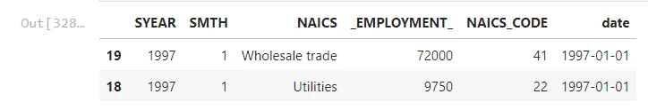
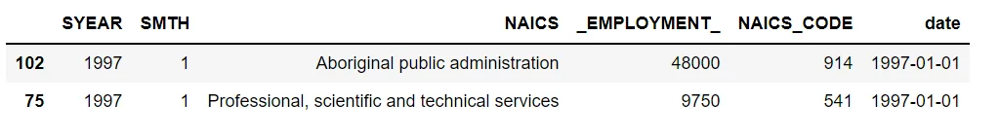
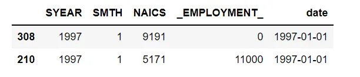
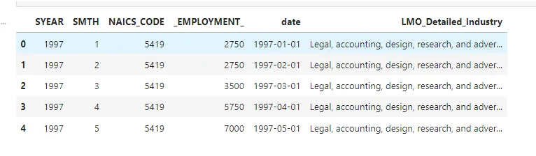
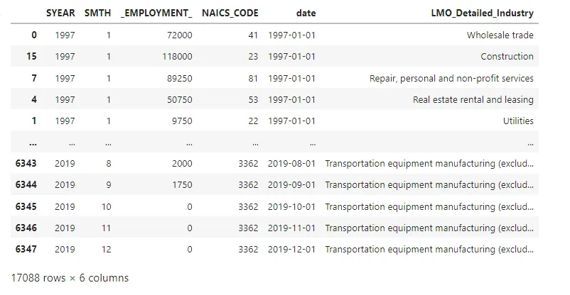
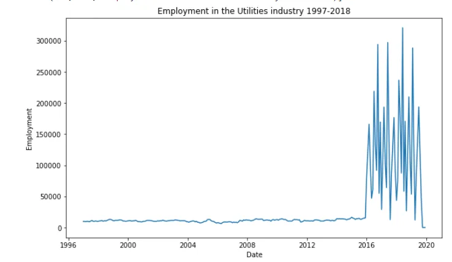
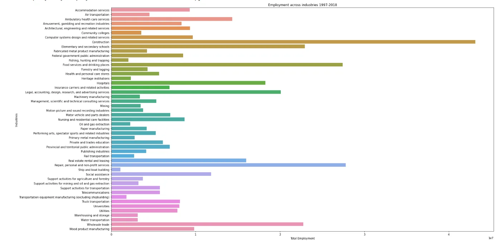

Time-Series-Analysis-of-NAICS TThe North American Industry Classification System (NAICS) is an industry classification system developed by the statistical agencies of Canada, Mexico, and the United States. NAICS is designed to provide common definitions of the industrial structure of the three countries and a common statistical framework to facilitate the analysis of the three economies. This analysis is a step by step analysis of the data, with a blog post found here <https://www.datainsightonline.com/post/analysing-the-naics-time-series-data>

Time-Series-Analysis-of-NAICS TThe North American Industry Classification System (NAICS) is an industry classification system developed by the statistical agencies of Canada, Mexico, and the United States. NAICS is designed to provide common definitions of the industrial structure of the three countries and a common statistical framework to facilitate the analysis of the three economies. This analysis is a step by step analysis of the data, with a blog post found here https://www.datainsightonline.com/post/analysing-the-naics-time-series-data

15 CSV files beginning with RTRA. These files contain employment data by

industry at different levels of aggregation; 2-digit NAICS, 3-digit NAICS, and 4-digit

NAICS. Columns mean as follows:

(i) SYEAR: Survey Year

(ii) SMTH: Survey Month

(iii) NAICS: Industry name and associated NAICS code in the bracket

(iv) _EMPLOYMENT_: Employment

LMO Detailed Industries by NAICS: An excel file for mapping the RTRA data to the

desired data. The first column of this file has a list of 59 industries that are frequently used.

The second column has their NAICS definitions. Using these NAICS definitions and RTRA

data, you would create a monthly employment data series from 1997 to 2018 for these 59

industries.

I will merge LMO Detailed Industries by NAICS file with 2-digit NAICS .

I will merge LMO Detailed Industries by NAICS file with 3-digit NAICS .

I will merge LMO Detailed Industries by NAICS file with 4-digit NAICS .

then

merge all with other .

First read all files and preprossing it for suitable for merging.

Load liberalies

```python
import pandas as pd
import numpy as np
import matplotlib.pyplot as plt
import seaborn as sns
import re
import glob
```

```python
files = glob.glob(r"C:/Users/21AK22/Documents/Data Insight/A_NEWLY_HIRED_DATA_ANALYST/*.csv")
data_2digit = pd.DataFrame()
data_3digit = pd.DataFrame()
data_4digit = pd.DataFrame()
for file in files:
   if re.search('_2NAICS', file):
       df = pd.read_csv(file)data_2digit =
       pd.concat([data_2digit, df])
   elif re.search('_3NAICS',
       file):
       df = pd.read_csv(file)data_3digit =
       pd.concat([data_3digit, df])
   elif re.search('_4NAICS', file):
      df =  pd.read_csv(file)data_4digit =
      pd.concat([data_4digit, df])
```

I will use two function(separate_NAICS_code - Date_column) for preprossing data

```python
def separate_NAICS_code(df):
df1=pd.DataFrame(df.NAICS.astype('str').str.split('[').to_list(), columns=['NAICS','NAICS_CODE'])
df1['NAICS_CODE']= df1.NAICS_CODE.astype('str').str.strip(']').str.replace('-',',')
df['NAICS']=df1['NAICS']
df['NAICS_CODE']= df1['NAICS_CODE']
return df
```

```python
def Date_column(df):
df['date'] = pd.to_datetime(df.SYEAR.astype('str') + df.SMTH.astype('str'), format='%Y%m')
df = df.sort_values('date')
return df
```

preprossing data_2digit data and data_3digit

- Separate NAICS from thier code and put thier code in new column use separate_NAICS_code function.

- create date column using SYEAR and SYEAR use Date_column function.

preprossing data_4digit data only using Date_column function.

```python
data_2digit.head(2)
data_3digit.head(2)
data_4digit.head(2)
```







Read and preprossing LMO_Detailed_Industries_by_NAICS file

- replace & in column NAICS with ,

- put type of column NAICS string

```python
LMO_Detailed_Industries_by_NAICS = pd.read_excel(r"C:/Users/21AK22/Documents/Data Insight/A_NEWLY_HIRED_DATA_ANALYST/LMO_Detailed_Industries_by_NAICS.xlsx")
LMO_Detailed_Industries_by_NAICS['NAICS'] = LMO_Detailed_Industries_by_NAICS['NAICS'].replace(regex='&', value=',').astype('str')
LMO_Detailed_Industries_by_NAICS['NAICS'] = LMO_Detailed_Industries_by_NAICS['NAICS'].astype('str')
print(LMO_Detailed_Industries_by_NAICS.head())
```

splits all values in the NAIC column, that have a comma. We observe the following result



- left merging the data_2digit with lmo_detailed_industries

- left merging the data_3digit with lmo_detailed_industries

- merging the data_4digit with lmo_detailed_industries

then

Merging 3 dataframes

Result:



some visualization on final data

Employment in the Utilities industry 1997-2018

Number of Employment across industries 1997-2018





sourse code:https://github.com/eman888991/Data-Insight/blob/main/Project_Time_Series_Analysis_of_NAICS.ipynb
