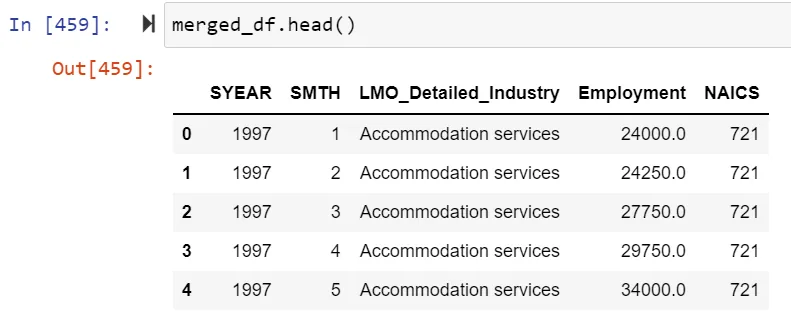
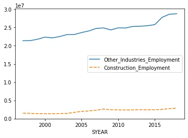
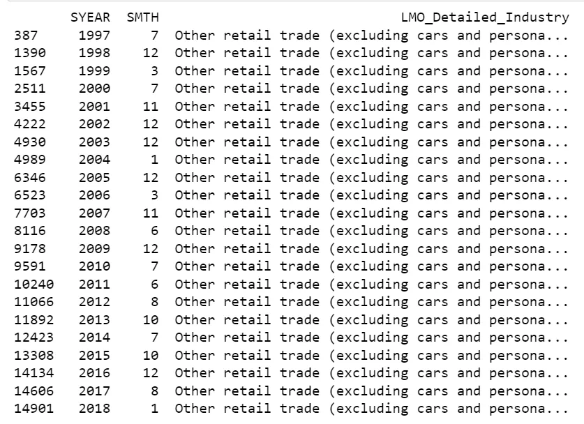
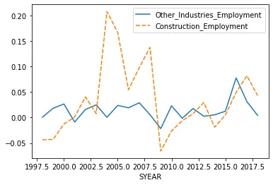
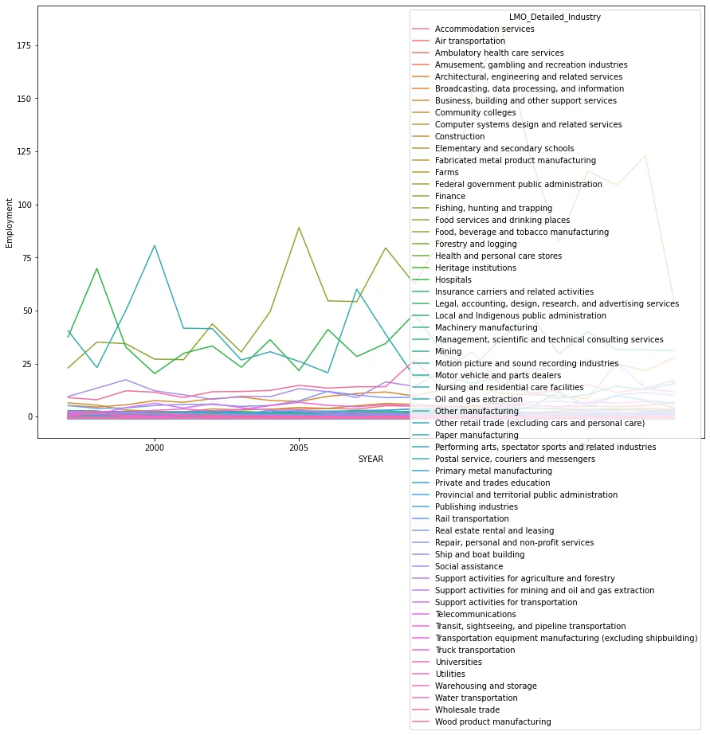

Time series analysis is a **specific way of analyzing a sequence of data points collected over an interval of time**. In time series analysis, analysts record data points at consistent intervals over a set period of time rather than just recording the data points intermittently or randomly.

This blog presents detailed explanation on the analysis of North American Industry Classification System (NAICS) data collected over years, which you can find source code [here](https://github.com/AbdiTolesa/naics-time-series-analysis).

The North American Industry Classification System (NAICS) is an industry classification system developed by the statistical agencies of Canada, Mexico, and the United States. NAICS is designed to provide common definitions of the industrial structure of the three countries and a common statistical framework to facilitate the analysis of the three economies.

**About the dataset:**

1) 15 CSV files beginning with RTRA. These files contain employment data by industry at different levels of aggregation; 2-digit NAICS, 3-digit NAICS, and 4-digit NAICS. Columns mean as follows:

(i) SYEAR: Survey Year

(ii) SMTH: Survey Month

(iii) NAICS: Industry name and associated NAICS code in the bracket

(iv) _EMPLOYMENT_: Employment

2) LMO Detailed Industries by NAICS: An excel file for mapping the RTRA data to the desired data. The first column of this file has a list of 59 industries that are frequently used. The second column has their NAICS definitions.

3) Data output template: this is the file we need to use for analysis later but the Employment column is not filled in with values and doing that is one of our tasks before diving into analyzing our data with different tools.

**Preparing the Dataset**

The first step taken to make the dataset more convenient for analysis is merging of the Data_Output_Template.xlsx with the LMO_Detailed_Industries_by_NAICS.xlsx on LMO_Detailed_Industry field. That would allow us to read the NAICS code(s) related to that industry in a single row when iterating over the rows in the output template file. This is how the merged dataframe looks like.



However the NAICS codes for the industries could be composed of more than one code and they are not necessarily separated by comma. The ampersand sign '&' is used as well in some cases like *'515, 518 & 519'.*

The following snipped is used to split-up the NAICS codes whether the delimiters used are comma(',') and/or ampersand('&')

```python
naics_codes = list(map(str.strip, re.split(',|&', naics)))
```

Next, we have to read the RTRA files to get the respective Employment data for each row of data. The format of the RTRA files is RTRA_Employ_{n_digits}NAICS_{year_range}.csv, where n_digits is the length of the NAICS code and year_range is the year range in which the current row year falls, which is in yy_yy format. One example from the list of RTRA files is 'RTRA_Employ_2NAICS_00_05.csv'. This RTRA file contains data for three digit NAICS code industries for year 2000-2005. Since the year ranges are limited in number as can be inferred from the file names of the RTRA files, the year range of a given can simply be computed with the following conditional block of code.

```python
    if 1997 <= int(year) <= 1999:
        year_range = '97_99'
    elif 2000 <= int(year) <= 2005:
        year_range = '00_05'
    elif 2006 <= int(year) <= 2010:
        year_range = '06_10'
    elif 2011 <= int(year) <= 2015:
        year_range = '11_15'
    elif 2016 <= int(year) <= 2020:
        year_range = '16_20'
```

Once we have extracted the information need to specify the required RTRA file, we can use pandas 'read_csv()' function to load a given dataset into our environment.

```python
rtra_filename = f"dataset/RTRA_Employ_{n_digits}NAICS_{year_range}.csv"
rtra_df_ori = pd.read_csv(rtra_filename)
```

We can finally iterate over the NAICS codes for each row of data in our Data output template file dataframe and then increment the total employment for that specific industry per year and month, aggregating over the list of its own NAICS codes like this.

```python
    total_employment = 0
    for this_naics_code in naics_codes:
        # get the value from RTRA file using year, month and naics_code
        if rtra_df[ (rtra_df['naics_code'] == this_naics_code) ].shape[0] > 0:
            industry_employment_by_year_month = rtra_df[ (rtra_df['naics_code'] == this_naics_code) ].iloc[0]['_EMPLOYMENT_']
        # print(f"industry_employment by_{year}_{month}_code_{this_naics_code}: {industry_employment_by_year_month}")
        total_employment += industry_employment_by_year_month
```

#### Insights from the dataset

### How did Construction evolved over time compared to the total employment across all industries?

To compute the performance of employment history in the Construction Industry with other industries, we can slice the dataset using the value ofLMO_Detailed_Industry. Then we can group the data by the SYEAR field and aggregate the result.

```python
other_industries = output_df_cpy[output_df_cpy["LMO_Detailed_Industry"] != 'Construction']
other_industries_summary = other_industries.groupby(["SYEAR"]).sum().drop('SMTH', axis=1)

construction_industry = output_df_cpy[output_df_cpy["LMO_Detailed_Industry"] == 'Construction']
construction_industry_summary = construction_industry.groupby(["SYEAR"]).sum().drop('SMTH', axis=1)
```



We can see from the graph that the construction has shown a very little improvement in the number of employees hired compared to the other industries that have shown a significant rise especially since 2015.

### Which industry had the most performance each year and throughout?
To know which industry has the highest number of Employment each year, we can simply group the data by year and get the indices for rows of the maximum Employment number using pandas.DataFrame.idxmax() method. We can then slice the original dataframe to filter those rows only and print them.

```python
idx = output_df_cpy.groupby('SYEAR')['Employment'].idxmax()
print(output_df_cpy.loc[idx].head(22))
```



Obviously, the 'Other retail trade (excluding cars and personal care)' industry has been the top employer industry throughout! Interesting!

### How does the employment percentage change look in Construction industry vs the rest, overall?
Pandas provides a handy function pandas.DataFrame.pct_change() that would allow us to compute the percentage of change in values from the previous period.

```python
sns.lineplot(data=combined_summaries.pct_change())
```



### Which Quarter of each year saw the highest employment rate?

Lets check whether employment rate differs seasonally by quarter.

```python
def get_quarter(m):
    return (m-1)//3 + 1

idx = output_df_cpy.groupby('SYEAR')['Employment'].idxmax()
result = output_df_cpy.loc[idx]

result['Qtr'] = result['SMTH'].map(lambda x: get_quarter(x))
result['Qtr'].hist()
```

### Which does employment rate differs across different industries through time?
We can plot the percentage in change of Employment versus year in the x-axis and then add the industry names as hue in the seaborn library sns.lineplot() method, to see plots of lines one of each industry.

```python
sns.lineplot(x="SYEAR", y=output_df_cpy['Employment'].pct_change(), hue="LMO_Detailed_Industry", data=output_df_cpy, ci=None)
```


