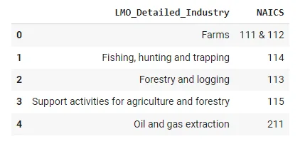
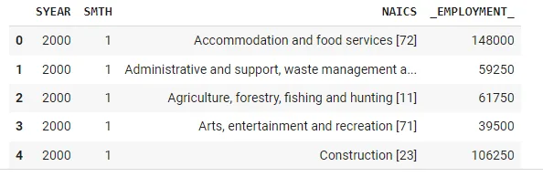
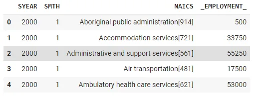
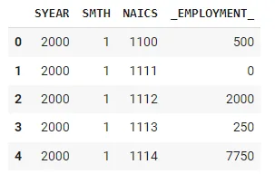
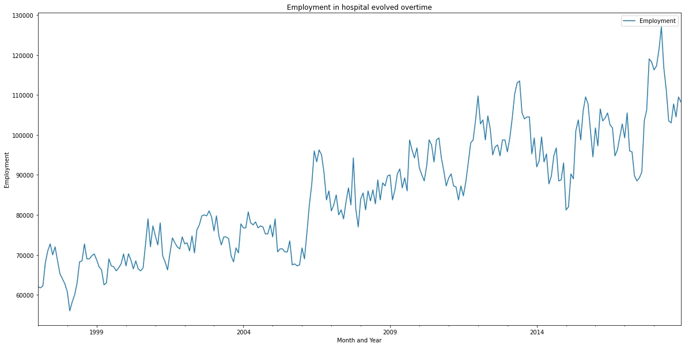
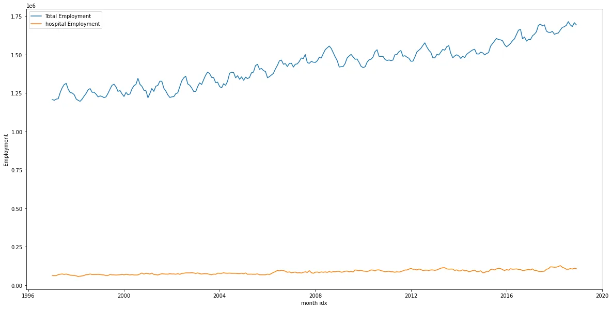
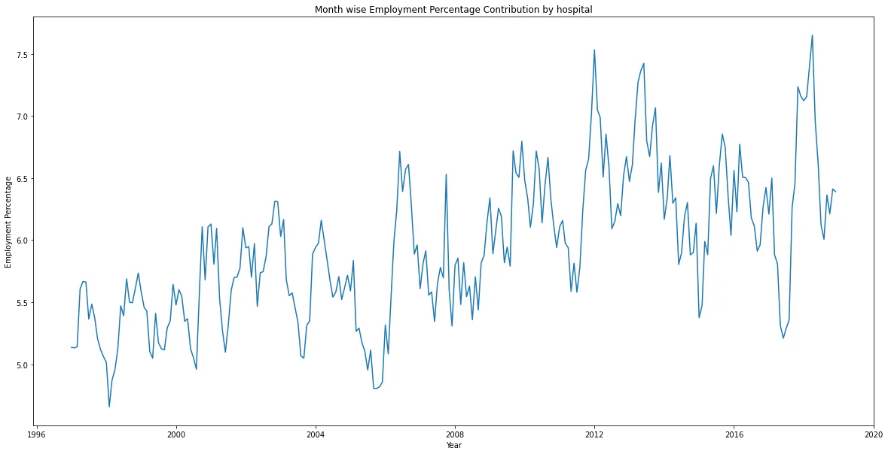
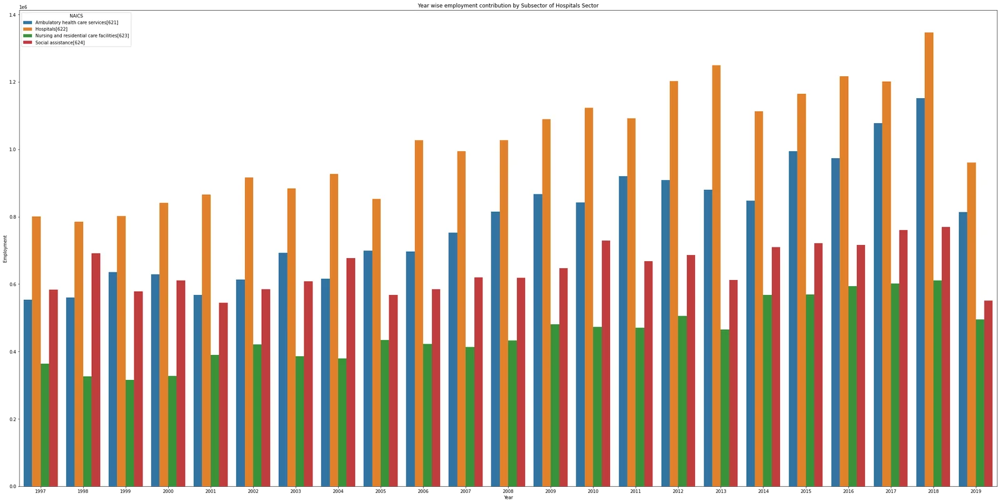

### Introduction:

A Data Analyst is someone who munges information using data analysis tools. The meaningful results they pull from raw data help their employers or clients make important decisions by identifying various facts and trends. The North American Industry Classification System (NAICS) is an industry classification system developed by the statistical agencies of Canada, Mexico, and the United States. NAICS is designed to provide common definitions of the industrial structure of the three countries and a common statistical framework to facilitate the analysis of the three economies.

The following figure gives the analysis of NAICS codes:


### About Dataset:

a. NAICS 2017 – Statistics Canada: Description of the North American Industry Classification System (NAICS). All you would need to understand for this task is, how the NAICS works as a hierarchical structure for defining industries at different levels of aggregation.

a 2-digit NAICS industry (e.g., 23 - Construction) is composed of some 3-digit NAICS industries (236 - Construction of buildings, 237 - Heavy

and civil engineering construction, and a few more 3-digit NAICS industries). Similarly, a 3-digit NAICS industry (e.g., 236 - Construction of buildings), is composed of 4-digit NAICS industries (2361 - Residential building construction and 2362 - Non-residential building construction).

b. Raw data: 15 CSV files beginning with RTRA. These files contain employment data by industry at different levels of aggregation;

2-digit NAICS, 3-digit NAICS, and 4-digit

NAICS. Columns mean as follows:

(i) SYEAR: Survey Year

(ii) SMTH: Survey Month

(iii) NAICS: Industry name and associated NAICS code in the bracket

(iv) _EMPLOYMENT_: Employment

c. LMO Detailed Industries by NAICS: An excel file for mapping the RTRA data to the desired data. The first column of this file has a list of 59 industries that are frequently used. The second column has their NAICS definitions. Using these NAICS definitions and RTRA data, you would create a monthly employment data series from 1997 to 2018 for these 59

industries.

### Importing Libraries:
```python
import pandas as pd
import numpy as np
import seaborn as sns
import matplotlib.pyplot as plt
% matplotlib inline
```

### Loading Data:

```python
lmo_data = pd.read_excel('LMO_Detailed_Industries_by_NAICS.xlsx')
lmo_data.head()
```



```python
df_2_naics = pd.read_csv('RTRA_Employ_2NAICS_00_05.csv')

file_2_naics = ['RTRA_Employ_2NAICS_06_10.csv', 'RTRA_Employ_2NAICS_11_15.csv',
                'RTRA_Employ_2NAICS_16_20.csv', 'RTRA_Employ_2NAICS_97_99.csv']

for i in file_2_naics:
    df = pd.read_csv(i)
    df_2_naics = df_2_naics.append(df, ignore_index=True)

df_2_naics.head()
```



```python
df_3_naics = pd.read_csv('RTRA_Employ_3NAICS_00_05.csv')

file_3_naics = ['RTRA_Employ_3NAICS_06_10.csv',        'RTRA_Employ_3NAICS_11_15.csv',
                'RTRA_Employ_3NAICS_16_20.csv',     'RTRA_Employ_3NAICS_97_99.csv']
for i in file_3_naics:
    df = pd.read_csv(i)
    df_3_naics = df_3_naics.append(df, ignore_index=True)

df_3_naics.head()
```



```python
df_4_naics = pd.read_csv('RTRA_Employ_4NAICS_00_05.csv')

file_4_naics = ['RTRA_Employ_4NAICS_06_10.csv', 'RTRA_Employ_4NAICS_11_15.csv',
                'RTRA_Employ_4NAICS_16_20.csv', 'RTRA_Employ_4NAICS_97_99.csv']

for i in file_4_naics:
    df = pd.read_csv(i)
    df_4_naics = df_4_naics.append(df, ignore_index=True)

df_4_naics.head()
```



### EDA and Visualization :

**Plotting the Employment for each sector**

```python
plt.figure(figsize=[20,25])
sns.barplot(x=industry_wise_summary.Employment,y=industry_wise_summary.index,palette='mako');
```


As we see the highest sector is construction but I'm interested to study the hospital sector and see how this sector improve through time.

```python
hospital_data.plot(y="Employment", title="Employment in hospital evolved overtime", figsize=(20,10))
plt.xlabel("Month and Year")
plt.ylabel("Employment")
```



The hospitals employment comparing to the total

```python
total_employment_summary = month_wise_employment_summary.groupby("month idx")["Employment"].sum()
total_employment_summary = total_employment_summary.reset_index()
# total_employment_summary.head()
plt.figure(figsize=(20,10))
sns.lineplot(x="month idx", y="Employment", data=total_employment_summary, label="Total Employment")
sns.lineplot(x="month_idx", y="Employment", data=hospital_data, label="hospital Employment")
plt.title("")
plt.show()
```



Month wise Employment Percentage Contribution by hospital

```python
plt.figure(figsize=(20,10))
sns.lineplot(x="month idx", y="Employment_perc", data=hospital_perc_df)
plt.xlabel("Year")
plt.ylabel("Employment Percentage")
plt.title("Month wise Employment Percentage Contribution by hospital")
plt.show()
```



Year wise employment contribution by Subsector of Hospitals Sector

```python
plt.figure(figsize=(40,20))
sns.barplot(x="SYEAR", y="_EMPLOYMENT_", hue="NAICS", data=hospital_subsector_summary)
plt.xlabel("Year")
plt.ylabel("Employment")
plt.title("Year wise employment contribution by Subsector of Hospitals Sector")
plt.show()
```



Subsectors contribution towards the Hospital Sector

```python
plt.figure(figsize=(15,5))
sns.barplot(x="NAICS", y="_EMPLOYMENT_", data=hospital_subsector)
plt.ylabel("Employment")
plt.title("Employment contribution by Subsector of hospital Sector")
plt.show()
```


## Conclusion:
The construction field is the highest but in next few years the hospital sector will grow due to pandemic COVID-19 most of countries will invest more and more in the health sector.
