According to **Wikipedia**, Data analysis is a process of inspecting, cleansing, transforming and modeling data to discover useful information, informing conclusions and supporting decision-making.

The process of data analysis can be summarized as follows:

1. Ask
2. Prepare
3. Process
4. Analyze
5. Share
6. Act

In the first step, we have to define the problem and ask the right questions. Asking the right question is important to get meaningful information from data.

In the second step, we first need to understand how data is generated and collected Then, identify and use different types of data formats, types and structures.

The process step includes data cleaning and transformation. In which, we need to maintain data integrity.

In analyzing step, we can use a variety of tools to format and transform data such as sorting, filtering, etc. In this step, we identify patterns and draw conclusions, or make predictions and recommendation.

In the fifth step, we bring our data to life. Effective visualization are created in this step. The visualization are used to communicated to help others understand results.

Finally, we apply our insights that drawn from the data such as solving problems, making decisions or creating something new.

Now, let's move into the project and I am going to explain the process of this analysis based on the above steps.

## Step1: Ask

The following questions will guide the whole process.

1. How employment in Construction evolved over time and how this
   compares to the total employment across all industries?
2. How employment in Motion picture and sound recording Industry changed over time?
3. Which industry has the highest employment and which one has the lowest?
4. What are some top industries which has high employment?
5. How is the evolution of employment for 59 industries?
6. What are the most likely to increase in employment for next few years?

Step2: Prepare

The data used in this process includes the employment data for different industries of NAICS ( The North American Industry Classification System). The industries are classified based on NAICS code in a hierarchical structure.

The Classification Structure displays the codes and titles of the sectors, subsectors, industry groups, industry, and national industries of NAICS Canada. In general, comparable sectors, subsectors, industry groups, industries carry the same code in NAICS Canada, NAICS Mexico and NAICS United States.

A total of 15 CSV files beginning with RTRA were provided. These files contain employment data by industry at different levels of aggregation; 2-digit NAICS, 3-digit NAICS, and 4-digit NAICS.

Columns mean as follows:

(i) SYEAR: Survey Year

(ii) SMTH: Survey Month

(iii) NAICS: Industry name and associated NAICS code in the bracket

(iv) _EMPLOYMENT_: Employment

Total time period for each 2Digit, 3 Digit , and 4Digit NAICS is from 1997 to 2019 ( a total of three files for each NAICS).

In this project, we are supposed to create a monthly employment data series from 1997 to 2018 for the frequent used 59 industries. We can see the expected output data in Data output template.

We will have to use LMO Detailed Industries by NAICS file for mapping the RTRA data to the desired data. The first column of this file has a list of 59 industries that are frequently used.

## Step3: Process

Now let's start processing. Frist import them as pandas data frames using the following function. Since the RATA files have 3 separate files for each 2Digit, 3Digit and 4Digit file, we need to merge them.

```python
 #function for reading csv file
def read_file(df,list_fi):
  for file in list_fi:
    dff=pd.read_csv(file)
    df=df.append(dff,ignore_index=True)
  return df
```

The function takes two parameters: one for to store the merged data frame and the other is a list of files for 2Digit and 3Digit and 4Digit RATA files respectively.

Let's explore each data frame.

2Digit-NAICS

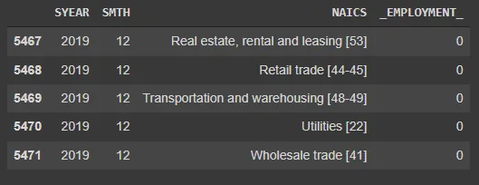

3Digit-NAICS

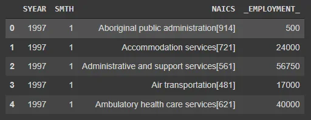

4Digit-NAICS

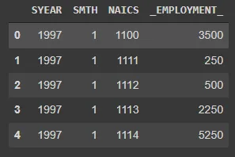

A mapping file - LMO_Detailed_Industry

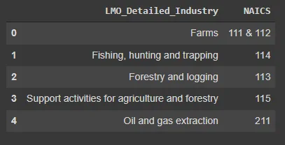

We have to use the codes in NAICS column of LMO file for mapping the data frames to get the monthly employment data for 59 Industries. So that we need to do some preprocessing.

First, NAICS columns of 2Digit and 3Digit data frames need to be removed NAICS description names and left with NAICS code. 4Digit NAICS does not need.

```python
#function to make 2 digit and 3 digit df to remove NAICS names and only left the code number
def remove_NAICSnames(df_name):
  for i in range(len(df_name)):
    str1=df_name.NAICS.loc[i]
    fil=re.search(r'((\d+)(-)(\d+))|(\d+)',str1)
    if fil:
      df_name.loc[i,'NAICS']=fil.group(0)
    else:
      df_name.loc[i,'NAICS']=''
```

This function will remove the NAICS description names and left with the NAICS codes.

Result:

2Digit-NAICS

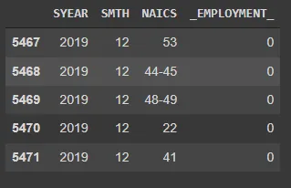

3Digti-NAICS

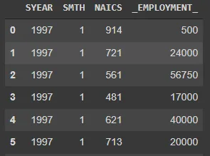

We can see we still need to do some processing in 2Digit NAICS file. There are the NAICS values which has more than one code which refers to same industry. So, I split them into separate rows.

```python
#split rows like(44-45) into two
NAICS2_D.NAICS=NAICS2_D.NAICS.str.split('-')
#explode
NAICS2_D=NAICS2_D.apply(pd.Series.explode)
```

Result:

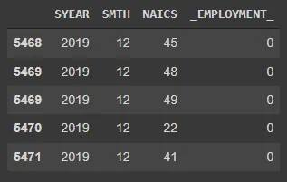

A mapping LMO also needs some preparation. Some of the NAICS columns has more than one code which refers to the same industry. First, we need to replace '&' with ','.

```python
# replace & with ,
lmo.NAICS=lmo.NAICS.replace(to_replace=' & ',value=',' , regex=True)
```

Result:

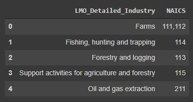

Again, I split the rows which has more than one code into separate rows.

```python
# split the row which has more than one NAICS code to multiple rows
lmo.NAICS=lmo.NAICS.astype('str').str.split(',')
#explode
lmo=lmo.apply(pd.Series.explode)
```

Result:


Please note that all the NAICS columns are string types and you can change into integer type or you may just care of whit spaces if you use as string.

Now, we are ready to merge the data frame to get each 2Digit, 3Digit and 4Digit data frames respectively.

The following is the function to merge the data frames.

```python
#function for mergine data frame
def merge_df(df1,df2):
  df_new=df1.merge(df2,on='NAICS').sort_values(['SYEAR',
  'SMTH','LMO_Detailed_Industry']).reset_index(drop=True)
  return df_new
```

After merging them, we will have the rows which refer to the same industry. So we need to recombine them into a single row.

```python
#combine two rows which has same Industry name and sum employment
NAICS2_merged=NAICS2_merged.groupby(by=['SYEAR','SMTH', 'LMO_Detailed_Industry']).agg({'_EMPLOYMENT_':sum}).
reset_index()
```

This should go for 3Digit and 4Digit as well.

Result:

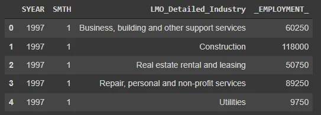

The next step is we have to drop 2019 rows for each merged data frame since we just need the data from 1997 to 2018.

```python
NAICS2_97_2018=NAICS2_merged[NAICS2_merged['SYEAR']<2019]
```

Repeat the same step for 3Digit and 4Digit NAICS.

The final step of the preparation is to join all of the data frames together.

```python
NAICS_Complete=pd.concat([NAICS2_97_2018,NAICS3_97_2018,NAICS4_97_2018],ignore_index=True)
```

Check the shape and compare with the shape of output template.

```python
NAICS_Complete.shape
```


```python
output_template=pd.read_excel('/content/Data_Output_Template.xlsx')
output_template.shape
```


Check statistics:

```python
# Analyzing
NAICS_Complete._EMPLOYMENT_.describe()
```

Result:

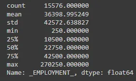

It seems complete.

Step4: Analyze , Step5: Share

First focus question: How employment in Construction evolved over time and how this compares to the total employment across all industries?

To answer this, first extract 'construction only' data frame from the complete NAICS file.

```python
construction_df=NAICS_Complete[NAICS_Complete.LMO_Detailed_Industry=='Construction']
```

Then, group the data frame according to year and then plot the line chart to see trend.

```python
construction_by_year=construction_df.groupby('SYEAR')['_EMPLOYMENT_'].sum().reset_index()
```

Plot:

```python
plt.plot(construction_by_year['SYEAR'],construction_by_year ['_EMPLOYMENT_'],color='red',marker='o')
plt.title('Employment Per Year for Construction Industry', fontsize=14)
plt.xlabel('YEAR', fontsize=14)
plt.ylabel('EMPLOYMENT', fontsize=14)
plt.grid(True)
plt.show()
```

Result:

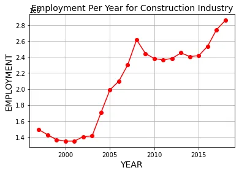

From the above line chart, we can see that the amount of employment was first decreasing until 2001. Starting from 2003, the employment in construction was evolved dramatically and reached the peak at 2008. After 2008, it was decreasing again until 2011 and gradually increasing. From 2015 to 2018, the employment in construction was going up with big steps. It is likely to keep going up after 2018 as well.

To answer the second part of the above question, which is to compare construction with other industries. I created 59 subplots in Tableau Dashboard. Interestingly, a trend line of construction is totally different from others while most of the other trends are similar in which the evolution of most industries did not change that much within these 22 years. Whereas, construction industry employment evolution had a huge change after 20th century.

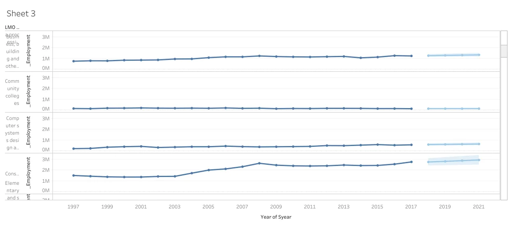

You can find this dashboard [here](https://public.tableau.com/views/NAICS_Time_Series_2/Dashboard2?:language=en-US&publish=yes&:display_count=n&:origin=viz_share_link).

The second focus question: How employment in Motion picture and sound recording Industry changed over time?

Again extract Motion Industry only data and plot them as a line chart.

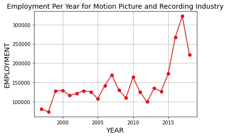

We can see that the evolution of employment fluctuated with ups and downs before 2015. After 2015, the number of employment had increased surprisingly with large amount and reached the peak at 2017. It was falling down after 2017, and according to the prediction analysis that applied in Tableau, the employment evolution would again likely to go up for next three years.

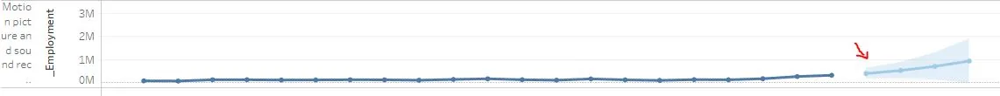

Next questions:

Which industry has the highest employment and which one has the lowest?

What are some top industries which has high employment?

To answer these, I extracted employment data for 59 industries.

```python
industries=NAICS_Complete.groupby('LMO_Detailed_Industry')['_EMPLOYMENT_'].sum()
```

Then, I save as an excel file to create a dashboard using Tableau.

```python
#save as an excel file
industries.to_excel('/content/employment_per_industry.xlsx')
```

You can find this dashboard [here](https://public.tableau.com/views/NAICS_Time_Series_1/Dashboard1?:language=en-US&publish=yes&:display_count=n&:origin=viz_share_link).

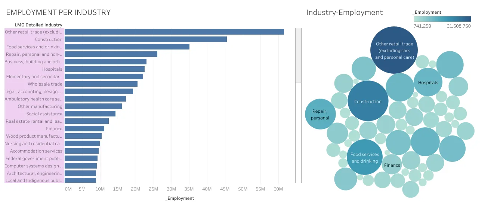

From there, Other retail trade (excluding car and personal care) has the highest employment and construction comes second. Some of the top industries which has high employment are: Food services and drinking places, Repair, personal and non-profit, Business, buildings and other support services and Hospitals industry. Fishing, trapping and hunting has the lowest employment.

Then we will see how is the evolution of employment for 59 industries.

I again use Tableau dashboard to visualize.

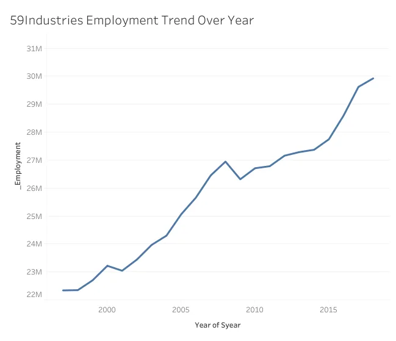

The variance of employment for a total of 59 industries has a upward trend means that the overall amount of employment is keep increasing.

Final question: What are the most likely to increase in employment for next few years?

I used prediction tool in Tableau of 59 subplots for 59 industries. Construction, Motion Picture and sound recordings industry, Other (Retail, Trade (excluding cars and personal cares) are the most likely to increase in employment for next few years.

Dashboard link [here](https://public.tableau.com/views/NAICS_Time_Series_2/Dashboard2?:language=en-US&publish=yes&:display_count=n&:origin=viz_share_link)  .

Step7: Act

The final steps is to make some decisions or recommendations. For my future work, I would continue to working on this project to find more insights by asking more effective questions.
