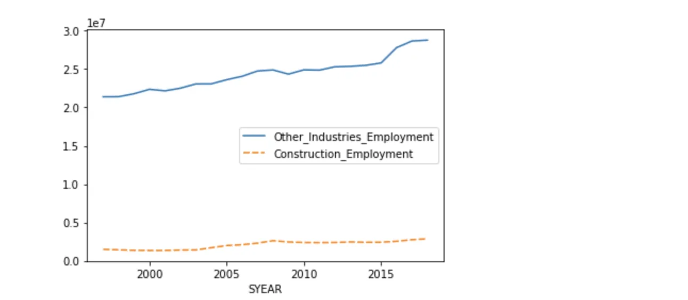
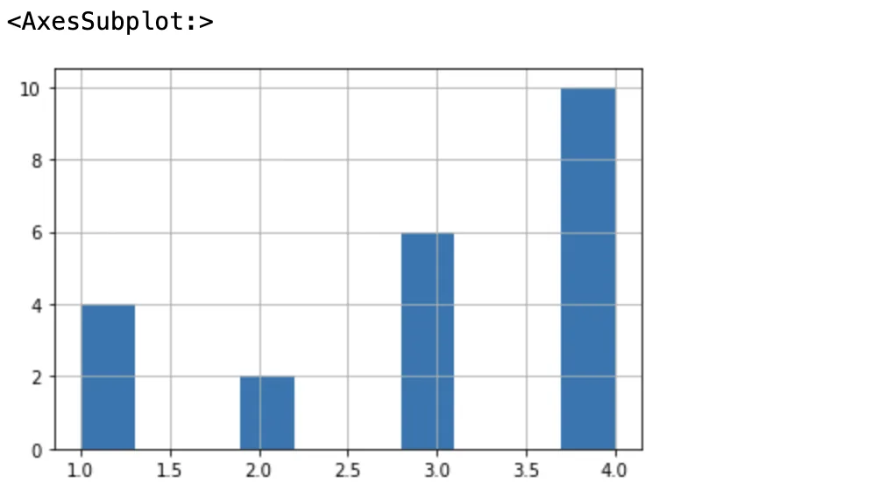

NAICS stands for The North America Industry Classification System developed by three countries Canada,US and Mexico.The goal of this blog post is to answer few questions which will arise in any Data Analyst mindset and when he/she will see the data which will solve few of the problems.
The whole idea revolves around time after all it's the single most entity which change the future and how we see the things.Hence the time series analysis it is.Let's get started

Importing Libraries

```python
# import necessary libraries
import pandas as pd
import re
```

Now read data and merge the files to read data again since there are too many files to read and opening each one of them will create a mess hence start reading two main files and merge the rest to read and see the values.

Pick the path and read the main xlsx files and sort the files through year and merge it using merged_df.head().

```python
lmo_detailed_df = pd.read_excel('/Users/rohitroy/Downloads/Data Scientist Program/A_NEWLY_HIRED_DATA_ANALYST/LMO_Detailed_Industries_by_NAICS.xlsx')
data_output_df  = pd.read_excel('/Users/rohitroy/Downloads/Data Scientist Program/A_NEWLY_HIRED_DATA_ANALYST/Data_Output_Template.xlsx')

merged_df = data_output_df.merge(lmo_detailed_df, on="LMO_Detailed_Industry")
merged_df.NAICS = merged_df.NAICS.astype('str')
```

**How construction evolved with regards to other industries ??**
In order to find out plot the graph install the seaborn library and see LMO_DETAILED_INDUSTRY. And we can clearly see how the industry of construction has been **low** in total employment compared to other industries over period of 15 years.

```python
construction_industry.rename(columns={'Employment':'Construction_Emp'}, inplace=True)
other_industries.rename(columns={'Employment':'Other_Industries_Emp'}, inplace=True)
combined_summaries = other_industries.merge(construction_industry, left_index=True, right_index=True)
```



**Which industry perform the best through the decade and the half ??**
Other retails outlets worked the best compared to personal care products as with time the things must have become automated and machines came across the picture.

**Which quarter did the best ?**
For the seasonal employers these quarters and the numbers usually flucuates and leads to tendency of high gross margin , hence 4th quarter has shown promising results but leads to high volatility overall.



**Employment growth change with rest of Professions ??**
The employment of construction changes over a smart period of 2005-2010 possibly because volatility of the market and huge recession which took place in 2007 as the other markets were dependent on the real state business but this is just a conjecture and hence a statement can't be made.Therefore we can see a sharp increase and decrease over a brief period .

```python
sns.lineplot(data=combined_summaries.pct_change())
```

**Which market is leading in growth overall ?**
This is a question which everyone must wants to know after all with time how the employment changes is not only dependent on the knowledge and the mindset of people but also where the technology and money is moving , hence we can clearly see the finance sector has leaded strongly only took a hit in recession i.e 2007 but have boomed after 2010 followed by other administration and food product industries making people's life simple. Here is the [code](https://github.com/rohitroycanny/adventures/blob/main/NAICS.ipynb).

```python
import matplotlib.pyplot as plt
plt.figure(figsize=(25,15))

sns.lineplot(x="SYEAR", y=output_df_cpy['Employment'].pct_change(), hue="LMO_Detailed_Industry", data=output_df_cpy, ci=None)
```
