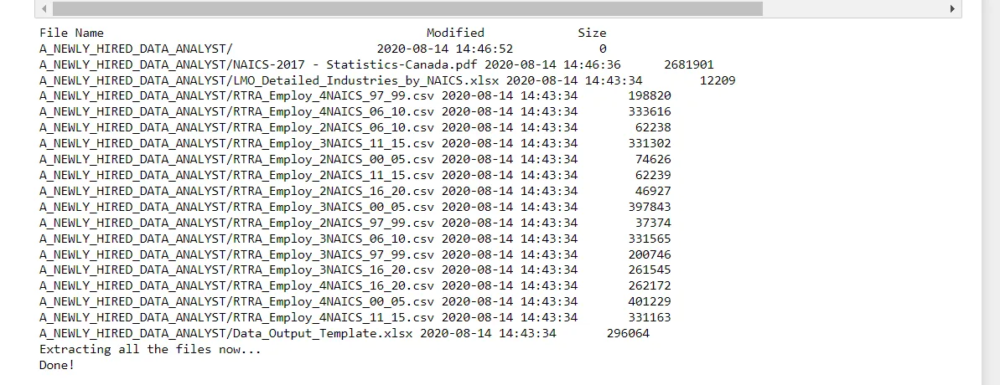
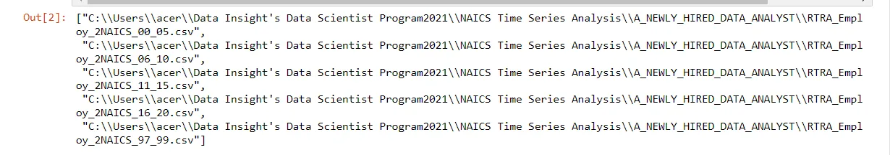
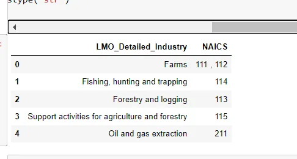
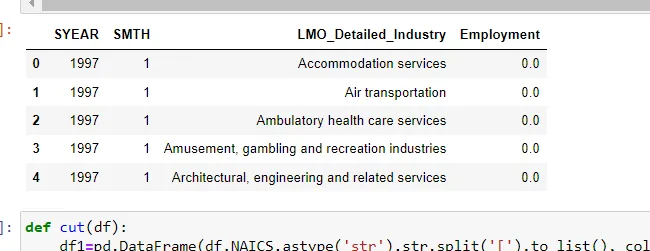
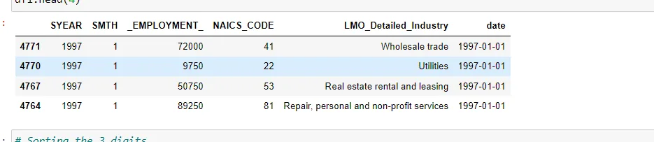
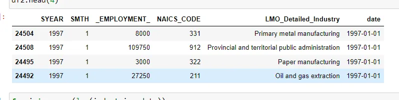
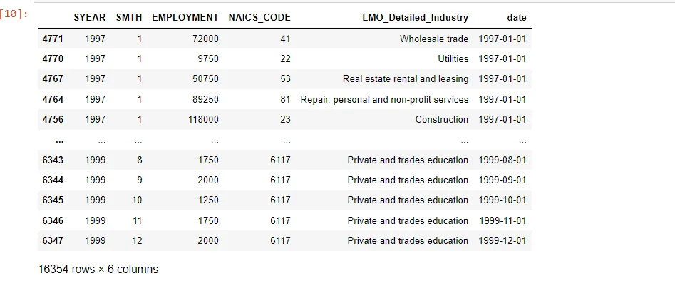
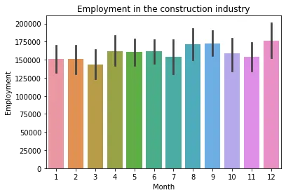
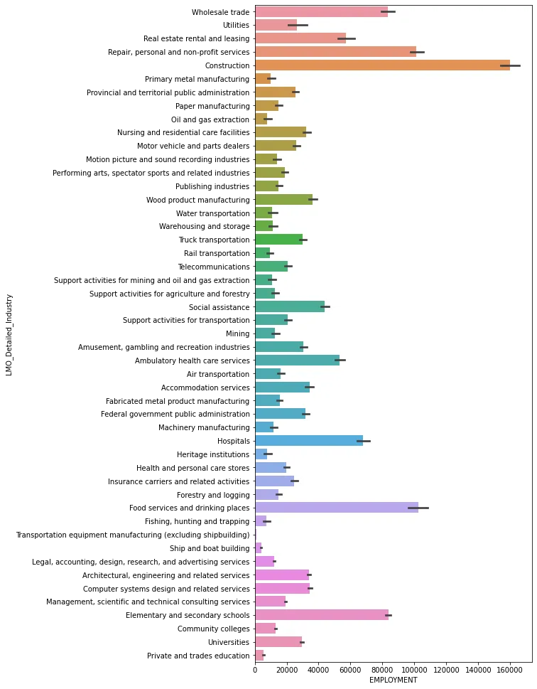

Time series analysis is a statistical method to analyze past data within a given duration of time to forecast the future. In this blog, we will be doing the time-series analyses of NAICS(North American Industry Classification System).NAICS is an industry classification system developed by the statistical agencies of Canada, Mexico, and the United States. NAICS is designed to provide common definitions of the industrial structure of the three countries and a common statistical framework to facilitate the analysis of the three economies.

For this blog we will be considered that we are a newly hired Data Analyst, our work is to collect, clean, and analyze datasets in order to assist in issue solving and effective decision making.

Instructions include:

1. Download zipped files **A_NEWLY_HIRED_DATA_ANALYST.zip**

2. Prepare a data set using the following files:

**i. NAICS 2017 – Statistics Canada**:

Description of the North American industry classification system
 (NAICS). All you would need to understand for this task is, how the
 NAICS works as a hierarchical structure for defining industries at
 different levels of aggregation. For example, a 2-digit NAICS industry
 (e.g., 23 - Construction) is composed of some 3-digit NAICS industry
 buildings, 237 - Heavy and civil engineering construction, and a few
 more 3-digitNAICSindustries). Similarly, a 3-digit NAICS industry
 (e.g., 236 -Construction of buildings), is composed of4-digit NAICS
 industries (2361 - Residential building construction and2362 -

Non-residential building construction).

**ii. Raw data**:

15 CSV files beginning with RTRA. These files contain employment
 data by industry at different levels of aggregation; 2-digit nails, 3-digit
 NAICS, and 4-digit NAICS. Columns mean as follows:

(i) SYEAR: Survey Year

(ii) SMTH: Survey Month

(iii) NAICS: Industry name and associated NAICS code in the bracket

(iv) _EMPLOYMENT_: Employment

**iii.** **LMO NAICS Detailed Industries:**

An excel file that maps RTRA data to the necessary data. This file's
 first column contains a list of 59 commonly used industries. The
 NAICS definitions are listed in the second column. This file contains
 the industries we'll be looking at in our analysis.

Let's get started:

1. **Importing All the required libraries** **and unzipping** **the** **A_NEWLY_HIRED_DATA_ANALYST.zip file.**

```python
#importing the libraries
import numpy as np
import matplotlib.pyplot as plt
import seaborn as sns
import glob
import pandas as pd
from zipfile import ZipFile # Required module
file_name = r"C:\Users\acer\Data Insight's Data Scientist Program2021\NAICS Time Series Analysis\A_NEWLY_HIRED_DATA_ANALYST.zip"

with ZipFile(file_name, 'r') as zip:
    zip.printdir()

    # Extract all files now
    print('Extracting all the files now...')
    zip.extractall()

    print('Done!')

# data = pd.read_csv("C:/Users/NTANDO/Documents/Data Insight/A_NEWLY_HIRED_DATA_ANALYST/RTRA_Employ_4NAICS_16_20.csv")
data = pd.read_csv(r"C:\Users\acer\Data Insight's Data Scientist Program2021\NAICS Time Series Analysis\A_NEWLY_HIRED_DATA_ANALYST\RTRA_Employ_4NAICS_16_20.csv")
```



**2. NACIS ID**

The NAICS code system is structured in a hierarchical manner:

Sector: 2 digits code

Subsector: 3 digits code

Industry Group: 4 digits code

```python
#Accessing the files
the_2NAICS = glob.glob(r"C:\Users\acer\Data Insight's Data Scientist Program2021\NAICS Time Series Analysis\A_NEWLY_HIRED_DATA_ANALYST\*2NAICS*")
the_3NAICS = glob.glob(r"C:\Users\acer\Data Insight's Data Scientist Program2021\NAICS Time Series Analysis\A_NEWLY_HIRED_DATA_ANALYST\*3NAICS*")
the_4NAICS = glob.glob(r"C:\Users\acer\Data Insight's Data Scientist Program2021\NAICS Time Series Analysis\A_NEWLY_HIRED_DATA_ANALYST\*4NAICS*")
the_2NAICS # the list of files
```

```python
# Accessing the datasets in files
def access_datasets(data_paths):
    df = pd.DataFrame()
    for path_ in data_paths:
        df = pd.concat([df,pd.read_csv(path_)])
    return df

data_2NAICS = access_datasets(the_2NAICS)
data_3NAICS = access_datasets(the_3NAICS)
data_4NAICS = access_datasets(the_4NAICS)
```



**3. Reading the LMO Detailed Industries by NAICS file.**

```python
industries_data = pd.ExcelFile(r"C:\Users\acer\Data Insight's Data Scientist Program2021\NAICS Time Series Analysis\A_NEWLY_HIRED_DATA_ANALYST\LMO_Detailed_Industries_by_NAICS.xlsx")
industries_data = industries_data.parse(0)
industries_data['NAICS'] = industries_data['NAICS'].replace(regex='&', value=',')
industries_data['NAICS'] = industries_data['NAICS'].astype('str')
industries_data.head()
```



**4. Reading the Data Output Template file.**

```python
data_output = pd.ExcelFile(r"C:\Users\acer\Data Insight's Data Scientist Program2021\NAICS Time Series Analysis\A_NEWLY_HIRED_DATA_ANALYST\Data_Output_Template.xlsx")
data_output = data_output.parse(0)
data_output = data_output.fillna(0)
data_output.head()
```



**5. Merger both the LMO Detailed Industries by NAICS and Data**
 **Output Template files.**

**i. Merging for 2NAICS**

```python
def cut(df):
    df1=pd.DataFrame(df.NAICS.astype('str').str.split('[').to_list(), columns=['NAICS','NAICS_CODE'])
    df1['NAICS_CODE']= df1.NAICS_CODE.astype('str').str.strip(']').str.replace('-',',')
    df['NAICS']=df1['NAICS']
    df['NAICS_CODE']= df1['NAICS_CODE']
    return df

data_2NAICS = cut(data_2NAICS)
data_2NAICS.sort_values(by=["SYEAR", "SMTH"])

#left merging the df_2_naics with lmo_detailed_industries
df1=data_2NAICS.merge(industries_data, left_on='NAICS_CODE',
                     right_on='NAICS', how='left').drop(columns=['NAICS_x','NAICS_y'],axis=1)
df1.tail(10)

def format_date(df):
  df['date'] = pd.to_datetime(df.SYEAR.astype('str') + df.SMTH.astype('str'), format='%Y%m')
  df2 = df.sort_values('date')
  return df2

df1 = format_date(df1).dropna()
df1.head(4)
```



**ii. Merging for 3NAICS**



**3. Merging all three codes i.e. 2NAICS, 3NAICS, 4NACIS**

```python
# Merging 3 dataframes
data = pd.concat([df1, df2, df3])
data = data.dropna()
data.sort_values(by= "date")
data.columns = ['SYEAR', 'SMTH', 'EMPLOYMENT', 'NAICS_CODE', 'LMO_Detailed_Industry', 'date']
data = data[data['SYEAR'] <= 2018]
data
```



Till now we have performed unzipping, importing of libraries and merging of different excel files that contain the required data.

Now we are going to visualize the different columns in the data using python libraries matplotlib and seaborn.

1. **Visualization of the construction industry.**

```python
# barplot of construction per month
construction = data[data['LMO_Detailed_Industry']== "Construction"]

ax = sns.barplot(y= 'EMPLOYMENT', x= 'SMTH', data= construction)
ax.set(xlabel="Month", ylabel = "Employment", title= "Employment in the construction industry")
```



**2. V****isualizing the sums per industry**


