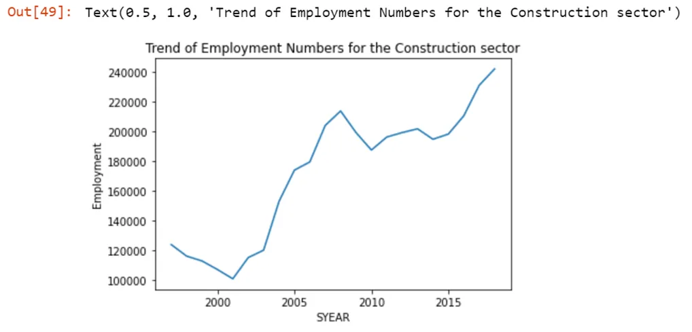
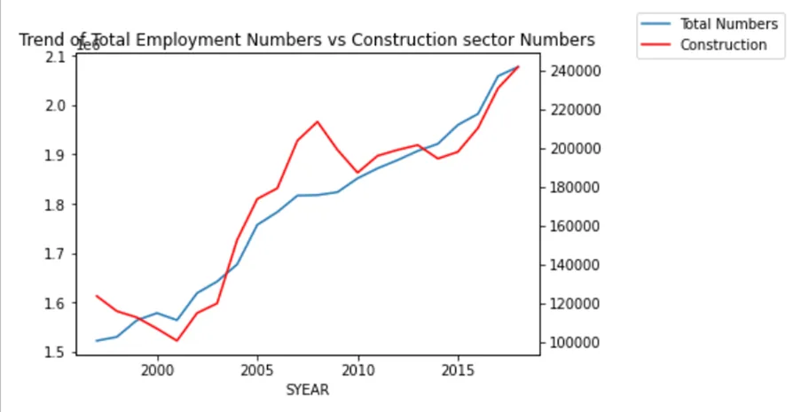
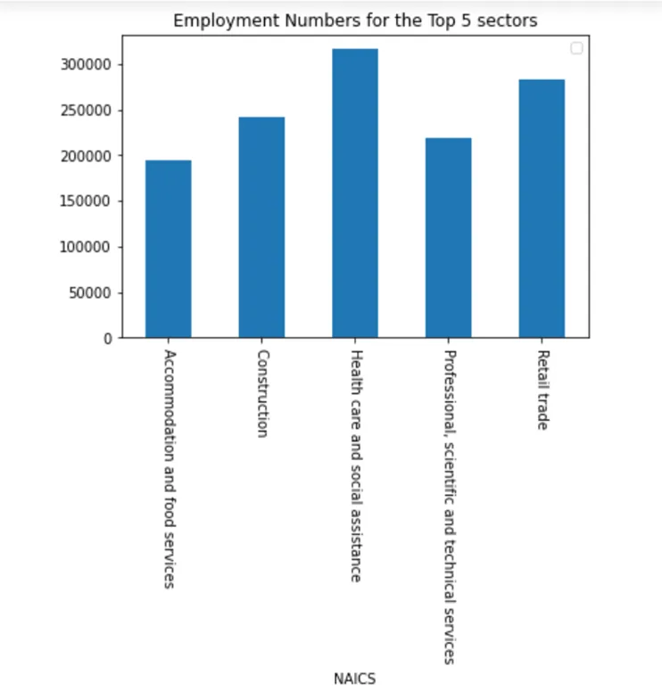
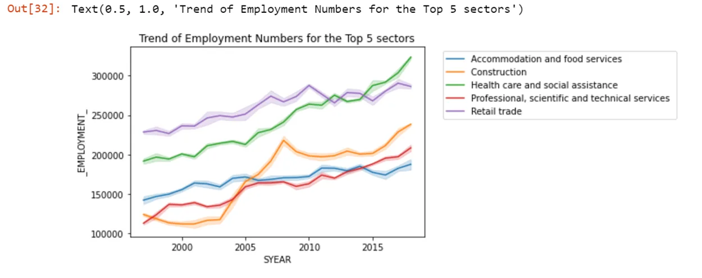
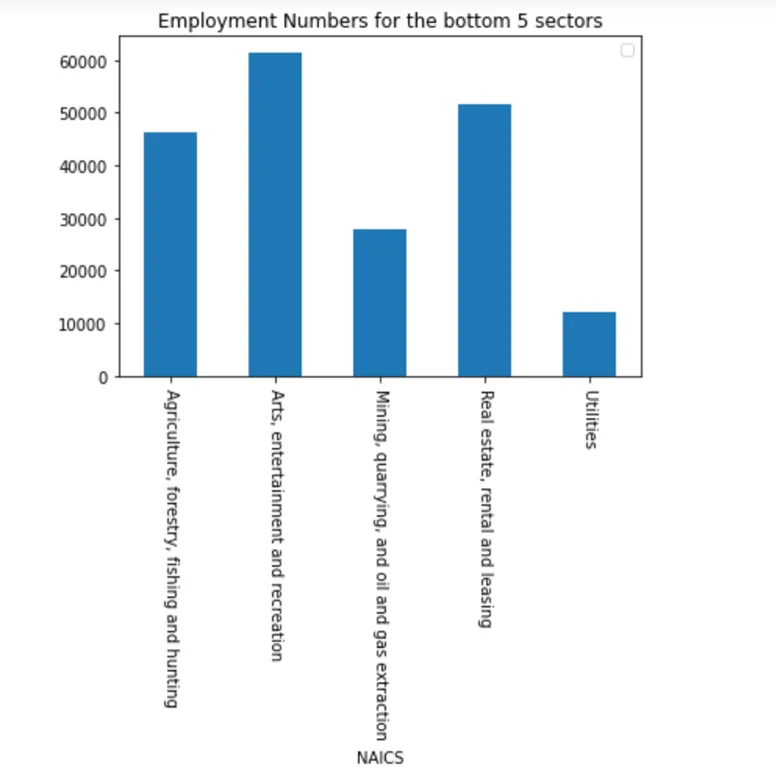
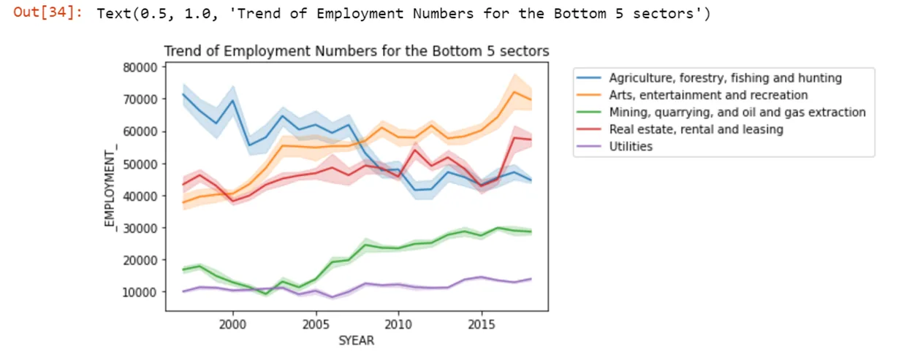
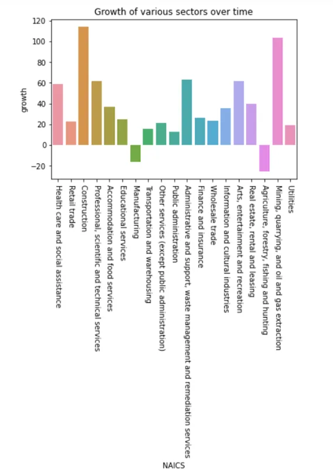

The North American Industry Classification System (NAICS) is an industry classification system developed by the statistical agencies of Canada, Mexico, and the United States. NAICS is designed to provide common definitions of the industrial structure of the three countries and a common statistical framework to facilitate the analysis of the three economies. The NAICS structure is hierarchical with a six-digit code numbering system adopted, of which the first five digits are used to describe the NAICS levels that will be used by the three countries (i.e. Canada, Mexico, and the United States) to produce comparable data. The first two digits designate the sector, the third digit designates the subsector, the fourth digit designates the industry group and the fifth digit designates the industry. The sixth digit is used to designate national industries. A zero as the sixth digit indicates that there is no further national detail.

As said earlier, the hierarchical structure of the NAICS defines industries at different levels of aggregation with the highest aggregate being a 2-digit NAICS industry (e.g., 23 — Construction) which is then composed of some 3-digit NAICS industries (236 — Construction of buildings, 237 — Heavy and civil engineering construction, and a few more 3-digit NAICS industries). Similarly, a 3-digit NAICS industry (e.g., 236 — Construction of buildings), is composed of 4-digit NAICS industries (2361 — Residential building construction and 2362 — Non-residential building construction). The above example is the top-down approach while the down-top approach will be the smaller industries with 4-digit NAICS making up a 3-digit NAICS industry which in turn makes a 2-digit NAICS industry.

The file containing the datasets used in this time series analysis is obtained from [https://wixlabs-file-sharing.appspot.com.](https://wixlabs-file-sharing.appspot.com/) The zipped files consist of 15 CSV files beginning with Real-Time Remote Access (RTRA). These files contain employment data by industry at different levels of aggregation; 2-digit NAICS, 3-digit NAICS, and 4-digit NAICS. The source of the data is from Real Time Remote Access (RTRA) data from the Labour Force Survey (LFS) by Statistics Canada. Below is the description of the column names as used in each dataset (CSV file):

1. SYEAR: Survey Year
2. SMTH: Survey Month
3. NAICS: Industry name and associated NAICS code in the bracket
4. *EMPLOYMENT*: Number of Employment offered in the industry aggregate

Each level of aggregation (i.e.2-digit NAICS, 3-digit NAICS, and 4-digit NAICS) has survey data from 1997 to 2020 segregated into 1997–1999, 2000–2005, 2006–2010, 2011–2015 and 2016–2020 with 2020 data yet not available during the time of this analysis.

To begin with, we import the necessary libraries.

```python
import pandas as pd
import numpy as np
import matplotlib.pyplot as plt
import seaborn as sns
import os
```

Now we have to load the RTRA datasets by grouping them into levels. (2NAICS, 3NAICS, 4NAICS)

```python
file_path=r'C:\Users\hp\Desktop\DataInsight\A_NEWLY_HIRED_DATA_ANALYST'
level_2=['RTRA_Employ_2NAICS_00_05.csv','RTRA_Employ_2NAICS_06_10.csv','RTRA_Employ_2NAICS_11_15.csv','RTRA_Employ_2NAICS_16_20.csv','RTRA_Employ_2NAICS_97_99.csv']
level_3=['RTRA_Employ_3NAICS_00_05.csv','RTRA_Employ_3NAICS_06_10.csv','RTRA_Employ_3NAICS_11_15.csv','RTRA_Employ_3NAICS_16_20.csv','RTRA_Employ_3NAICS_97_99.csv']
level_4=['RTRA_Employ_4NAICS_00_05.csv','RTRA_Employ_4NAICS_06_10.csv','RTRA_Employ_4NAICS_11_15.csv','RTRA_Employ_4NAICS_16_20.csv','RTRA_Employ_4NAICS_97_99.csv']
```

Before combining the 3 levels datasets we need to preprocess the datasets into a consumable format.

```python
data_level2=pd.DataFrame()
for data in level_2:
    df= pd.read_csv(os.path.join(file_path,str(data)))
    df[['NAICS','CODE']] = df.NAICS.str.split("[",expand=True)
    df['CODE']=df['CODE'].replace({']':''}, regex=True)
    df[['CODE','UPPER_CODE']] = df.CODE.str.split("-",expand=True)
    data_level2 = data_level2.append(df, ignore_index=True)

data_level3=pd.DataFrame()
for data in level_3:
    df= pd.read_csv(os.path.join(file_path,str(data)))
    df[['NAICS','CODE']] = df.NAICS.str.split("[",expand=True)
    df['CODE']=df['CODE'].replace({']':''}, regex=True)
    df['UPPER_CODE'] = 0
    data_level3 = data_level3.append(df, ignore_index=True)

data_level4=pd.DataFrame()
for data in level_4:
    df= pd.read_csv(os.path.join(file_path,str(data)))
    df['CODE']=df['NAICS']
    df['UPPER_CODE'] = 0
    data_level4 = data_level4.append(df, ignore_index=True)

del df
```

Now we can get the combined data within one dataframe by appending all the levels into one.

```python
data_combined=pd.DataFrame()

df=pd.DataFrame()
df=df.append(data_level2, ignore_index=True)
df=df.append(data_level3, ignore_index=True)
df=df.append(data_level4, ignore_index=True)

data_combined=data_combined.append(df, ignore_index=True)

del df
```

Then we have to work with the LMO dataset, an excel file for mapping the RTRA data to the desired data. The first column of this file has a list of 59 industries that are frequently used. The second column has their NAICS definitions. Using these NAICS definitions and RTRA data, we will create a monthly employment data series from 1997 to 2018 for these 59

industries.

```python
data_desc= pd.read_excel(os.path.join(file_path,'LMO_Detailed_Industries_by_NAICS.xlsx'))
data_desc['NAICS']=data_desc['NAICS'].replace({'&':','}, regex=True)
data_desc=data_desc[['NAICS','LMO_Detailed_Industry']]

data_desc1=data_desc[~data_desc['NAICS'].str.contains(',', na=False)]
data_desc2=data_desc[data_desc['NAICS'].str.contains(',', na=False)]

data_desc2=data_desc2.assign(NAICS=data_desc2['NAICS'].str.split(',')).explode('NAICS')

data_desc=data_desc1.append(data_desc2, ignore_index=True)
data_desc.columns=['CODE','LMO_Detailed_Industry']
```

Now we need to join the codes to the output template, an excel file with an empty column for employment. We will fill the empty column with the data we prepared from our analysis.

```python
#load data
data_output= pd.read_excel(os.path.join(file_path,'Data_Output_Template.xlsx'))

#join tables
data_output=data_output.merge(data_desc,how='left', on='LMO_Detailed_Industry')
```

```python
cols = ['SYEAR', 'SMTH', 'CODE']
data_output['check']= data_output[cols].apply(lambda row: '_'.join(row.values.astype(str)), axis=1)
data_combined['check']= data_combined[cols].apply(lambda row: '_'.join(row.values.astype(str)), axis=1)

data_combined=data_combined[['check', '_EMPLOYMENT_']]

data_output=data_output.merge(data_combined,how='left', on='check')
data_output.drop(['Employment','check'],axis=1,inplace=True)
data_output.columns=['SYEAR', 'SMTH', 'LMO_Detailed_Industry', 'CODE', 'Employment']
```

Let us sort the dataset by year and month.

```python
data_output.sort_values(['SYEAR', 'SMTH'],inplace=True)
```

Now our data is ready for the Time Series Analysis, we can answer some questions.

## 1. How has employment in Construction evolved over time?
```python
#Picking off Construction data
construction=pd.DataFrame(data_output[data_output['CODE']==23].groupby(['SYEAR'])["Employment"].last()).reset_index()
#Drawing a line plot to look at the evolutio over time
sns.lineplot(x='SYEAR',y='Employment',data=construction)
plt.title('Trend of Employment Numbers for the Construction sector')
```

When we run the above code we get:



We notice a couple of changes in employment numbers over the period. A reduction in the numbers of workers in the construction sector was evident at the end of the 20th Century, it has been growing exponentially over the years with a spike during the 2008 recession period. We also note that in the last decade the construction sector suffered a slight deep from around 2009 to 2015 and has been growing since to record growths of over 100%.

## 2. Employment in Construction vs the total employment across all industries.
```python
#Picking off total yearly data
total=pd.DataFrame(data_output.groupby(['SYEAR','CODE'])["Employment"].last()).reset_index()

total=pd.DataFrame(total.groupby(['SYEAR'])["Employment"].sum()).reset_index()
```

```python
ax = total.plot(x='SYEAR',y='Employment', legend=False,label='Total Numbers')
ax2 = ax.twinx()
construction.plot(x='SYEAR',y='Employment', ax=ax2, legend=False,label='Construction', color="r")
plt.title('Trend of Total Employment Numbers vs Construction sector Numbers')
ax.figure.legend(bbox_to_anchor=(1.05, 1), loc='upper left')
plt.show()
```

As a result we get:



We see that at the end of the 20th century as construction jobs where steadily reducing the general market was enjoying an increase in the number of jobs. This can be attributed to the internet boom during those days.However the construction sector recovered in the mid 2000's with a spike in 2008 compared to a slow down in total employee numbers during the same period. In the last 5 years however the construction sector has been growing at a slower rate compared to the general employment sector.

## 3. What are the top 5 sectors with most employee numbers currently and investigate their evolution.
```python
#sort the data by year
data_level2=data_level2.sort_values(['SYEAR','SMTH'],ascending=True)

#Picking off total yearly data
_2018=pd.DataFrame(data_level2[data_level2['SYEAR']==2018].groupby(['CODE','NAICS'])["_EMPLOYMENT_"].last()).reset_index().sort_values(by='_EMPLOYMENT_',ascending=False)
```

```python
#pick off the top 5 sectors
top_5= _2018.head(5).sort_values(by='NAICS')

#Plot the top 5
ax=top_5.plot.bar(x='NAICS', y='_EMPLOYMENT_', rot=0)
plt.xticks(rotation =270)
plt.title('Employment Numbers for the Top 5 sectors')
```

When we run the above code we get:



```python
top_5_list=['72','23','62','54','44']

#looking at the evolution of these sectors
###Picking off the data
top_5_data=data_level2[data_level2['CODE'].isin(top_5_list)]

top_5_data=top_5_data[top_5_data['SYEAR']!=2019]

#Drawing a line plot to look at the evolutio over time
sns.lineplot(x='SYEAR',y='_EMPLOYMENT_',data=top_5_data,hue='NAICS',legend='brief')
plt.legend(bbox_to_anchor=(1.05, 1), loc='upper left')
plt.title('Trend of Employment Numbers for the Top 5 sectors')
```

This results:



The construction sector has the most noticeable bump in growth since the early 2000's to date. In the last decade however we have noticed that the Health care sector overtook the Retail sector to become the top sector ,the construction and Proffesional sectors also have a noticeable growth over the decade.

## 4. What are the 5 sectors with lowest numbers of Employees currently and investigate their evolution.
```python
#pick off the bottom 5 sectors
tail_5= _2018.tail(5).sort_values(by='NAICS')
#Plot the bottom 5
ax=tail_5.plot.bar(x='NAICS', y='_EMPLOYMENT_', rot=0)
plt.xticks(rotation =270)
plt.title('Employment Numbers for the bottom 5 sectors')
```

This results:



```python
tail_5_list=['71','53','11','21','22']

#looking at the evolution of these sectors
###Picking off the data
tail_5_data=data_level2[data_level2['CODE'].isin(tail_5_list)]

tail_5_data=tail_5_data[tail_5_data['SYEAR']!=2019]

#Drawing a line plot to look at the evolutio over time
sns.lineplot(x='SYEAR',y='_EMPLOYMENT_',data=tail_5_data,hue='NAICS',legend='brief')
plt.legend(bbox_to_anchor=(1.05, 1), loc='upper left')
plt.title('Trend of Employment Numbers for the Bottom 5 sectors')
```

When we run the above code we get:



There is a steep decline in opportunities in the Agricultural sector, with a steep drop around 2007 and stablizing in the last decade. Also important to note that the Arts & entertainment and Mining sectora has been growing steadily overtime where as the Realestate and Utilities sectors have been rather stagnant with no major shifts over time.

## 5. Which sectors are showing the highest growth in employees over the last decade?
```python
#Picking off total yearly data
_1999=pd.DataFrame(data_level2[data_level2['SYEAR']==1999].groupby(['CODE','NAICS'])["_EMPLOYMENT_"].last()).reset_index().sort_values(by='_EMPLOYMENT_',ascending=False)
_1999=_1999[['CODE','_EMPLOYMENT_']]

_1999.columns=['CODE','Employment_1999']
_2018.columns=['CODE','NAICS','Employment_2018']

growth= _2018.merge(_1999, how='left',on='CODE')
growth['growth']=[(((y-x)*100)/x) for (x,y) in zip(growth['Employment_1999'],growth['Employment_2018'])]
```

```python
# draw the growth plots
sns.barplot(x='NAICS', y='growth',data=growth)
plt.xticks(rotation =270)
plt.title('Growth of various sectors over time')
```

This results:



We See majors enormous growth in the Construction,Mining with over 100% growth over time, the Admin,professional services and Healthcare sectors have over 50% growth with notable reductions in the agricultural and Manufacturing sectors. Generally most of the sectors have a somewhat positive growth over time, which is very impressive comparing the over time growth in population.

You can get the jupyter notebook of this Data Insight project at this [link](https://github.com/iamNargiz/NAICS_timeseries_analysis).
