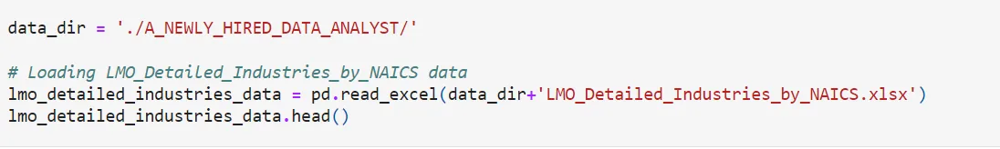
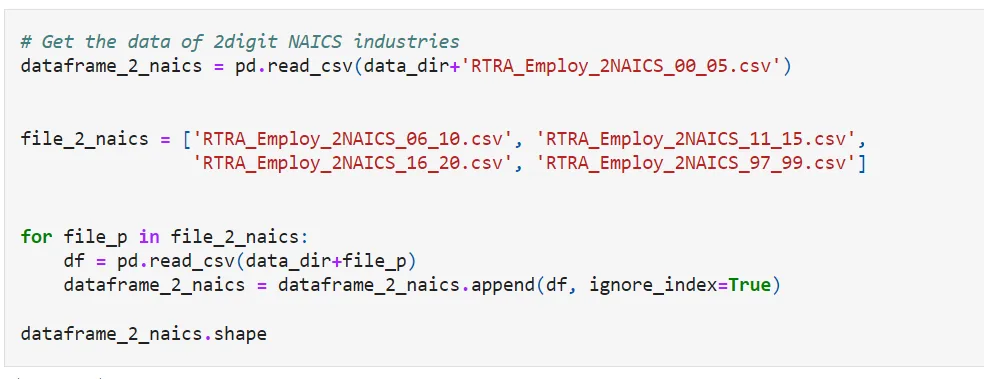
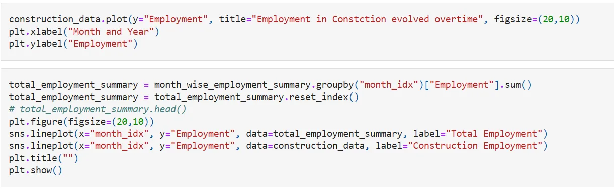
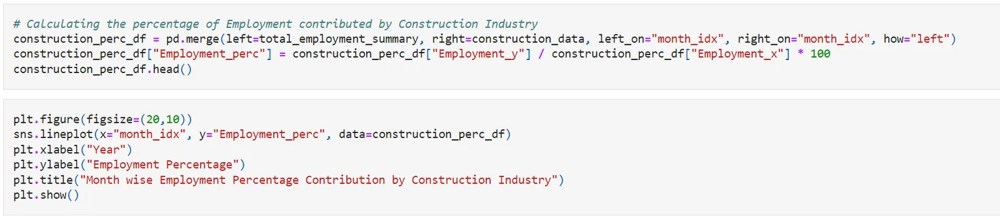
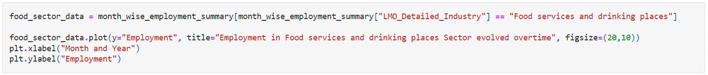
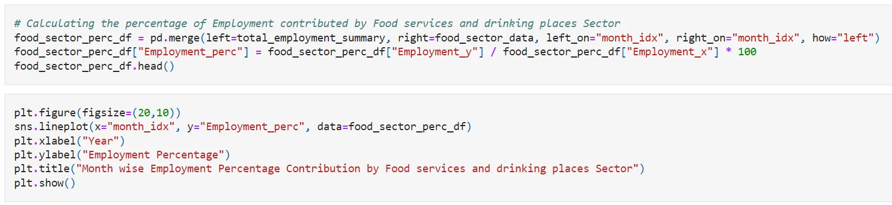
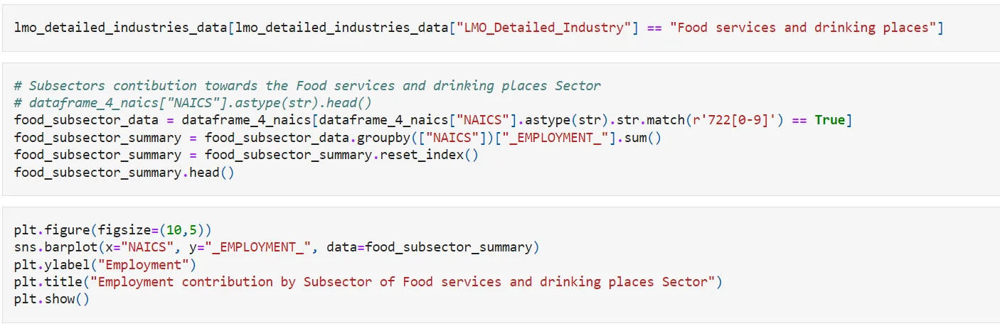
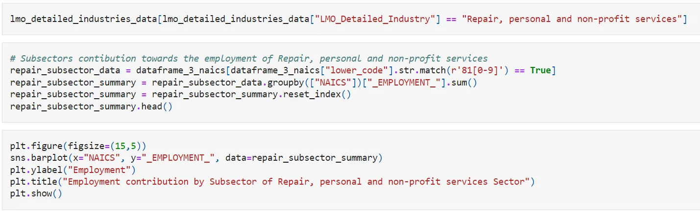

**Introduction**

The North American industrial classification system is so unique in its industrial classification that it is built into a single conceptual framework. Economic units with similar manufacturing processes are categorized in the same industry and the lines drawn between the industries distinguish between usable production processes. This supply-based, or production-based, economic concept was adopted for NAICS because an industrial classification system is a framework for collecting and publishing data of inputs and outputs for statistical use that requires inputs and outputs to be used together and classified consistently. Examples of such services include productivity measurement, individual labor costs, and intensity of production capital, estimating employment-output relationships, creating input-output tables, and other uses that indicate production relationship analysis.

**Raw data**

15 CSV files beginning with RTRA. These files contain information on collective employment at different levels of the industry; 2-digit NAICS, 3-digit NAICS, and 4-digit NAICS. Columns mean as follows:

(1) SYEAR: Survey Year

(2) SMTH: Survey Month

(3) NAICS: Industry name and associated NAICS code in the bracket (iv) (4)_EMPLOYMENT_: Employment

Library Import:

Read File:

Clean File:

Get the data of 2digit NAICS industries:

Time series employment in Construction IndustryTime series employment in Construction Industry:

Comparing employment in Construction

Time Series Employment in Food services and drinking places Sector:

Subsector Contribution:

Contribution of Employment by Food services and drinking places Sector:

Time series Employment Analysis of Repair, personal and non-profit services Sector:

Subsector Contribution towards Employment of Repair, personal and non-profit services:

**Conclusion**

The top three largest employment contributing sectors contribute about 20 to 25% of the total employment. The construction sector is the largest contributor with over 11% contribution.
