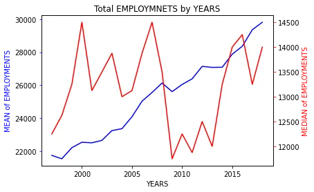
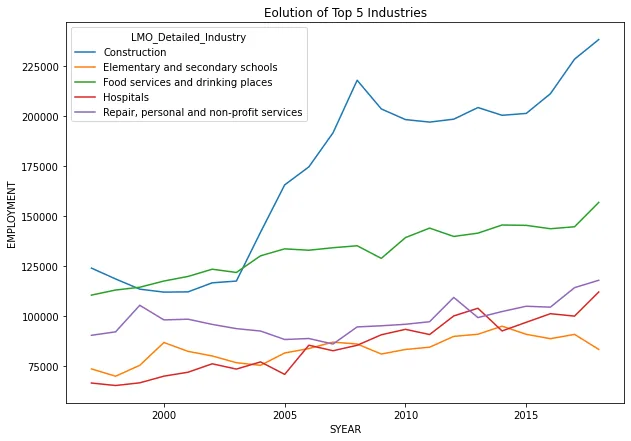
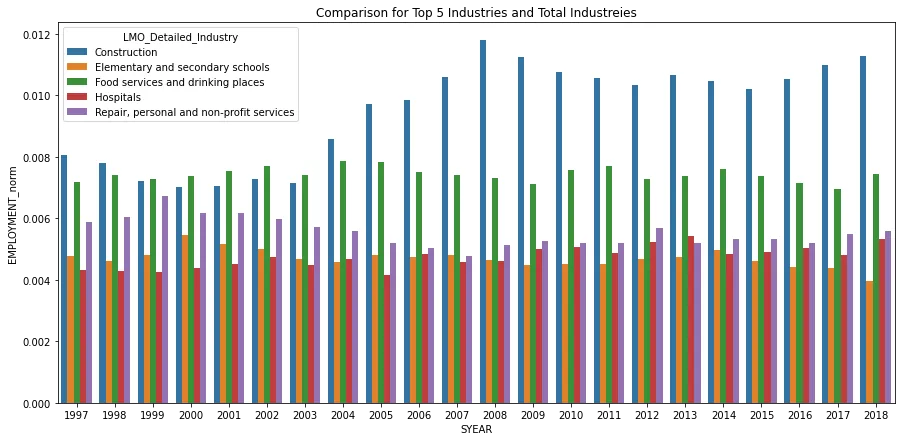

The North American Industry Classification System (NAICS) is an industry classification system developed by the statistical agencies of Canada, Mexico, and the United States. NAICS is designed to provide common definitions of the industrial structure of the three countries and a common statistical framework to facilitate the analysis of the three economies.

The structure of NAICS is hierarchical. The numbering system that has been adopted is a six-digit code, of which the first five digits are used to describe the NAICS levels that will be used by the three countries to produce comparable data. The first two digits designate the sector, the third digit designates the subsector, the fourth digit designates the industry group and the fifth digit designates the industry. The sixth digit is used to designate national industries. A zero as the sixth digit indicates that there is no further national detail. For example (see page 22), a 2-digit NAICS industry (e.g., 23 - Construction) is composed of some 3-digit NAICS industries (236 - Construction of buildings, 237 - Heavy and civil engineering construction, and a few more 3-digit NAICS industries). Similarly, a 3-digit NAICS industry (e.g., 236 - Construction of buildings), is composed of 4-digit NAICS industries (2361 - Residential building construction and 2362 - Non-residential building construction).

In this blog, we take time series data analysis on the Employment data based on the North American Industry Classification System - NAICS . Firstly, we import the data-set, prepare data and clear data. And then we take exploratory data analysis on the previous data-set.

The database file contain -

**Raw data**: 15 CSV files beginning with RTRA. These files contain employment data by industry at different levels of aggregation; 2-digit NAICS, 3-digit NAICS, and 4-digit NAICS. Columns mean as follows:

(i) SYEAR: Survey Year

(ii) SMTH: Survey Month

(iii) NAICS: Industry name and associated NAICS code in the bracket

(iv) _EMPLOYMENT_: Employment

**LMO Detailed Industries by NAICS**: An excel file for mapping the RTRA data to the desired data. The first column of this file has a list of 59 industries that are frequently used. The second column has their NAICS definitions.

**Data Output Template:** An excel file with an empty column for employment

**Import, Clean and Prepare Data**

Firstly, we import required Python Library to help our tasks. We need **Pandas** library for data manipulation, **Matplot** and **Seaborn** library for data Visualization, **Numpy** Library for Math calculation **re** library for regular experession.

There are three types of file types in the dataset folder – 15 Raw data CSV file, LMO detailed industry data, and output data. When we read and import data-set file, it can be complicated. So, 15 Raw data files name starting with RATR are separated into three type of industry level,

As Reading Raw data file must take three times, Read_Raw_Data file function is created. This function takes two arguments – file location and filename and this return Raw Data-frame. This function imports Raw data with reading CSV filetype and then appends to one Data-frame.

In 2 NAICS Raw Data-frame and 3 NAICS Raw Data-frame, NAICS codes are attaching with specific industry name. So, Clean_Raw_Database function is created – this function separate ‘NAICS’ column to industry name and NAICS codes. It take only NAICS code and drop “NAICS column”. Since data analysis are taken only form 1997 to 2018, the function drop data after 2018.

The function **Read_and_Clean_Data** is combination of **Read_Raw_Datafile** and **Clean_Raw_data** function – this function take file location and filename and return back cleaned Raw dataFrame.

### Read and Clean 2 NAICS Raw File

For reading and cleaning 2 NAICS Raw Data, **Read_and_Clean_Data function** is used. Clean 2 NAICS dataframe is received as **NAICS_2_df.**

### Read and Clean 3 NAICS Raw file
**Read_Raw_Datafile** function is used to read Raw 3 NAICS file and assigned with NAICS_3_df. Some of the NAICS code combining with industry name are missing in ‘NAICS column’ which is string datatype. So, python regular expression is used to remove some missing codes. For data cleaning, **Clean_Raw_Data** is used.

### Read and Clean 4 NAICS Raw file
Reading 4 NAICS Raw file is same as previous – save in NAICS_4_df. There is only NAICS code , no filename in ‘NAICS’ column. So, Column name from ‘NAICS’ to ‘NAICS_Codes’ can be directly changed. As the result columns is in ‘int64’ datatype, the datatype of column is changed to ‘string’.

**Read and Clean LMO Industry Data**

As LMO industry data is in ‘.xlsx’ file type, this datafile is read with pandas’ reading excel function and save in ‘LMO_industry_data’. NAICS codes are placed in ‘NAICS’ column, so we reprocess and clean these data and save it in ‘NAICS_Codes’ column. Then drop ‘NAICS’ column.

NAICS Raw Data-frame contains ‘SYEAR’ and ‘SMTH’ (month) columns, and not contain ‘DATE’ date. The function **add_date** can add ‘DATE’ data to dataframe by combining year and month and changing to datetime datatype. And then set ‘DATE’ data to index of dataframe.

The function **Merge_RART_and_LMO_data** merge ‘clean raw dataframe’ and “LMO industry data’ by left join based on ‘NAICS_Codes’. This function also add ‘date ‘ data to dataframe.

### Merging Cleaned NAICS data and LMO industry data
**Merge_RTRA_and_LOM_data** function is used to merge of Cleaned Raw 2 NAICS dataframe and LMO industry data and saved in Output_2NAICS_df. Cleaned 3 NAICS and 4 NAICS data and LMO inndustry data merge same as previous.

### Merging all file from 1997 - 2018
Pandas’s concat() function is used to merge all dataframe vertically and assigned to **Output_NAICS_97_18**

### Reading Output Data
Pandas’s read_excel() function is used to read output_dataframe in .xlsx filetype and saved as Output_df. And Date column is add to Output_df.

### Merging all together
**Output_df** and **Output_NAICS_97_18** are merge based on ‘ DATE’ and ‘LMO_Detailed_Industry’ column using left join and save to Output_df. ‘SYEAR’ and ‘SMTH’ column of Output_NAICS_97_18 and ‘EMPLOYMENT’ column of Output_df are drop due to the same name. The suffixes name of Output_df are changed, fill null value of ‘EMPLOYMENT’ and change to ‘float64’ data type.

Finally, Output dataframe (Output_df) is saved to Output file as .xlsx filetype. Output file can be seen in [here](https://github.com/DoublePK/DataScientistProgramAssignments/blob/master/Project:%20Time%20Series%20Analysis%20of%20NAICS/Data_Output_Template.xlsx).

## Exploratory Data Analysis
### HOW DID THE EMPLOYMENT EVOLVED OVER TIME ACROSS ALL INDUSTRIES?

Total employment of all industries all the time is got using Pandas’ groupby() method and assigned to all_employment. Total employment is minimize by averaging (mean) . As employing rate in all industries is too different, median of all industrial data in each year is also calculated. The line plot of mean data is drawn in blue and median data is in red.

Increment of average employing place can tell as employment was always evolving throughout the years. But, in 2008, improving rate is slowdown due to economic crisis. Increasing rate is still unstable until 2015. Due to the rate of employment in each industry is fluctuate, the median of employment is up and down. The effect of economic crisis in 2008 drop down to all industries.

### What is the evolution of the employment's frequency over the months of each year?
Frequency table for employment of the month in each year is get by pandas.crosstab() method and save in employment_month. Seaborn’s heatmap() method is used to visualize frequency.

In above picture, the yellow color is highest employing rate and blue is lowest. We can see that from 1997 to 2004 the employment frequency was very low as the color was blue The employment was at its finest in 2018 and the peak month for employment was june 2017 as the color was the yellow.

### What are the top 5 employing industries ?
Total employing of each industry in each year is got by Pandas’ crosstab() method by summing in each year. After averaging through all year employment, sort in descending order and assigned to total_employment. Top five employing industry is assigned in top_employing_industries.

And then top industrial data is extract from Output_df and received as top_employment_by_year. Top employment industrial data is illustrated using boxplot.

Construction is the most employing industry and Food services and drinking places is in second place. The average employment of Construction is highest in all industries.

### Why top employing industries through out of all year?
Let’s visualize top industrial employment rate in line plot.

From the figure, Construction and Food services are always above other industries because living and Food is the basic needs for humans. After 2003, construction is highly overcome all other industries. Other industries – Hospital, Basic education, Repair, personal and non-profit services are also unnecessarily services for human.

### How top employment industries evolved over time comparing to total employment?
Total Employment of top industries in each years is compared to total employment by diving top employment industries by total employment in each year. Bar plot is used to visualize this comparisons.

Employing rate of Construction is 0.8 % until 2005 and the employing rate is over 1% . The employment of Food services and drinking places is around 0.8 % all through year. Other top industries is employed between 0.4% and 0.6%.

### What is the evolution of the construction over the months of each year?
As Construction is the highest employing industrious, let’s emphasize over the month of each year.

Before 2004, employing place in construction is below 140K and employment is increased up to 200K until 2008. After 2008 economic crisis, the employment is slowly decrease. After 2017, employing place in constriction industry is increased up to 240K.

In conclusion, the economic crisis affected the industries sectors badly as there was an employment decrease due to people losing there actual jobs and not needing any new employers. The construction Industry is the first main contributor in employment, adding to it : Services of the basic needs for humans is the top employment industries all the time.

The data-set for this analysis can be found [here](https://github.com/DoublePK/DataScientistProgramAssignments/tree/master/Project:%20Time%20Series%20Analysis%20of%20NAICS/A_NEWLY_HIRED_DATA_ANALYST) and the source code in python can bee seen [here](https://github.com/DoublePK/DataScientistProgramAssignments/blob/master/Project:%20Time%20Series%20Analysis%20of%20NAICS/Time%20Series%20Analysis%20of%20NAICS.ipynb).
