## NAICS
The **North American Industry Classification System (NAICS)** is the standard used by Federal statistical agencies in classifying business establishments for the purpose of collecting, analyzing, and publishing statistical data related to the **U.S.**, **Canada**, and **Mexico** business economies. **NAICS** is intended to give similar definitions of the three countries' industrial structure as well as a common statistics framework to aid in the analysis of their economies.

##### HOW IT WORKS
A hierarchical structure is used by NAICS. The link of one thing to a specific category is known as a "**hierarchy**." It is as follows:

- **Sector**: 2-digit code

  - **Subsector**: 3-digit code

    - **Industry Group**: 4-digit code

      - **NAICS Industry**: 5-digit code

        - **National Industry**: 6-digit code

For example, a **2-digit NAICS** industry (e.g., 23 - Construction) is

composed of some **3-digit NAICS** industries (236 - Construction of buildings, 237 - Heavy and civil engineering construction, and a few more 3-digit NAICS industries). Similarly, a **3-digit NAICS** industry (e.g., 236 - Construction of buildings), is composed of **4-digit NAICS** industries (2361 - Residential building construction and 2362 - Non-residential building construction).

## DATA USED
1. **Raw Data**:15 csv files beginning with RTRA. These files contain employment data by industry at different levels of aggregation, 2-digit NAICS, 3-digit NAICS, and 4-digit NAICS. The columns are as follows: ***SYEAR***(Survey Year), ***SMTH***(Survey Month), ***NAICS***(Industry name and associated NAICS code in the bracket ), and _***EMPLOYMENT_***(Employment).
2. **Data Output Template**: An excel file with an empty column for employment. You should fill the empty column with the data you prepared from your analysis.
3. **LMO Detailed Industries by NAICS**: An excel file for mapping the RTRA data to the desired data. The first column of this file has a list of 59 industries that are frequently used. The second column has their NAICS definitions. Using these NAICS definitions and RTRA data, you would create a monthly employment data series from 1997 to 2018 for these 59 industries.

## WORKING WITH THE DATA
The analysis of the data was done in Google Collaboratory.

**IMPORTING NECESSARY LIBRARIES**

Importing all the necessary libraries needed in the analysis of the data.

```python
import pandas as pd
import numpy as np
import seaborn as sns
import matplotlib.pyplot as plt
%matplotlib inline
```

**UPLOADING ALL THE NECESSARY FILES INTO COLLAB**

Uploading all the files needed for the analysis from my local computer onto Google Collaboratory.

```python
from google.colab import files
files.upload()
```

**Output of code**:

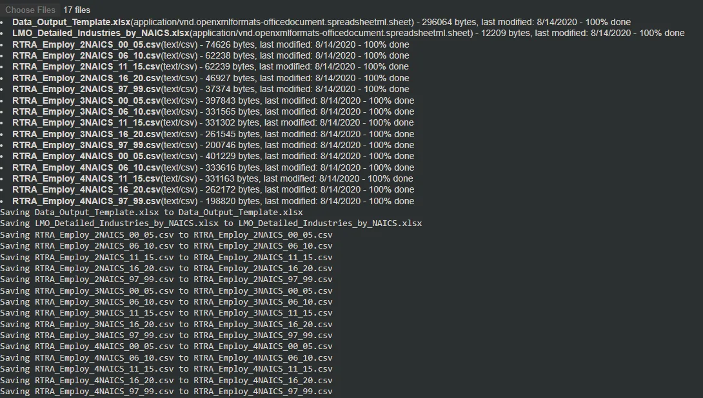

**LOADING, CHECKING, AND CLEANING THE LMO DETAILED INDUSTRIES BY NAICS**

Loading the LMO_Detailed_Industries_by_NAICS.xlsx file and replacing the '&' sign with ',' sign. This is to make analysis simpler.

```python
#Loading the contents of LMO_Detailed_Industries_by_NAICS
df_lmo_details = pd.read_excel('LMO_Detailed_Industries_by_NAICS.xlsx')
#Displaying the first 5 rows
df_lmo_details.head()
```

**Output**:

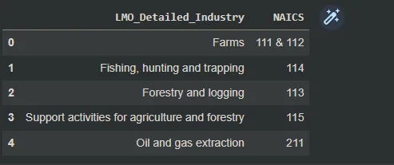

The presence of the '&' sign must be changed to ','.

```python
#Converting to string and changing & to ,
df_lmo_details.NAICS = df_lmo_details.NAICS.astype(str).str.replace('&', ',')
#Printing first 5 rows to check if it is changed
df_lmo_details.head()
```

**Output**:

'&' replaced with ','.

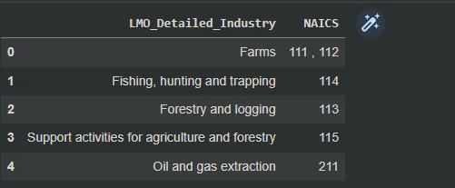

**LOADING DATA OUTPUT TEMPLATE**

The given final output for the data that will be analyzed.

```python
#Loading the contents of Data_Output_Template
df_output_tem = pd.read_excel('Data_Output_Template.xlsx')
#Displaying the first 5 rows
df_output_tem.head()
```

**Output**:

It has 4 main columns with the Employment column having no values.

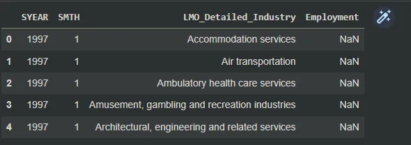

**LOADING AND CLEANING RTRA 2-DIGIT NAICS**

Since there are 5 different files of 2-digit NAICS, it is prudent to find an easy way to automate that. Creating a list for all of them and looping through to load them then appending them to each other to form a single file will be more expedient.

```python
#Making a list to house all the RTRA_Employ_2NAICS data
rtra_2_list = ['RTRA_Employ_2NAICS_00_05.csv', 'RTRA_Employ_2NAICS_06_10.csv', 'RTRA_Employ_2NAICS_11_15.csv', 'RTRA_Employ_2NAICS_16_20.csv']
```

```python
#Loading the data from 1997 to 1999
df_2 = pd.read_csv('RTRA_Employ_2NAICS_97_99.csv')

#For loop to join all the files together
for files in rtra_2_list:
  df = pd.read_csv(files)
  df_2 = df_2.append(df, ignore_index=True)

#Displaying first 5 rows of the dataset
df_2.head()
```

**Output**:

Data successfully loaded.

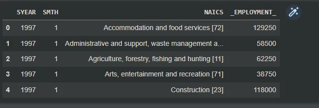

It can be seen that the ***NAICS*** column has both strings and numbers and hence the need to divide them into words and numbers.

Splitting the ***NAICS*** column into ***NAICS*** and ***NAICS_CODE***

```python
#Splitting the NAICS column into NAICS and NAICS code at the [ index
df_2[['NAICS', 'NAICS_CODE']] = df_2['NAICS'].astype(str).str.split('[', expand=True)
#Displaying the first 5 rows
df_2.head()
```

**Output**:

***NAICS_CODE*** column is produced but has a bracket which needs not to be there.

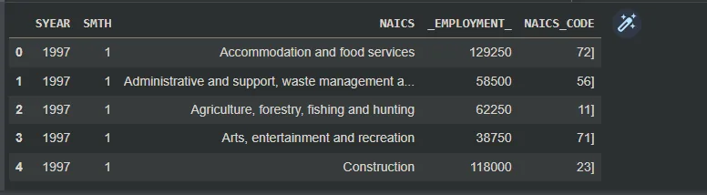

Getting ride of the last bracket and replacing '-' with ','.

```python
#Getting rid of the last bracket the replacing - with ,
df_2['NAICS_CODE'] = df_2['NAICS_CODE'].astype(str).str.strip(']').replace('-', ',')
#Displaying the first 5 rows to check if the change has been effected
df_2.head()
```

**Output**:

Final output has the bracket removed as shown below.

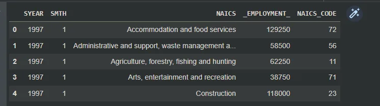

There is the need to merge the cleaned 2-digit NAICS dataset with LMO detail dataset and then get rid of the missing rows.

```python
#Merging the 2 digit NAICS dataset with the LMO Details dataset
df_2_lmo = df_2.merge(df_lmo_details, left_on='NAICS_CODE', right_on='NAICS', how='left')

#Displaying the first 10 rows
df_2_lmo.head(10)
```

**Output**:

Merged the two datasets.

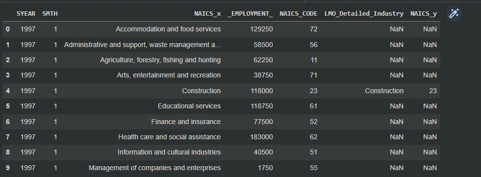

The above dataset has ***NAICS_x*** and ***NAICS_y*** which need to be dropped.

```python
#Dropping the NAICS_x and NAICS_y columns
df_2_lmo = df_2_lmo.drop(columns=['NAICS_x', 'NAICS_y'])

#Displaying the first 10 rows again
df_2_lmo.head(10)
```

**Output**:

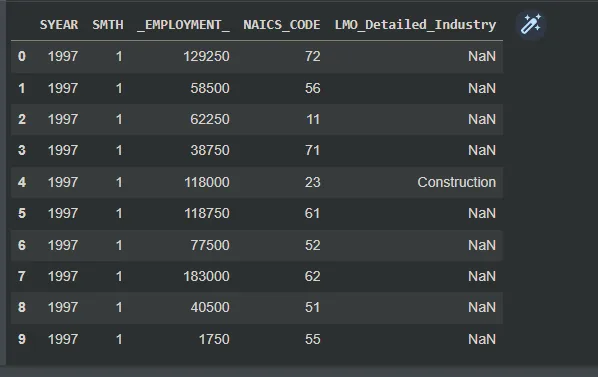

There are some NaN values in the ***LMO_Detailed_Industry*** column which need to be dealt with and also a better indexing.

The index must be changed into the year and month format.

```python
combined= df_2_lmo.SMTH.astype('str').str.cat(df_2_lmo.SYEAR.astype('str'),sep=' ')
df_2_lmo['DATE']= pd.to_datetime(combined).dt.strftime('%Y-%m')
df_2_lmo.set_index('DATE',inplace=True)

#Dropping missing values
df_2_lmo = df_2_lmo.dropna()
df_2_lmo
```

**Output**:

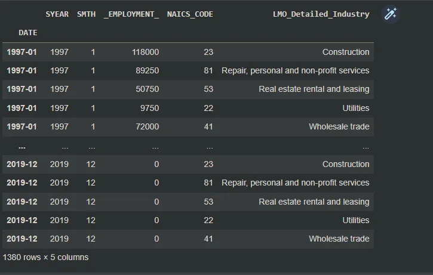

This is the final output for 2-digit NAICS dataset. The above processes will be carried out for 3-digits NAICS and 4-digits NAICS.

The 3-digits NAICS final output is:

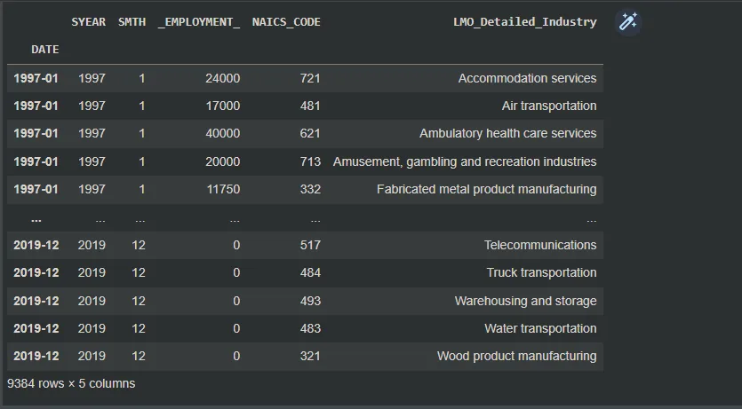

The 4-digit NAICS final output is:

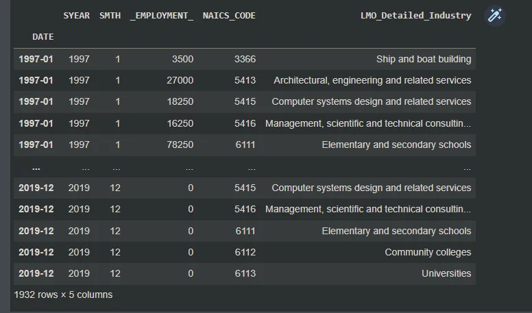

Afterwards, all the 3 datasets are joined to give the final data for analysis.

```python
#Adding the datasets together
df_2_3 = df_2_lmo.append(df_3_lmo)
df_naics_set = df_2_3.append(df_4_lmo)
df_naics_set
```

**Output**:

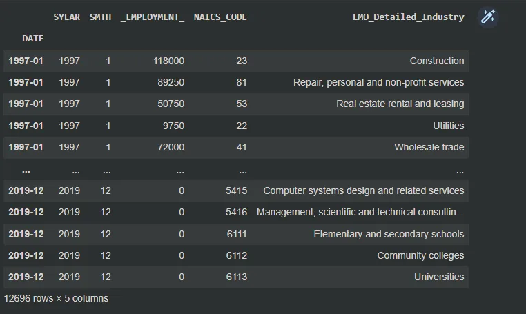

Since the instruction wanted analysis from 1997 to 2018, it is best to choose these and omit the 2019 and other year.

```python
#Choosing rows with indices less than 2019
df_naics_97_18 = df_naics_set[(df_naics_set.index).astype(str) < '2019']

#Displaying some of the rows
df_naics_97_18
```

**Output**:

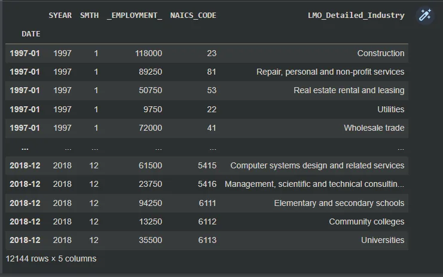

Now loading of the data output template and making a date column as index.

```python
#Forming right date format from SMTH and SYEAR and making it the index of the dataset
month_year= df_output_tem.SMTH.astype('str').str.cat(df_output_tem.SYEAR.astype('str'),sep=' ')
df_output_tem['DATE']= pd.to_datetime(month_year).dt.strftime('%Y-%m')
df_output_tem.set_index('DATE',inplace=True)

df_output_tem
```

**Output**:

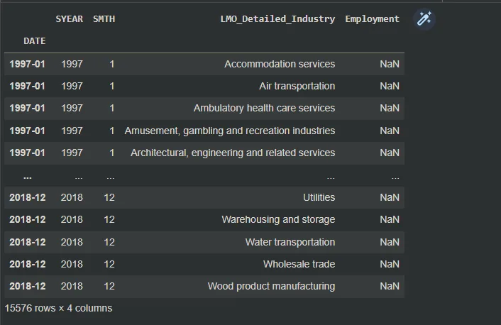

Now, it is best to merge data from 1997 to 2018 with the data output template.

```python
#Merging datasets together
final_data = df_output_tem.merge(df_naics_97_18, left_on=['DATE','LMO_Detailed_Industry'], right_on=['DATE','LMO_Detailed_Industry'], how='left')
#Displaying dataset
final_data
```

**Output**:

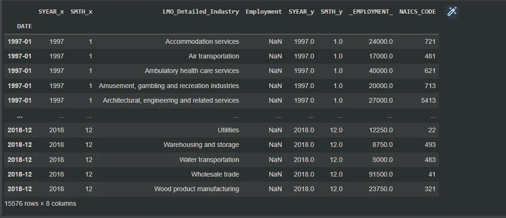

Now there is a need to drop the ***SYEAR_y*** and ***SMTH_y***. And rename ***SYEAR_x*** and ***SMTH_x*** to ***SYEAR*** and ***SMTH*** respectively.

```python
#Dropping SYEAR_y and SMTH_y
final_data = final_data.drop(columns=['SYEAR_y', 'SMTH_y'], axis=1)

#Fusing _EMPLOYMENT_ into Employment
final_data['Employment'] = final_data._EMPLOYMENT_

#Dropping _EMPLOYMENT_ column
final_data = final_data.drop('_EMPLOYMENT_', axis=1)

#Renaming SYEAR_x and SMTH_x columns to SYEAR and SMTH
final_data.rename(columns={'SYEAR_x': 'SYEAR', 'SMTH_x':'SMTH'},inplace=True)

final_data
```

**Output**:

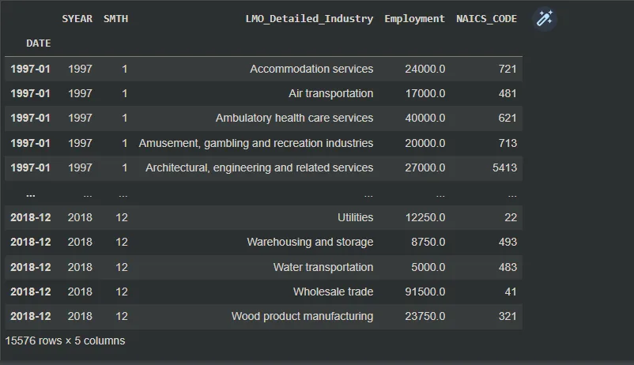

Now we check for NaN values.

```python
#Checking for missing data
final_data.isnull().sum()
```

**Output**:

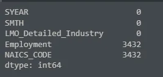

Since there are null values. It is best to take care of them. We will fill them with 0s.

```python
#Filling NAN values with 0
final_data['Employment']=final_data['Employment'].fillna(0).astype(int)
final_data['NAICS_CODE']=final_data['NAICS_CODE'].fillna(0).astype(int)

final_data
```

The final data output is:

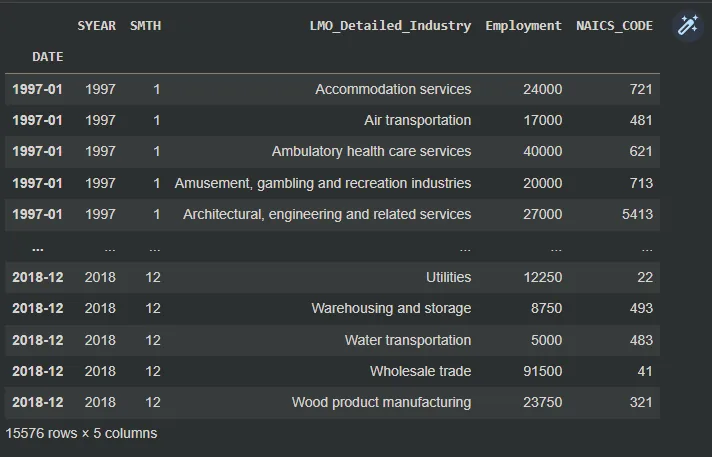

## INSIGHTS FROM DATA
As a data scientist trying to acquire the best information from this data for my company, I will channel my findings into giving the answers for 5 basic questions. The questions are as follows:

1. How employment in construction evolved over time and how this compares to the total employment across all countries?
2. How is the total employment of each industry from 1997 to 2018?
3. How is the trend of employment in the real estate rental and leasing industry?
4. What are the top 10 employment industries?
5. What has the trend been over the years in the hospital industry?

**HOW EMPLOYMENT IN CONSTRUCTION INDUSTRY HAS EVOLVED**

To check the evolution of employment of the construction industry, it is prudent to take only the construction industry into consideration.

```python
#Taking only rows with Construction as LMO_Detailed_Industry
construction = final_data[final_data['LMO_Detailed_Industry'] == 'Construction']

#Displaying the columns
construction
```

**Output**:

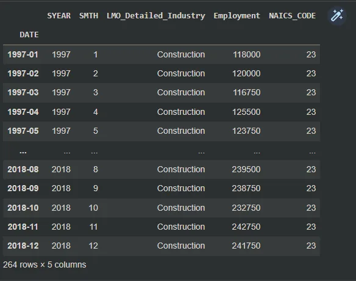

It is best now to know the individual employments for each year from 1997 to 2018.

```python
#Grouping construction by year
per_year_group = construction.groupby('SYEAR')['Employment'].sum()

per_year_group
```

**Output**:

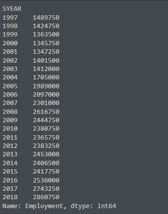

From the above, we can see each year and the total number of employments for the construction industry. It is even better to show this in visuals.

```python
#Visualization with seaborn

plt_1 = plt.figure(figsize=(10, 8))
sns.set_style('whitegrid')
sns.lineplot(data=per_year_group)
plt.xlabel('YEARS')
plt.ylabel('NUMBER OF EMPLOYMENTS')
plt.title('EVOLUTION OF EMPLOYMENT OF THE CONSTRUCTION INDUSTRY OVER THE YEARS')
plt.xticks(np.arange(1997,2019), rotation=90)

plt.show()
```

**Output:**

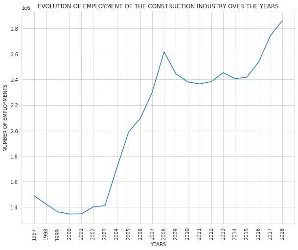

This visual shows that, there was a very sharp rise in the number of employments in the construction industry from 2003 to 2008. This could possibly mean there was a lot of construction underway in these particular year. From 2008 to 2012, there was a decrease and then a rise rom 2012 to 2013, then a decrease in 2014, then afterwards, there has been an increase ever since.

**HOW IS THE TOTAL EMPLOYMENT OF EACH INDUSTRY FROM 1997 TO 2018?**

To achieve this, it is best to group the data by LMO_Details_Industry and then sum up the Employment column.

```python
total_employment = pd.DataFrame(final_data.groupby('LMO_Detailed_Industry')['Employment'].sum())
total_employment
```

**Output**:

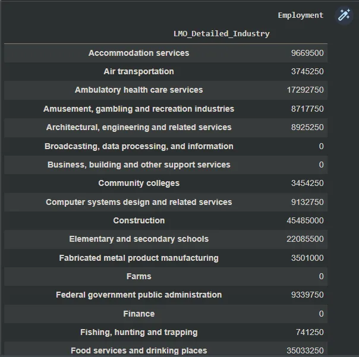

Now we visualize the above output.

```python
plt_2 = plt.figure(figsize=(10, 8))

sns.set_style('dark')
sns.barplot(x='Employment',y=total_employment.index,data=total_employment,orient ='h')
plt.title('TOTAL NUMBER OF EMPLOYMENTS BY VARIOUS INDUSTRIES FROM 1997 TO 2018')
plt.xlabel('NUMBER OF EMPLOYMENTS')
plt.ylabel('INDUSTRIES')

plt.show()
```

**Output**:

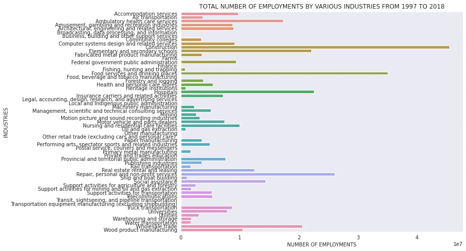

The above shows that the Construction industry has had the highest number of employments in total from 1997 to 2018 followed by Food services and drinking places.

**HOW IS THE TREND OF EMPLOYMENT IN THE REAL ESTATE RENTAL AND LEASING INDUSTRY?**

For this, it is prudent to get only the rental and leasing industry rows.

```python
#Taking only rows with real estate rental and leasing industry as LMO_Detailed_Industry
estate = final_data[final_data['LMO_Detailed_Industry'] == 'Real estate rental and leasing']

#Displaying the columns
estate
```

**Output**:

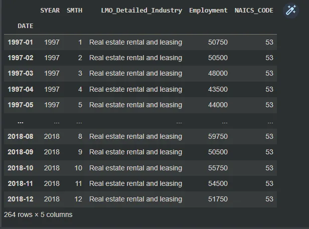

Now that we have only real estate rental and leasing rows selected, it is now prudent to group these according to years and sum up the employment column.

```python
#Grouping construction by year
per_year_group_estate = pd.DataFrame(estate.groupby('SYEAR')['Employment'].sum())

per_year_group_estate
```

**Output**:

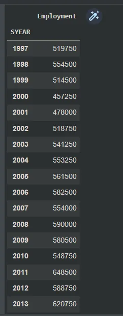

Now with the above output, we can visualize.

```python
#Visualizing

plt_3 = plt.figure(figsize=(10,8))

sns.set_style('whitegrid')
sns.lineplot(x='SYEAR', y='Employment', data=estate )
plt.xlabel('YEARS')
plt.ylabel('NUMBER OF EMPLOYMENTS')
plt.title('TREND OF EMPLOYMENTS BY REAL ESTATE RENTAL AND LEASING INDUSTRY OVER THE YEARS')
plt.xticks(rotation=90)

plt.show()
```

**Output**:

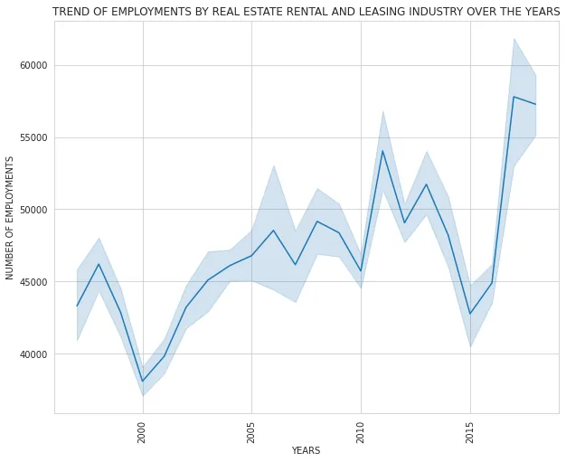

From the visualization, there has been rise and falls in the rental and leasing industry over the years. It has not been consistent but recorded its highest employment number in 2017 and least in 2000.

**WHAT ARE THE TOP 10 EMPLOYMENT INDUSTRIES?**

In order to find the top 10 employing industries, it will be best to group the dataset by LMO_Detailed_Industries then sum the employment column and then sort the values based on the employment column.

```python
#Finding top 10 employment industries
top_ten = pd.DataFrame(final_data.groupby('LMO_Detailed_Industry')['Employment'].sum()).sort_values('Employment', ascending=False).iloc[:10]

top_ten
```

**Output**:

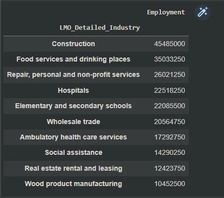

The above output shows that the Construction industry has the highest employment and Wood Product manufacturing is the last of the top 10.

It is best to visualize at this point.

```python
#Visualizing

plt_4 = plt.figure(figsize=(10, 8))
sns.set_style('ticks')
sns.barplot(x=top_ten.index, y='Employment', data=top_ten)
plt.xlabel('NAME OF INDUSTRIES')
plt.ylabel('NUMBER OF EMPLOYMENTS')
plt.title('TOP 10 INDUSTRIES WITH HIGHEST NUMBER OF EMPLOYMENTS')
plt.xticks(rotation=90)

plt.show()
```

**Output**:

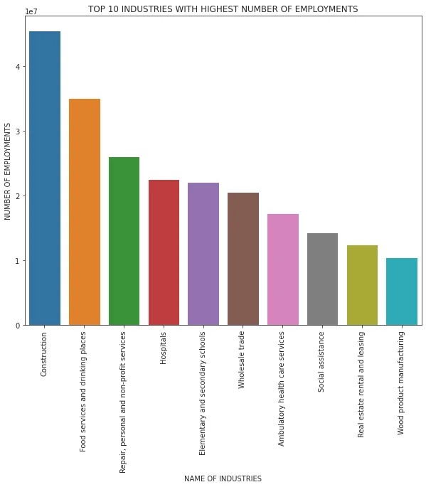

**WHAT HAS THE TREND BEEN OVER THE YEARS IN THE HOSPITAL INDUSTRY?**

For this, it is prudent to get only the hospital rows.

```python
#Taking only rows with hospitals as LMO_Detailed_Industry
hospital = final_data[final_data['LMO_Detailed_Industry'] == 'Hospitals']

#Displaying the columns
hospital
```

**Output**:

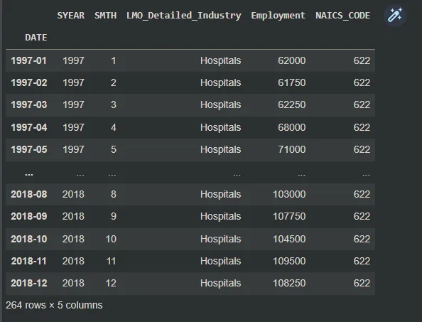

Then we group by year and then select and sum the employment column.

```python
#Grouping hospital by year
per_year_group_hospital = pd.DataFrame(hospital.groupby('SYEAR')['Employment'].sum())

per_year_group_hospital
```

**Output**:

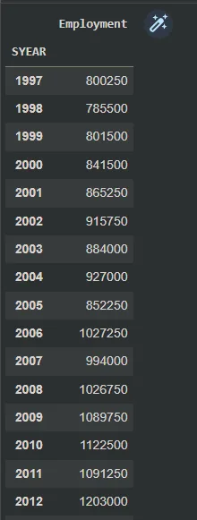

Now it is best to visualize the data.

```python
#Visualizing

plt_5 = plt.figure(figsize=(10,8))

sns.set_style('whitegrid')
sns.scatterplot(x='SYEAR', y='Employment', data=per_year_group_hospital )
plt.xlabel('YEARS')
plt.ylabel('NUMBER OF EMPLOYMENTS')
plt.title('TREND OF HOSPITAL EMPLOYMENTS OVER THE YEARS')
plt.xticks(np.arange(1997,2019,1), rotation=90)

plt.show()
```

**Output**:

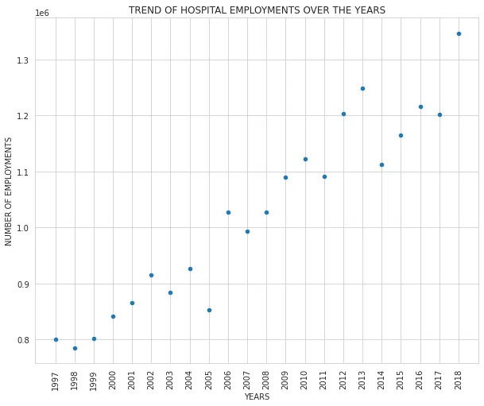

It can be seen that there has been a rise in the number of employments in the hospital sector. The highest was recorded in 2013 and the least in 1998.

## CONCLUSION AND RECOMMENDATIONS
1. The construction industry has the largest number of employments. It contributes more than any other industry. It will be advisable in case of investments for my company to invest in this industry since is it growing at a fast rate than any other.
2. The only way to know how some industries are doing very well and and others are not, will be to dive deep into the individual industries. Modern advancements has brought drastic decrease in the number of employments for some sectors.
3. Taking into consideration the trends of some sectors, they will be less and less employments in such industries which can lead to the sector dying out if nothing is done.

## ADVISE TO ASPIRING DATA ANALYSTS
1. Aspiring data analysts should be ready to learn and love to practice whatever they learn. Practice indeed makes man perfect.
2. They should learn statistics, mathematics, probability, and critical thinking very well.
3. They should get their motivation for the journey since it is a long one.

CHECK OUT ON GITHUB:

<https://github.com/Jegge2003/time_series_analysis_of_NAICS>
