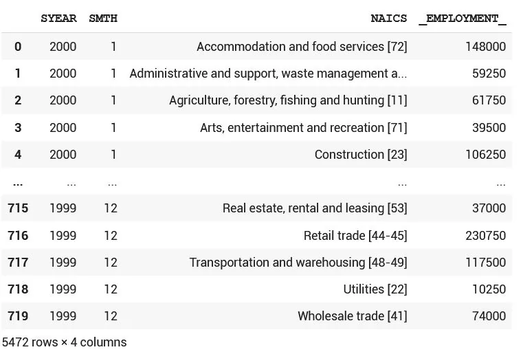
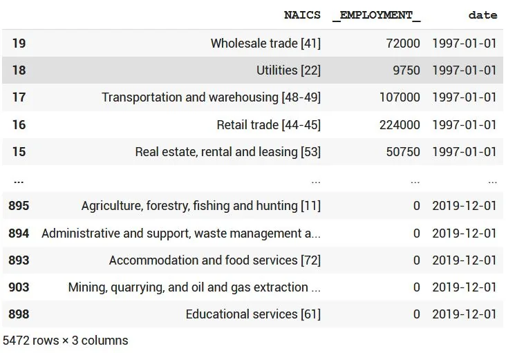
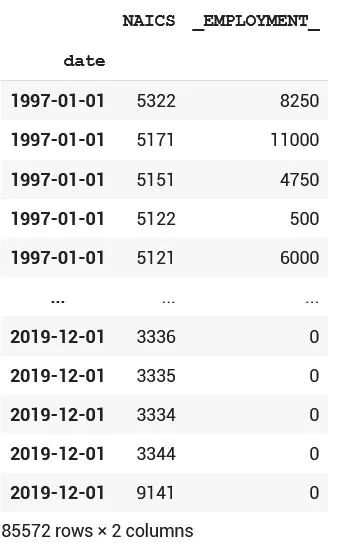
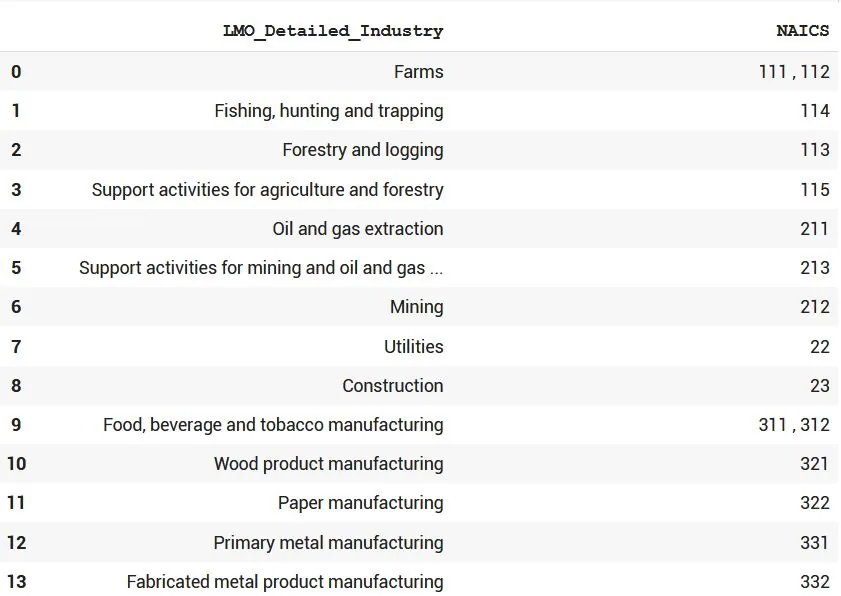
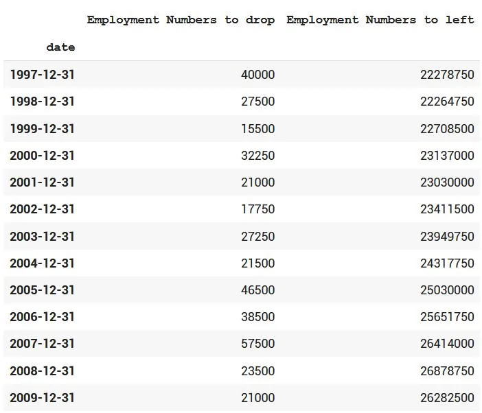
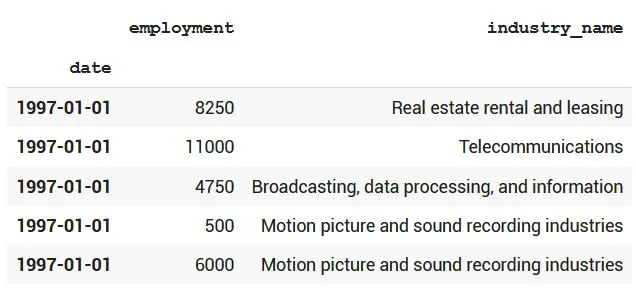
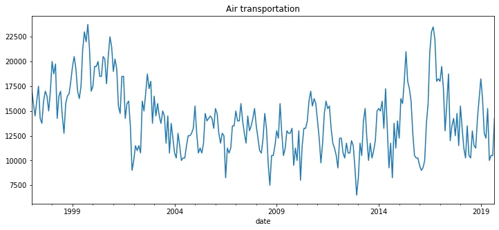
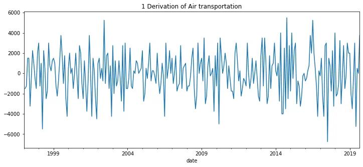

In this document, a Time Series Analysis of NAICS dataset will be done..


#### Introduction:

Dataset:

NAICS dataset is the North American Industry Classification System, (NAICS) Canada represents a continuing cooperative effort among

Statistics Canada, Mexico's Instituto Nacional de Estadística y Geografía (INEGI), and the Economic Classification Policy Committee (ECPC) of the United States, acting on behalf of the Office of Management and Budget, to create and maintain a common industry classification system. With its inception in 1997, NAICS replaced the existing classification of each country, the Standard Industrial Classification (1980) of Canada, the Mexican Classification of Activities and Products (1994), and the standard Industrial Classification (1987) of the United States. Since 1997, the countries have collaborated in producing 5-year revisions to NAICS in order to keep the classification system current with changes in economic activities. The NAICS changes for 2017 represent a minor revision and all occur within sector boundaries. and discussing how the NAICS works as a hierarchical structure for defining industries at different levels of aggregation. For example (see page 22), a 2-digit NAICS industry (e.g., 23 - Construction) is composed of some 3-digit NAICS industries (236 - Construction of buildings, 237 - Heavy and civil engineering construction, and a few more 3-digit NAICS industries). Similarly, a 3-digit NAICS industry (e.g., 236 - Construction of buildings), is composed of

4-digit NAICS industries (2361 - Residential building construction and 2362 - Non-residential building construction).

The raw data consists of 15 CSV files beginning with RTRA. These files contain employment data by industry at different levels of aggregation; 2-digit NAICS, 3-digit NAICS, and 4-digit NAICS. Columns are SYEAR which means Survey Year,SMTH means Survey Month though NAICS stands for Industry name and associated NAICS code in the bracket, and finally _EMPLOYMENT_ is clearly Employment.

Now as we now every description needed, let's dive into data and see it; first in order to import all csvs, we can do this:

```python
import pandas as pd
import glob

glob.glob('/content/A_NEWLY_HIRED_DATA_ANALYST/*.csv')

>>>
['/content/A_NEWLY_HIRED_DATA_ANALYST/RTRA_Employ_2NAICS_00_05.csv',  '/content/A_NEWLY_HIRED_DATA_ANALYST/RTRA_Employ_3NAICS_00_05.csv',  '/content/A_NEWLY_HIRED_DATA_ANALYST/RTRA_Employ_3NAICS_97_99.csv',  '/content/A_NEWLY_HIRED_DATA_ANALYST/RTRA_Employ_4NAICS_06_10.csv',  '/content/A_NEWLY_HIRED_DATA_ANALYST/RTRA_Employ_4NAICS_16_20.csv',  '/content/A_NEWLY_HIRED_DATA_ANALYST/RTRA_Employ_4NAICS_00_05.csv',  '/content/A_NEWLY_HIRED_DATA_ANALYST/RTRA_Employ_2NAICS_16_20.csv',  '/content/A_NEWLY_HIRED_DATA_ANALYST/RTRA_Employ_4NAICS_97_99.csv',  '/content/A_NEWLY_HIRED_DATA_ANALYST/RTRA_Employ_4NAICS_11_15.csv',  '/content/A_NEWLY_HIRED_DATA_ANALYST/RTRA_Employ_3NAICS_06_10.csv',  '/content/A_NEWLY_HIRED_DATA_ANALYST/RTRA_Employ_2NAICS_11_15.csv',  '/content/A_NEWLY_HIRED_DATA_ANALYST/RTRA_Employ_3NAICS_11_15.csv',  '/content/A_NEWLY_HIRED_DATA_ANALYST/RTRA_Employ_2NAICS_06_10.csv',  '/content/A_NEWLY_HIRED_DATA_ANALYST/RTRA_Employ_3NAICS_16_20.csv',  '/content/A_NEWLY_HIRED_DATA_ANALYST/RTRA_Employ_2NAICS_97_99.csv']
```

This will result all the names of the csv files..Let's be more specific and read only the 2-digit Naics and save them into one list that contains all paths..

```python
all_2NAICS = glob.glob('/content/A_NEWLY_HIRED_DATA_ANALYST/*2NAICS*')
all_2NAICS
>>
['/content/A_NEWLY_HIRED_DATA_ANALYST/RTRA_Employ_2NAICS_00_05.csv',
 '/content/A_NEWLY_HIRED_DATA_ANALYST/RTRA_Employ_2NAICS_16_20.csv',
 '/content/A_NEWLY_HIRED_DATA_ANALYST/RTRA_Employ_2NAICS_11_15.csv',
 '/content/A_NEWLY_HIRED_DATA_ANALYST/RTRA_Employ_2NAICS_06_10.csv',
 '/content/A_NEWLY_HIRED_DATA_ANALYST/RTRA_Employ_2NAICS_97_99.csv']
```

Now let's do the same for 3-digits and 4-digits NAICS:

```python
all_3NAICS = glob.glob('/content/A_NEWLY_HIRED_DATA_ANALYST/*3NAICS*')
all_4NAICS = glob.glob('/content/A_NEWLY_HIRED_DATA_ANALYST/*4NAICS*')
```

Now every path is set and done,let's create a function that reads, and combines all datasets of same digit in one csv file to be ready ..

```python
def get_datasets(data_paths):
    df = pd.DataFrame()
    for path_ in data_paths:
        df = pd.concat([df,pd.read_csv(path_)])
    return df
```

This starts with creating a dataframe, loops over paths and reads each, concatenate each dataset to the previous ones.. Simply that's it..

```python
## Reading all Naics datasets and their three types respectively
data_2NAICS = get_datasets(all_2NAICS)
data_3NAICS = get_datasets(all_3NAICS)
data_4NAICS = get_datasets(all_4NAICS)
```

That's it, let's see how the 2-digits looks like for example;

```python
data_2NAICS
>>>
```



Now it's so logical to think of date formatting the 'SYEAR, SMTH' to pandas datetime, don't mind me that I called the function data_format(); and using it on the 3 datasets...

```python
def data_format(df):
  df['date'] = pd.to_datetime(df.SYEAR.astype('str') + df.SMTH.astype('str'), format='%Y%m')
  df= df.drop(columns=['SYEAR','SMTH'])
  df2 = df.sort_values('date')
  return df2
data_2NAICS = data_format(data_2NAICS)
data_3NAICS = data_format(data_3NAICS)
data_4NAICS = data_format(data_4NAICS)
```

And let's see the output;

```python
print(data_2NAICS)
```



In our case, we use the 4-digit NAICS dataset as the case study for insights of visualizations, and it wouldn't differ much if the choice is otherwise..

```python
## Let's have the four-digit's level of aggregation, and begin to studying it:

data_4NAICS['NAICS'] = data_4NAICS['NAICS'].astype('str')
data_4NAICS.set_index('date', inplace=True)

## As it's clear, data series starts for 1997, ends at 2019..
data_4NAICS
>>>
```



Now, the NAICS column makes it really unclear what are we doing, and this is our next step, let's decode those values..

```python
## Let's decode industry names now in digit-four so we can have our output:

industries = pd.read_excel('/content/LMO_Detailed_Industries_by_NAICS.xlsx')

industries['NAICS'] = industries['NAICS'].replace(regex='&', value=',')
industries['NAICS'] = industries['NAICS'].astype('str')
industries
>>>
```



Now, this is the most interesting part of the code, we collect each corresponding value to the industry, and matching each of the industries mentioned and their corresponding number of digits..

```python
## Create a dictionary for every value, their corresponding name, and their corresponding number-digits:

industries_dictionary = {
    'two_digits' : {},
    'three_digits' : {},
    'four_digits' : {}
}
for name, numbers in zip(industries['LMO_Detailed_Industry'].values, industries['NAICS'].values):
    num_list = numbers.split(',')
    num_list = [x.strip() for x in num_list]
    for i in range(len(num_list)):
        if len(num_list[i]) == 2:
            industries_dictionary['two_digits'][num_list[i]] = name
        elif len(num_list[i]) == 3:
            industries_dictionary['three_digits'][num_list[i]] = name
        elif len(num_list[i]) == 4:
            industries_dictionary['four_digits'][num_list[i]] = name
```

Let's see them all through dictionary:

```python
print(industries_dictionary)
>>>
{'four_digits': {'3361': 'Transportation equipment manufacturing (excluding shipbuilding)',   '3362': 'Transportation equipment manufacturing (excluding shipbuilding)',   '3363': 'Transportation equipment manufacturing (excluding shipbuilding)',   '3364': 'Transportation equipment manufacturing (excluding shipbuilding)',   '3365': 'Transportation equipment manufacturing (excluding shipbuilding)',   '3366': 'Ship and boat building',   '3369': 'Transportation equipment manufacturing (excluding shipbuilding)',   '5411': 'Legal, accounting, design, research, and advertising services',   '5412': 'Legal, accounting, design, research, and advertising services',   '5413': 'Architectural, engineering and related services',   '5414': 'Legal, accounting, design, research, and advertising services',   '5415': 'Computer systems design and related services',   '5416': 'Management, scientific and technical consulting services',   '5417': 'Legal, accounting, design, research, and advertising services',   '5418': 'Legal, accounting, design, research, and advertising services',   '5419': 'Legal, accounting, design, research, and advertising services',   '6111': 'Elementary and secondary schools',   '6112': 'Community colleges',   '6113': 'Universities',   '6114': 'Private and trades education',   '6115': 'Private and trades education',   '6116': 'Private and trades education',   '6117': 'Private and trades education'},  'three_digits': {'111': 'Farms',   '112': 'Farms',   '113': 'Forestry and logging',   '114': 'Fishing, hunting and trapping',   '115': 'Support activities for agriculture and forestry',   '211': 'Oil and gas extraction',   '212': 'Mining',   '213': 'Support activities for mining and oil and gas extraction',   '311': 'Food, beverage and tobacco manufacturing',   '312': 'Food, beverage and tobacco manufacturing',   '313': 'Other manufacturing',   '314': 'Other manufacturing',   '315': 'Other manufacturing',   '316': 'Other manufacturing',   '321': 'Wood product manufacturing',   '322': 'Paper manufacturing',   '323': 'Other manufacturing',   '324': 'Other manufacturing',   '325': 'Other manufacturing',   '326': 'Other manufacturing',   '327': 'Other manufacturing',   '331': 'Primary metal manufacturing',   '332': 'Fabricated metal product manufacturing',   '333': 'Machinery manufacturing',   '334': 'Other manufacturing',   '335': 'Other manufacturing',   '337': 'Other manufacturing',   '339': 'Other manufacturing',   '441': 'Motor vehicle and parts dealers',   '442': 'Other retail trade (excluding cars and personal care) ',   '443': 'Other retail trade (excluding cars and personal care) ',   '444': 'Other retail trade (excluding cars and personal care) ',   '445': 'Other retail trade (excluding cars and personal care) ',   '446': 'Other retail trade (excluding cars and personal care) ',   '447': 'Other retail trade (excluding cars and personal care) ',   '448': 'Other retail trade (excluding cars and personal care) ',   '451': 'Other retail trade (excluding cars and personal care) ',   '452': 'Other retail trade (excluding cars and personal care) ',   '453': 'Other retail trade (excluding cars and personal care) ',   '454': 'Other retail trade (excluding cars and personal care) ',   '481': 'Air transportation',   '482': 'Rail transportation',   '483': 'Water transportation',   '484': 'Truck transportation',   '485': 'Transit, sightseeing, and pipeline transportation',   '486': 'Transit, sightseeing, and pipeline transportation',   '487': 'Transit, sightseeing, and pipeline transportation',   '488': 'Support activities for transportation',   '491': 'Postal service, couriers and messengers',   '492': 'Postal service, couriers and messengers',   '493': 'Warehousing and storage',   '511': 'Publishing industries',   '512': 'Motion picture and sound recording industries',   '515': 'Broadcasting, data processing, and information',   '517': 'Telecommunications',   '518': 'Broadcasting, data processing, and information',   '519': 'Broadcasting, data processing, and information',   '521': 'Finance',   '522': 'Finance',   '523': 'Finance',   '524': 'Insurance carriers and related activities',   '526': 'Finance',   '621': 'Ambulatory health care services',   '622': 'Hospitals',   '623': 'Nursing and residential care facilities',   '624': 'Social assistance',   '711': 'Performing arts, spectator sports and related industries',   '712': 'Heritage institutions',   '713': 'Amusement, gambling and recreation industries',   '721': 'Accommodation services',   '722': 'Food services and drinking places',   '911': 'Federal government public administration',   '912': 'Provincial and territorial public administration',   '913': 'Local and Indigenous public administration',   '914': 'Local and Indigenous public administration',   '919': 'Local and Indigenous public administration'},  'two_digits': {'22': 'Utilities',   '23': 'Construction',   '41': 'Wholesale trade',   '53': 'Real estate rental and leasing',   '55': 'Business, building and other support services',   '56': 'Business, building and other support services',   '81': 'Repair, personal and non-profit services'}}
```

And now let's decode the NAICS column and match each value to its industry;

```python
## Let's use the dictionary for decoding
import numpy as np

industry_decoded = []
for code in data_4NAICS['NAICS']:
    if code[:2] in industries_dictionary['two_digits'].keys():
        industry_decoded.append(industries_dictionary['two_digits'][code[:2]])
    elif code[:3] in industries_dictionary['three_digits'].keys():
        industry_decoded.append(industries_dictionary['three_digits'][code[:3]])
    elif code in industries_dictionary['four_digits'].keys():
        industry_decoded.append(industries_dictionary['four_digits'][code])
    else:
        industry_decoded.append(np.nan)
```

Now everything is ready to create the decoded column..

```python
data_4NAICS['industry_name'] = industry_decoded
print('Undecoded industry name')
print(data_4NAICS[data_4NAICS['industry_name'].isna()]['NAICS'].unique())
print(data_4NAICS[data_4NAICS['industry_name'].isna()]['NAICS'].value_counts())
print('Total Employment with no clear industry')
print(data_4NAICS[data_4NAICS['industry_name'].isna()]['_EMPLOYMENT_'].sum())
print('Total Employment with a clear industry')
print(data_4NAICS[data_4NAICS['industry_name'].notna()]['_EMPLOYMENT_'].sum())

>>>
Undecoded industry name
['1100' '2100']
1100    276
2100    276
Name: NAICS, dtype: int64
Total Employment with no clear industry
725000
Total Employment with a clear industry
588918000
```

Total number of employment with no clear industry can be ignored with no problems..

```python
### Now let's inspect number of employees we will have to drop at each year
pd.DataFrame({"Employment Numbers to drop":data_4NAICS[data_4NAICS.isna()['industry_name']].resample('Y')['_EMPLOYMENT_'].sum(),
              "Employment Numbers to left":data_4NAICS[data_4NAICS.notna()['industry_name']].resample('Y')['_EMPLOYMENT_'].sum()})
```



Let's get rid of any useless data parts, dropping encoded industry values, and renaming employment..

```python
data_4NAICS.rename(columns={'_EMPLOYMENT_':'employment'}, inplace=True)
data_4NAICS.drop(columns=['NAICS'], inplace=True)
data_4NAICS.head()
```



We can discuss a lot of comparisons in this large scaled dataset, but that's enough to discuss a question which can be a good example to generalize from it; let's see how does Air transportation change throughout the years:

```python
df['Air transportation'].plot(figsize=(12,5), title='Air transportation')
```



The air transportations seem to have lots of strong fluctuations but a clear regression in the era between the year 2004 and the 2012, which is followed by a flouring era in which the air transportation grows a lot with some fluctuations as well, that regresses since 2017 even before the spreading of the Covid-19 corona virus.. This can be clearer from the first derivative of the data..

```python
df['Air transportation'].diff().plot(figsize=(12,5), title='1 Derivation of Air transportation')
```



I am happy to work such an article working on such data, but I will be grateful if this article appeals to you and you found it useful, have a great day.
