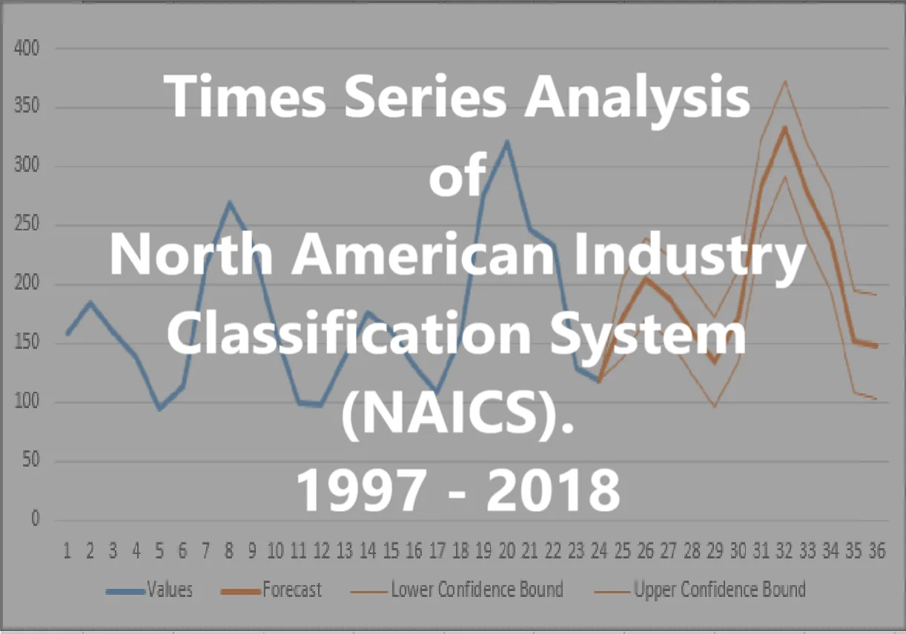

The North American Industry Classification System (NAICS) is an industry classification system developed by the statistical agencies of Canada, Mexico, and the United States. NAICS is designed to provide common definitions of the industrial structure of the three countries and a common statistical framework to facilitate the analysis of the three economies.

Time series analysis is a statistical technique that deals with time-series data, or trend analysis. Time series data means that data is in a series of particular time periods or intervals.

The files from the data set are flat files, Excel (.xlsx), and CSV (.csv) files, we will merge and append data from several files to make a Data Output file. Our first task would be to carry out some data wrangling processes before we can make analysis, ask questions, and gain insights.

**Summary of the data set files we will be using:-**
- 15 RTRA (Real-Time Remote Access) CSV files containing employment data by industry at different levels of aggregation, 2-digit NAICS, 3-digit NAICS, and 4-digit NAICS. *We will search through rows with 2, or 3, or 4 digits NAICS and append employment data each month of each year from 1997 - 2018*
 **Meaning of columns in the files:**
 - SYEAR: Survey Year
 - SMTH: Survey Month
 - NAICS: Industry name and associated NAICS code in the bracket
 - _EMPLOYMENT_: Employment

- LMO Detailed Industries by NAICS: An excel file for mapping the RTRA data to the desired data row.
 **Columns in the file:**
 - Column 1 lists all 59 industries that are used frequently
 - Column 2 list the industries NAICS definitions

As part of our data wrangling, we would create a dataset of monthly employment series from 1997 to 2018 for the industries.

One of the guiding principles for our data wrangling is to try to create each series from the highest possible level of aggregation in the raw data files, thus, if an LMO Detailed Industry is defined with a 2-digit NAICS only, we would not use a lower level of aggregation (i.e. 3-digit or 4-digit level NAICS files in the RTRA), similarly, if an LMO Detailed Industry is defined with a 3-digit NAICS only, we would not use the 4-digit NAICS files for that industry.

Let us begin!

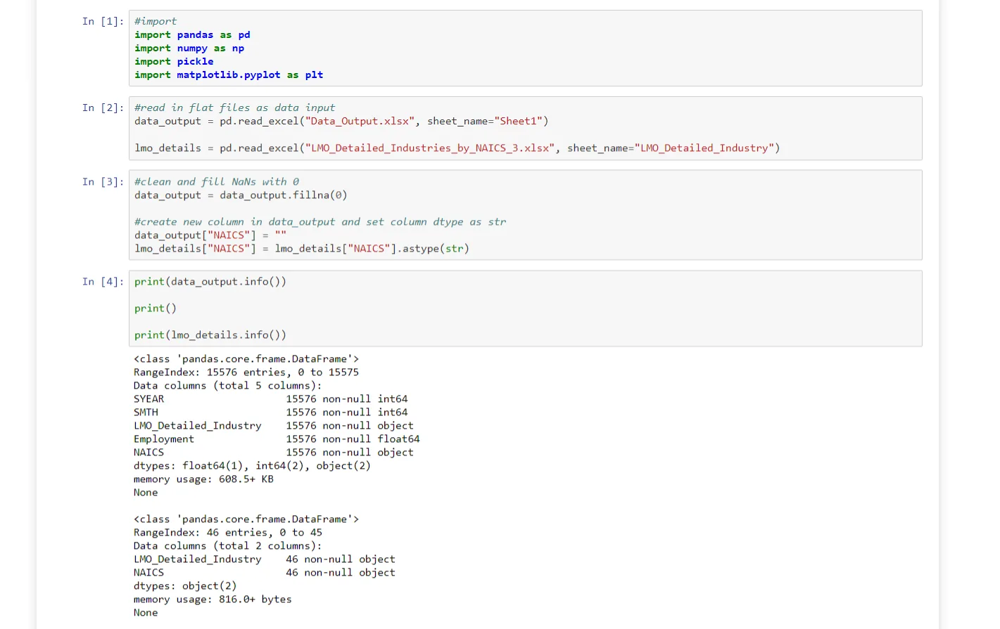

We will begin our data wrangling with the two imported files as DataFrames, reviewing the Data Output template, it has columns for SYEAR, SMTH, LMO_Detailed_Industry, and Employment, but for us append employment data successfully, we would need to give each row a unique identifier to be able to select unique rows from the RTRA CSV files, hence we create a column for the NAICS code as NAICS.

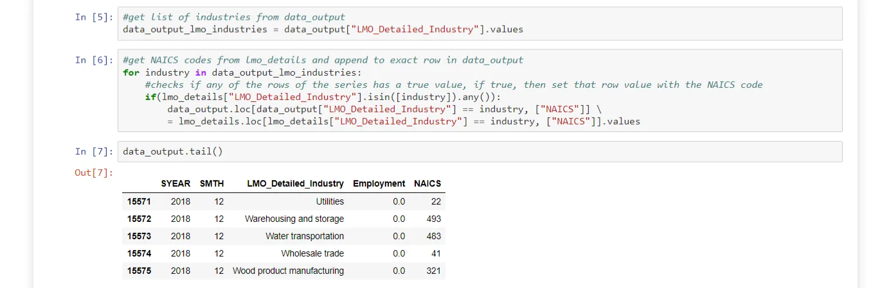

The information of each DataFrame shows that the Data Output file has 15576 rows, a product of 12 months of each year from 1997 to 2018 for each of the 59 industries.

We fill rows with "0" for industries with compound/ complex NAICS from the LMO_Detailed_Industries if their NAICS provided cannot be determined dynamically from the RTRA files.

We get a list of all the industry names from the Data Output file so we can pick the NAICS for each industry from the LMO_Detailed_Industry file, this is to ensure we get the NAICS codes data based on what was provided in the Data Output file.

In cell [6] we run a computation using a for loop, looping through the industry list and appending NAICS codes from the LMO_Detailed_Industry for each industry in the rows of the Data Output file.
At the end of the computation, in the cell [7] we see that the NAICS column is filled with appropriate codes for each industry.

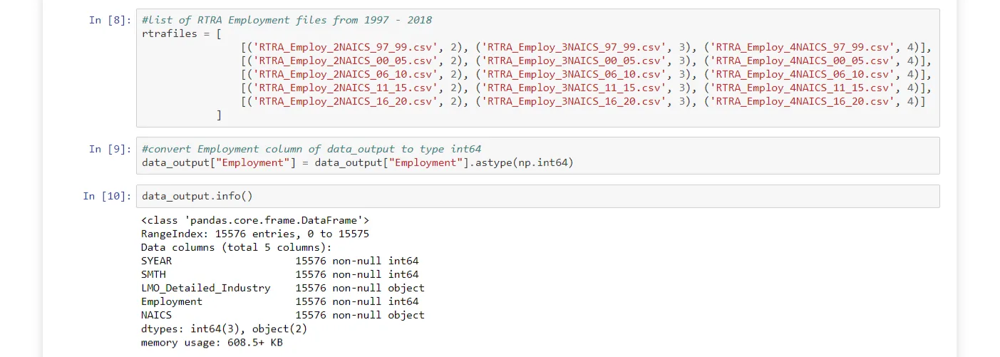

We load the 15 RTRA CSV files so that we get and append the employment data for each industry, based on their NAICS which we have appended to the Data Output file.

We extract the NAICS and the SYEAR (Year) from the Data Output file so that we can uniquely identify rows from the Data Output file and any particular RTRA file which is being considered in the loop.

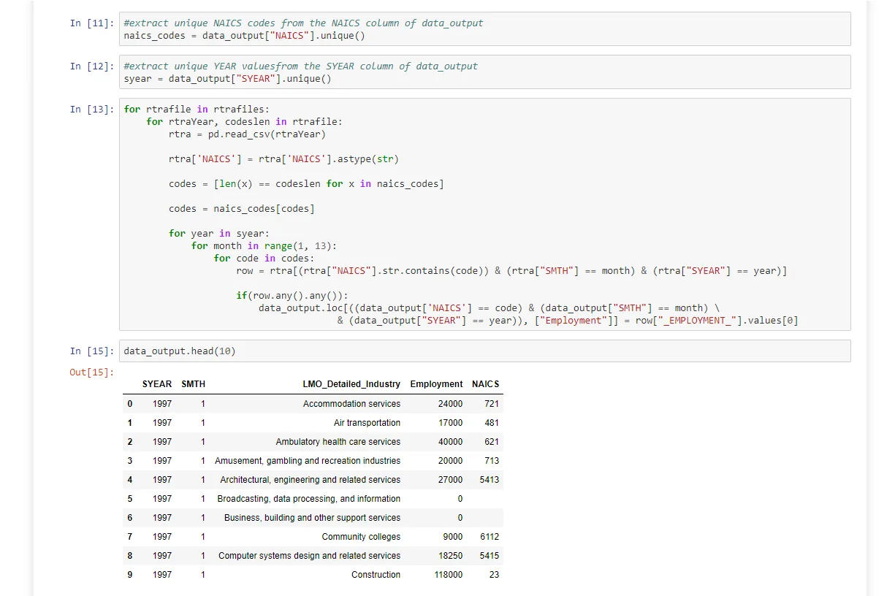

Cell [13] is our most complex code block with a long computation time based on the repetitive and conditional computation we have to do to be able to get unique employment data for each row from over the 15 RTRA CSV files for each month of each year for each industry.

Printing the head() of the Data Output file shows that the Employment has been appended with unique values, their authenticity can be confirmed manually.

**We have been able to successfully wrangle and append the employment data unique for every row in the Data Output file.**

**Now we can progress to make some data analysis, ask questions, create visualizations, and gain some insights, and derive some new knowledge from the dataset.**

**Question 1: How has construction evolved over time?**

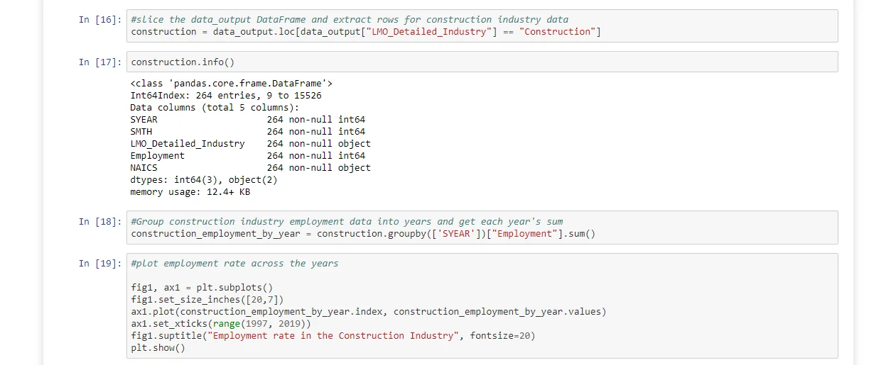

We slice the DataFrame to get rows for the Construction industry, then we group the Construction DataFrame by SYEAR column so that we can plot the employment trend across the years, from 1997 - 2018.

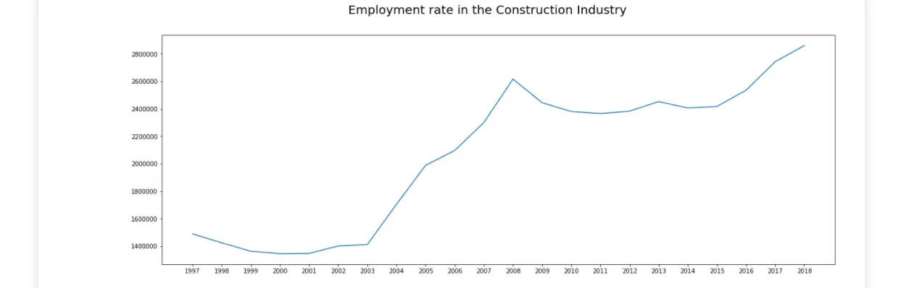

**There has been significant growth, an upward trend, in the construction industry, there was a peak in the growth rate from 2003.**

**Question 2: How employment in Construction evolved over time, compared to the total employment across all industries?**

*Let us consider the percentage of all employments in the construction industry against total employment across all industries.*

The percentage of total construction employments from 1997 - 2018 from the total number of employments in all industries (construction industry inclusive) is approx. 11.56%

*Let us consider the employment rate of other industries (excluding the construction industry) in total, how has the employment rate been?*

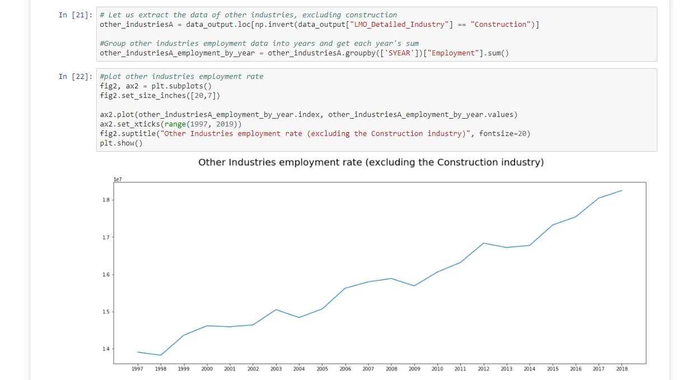

**We can clearly see that there has been a significant upward trend in the employment rate of these industries, just like the construction industry.**

*Let us compare the employment rate construction industry against the total employment of the other industries.*

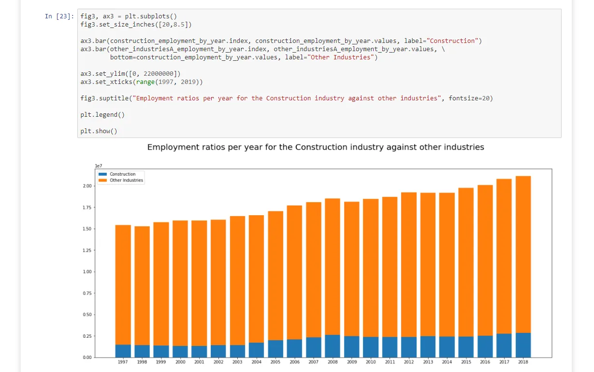

**The construction industry has a significant employment rate, compared to the total employment rate of the other industries, as they experience growth in the number of employees, the construction industry also experiences significant employments as well, and in the case where the total growth rate of the other companies, remain the same, the construction industry experienced a significant increase in employment, see the year 2003 and 2004.**

We can agree that the construction industry is a significant industry among other industries in North America.

**Question 3: How has the employment of Hospital staff evolved over time?**

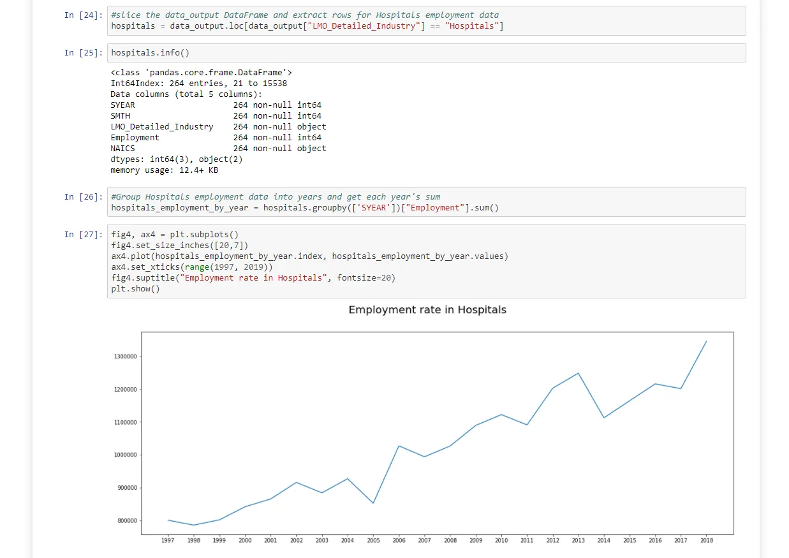

**The employment of Hospital staff over the years has been erratic, with spikes in growth at various significant years, this could be a result of government policies and the availability of employable healthcare professionals and clerical officers, nevertheless, the employment trend is upward.**

**Question 4: How employment of Hospital staff has evolved over time, compared to the total employment across all industries.**

*Let us consider the percentage of all employments in Hospitals against total employment across all industries.*

The percentage of total employment of Hospital staff from 1997 - 2018 from the total number of employments in all industries (construction industry inclusive) is approx. 5.73%

*Let us consider the employment rate of other industries (excluding the Hospitals) in total, how has their employment rate been?*

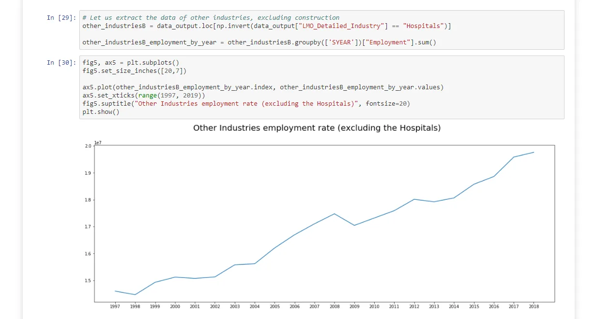

**The employment rate in other industries as seen has been significantly upward just like in Hospitals.**

*Let us compare the employment rate in Hospitals against the total employment rate in all industries.*

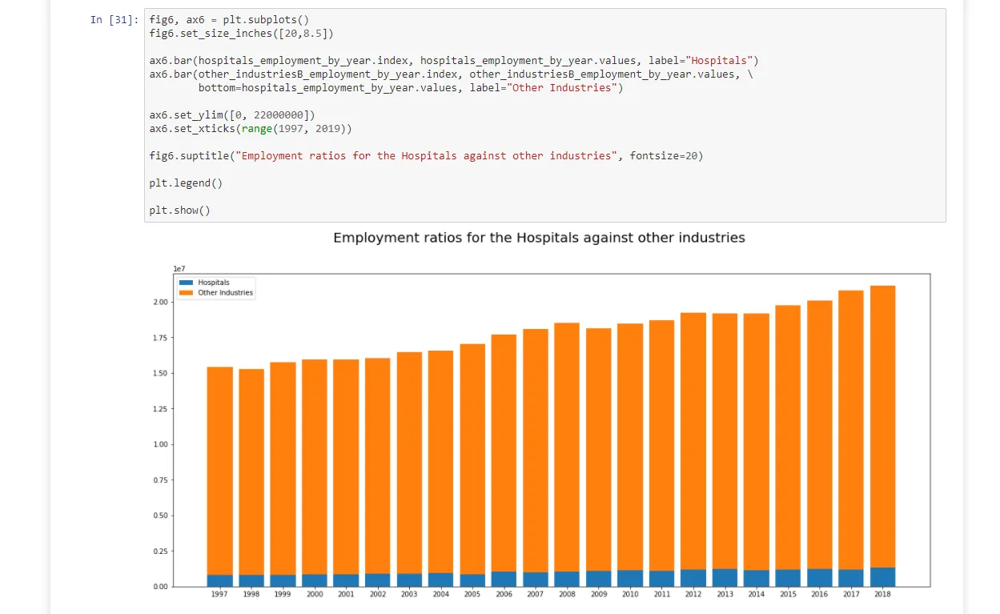

**Comparing the employment of hospital staff across the years against the total sum of employments of other industries, we can see that the employment rate has seen a slight upward trend over the years.**
**The number of employment of hospital staff each year from 1997 to 2018 has been below 1,250,000, this is relatively small compared to the total employments per year in the other industries as well as compared to the employments in the construction industry.**

**Question 5: How has employment in the construction industry and that of Hospital staff evolved over time?**

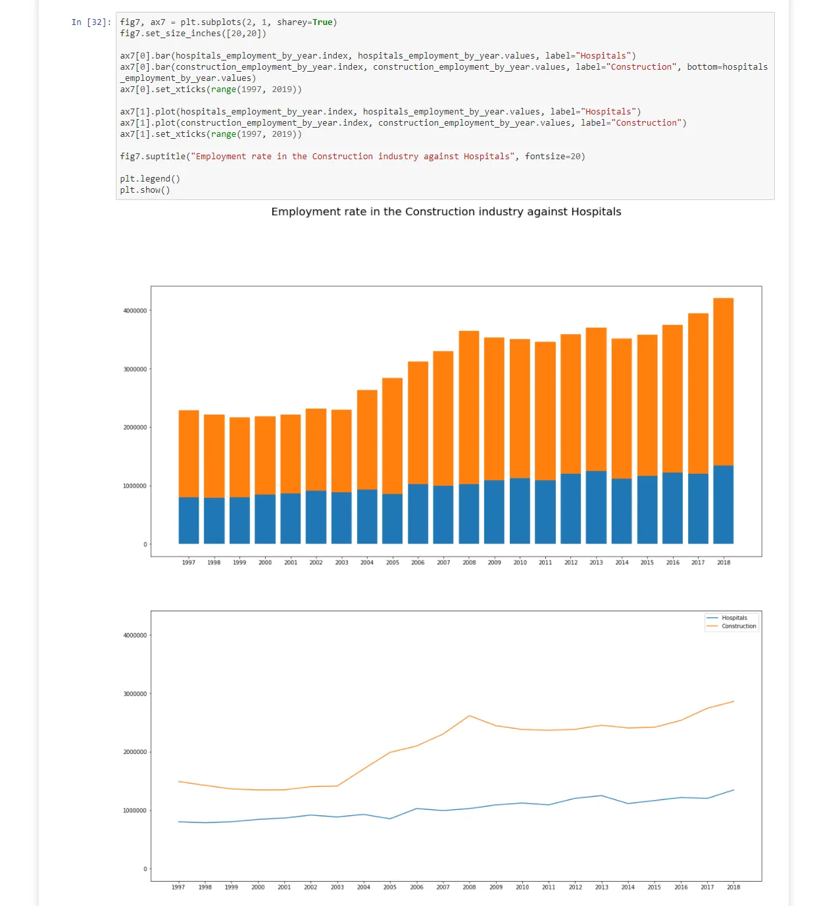

**The bar plots show that employments in the Construction industry per year is significantly higher than employments in Hospitals; the line graph shows a consistent and significant upward trend of employment in the Construction industry, while there is a relatively slight increase in employment in Hospitals over the years.**

**Conclusion:**
We can clearly draw insights and derive some knowledge about the Construction industry and the Hospitals.
We can see that the construction industry is an industry in which the government of the North American countries in the NAICS can consider investing in through ways of education and infrastructure, to make available more jobs, while not neglecting the Hospitals. The construction industry can become a major source of GDP for these countries, considering the employment rate, it shows there are a huge market and demand for construction workers in North America.

**Data Source:**

1. Labour Force Survey (LFS) by the Statistics of Canada.
