## Introduction
The **North American Industry Classification System** or **NAICS** is a classification of business establishments by type of economic activity (the process of production). It is used by the government and businesses in Canada, Mexico, and the United States of America.

NAICS works as a hierarchical structure for defining industries at different levels of aggregation. For example, a 2-digit NAICS industry (e.g., 23 - Construction) is composed of some 3-digit NAICS industries (236 - Construction of buildings, 237 - Heavy and civil engineering construction, and a few more 3-digit NAICS industries).

Similarly, a 3-digit NAICS industry (e.g., 236 - Construction of buildings), is composed of 4-digit NAICS industries (2361 - Residential building construction and 2362 - Non-residential building construction).

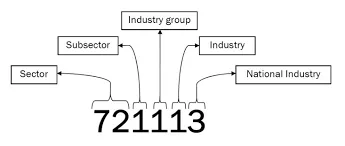

For this post, we will work only with the four first digits.

## Data

15 CSV files beginning with RTRA. These files contain employment data by industry at different levels of aggregation; 2-digit NAICS, 3-digit NAICS, and 4-digit NAICS. Columns mean as follows:

(i) SYEAR: Survey Year

(ii) SMTH: Survey Month

(iii) NAICS: Industry name and associated NAICS code in the bracket

(iv) _EMPLOYMENT_: Employment

## Our goal during this post

1. Fill the empty column with the data in our prepared file.
2. Try to answer some questions about employment in Construction evolved and how this compares to the total employment across all industries?

## Data Import and cleaning

Firstly, let's import some libraries that we will use.

```python
import re
import glob
import numpy as np
import pandas as pd
import seborn as sns
import matplotlob.pyplot as plt
```

Then, let's create a function to retrieve all data for the selected digit. before that will we need to get all CSV files in the data folder.

```python
# get all csv files in data folder
files = glob.glob('./data/*.csv')

def create_df(digit:int) -> pd.core.frame.DataFrame :
    """
    Create a sorted dataframe for selected digit using files already in data folder that match with '_{digit}NAICS'
    Parameters
    ----------
    digit : int
        Number of digit of NAICS file we want to retrieve

    files : list
        Global parameter, list of csv files in data folder.

    Returns
    -------
    pd.core.frame.DataFrame
        sorted dataframe of NAICS with n digits.
    """
    global files
    return pd.concat([pd.read_csv(file) for file in files if re.search("_{}NAICS".format(digit), file)]).sort_values(by=['SYEAR', 'SMTH'])
```

Now we create our function, we will get data for 2-digit NAICS, 3-digit NAICS, and 4-digit NAICS.

```python
df_2_digit = create_df(2)
df_3_digit = create_df(3)
df_4_digit = create_df(4)
```

Let's present data for the first created dataset.

```python
df_2_digit.head(25)
```

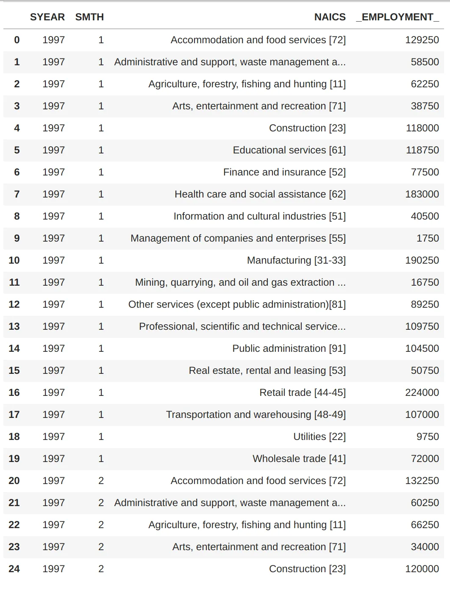

For the time series purpose, we need to create a new column date. This column will be created from the concatenation of **SYEAR** and **SMTH** columns.

The type of this column will be DateTime.

After creating this column we will need to remove **SYEAR** and **SMTH** columns for each dataset.

Let's begin by creating a function like the previous one for doing it.

```python
def create_date(df: pd.core.frame.DataFrame) -> pd.core.frame.DataFrame:
    """
    Create the date column in the selected dataset then remove unused columns
    Parameters
    ----------
    df : pd.core.frame.DataFrame
        the dataframe we want to change

    Returns
    -------
    pd.core.frame.DataFrame
        the input dataframe with ['DATE'] and without ['SYEAR', 'SMONTH'] columns
    """
    df['DATE'] = pd.to_datetime(df['SYEAR'].astype('str') + df['SMTH'].astype('str'), format='%Y%m')
    df.drop(columns=['SYEAR', 'SMTH'], inplace=True)
    return df
```

Let's add a **DATE** column for each data frame.

```python
df_2_digit = create_date(df_2_digit)
df_3_digit = create_date(df_3_digit)
df_4_digit = create_date(df_4_digit)
```

Now let's see the result for the first dataset again.

```python
df_2_digit.head()
```

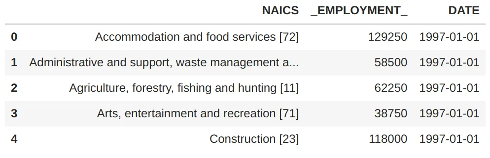

To match with the **LMO_Detailed_Industries_by_NAICS** file, we have to split **NAICS Code** and **NAICS Industries** in our data frames.

```python
def create_code(df: pd.core.frame.DataFrame) -> pd.core.frame.DataFrame:
    """
    Create the code column in the selected dataset
    Parameters
    ----------
    df : pd.core.frame.DataFrame
        the dataframe we want to change

    Returns
    -------
    pd.core.frame.DataFrame
        the input dataframe with ['CODE']
    """
    df['CODE'] = df['NAICS'].astype('str').str.extract('(\d+)')
    df['NAICS'] = df['NAICS'].astype('str').str.split('[').str.get(0)
    return df

df_2_digit = create_code(df_2_digit)
df_3_digit = create_code(df_3_digit)
df_4_digit = create_code(df_4_digit)

df_2_digit.head()
```

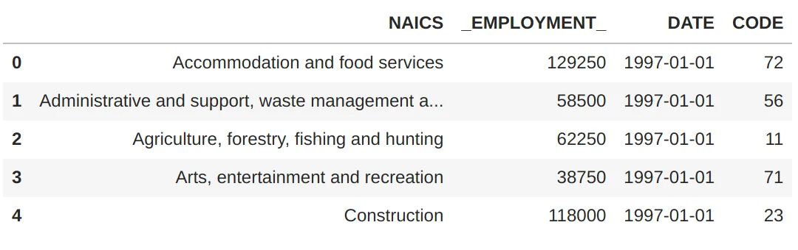

From now we will work with 4 digit dataset.

We will try to get the correct code of each **NAICS** in **LMO_Detailed_Industries_by_NAICS.**

Firstly we will retrieve value from **LMO_Detailed_Industries_by_NAICS**

```python
LMO = pd.read_excel('./data/LMO_Detailed_Industries_by_NAICS.xlsx')
LMO.head(6)
```

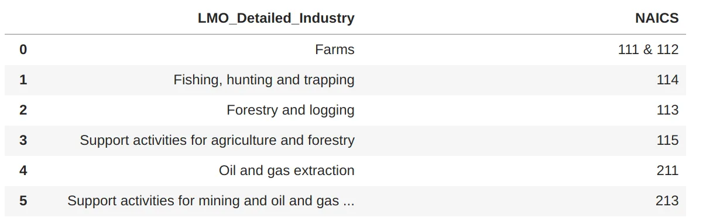

Now we will create a function to get the code when there is matching.

```python
def match_industry(df: pd.core.frame.DataFrame) -> list:
    """
    Get the matched industry code for each row
    Parameters
    ----------
    df : pd.core.frame.DataFrame
        the dataframe we want to change

    LMO: global values

    Returns
    -------
    list
        the list of code of industry in LMO dataset
    """
    global LMO
    codes = LMO['NAICS'].astype('str').str.replace('.', '').str.replace('&', ',').str.strip().str.extract('(\d+)', expand=True).values.ravel()
    match = []
    for i, row in df.iterrows():
        selected = None
        for code in codes:
            if not isinstance(row['CODE'], str) and row['CODE'] != None:
                print(row['CODE'])
            if row['CODE'][:len(str(code))] == str(code) and code not in [None, np.nan]:
                selected = code
        if selected is None:
            match.append(np.nan)
        else:
            match.append(selected)

    return match

df_4_digit['CODE'] = match_industry(df_4_digit)
print(df_4_digit['CODE'].head(20))
```

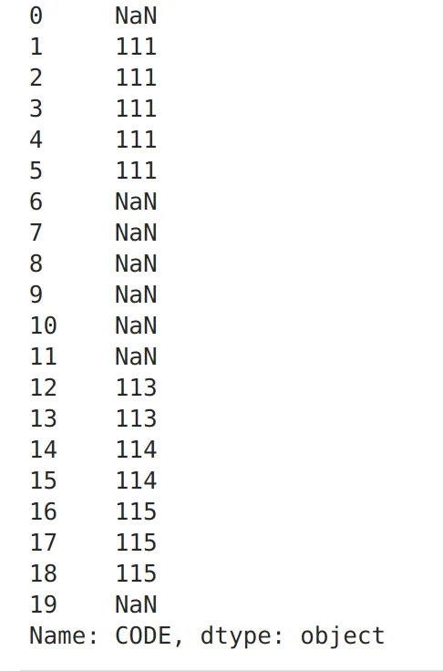

Now we will drop all rows where there is no matching.

```python
df_4_digit.drop(df_4_digit[df_4_digit['CODE'].isna()].index, inplace=True)
df_4_digit.drop(columns='NAICS', inplace=True)
df_4_digit.head()
```

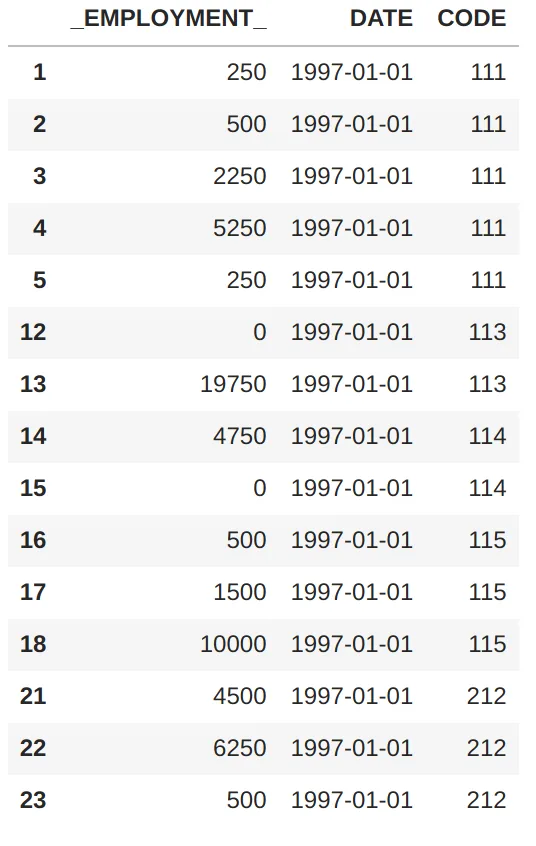

Finally, we get the correct **NAICS.**

```python
codes = LMO['NAICS'].astype('str').str.replace('.', '').str.replace('&', ',').str.strip().str.extract('(\d+)', expand=True).values
lmo_dict={row['LMO_Detailed_Industry']: codes[i] for i,row in LMO.iterrows()}

industries = []
for i, row in df_4_digit.iterrows():
    for name, codes in lmo_dict.items():
        if row['CODE'] in codes:
            industries.append(name)

df_4_digit['NAICS'] = industries
```

Let's see an overview of the result dataset.

```python
df_4_digit.groupby(['NAICS','DATE']).agg({'_EMPLOYMENT_':sum})
```

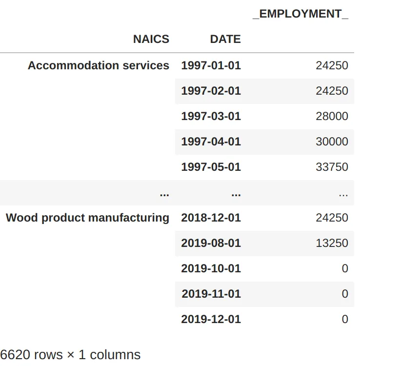

### Industries Employment
Let's see Employments in all industries.

```python
total_counts = df_4_digit.groupby('NAICS')['_EMPLOYMENT_'].sum().sort_values(ascending=False)
total_df = pd.DataFrame({'Industry':total_counts.index, 'Employments':total_counts.values})
plt.figure(figsize=(13,13))
sns.barplot(x='Employments', y='Industry', data = total_df)
```

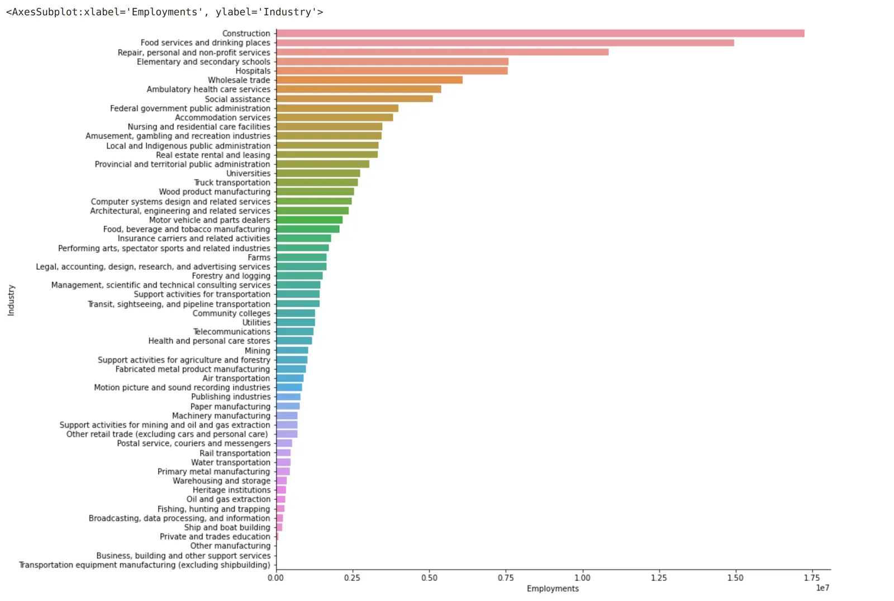

We notice that the Construction industry is the best employment industry.

### The year **with the most employment**

```python
employment_by_year = df_4_digit.groupby(df_4_digit.DATE.dt.year)['_EMPLOYMENT_'].sum().sort_values(ascending=False)
total_df = pd.DataFrame({'Year':employment_by_year.index, 'Employments':employment_by_year.values})
plt.figure(figsize=(13,7))
sns.barplot(x='Year', y='Employments', data = total_df)
```

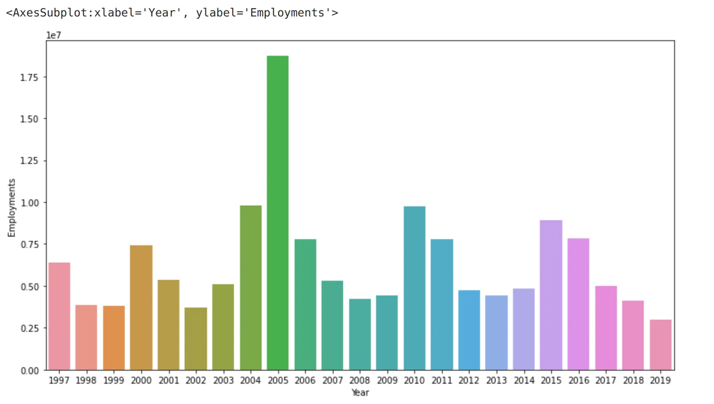

The year in which there was the most recruitment is 2005.

## Time Series
```python
data = pd.DataFrame(df_4_digit.reset_index().groupby(['NAICS', 'DATE'], as_index=False)['_EMPLOYMENT_'].sum())
data = data.pivot('DATE', 'NAICS', '_EMPLOYMENT_')
data['total'] = data.sum(axis=1)
data = data.iloc[:-3]
data.index.freq = 'MS'
data.fillna(0, inplace=True)
data.plot(subplots=True, figsize=(10, 120))
```

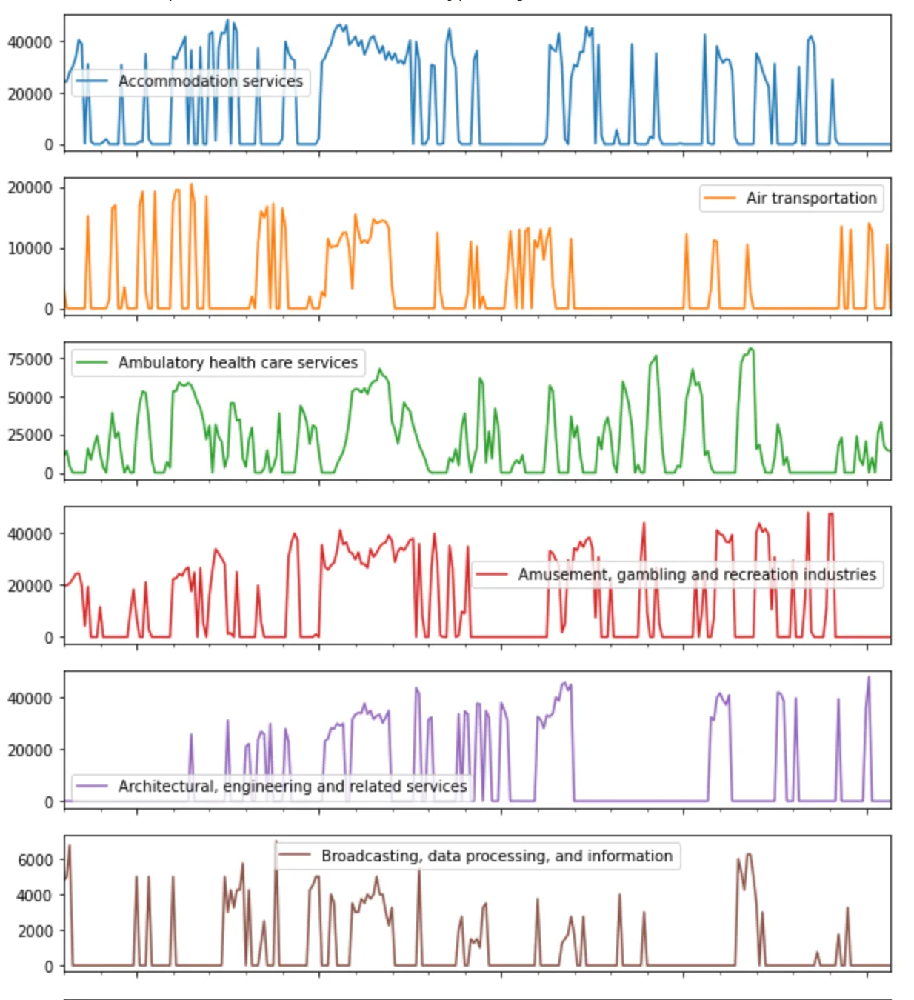

The graph is quite long so we will display the first 6 industries for the presentation. Let's focus on the total and Construction.

### Global employability **analysis**

```python
data['total'].plot(figsize=(13, 7))
```

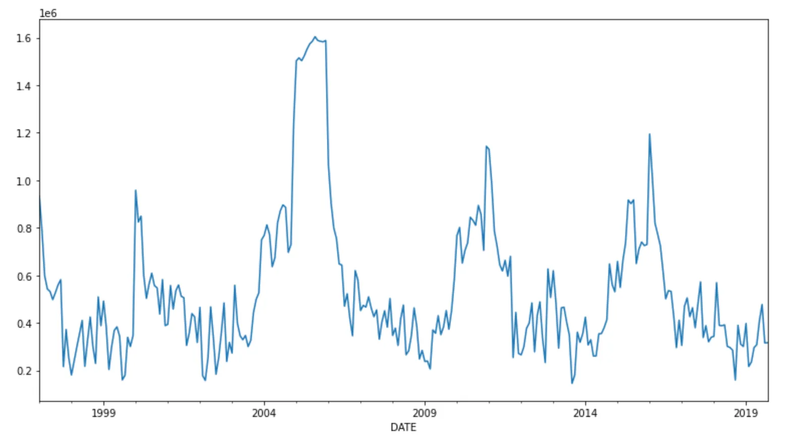

We manage to distinguish several peaks of growth approximately at an interval of 5 years which decrease then rise to reach another peak. We could say globally that the employability rate is periodic for 5 years.

### Distribution **of employment in construction**

```python
sns.boxplot(y=data['Construction'])
```

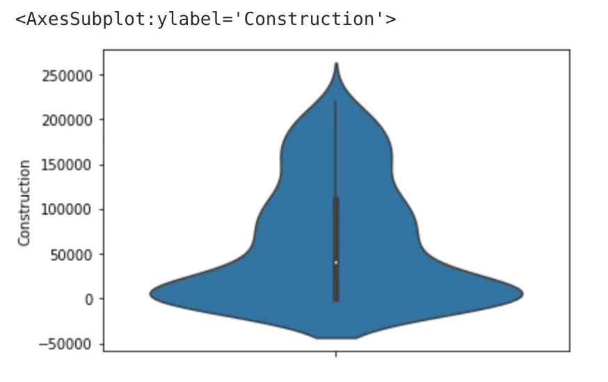

We find that the construction industry creates on average about 50,000 jobs per month. And that most 3/4 of the jobs generated per month range from 0 to 120,000 jobs per year for a peak of around 250,000 jobs.

### Comparing the top 5 industries

```python
data['Construction'].cumsum().plot(figsize=(13, 7),legend=True)
data['Food services and drinking places'].cumsum().plot(figsize=(13, 7), legend=True)
data['Repair, personal and non-profit services'].cumsum().plot(figsize=(13, 7), legend=True)
data['Elementary and secondary schools'].cumsum().plot(figsize=(13, 7),legend=True)
data['Hospitals'].cumsum().plot(figsize=(13, 7), legend=True)
```

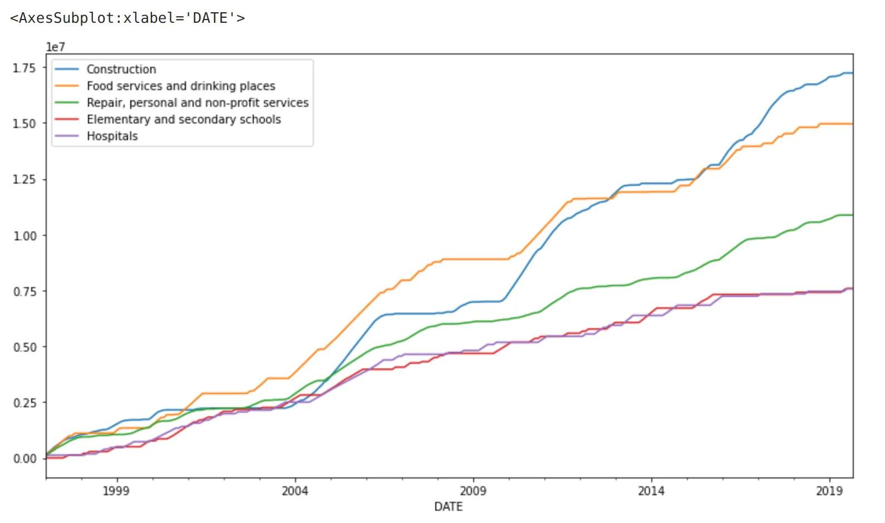

We find that in terms of the number of jobs created, the construction industry does not always have the largest. From 1997 to almost 2013 it was overtaken by the Food services and drinking places industries. After this date, it experienced a strong ascent. Compared to other industries, these two outperform them.

## Conclusion
We can conclude that the construction industry is the most job-providing, even if she not always be the greatest industry.

## Reference
The source for the data is [Real-Time Remote Access (RTRA)](https://www.statcan.gc.ca/en/microdata/rtra) data from the Labour Force Survey (LFS) by Statistics Canada.

This article was originally written by Kossonou Kouamé Maïzan Alain Serge, as part of the Data Insight [**data scientist program**](https://www.datainsightonline.com/data-scientist-program)**.**

The full code is [here](https://github.com/GreyCoderK/DataInsightOnline/blob/main/time_series.ipynb) on my GitHub.
