Time series analysis is a statistical technique which deals with time-series data. In time series data the data is in a series of particular time period or interval.

The files from the data set are all flat files that is Excel (.xlsx), and CSV (.csv) files, so we will merge and append data from several files.

For the datasets we have 15 RTRA (Real-Time Remote Access) CSV files, which has employment data by industry, 2-digit NAICS, 3-digit NAICS, and 4-digit NAICS.

First we import the necessary libraries to carry out the data analysis.

```python
import pandas as pd
import numpy as np
import glob
import matplotlib.pyplot as plt
import matplotlib.patches as patches
```

Then import all the 15 csv files.

```python
file_path = r'G:\DataScience\Data Insight\NAICS\csv_files'
all_csv_files = glob.glob(file_path + '/*.csv')

csv_list = []

for csv_file in all_csv_files:
    combined_dataframe = pd.read_csv(csv_file, index_col = None, header = 0)
    csv_list.append(combined_dataframe)

data = pd.concat(csv_list, axis = 0, ignore_index = True)
data
```

- 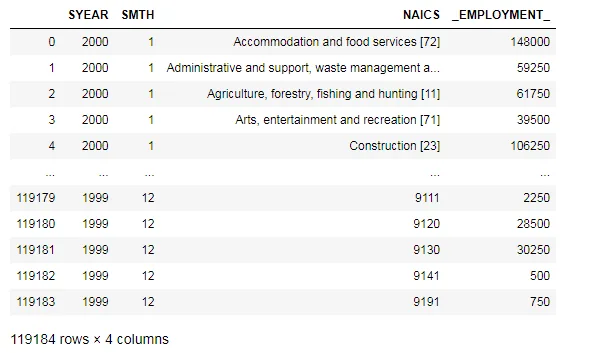

From the data we will couriers and messengers from postal services which contains 492 and save as Couriers_and_messengers.

```python
Couriers_and_messengers = data.loc[data['NAICS'].str.contains('492', na = False)]
```

Do the same for postal service that contains 491

```python
Postal_service = data.loc[data['NAICS'].str.contains('491', na = False)]
```

Now we will concat Postal service couriers and messengers.

```python
Postal_service_couriers_and_messengers = pd.concat([Postal_service, Couriers_and_messengers])

Postal_service_couriers_and_messengers
```

- 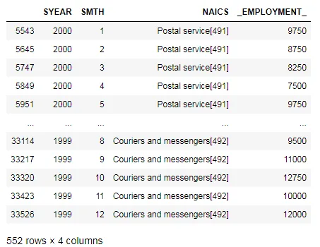

After changing all column names to *Postal service, couriers and messengers*, the dataframe is sorted by the **SYEAR and SMTH** columns. Then, the *Employment* column is segregated to add up consecutives even rows to get the sum of empoyments from both [491] and [492]. After that, the dataframe is merged back and the columns names are changed to reflect our *Data Output Template*.

```python
Postal_service_couriers_and_messengers = Postal_service_couriers_and_messengers.replace(
    'Postal service[491]', 'Postal service, couriers and messengers')

Postal_service_couriers_and_messengers = Postal_service_couriers_and_messengers.replace(
    'Couriers and messengers[492]', 'Postal service, couriers and messengers')
```

```python
df1 = Postal_service_couriers_and_messengers.sort_values(['SYEAR', 'SMTH'])
df1.head(50)
```

- 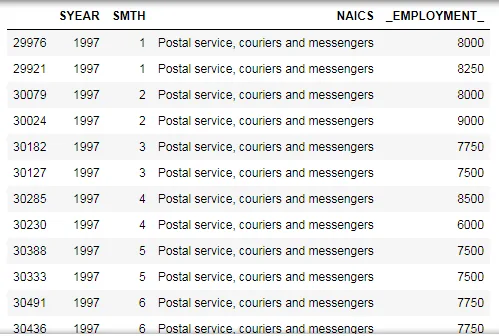

From df1 we will drop 'SYEAR', 'SMTH', 'NAICS' and save as df.

```python
df = df1.drop(['SYEAR', 'SMTH', 'NAICS'], axis = 1)
df
```

- 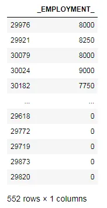

Now we add index

```python
df.index = np.arange(1,len(df)+1)
df = df.reset_index()
df
```

- 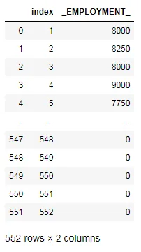

We filter odd and even.

```python
df = df.set_index('index')
df_odd = df.loc[df.index.values % 2 == 1]
df_even = df.loc[df.index.values % 2 == 0]
df_even = df_even.set_index(df_even.index.values - 1)
new = df_odd.add(df_even, fill_value = 0)
new = new.reset_index().reset_index()
```

```python
df2 = df1[np.arange(len(df)) % 2 == 0]
df2 = df2.reset_index().reset_index()
```

We merge df2 and drop the columns level_0, index_x, _EMPLOYMENT__x, index_y from Postal_service_couriers_and_messengers.

```python
df3 = pd.merge(df2, new, how = 'inner', on = 'level_0')
df3 = df3.drop(['level_0', 'index_x', '_EMPLOYMENT__x', 'index_y'], axis = 1)
df3.columns = ['SYEAR', 'SMTH', 'LMO_Detailed_Industry', 'Employment']
Postal_service_couriers_and_messengers   = df3

Postal_service_couriers_and_messengers = Postal_service_couriers_and_messengers[
    (Postal_service_couriers_and_messengers.SYEAR != 2019)]
```

Getting *Farms* from Crop production[111] & Animal production and aquaculture[112]

```python
Crop_Production = data.loc[data['NAICS'].str.contains('111', na = False)]
Animal_production_and_aquaculture = data.loc[data['NAICS'].str.contains('112', na = False)]
Farms = pd.concat([Crop_Production, Animal_production_and_aquaculture])
```

- 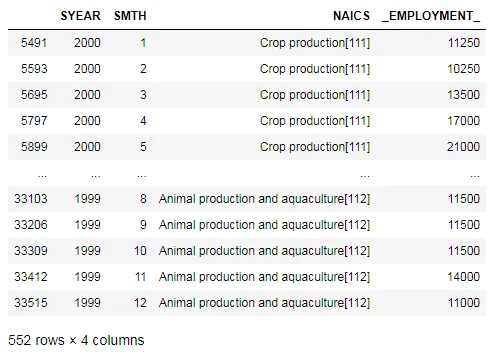

After changing all column names to *Farms*, the dataframe was sorted by the **SYEAR and SMTH** columns. Then, the *Employment* column was segregated to add up consecutives even rows to get the sum of empoyments from both [111] and [112]. After that, the dataframe was merged back and the columns names were changed to reflect *Data Output Template*.

```python
Farms = Farms.replace('Crop production[111]', 'Farms')
Farms = Farms.replace('Animal production and aquaculture[112]', 'Farms')
```

Getting *Food, beverage and tobacco manufacturing* from Food manufacturing[311] & Beverage and tobacco product manufacturing[312]

```python
Food_manufacturing = data.loc[data['NAICS'].str.contains('311', na = False)]
Beverage_and_tobacco_product_manufacturing = data.loc[data['NAICS'].str.contains('312', na = False)]
Food_beverage_and_tobacco_manufacturing = pd.concat([Food_manufacturing, Beverage_and_tobacco_product_manufacturing])
Food_beverage_and_tobacco_manufacturing
```

- 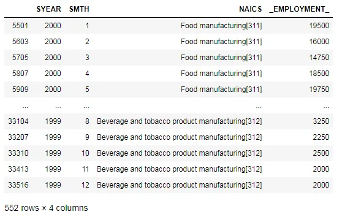

After changing all column names to *Food, beverage and tobacco manufacturing*, the dataframe was sorted by the **SYEAR and SMTH** columns. Then, the *Employment* column was segregated to add up consecutives even rows to get the sum of empoyments from both [311] and [312].

```python
Food_beverage_and_tobacco_manufacturing = Food_beverage_and_tobacco_manufacturing.replace(
    'Food manufacturing[311]', 'Food, beverage and tobacco manufacturing')
Food_beverage_and_tobacco_manufacturing = Food_beverage_and_tobacco_manufacturing.replace(
    'Beverage and tobacco product manufacturing[312]', 'Food, beverage and tobacco manufacturing')
Food_beverage_and_tobacco_manufacturing
```

- 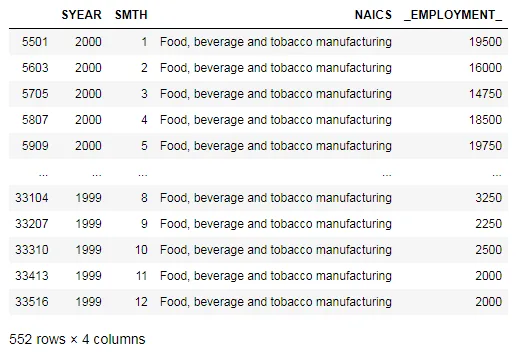

The whole process was repeated to obatin the *Business, building and other support services*. After changing all column names to *Business, building and other support services*, the dataframe was sorted by the **SYEAR and SMTH** columns. Then, the *Employment* column was segregated to add up consecutives even rows to get the sum of empoyments from both [55] and [56].

```python
MCE = data[data['NAICS'] == 'Management of companies and enterprises [55]']
MCE.SYEAR.value_counts().sort_values()
AWR = data[data['NAICS'] == 'Administrative and support, waste management and remediation services [56]']
AWR_reduced = AWR[(data['SYEAR'] != 2016) & (data['SYEAR'] != 2017) & (data['SYEAR'] != 2018) & (data['SYEAR'] != 2019)]
AWR_removed_data = AWR[(data['SYEAR'] == 2016) | (data['SYEAR'] == 2017) | (data['SYEAR'] == 2018) | (data['SYEAR'] == 2019)]

Business_building_and_other_support_services = pd.concat([MCE, AWR_reduced])
```

```python
Business_building_and_other_support_services = Business_building_and_other_support_services.replace(
    'Management of companies and enterprises [55]', 'Business, building and other support services')

Business_building_and_other_support_services = Business_building_and_other_support_services.replace(
    'Administrative and support, waste management and remediation services [56]', 'Business, building and other support services')

df1 = Business_building_and_other_support_services.sort_values(['SYEAR', 'SMTH'])
```

- 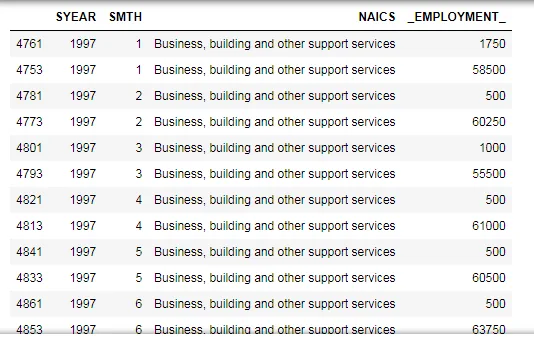

Adding removed data and renaming the coulmns

```python
Business_building_and_other_support_services = pd.concat([Business_building_and_other_support_services, AWR_removed_data])
Business_building_and_other_support_services.columns = ['SYEAR', 'SMTH', 'LMO_Detailed_Industry', 'Employment']

Business_building_and_other_support_services
```

## Data Visualisation
## 1. How employment in Construction evolved overtime?
```python
plt.figure(figsize=(18,10))
plt.bar(Construction['SYEAR'], Construction['Employment'], color = 'r')

plt.xlabel('Year', fontsize=18)
plt.xticks(rotation=40, fontsize = 14)
plt.ylabel('Construction', fontsize=18)
plt.yticks(fontsize = 14)
plt.title('Evolvement of employment in Construction overtime', fontsize=22)
red = patches.Patch(color='red', label='Construction')
plt.legend(handles=[red], prop = {'size':15})
```

- 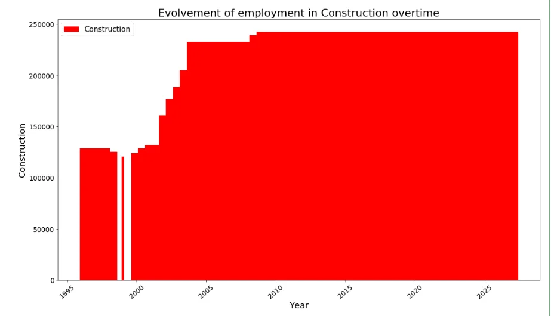

## 2. How employment in Construction evolved over time, compared to the total employment across all industries?
```python
data_output.loc[data_output['LMO_Detailed_Industry'] == 'Construction [23]'].groupby('SYEAR').sum()['Employment']
data_output.loc[data_output['LMO_Detailed_Industry'] != 'Construction [23]'].groupby('SYEAR').sum()['Employment']
```

```python
plt.figure(figsize=(14,10))
x_industries = ['1997', '1998', '1999', '2000', '2001', '2002', '2003', '2004', '2005', '2006', '2007', '2008', '2009',
                '2010', '2011', '2012', '2013', '2014', '2015', '2016', '2017', '2018']
x_indexes = np.arange(len(x_industries))
width = 0.20
y_construction = [1489750, 1424750, 1363500, 1345750, 1347250, 1401500, 1412000, 1705000, 1989000, 2097000, 2301000, 2616750,
                 2444750, 2380750, 2365750, 2383250, 2453000, 2406500, 2417750, 2536000, 2743250, 2860750]
plt.bar(x_indexes, y_construction, width = width, label = 'Construction')

y_other = [20344750, 20454250, 20863000, 22305750, 22218750, 22602000, 22585750, 22602000, 23088750, 23592500, 24161500,
           24339750, 23966000, 24443500, 24485750, 24895000, 24865750, 25087750, 25415500, 26156250, 27012500, 27220250]
plt.bar(x_indexes - width, y_other, width = width ,label = 'All other companies')

plt.legend()
plt.xlabel('Years of Construction evolvement', fontsize=18)
plt.xticks(ticks = x_indexes, labels = x_industries, fontsize = 12, rotation = 60)
plt.ylabel('Evolvement of Construction employment over time', fontsize=18)
plt.yticks(fontsize = 14)
plt.title('Evolvement of Construction compared to All other industries', fontsize=22)
```

- 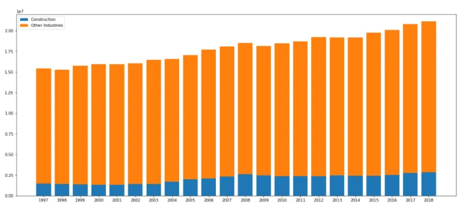

## 3. How employment in Other manufacturing evolved over time, compared to the employment across Other retail trade in terms of month and years?
```python
manufacturing_series = data_output_mixed.loc[data_output_mixed['LMO_Detailed_Industry'] == 'Other manufacturing'].groupby('SYEAR').sum()['Employment'].to_frame()
retail_series = data_output_mixed.loc[data_output_mixed['LMO_Detailed_Industry'] == 'Other retail trade(excluding cars and personal care)'].groupby('SYEAR').sum()['Employment'].to_frame()
years = pd.Series(x_industries).to_frame()
```

```python
plt.figure(figsize=(18,10))
plt.plot(years[0], manufacturing_series['Employment'], color = 'r',marker='o', linewidth=1)
plt.plot(years[0], retail_series['Employment'], color = 'b',marker='o', linewidth=1)

plt.xlabel('Year', fontsize=22)
plt.xticks(rotation=40, fontsize = 14)
plt.ylabel('Other manufacturing  VS  Other retail', fontsize=22)
plt.yticks(fontsize = 14)
plt.title('Annual evolvement of Other manufacturing  VS  Other retail', fontsize=22)
red = patches.Patch(color='red', label='Other manufacturing')
blue = patches.Patch(color='blue', label='Other retail trade(excluding cars and personal care)')
plt.legend(handles=[red, blue], prop = {'size':15})
```

- 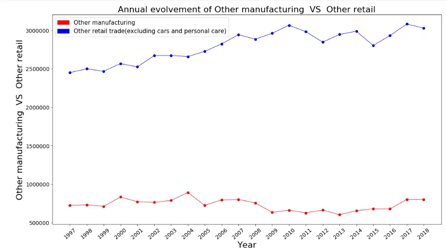

## 4. What is the monthly distribution of employment across all industries?
```python
plt.figure(figsize=(16,8))
plt.hist(data_output['Employment'], bins =40)
#plt.plot(years[0], retail_series['Employment'], color = 'b',marker='o', linewidth=1)

plt.xlabel('Employment number', fontsize=22)
plt.xticks(rotation=40, fontsize = 14)
#plt.ylabel('Other manufacturing  VS  Other retail', fontsize=22)
plt.yticks(fontsize = 0.1)
plt.title('Monthly distribution of employment across all industries', fontsize=22)
#red = patches.Patch(color='blue', label='Other manufacturing')
blue = patches.Patch(color='blue', label='Employment distribution across all industries')
plt.legend(handles=[blue], prop = {'size':15})
```

- 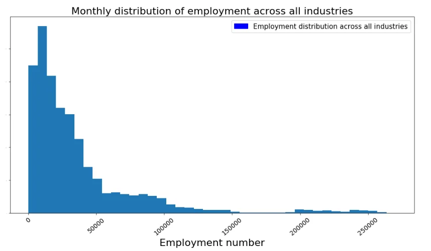

## 5. What is the monthly distribution of employment of mulitple NAICS numbers industries VS single NAICS number industries?
```python
plt.figure(figsize=(16,8))
plt.hist(data_output_mixed['Employment'], bins = 25, color = 'r')
#plt.plot(years[0], retail_series['Employment'], color = 'b',marker='o', linewidth=1)

plt.xlabel('Employment number', fontsize=22)
plt.xticks(rotation=40, fontsize = 14)
#plt.ylabel('Other manufacturing  VS  Other retail', fontsize=22)
plt.yticks(fontsize = 0.1)
plt.title('Monthly distribution of employment across mulitple NAICS numbers industries', fontsize=22)
#red = patches.Patch(color='blue', label='Other manufacturing')
blue = patches.Patch(color='red', label='Employment distribution across mulitple NAICS numbers industries')
plt.legend(handles=[blue], prop = {'size':15})
```

- 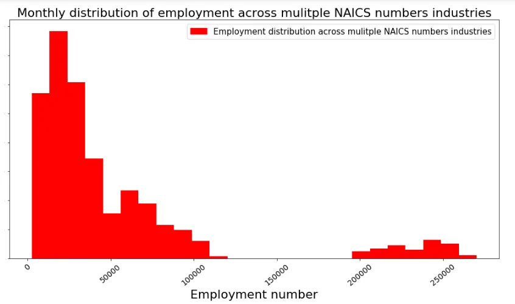

Data Source : Labour Force Survey (LFS) by the Statistics of Canada.

This project is done as a part of Data Insight program assignment.
