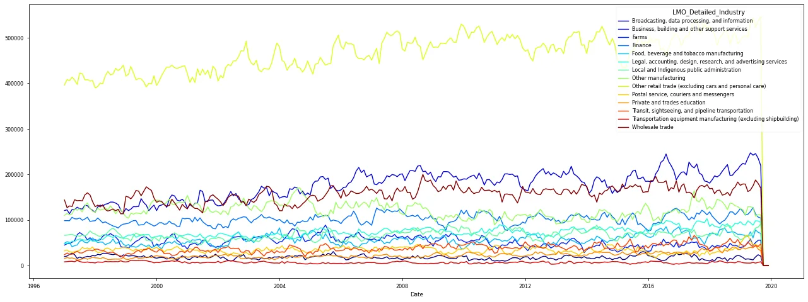
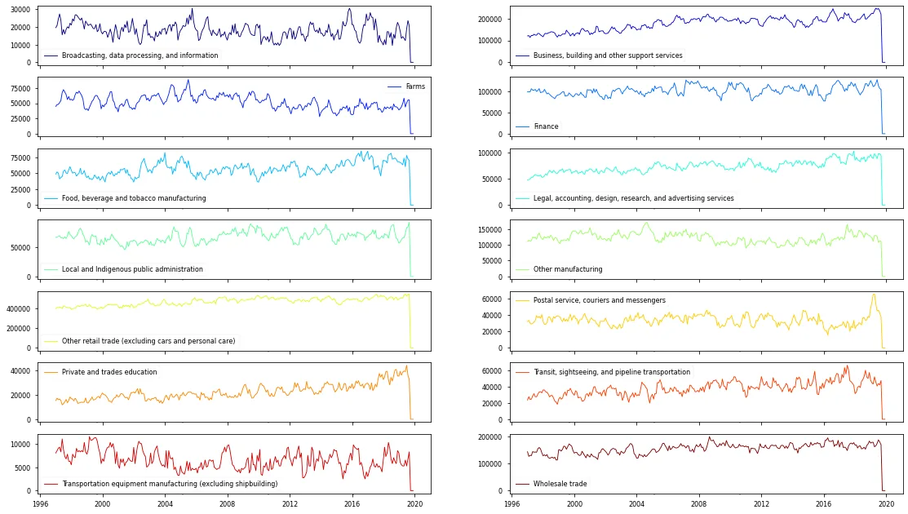
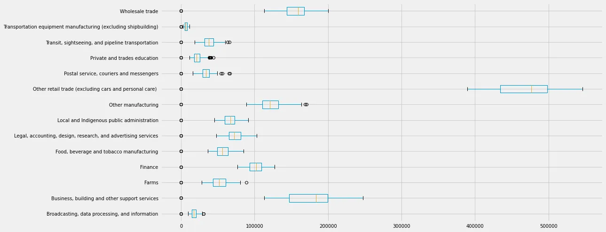
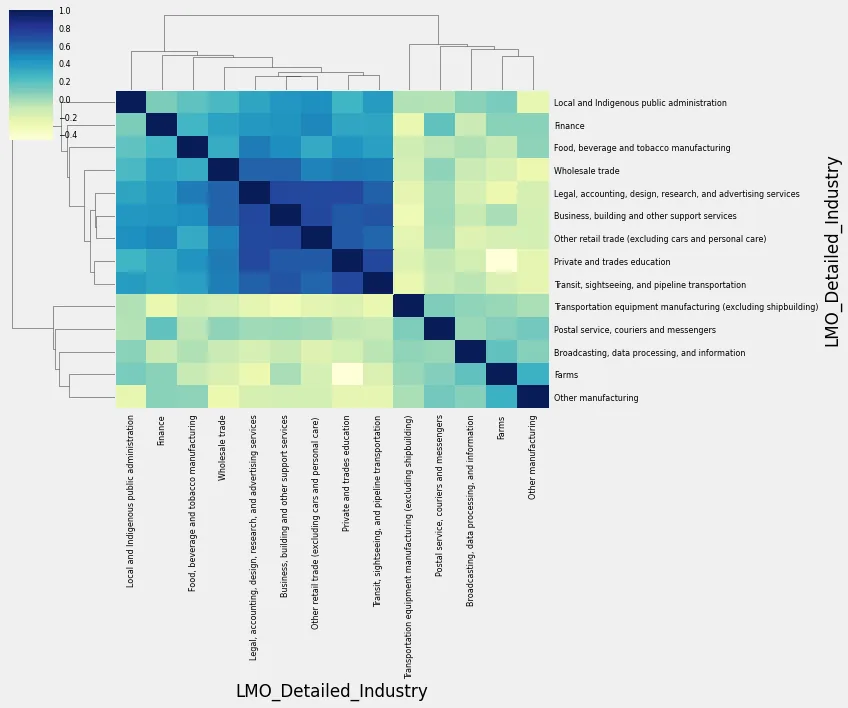
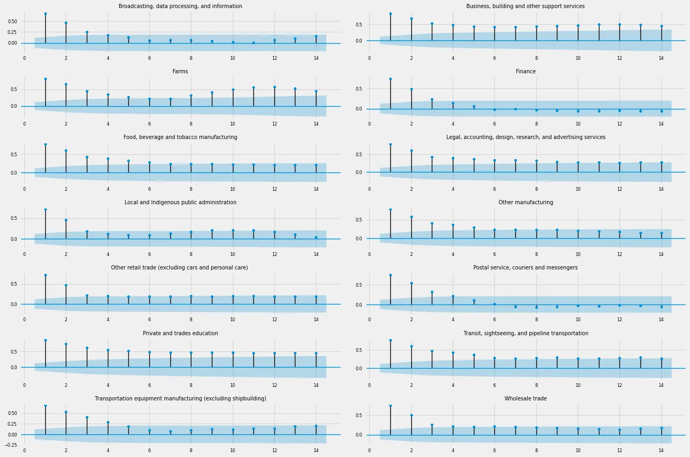
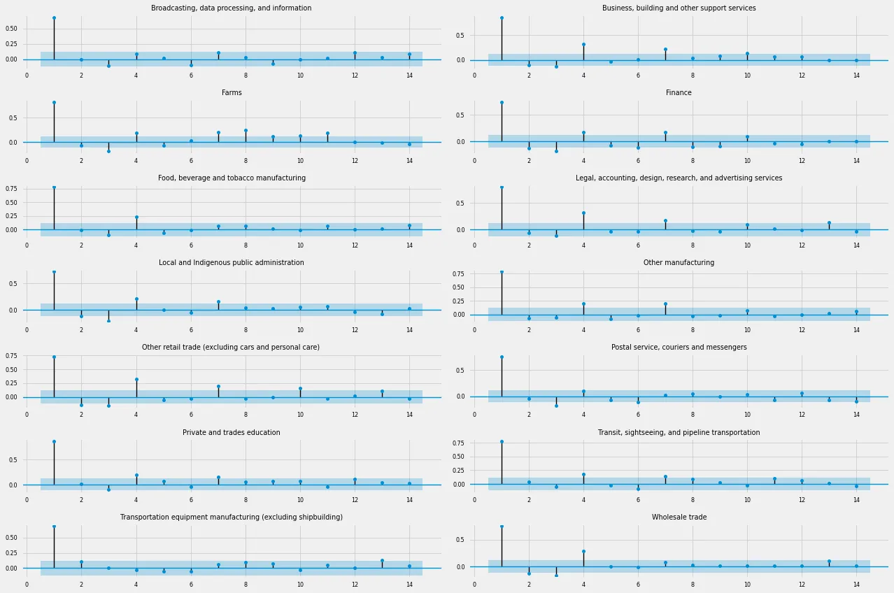

The **North American Industry Classification System(NAICS)** is an industry classification system developed by the statistical agencies of **Canada,Mexico and the United States**.NAICS is designed to provide common definitions of the industrial structure of the three countries and a commons statistical framework to facilitate the analysis of the three economies.

We analyzed the NAICS data and obtained various insights related to the industries.

## Data

A csv file was provided related to industry codes and names. Along with that there are 15 files containing employment data by industry at different level of aggregation; **2-digit NAICS, 3-digit NAICS, and 4-digit NAICS**

**The final dataframe which we will use for performing analysis contains the Survey Year, Survey Month, Industry names and the Employment numbers as features.**

## Analysis and Forecasting(Steps)

1. We plotted the time series data for all the sectors in one plot as seen above for comparative analysis.



We can see that **Other retail trade (excluding cars and personal care)** has much higher employment numbers than other industries thoughout. **Transportation equipment manufacturing (excluding shipbuilding)** has almost the lowest employment numbers of all throughout. There are some **cyclical patters** observed in all the time series at varying point of times. Also a **trend** can be hinted in case of few.

2. We then saw each of the time series plot individually.



Above we plotted each time series individually. We can get varying insights about them by observing them. For eg: there is upward trends present insome like **'Private and trades education'**, **'Business, building and other support services'** etc. whereas slight negative trends are seen in farms etc. Some time series like **'Finance','Broadcasting, data processing, and information'** shows no trend.

Industry -specific observations can also be obtained from the plots. Like, **Farms** employment remained constant till 2010 with cyclical patterns then suddenly started showing downward trend. Reason for that needs further investigation.

There are cyclical patterns are present in almost all.

3. We then checked check the distribution of values of each series using **Boxplot**.



As seen before **Other retail trade (excluding cars and personal care)** has higher range of values than all other series and T**ransportation equipment manufacturing (excluding shipbuilding)** has lowest values. There are outliers present in some time series indicating in some years employment number were high in those industries thus they hired many people at those years. This a an indication that at those years those industries performed well.

4. We checked the similarity between time series using **clustermap**.



he above clustermap shows which industries were similar in performance overall. Time series with similar characteristics are closer than those of different characteristics. For eg: **Business, building and other support services** and **Other retail trade (excluding cars and personal care)** formed closed cluster so they have characteristics.

Conversely, **Finance** and **Other manufacturing** are far away from each other in the hierarchical dendogram so they are quite dissimialr time series.

4. We tried to validate the results of clustermap standardize the mean and variance of time series over time to make them comparable and scatterplots.

5. We then plotted the **ACF and PACF plots** for each time series.

### ACF Plots



WE can take MA(4) model for **Braodcasting, data processing and information** as 4 significant lags can be seen. It's also MA(4) for **Postal, service, couriers and messengers**.For **private and trades education** the lags tails off slowly so it's hard to ascertain the lag order from here. We need to use AIC, BIC scores here. Same for **Transit,sightseing, and pipeline transportation**.

If ACF plot is high and tails off very very slowly there is a possibility that the time series is non-satationary. Eg: **Business, building and other support services** may be non-stationary.

### PACF Plots



We can found the order of AR from PACF plots from the number of significant lags. For eg: **Broadcasting, data processing and information** has AR(1) model. For **Private and trades education**, it's hard to tell as it tails off very slowly. We can use AIC, BIC scores for them to find their order. For **finance** we can take AR(1) model, as we could neglect lags at higher values as they are outside our limits and not in the first few lags. **Wholesale trade** can be another similar example of AR(1) model.

6. We checked the stationarity of each time series using **Augmented Dicky Fuller Test.**

```python
from statsmodels.tsa.stattools import adfuller
col2=[]
col3=[]
for i in col:
  print(i, 'p-value: {}'.format(adfuller(mer_f3[i])[1]))
  if adfuller(mer_f3[i])[1]>0.05:
    print('non-stationary')
    col2.append(i)
  else:
    col3.append(i)
  print('\n')
```
