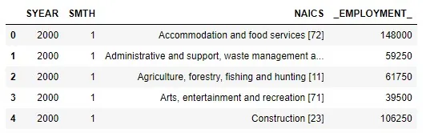
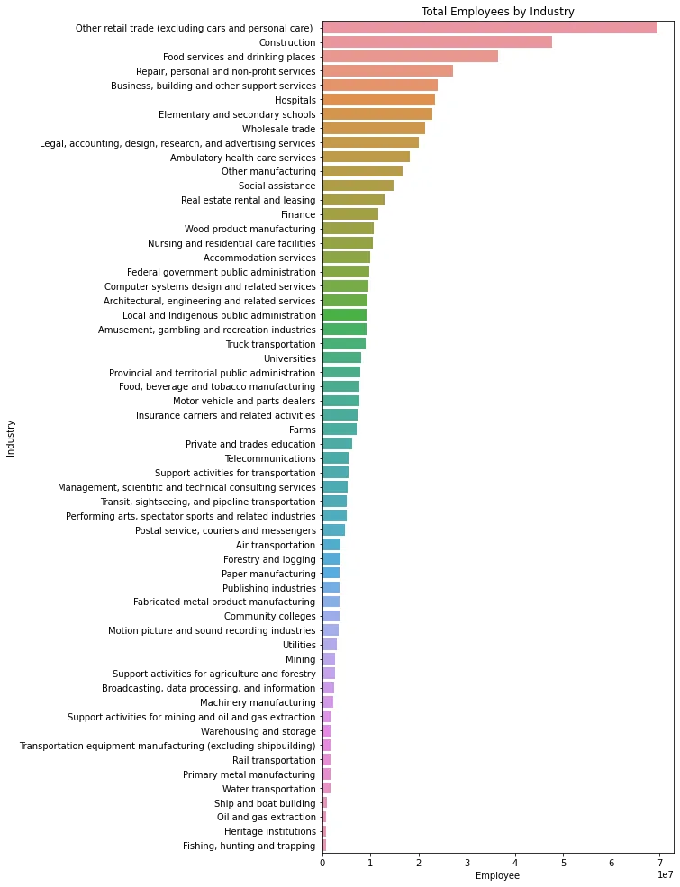
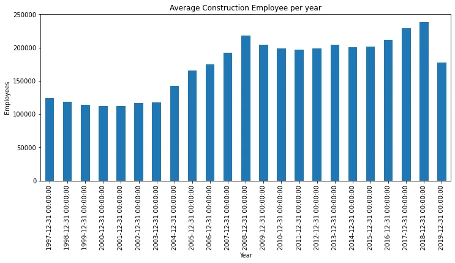
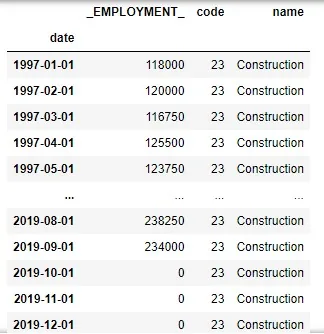
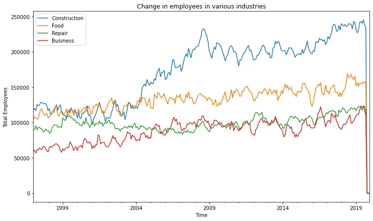
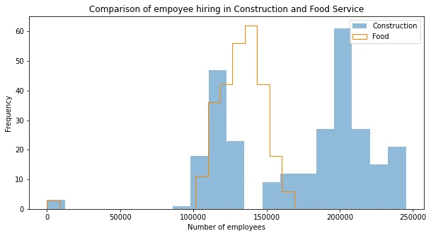

*I won't be providing all the codes for the analysis, so the content will be better understood if viewed in parallel with my notebook available* [*here*](https://github.com/Clown-Face/DataInsight/blob/5afae31ecdb01d4ba5ee2a0701a90dfcd5d734b0/Time%20Series%20Analysis.ipynb)*.*

The North American Industry Classification System (NAICS) is an industry classification system developed by the statistical agencies of Canada, Mexico, and the United States. NAICS is designed to provide common definitions of the industrial structure of the three countries and a common statistical framework to facilitate the analysis of the three economies.

In this analysis, we will look at the variation of employees among various industries. The dataset for the analysis is available [here](https://github.com/Clown-Face/DataInsight/tree/main/datasets/Time%20Series%20Analysis). The dataset consists of fifteen csv files beginning with RTRA which contains employment data by industry at different levels of aggregation: 2 digit NAICS, 3 digits NAICS and 4 digit NAICS. The column in each dataset signifies:

1. **SYEAR**: Survey Year
2. **SMTH**: Survey Month
3. **NAICS**: Industry name and associated NAICS code in the bracket
4. **_EMPLOYMENT_**: Employment

The dataset also consists of an excel file for mapping the RTRA data to the desired data. The first column of this file has a list of 59 industries that are frequently used. The second column has their NAICS definitions.

First, we'll be combining the data based on their level of aggregation i.e. by their NAICS code (2 digit, 3 digit or 4 digit)

```python
for item in file_2d:
    df = pd.read_csv(file_path+item)
    r_2 = pd.concat([r_2,df], ignore_index=True)
```

*(file_2d consists the name of all the RTRA files which has 2 digit NAICS data, refer my notebook here)*

This gives us a DataFrame:



The same is done for both 3 digit and 4 digit RTRA data.

We now need to extract the NAICS code from the 'NAICS' column in every table. We'll define a function to do so and pass the DataFrame objects to it.

```python
import re
def stol(df):
    df['code'] = df.NAICS.str.extract(r'\[(.+)\]', expand=False)
    df['code'] = df.code.str.replace('-', ',').astype('str')
    df['code'] = df.code.str.split(',')
    return df
```

Next we'll load the excel file containing the industry name and code.

```python
lookup = pd.read_excel(file_path+'LMO_Detailed_Industries_by_NAICS.xlsx')
lookup['NAICS'] = lookup['NAICS'].replace(regex='&', value=',').astype('str')
```

We'll create a dictionary which we'll use to map the NAICS code with industry name later. *(Thanks to Thiha and his blog* [*here*](https://www.datainsightonline.com/post/analysis-and-forecasting-naics?postId=95a6327f-4a21-4d87-a0ff-5da613b6ec17)*)*

Now, all it remains to extract the rows from each of the industry table (r_2, r_3 and r_4 defined earlier) which has NAICS codes contained in the lookup table and combine them together. We'll call this final_tab. For this we'll first define a function which will extract rows from industry table with NAICS code in lookup table.

```python
def check(v, df1, df2):
    i = 0
    for row in df1.itertuples():
        if v in row.code:
            df2 = pd.concat([df2, df1.loc[i]], axis =1)
        i += 1
    return df2
```

We'll then check for each row in the industry table and copy them in an empty table if it contains rows with required NAICS code.

```python
df_r2 = pd.DataFrame()
df_r3 = pd.DataFrame()
df_r4 = pd.DataFrame()
for lst in lookup['code']:
    for item in lst:
        if len(item) == 2:
            df_r2 = check(item, r_2, df_r2)
        elif len(item) == 3:
            df_r3 = check(item, r_3, df_r3)
        elif len(item) ==4:
            df_r4 = check(item, r_4, df_r4)
df_r2 = df_r2.transpose()
df_r3 = df_r3.transpose()
df_r4 = df_r4.transpose()
```

After generating the final table with all the required data, lets look for the timeseries data.

First we'll identify the total employees in each industry. As stated earlier, there is a total of 59 industry, so it'll be easier to compare them as a bar chart.

```python
grouped = final_tab.groupby('name', as_index=False)['_EMPLOYMENT_'].sum().sort_values(by='_EMPLOYMENT_', ascending=False)
```

```python
%matplotlib inline
plt.figure(figsize=(7,17))
sns.barplot(x='_EMPLOYMENT_', y='name', data=grouped)
plt.title('Total Employees by Industry')
plt.xlabel('Employee')
plt.ylabel('Industry')
plt.show()
```



It seems, construction is the industry with highest employee (excluding other unspecified industry). So, how does the total employee change every year in the industry?



Plotting a bar chart for the mean number of employees every year, it seems, the number of employees increase in the construction industry after the year 2004. The low value in the year 2019 is due to lack of data for the last few months in the year as can be seen in the table below.



Now, its clear that the number of employees increase in the construction industry. But how does it compare with other top industry?



Comparing the total employees every month for the top 4 industry i.e. Construction, Food services and drinking places, Repair, personal and non-profit services and Business, building and other support services, construction industry seems to be booming in terms of employees. Other industry shows similar ratio of increase.

Finally, when we look at the number of employees every month, we can see that the more number of employees are hired in construction industry. Around 200,000 employees were hired for more than 60 months in the period of 1997 - 2019.



This shows the preference of people to join the construction industry is higher than in other industry. So, the grown of construction industry is imperative.

I would like to thanks DataInsight for the scholarship provided and this blog has been prepared as part of the scholarship program.

Complete code for the analysis is available in my [GitHub repository](https://github.com/Clown-Face/DataInsight/blob/5afae31ecdb01d4ba5ee2a0701a90dfcd5d734b0/Time%20Series%20Analysis.ipynb).
