**Overview**

The North American Industry Classification System (NAICS) is an industry classification system developed by the statistical agencies of Canada, Mexico and the United States. NAICS is designed to provide common definitions of the industrial structure of the three countries and a common statistical framework to facilitate analysis of the three economies.

For this project i wiil explain analyses of NAICS datasets using the following files :

**NAICS 2017 – Statistics Canada**

**Raw data**

**LMO Detailed Industries by NAICS**

**Data Output Templat**e

In first step i import he Data_Output_Template file and LMO_Detailed_Industries_by_NAICS file.

**Preparing Data**

```python
%matplotlib inline
import pandas as pd
import numpy as np
import seaborn as sns
import matplotlib.pyplot as plt

## Loading LMO_Detailed_Industries_by_NAICS data
lmo_detailed_industries_data = pd.read_excel('LMO_Detailed_Industries_by_NAICS.xlsx')
lmo_detailed_industries_data.head(10)
```

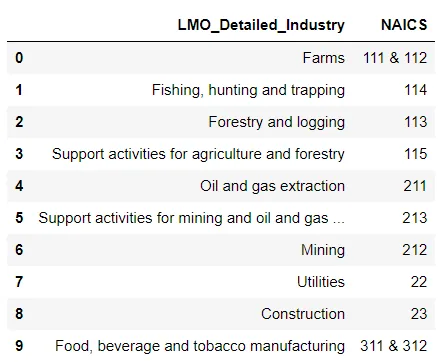

```python
#cleaning the NAICS column

lmo_detailed_industries_data['NAICS'] = lmo_detailed_industries_data['NAICS'].astype(str).str.replace(' &', ',').str.split(', ')
lmo_detailed_industries_data.head(10)
```

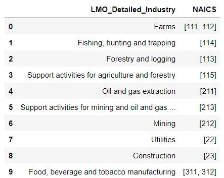

**data of 2digit NAICS industries**

Get the data of 2-digit NAICS industries from the Raw data.

```python
dataframe_2_naics = pd.read_csv('RTRA_Employ_2NAICS_97_99.csv')

list_2_naics = ['RTRA_Employ_2NAICS_00_05.csv',
                'RTRA_Employ_2NAICS_06_10.csv',
                'RTRA_Employ_2NAICS_11_15.csv',
                'RTRA_Employ_2NAICS_16_20.csv']

for file_p in list_2_naics:
    df = pd.read_csv(file_p)
    dataframe_2_naics = dataframe_2_naics.append(df, ignore_index=True)
dataframe_2_naics.head(10)
```

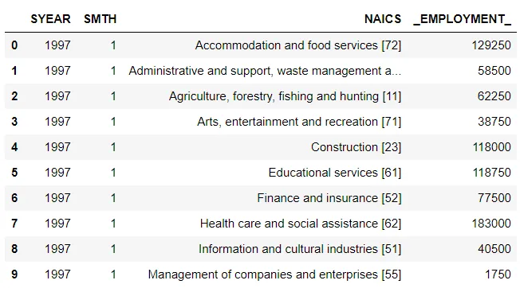

Now we nedd to separate the Industry description and NAICS code then get the NAICS_CODE

```python
def clean_col (df):
    df1=pd.DataFrame(df.NAICS.astype('str').str.split('[').to_list(), columns=['NAICS','NAICS_CODE'])
    df1['NAICS_CODE']= df1.NAICS_CODE.astype('str').str.strip(']').str.replace('-',',')
    df['NAICS']=df1['NAICS']
    df['NAICS_CODE']= df1['NAICS_CODE']
    return df

clean_col(dataframe_2_naics)
dataframe_2_naics.head(10)
```

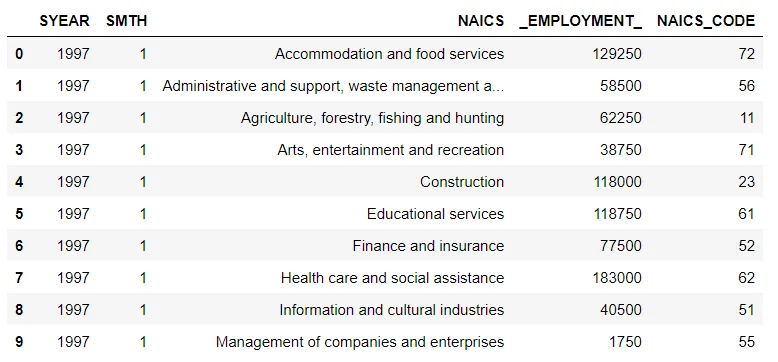

Get the 'LMO_Detailed_Industry' values for a NAICS code in RTRA files

```python
def add_lmo_industry(df):
    lmo_df = lmo_detailed_industries_data.apply(lambda y: y["LMO_Detailed_Industry"]
                                                if (df['NAICS_CODE'] in y['NAICS'])
                                                else np.nan, axis=1)
    lmo_df = lmo_df.dropna(how='all', axis=0)
    if lmo_df.empty:
        lmo_df = np.nan
    else:
        lmo_df = lmo_df.to_string(index=False)
    return lmo_df
```

```python
dataframe_2_naics["LMO_Detailed_Industry"] = dataframe_2_naics.apply(add_lmo_industry, axis=1)
dataframe_2_naics.head(10)
```

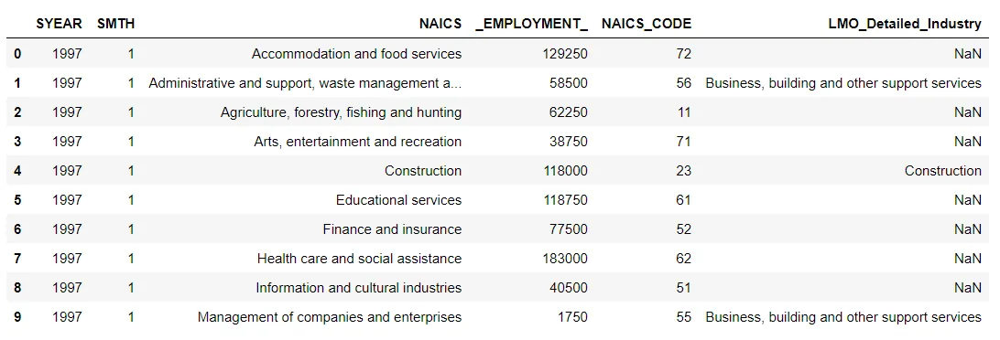

```python
#applying the fct on our df
df1 = dataframe_2_naics.dropna()
df1
```

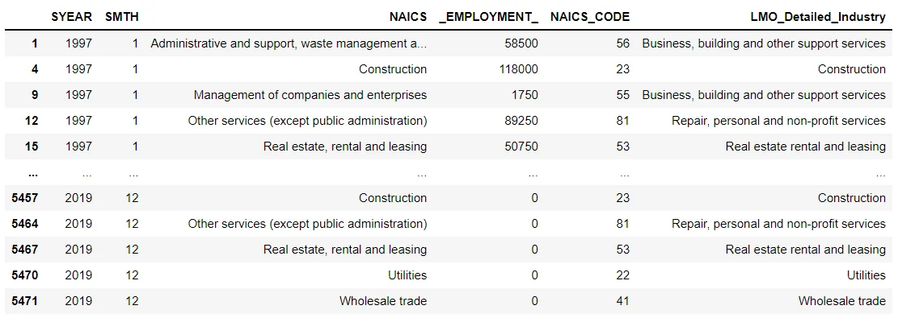

**3-Digit NAICS Industry data:**

we will process the same step of digit2 to create digit3

```python
dataframe_3_naics = pd.read_csv('RTRA_Employ_3NAICS_97_99.csv')

list_3_naics = ['RTRA_Employ_3NAICS_00_05.csv',
                'RTRA_Employ_3NAICS_06_10.csv',
                'RTRA_Employ_3NAICS_11_15.csv',
                'RTRA_Employ_3NAICS_16_20.csv'
                ]

for file_p in list_3_naics:
    df = pd.read_csv(file_p)
    dataframe_3_naics = dataframe_3_naics.append(df, ignore_index=True)

# Separate the Industry description and NAICS code then get the NAICS_CODE
df1 = pd.DataFrame(dataframe_3_naics['NAICS'].str.split('[').tolist(), columns=['NAICS','NAICS_CODE'])
df1['NAICS_CODE']= df1.NAICS_CODE.str.strip(']').str.replace('-',',')
dataframe_3_naics['NAICS']=df1['NAICS']
dataframe_3_naics['NAICS_CODE']= df1['NAICS_CODE']
dataframe_3_naics.head()

# Function to get the 'LMO_Detailed_Industry' values for a NAICS code in RTRA files
def add_lmo_industry(df):
    lmo_df = lmo_detailed_industries_data.apply(lambda y: y["LMO_Detailed_Industry"]
                                                if (df['NAICS_CODE'] in y['NAICS'])
                                                else np.nan, axis=1)
    lmo_df = lmo_df.dropna(how='all', axis=0)
    if lmo_df.empty:
        lmo_df = np.nan
    else:
        lmo_df = lmo_df.to_string(index=False)
    return lmo_df

dataframe_3_naics["LMO_Detailed_Industry"] = dataframe_3_naics.apply(add_lmo_industry, axis=1)
df2= dataframe_3_naics.dropna()
df2
```

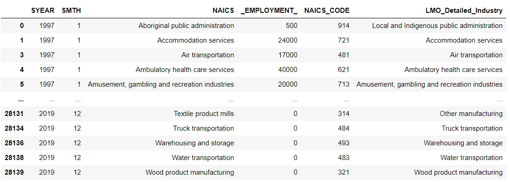

**4-Digit NAICS Industry data:**

```python
dataframe_4_naics = pd.read_csv('RTRA_Employ_4NAICS_97_99.csv')

file_4_naics = ['RTRA_Employ_4NAICS_00_05.csv',
                'RTRA_Employ_4NAICS_06_10.csv',
                'RTRA_Employ_4NAICS_11_15.csv',
                'RTRA_Employ_4NAICS_16_20.csv']

for file_p in file_4_naics:
    df = pd.read_csv(file_p)
    dataframe_4_naics = dataframe_4_naics.append(df, ignore_index=True)

# Separate the Industry description and NAICS code then get the NAICS_CODE

dataframe_4_naics['NAICS']=df1['NAICS']
dataframe_4_naics['NAICS_CODE']= df1['NAICS_CODE']

# Function to get the 'LMO_Detailed_Industry' values for a NAICS code in RTRA files
def add_lmo_industry(df):
    lmo_df = lmo_detailed_industries_data.apply(lambda y: y["LMO_Detailed_Industry"]
                                                if (df['NAICS_CODE'] in y['NAICS'])
                                                else np.nan, axis=1)
    lmo_df = lmo_df.dropna(how='all', axis=0)
    if lmo_df.empty:
        lmo_df = np.nan
    else:
        lmo_df = lmo_df.to_string(index=False)
    return lmo_df

dataframe_4_naics["LMO_Detailed_Industry"] = dataframe_4_naics.apply(add_lmo_industry, axis=1)
df3= dataframe_4_naics.dropna()
df3
```

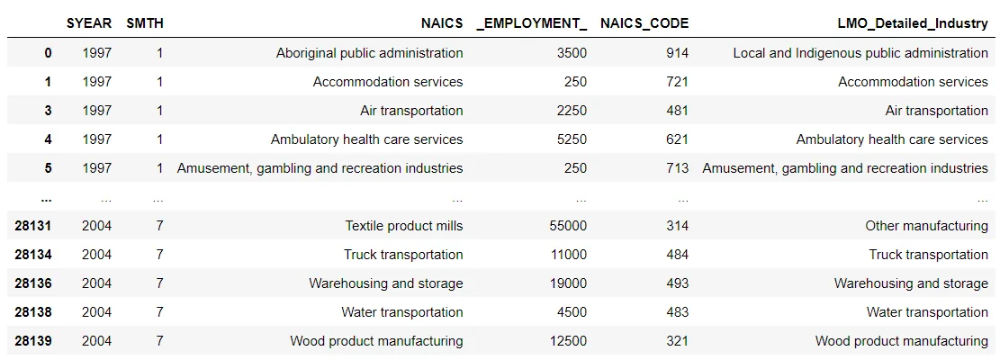

Now we need to creata a single from all the 2,3 and 4 digits NAICS and drop rows with NaN values

```python
df=df1.append(df2)
DF_NAICS=df.append(df3)

naics_employment_detail_df = DF_NAICS.dropna(axis=0, how='any')
naics_employment_detail_df
```

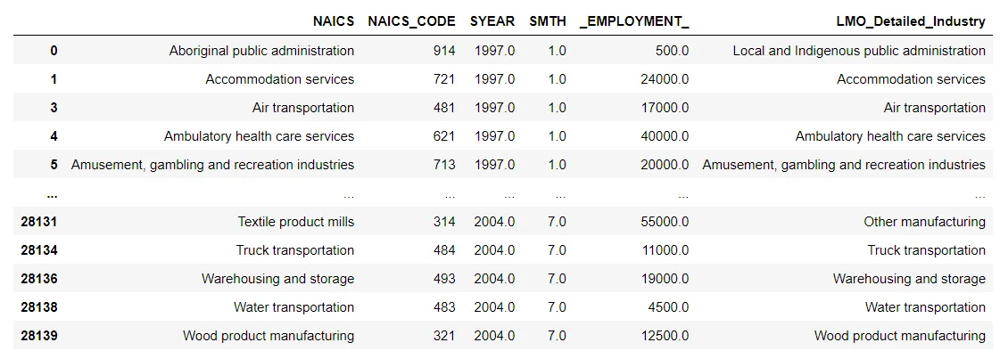

We are required to perform our analysis from 1997 to 2018, so we need to delete the 2019 rows

```python
DF_NAICS_97_18 = DF_NAICS[~((DF_NAICS.index).astype('str')>'2019')]
DF_NAICS_97_18
```

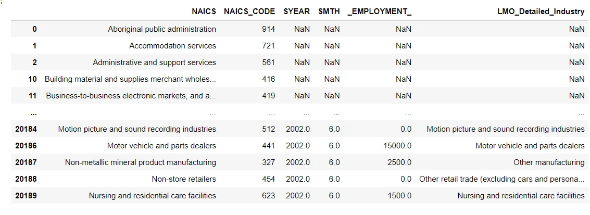

Now we will read the Data_Output_Template file

```python
#read the flat files as data
data_output= pd.read_excel('Data_Output_Template.xlsx')
data_output
```

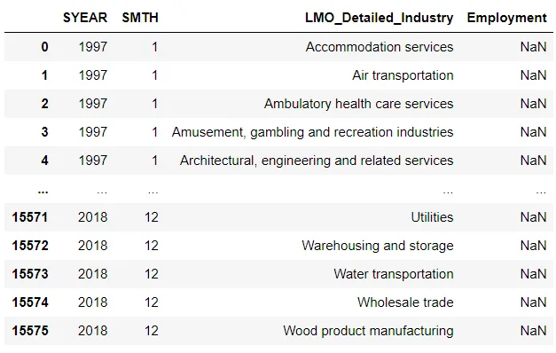

## Exploratory Data Analysis
The following is the employment summary for the exploratory analysis of the data calculated by industry.

```python
# create a dataframe with industry wise employment summary
industry_wise_summary = data_output.groupby(["LMO_Detailed_Industry"])["Employment"].sum()
industry_wise_summary.head()
```

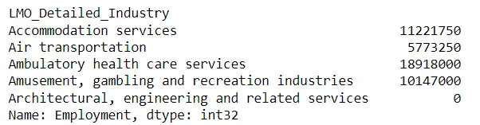

```python
# Plotting employment wise top 10 Industries.
industry_wise_summary.sort_values(ascending=False)[:10].plot(kind='barh')
plt.xlabel("Employment")
plt.title("Employment wise Top 10 Industries Bar plot")
```

Plotting employment wise top 10 industries using bar plot.

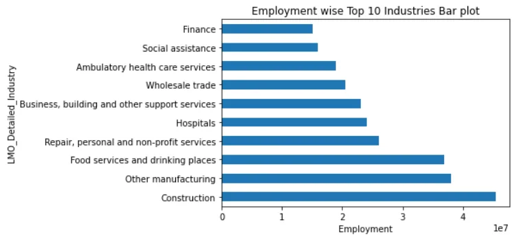

```python
# Create a dataframe with Year and Month as index
month_wise_employment_summary = data_output.copy()
month_wise_employment_summary['month_idx'] = pd.to_datetime([f'{y}-{m}' for y, m in zip(month_wise_employment_summary.SYEAR, month_wise_employment_summary.SMTH)])
month_wise_employment_summary.index = month_wise_employment_summary["month_idx"]
month_wise_employment_summary.head()
```

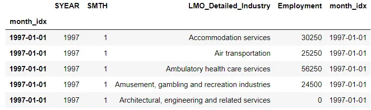

**Time series employment in the composition of the construction industry, the main factor in employment**

Let's trace the time series data of employment changes in the construction industry over time.

```python
construction_data = month_wise_employment_summary[month_wise_employment_summary["LMO_Detailed_Industry"] == "Construction"]

construction_data.plot(y="Employment", title="Employment in Constction evolved overtime", figsize=(20,10))
plt.xlabel("Month and Year")
plt.ylabel("Employment")
```

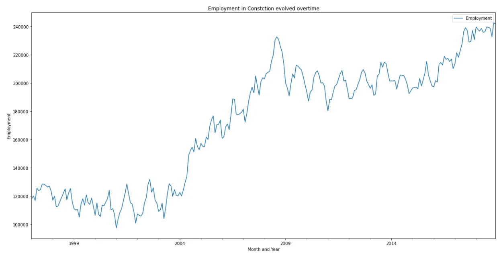

we can conclude from this curve that construction employment increased rapidly from 2004 to 2008.

**Contribution of the sub-sector to construction employment**

in this sectionWe will verify the annual and overall contribution of the subsectors.

```python
construction_subsector_data = dataframe_3_naics[dataframe_3_naics["NAICS_CODE"].str.match(r'23[0-9]') == True]
construction_subsector_summary = construction_subsector_data.groupby(["SYEAR", "NAICS"])["_EMPLOYMENT_"].sum()
construction_subsector_summary = construction_subsector_summary.reset_index()

plt.figure(figsize=(50,20))
sns.barplot(x="SYEAR", y="_EMPLOYMENT_", hue="NAICS", data=construction_subsector_summary)
plt.xlabel("Year")
plt.ylabel("Employment")
plt.title("Year wise employment contribution by Subsector of Construction Sector")
plt.show()
```

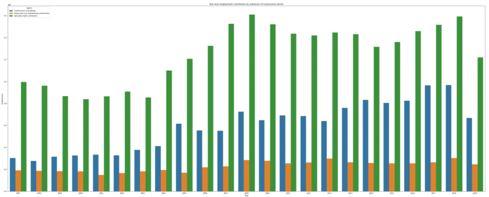

```python
# Subsectors contibution towards the Construction Industry Sector
construction_subsector = construction_subsector_data.groupby(["NAICS"])["_EMPLOYMENT_"].sum()
construction_subsector = construction_subsector.reset_index()

plt.figure(figsize=(15,5))
sns.barplot(x="NAICS", y="_EMPLOYMENT_", data=construction_subsector)
plt.ylabel("Employment")
plt.title("Employment contribution by Subsector of Construction Sector")
plt.show()
```

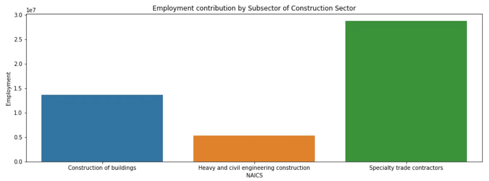

**Time Series Employment in Health and personal care Sector**

```python
Health_sector_data = month_wise_employment_summary[month_wise_employment_summary["LMO_Detailed_Industry"] == "Health and personal care stores"]
Health_sector_data.plot(y="Employment", title="Health and personal care Sector evolved overtime", figsize=(20,10))
plt.xlabel("Month and Year")
plt.ylabel("Employment")
```

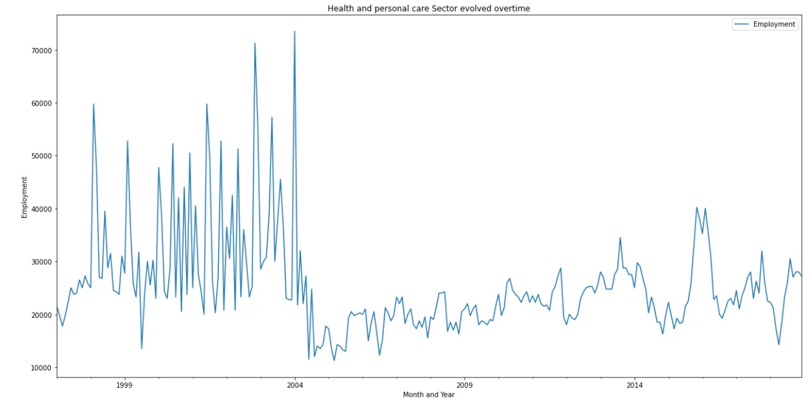

**Time Series Employment in telecommunication Sector**

```python
telecom_sector_data = month_wise_employment_summary[month_wise_employment_summary["LMO_Detailed_Industry"] == "Telecommunications"]

telecom_sector_data.plot(y="Employment", title="Telecommunications Sector evolved overtime", figsize=(20,10))
plt.xlabel("Month and Year")
plt.ylabel("Employment")
```

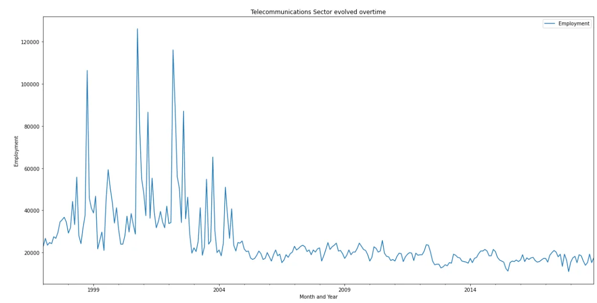

```python
# Subsectors contibution towards the employment of telecommunication services
telecom_subsector_data = dataframe_3_naics[dataframe_3_naics["NAICS_CODE"].str.match(r'81[0-9]') == True]
telecom_subsector_summary = telecom_subsector_data.groupby(["NAICS"])["_EMPLOYMENT_"].sum()
telecom_subsector_summary = telecom_subsector_summary.reset_index()

plt.figure(figsize=(15,5))
sns.barplot(x="NAICS", y="_EMPLOYMENT_", data=telecom_subsector_summary)
plt.ylabel("Employment")
plt.title("Employment contribution by Telecommunications Sector Sector")
plt.show()
```

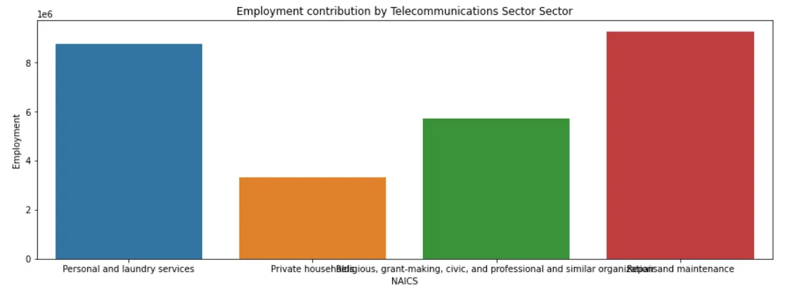

Thank you for your time

For more details on this project checkout my [Github](https://github.com/rabebbenothmen/Data-Insight2021/tree/main/Assignments/Time%20Series%20Analysis%20of%20NAICS)
