In this Blog we will talk about Analysis of NAICS

so let's talk about our data:

The North American Industry Classification System (NAICS) represents a continuing cooperative effort among Statistics Canada, Mexico's Instituto Nacional de Estadística y Geografía (INEGI), and the Economic Classification Policy Committee (ECPC) of the United States.

NAICS is designed to provide common definitions of the industrial structure of the three countries and a common statistical framework to facilitate the analysis of the three economies. The dataset contains total employments from January 1997 to September 2019. I made an analysis for the 59 industries and a prediction until December 2021.

The dataset contains employment data by industry at different levels of aggregation: 2 digit NAICS, 3 digits NAICS and 4 digit NAICS. The column in each dataset signifies:

1. **SYEAR**: Survey Year
2. **SMTH**: Survey Month
3. **NAICS**: Industry name and associated NAICS code in the bracket
4. **_EMPLOYMENT_**: Employment

The dataset also consists of an excel file for mapping the data to the desired data. it consists of two columns. The first column of this file has a list of 59 industries that are frequently used. The second column has their NAICS definitions.

At the first we will import the Libraries that we will use in the project

```python
import pandas as pd
import numpy as np
import matplotlib.pyplot as plt
%matplotlib inline
import seaborn as sns
```

**Reading the data**

as we see the 2 digit NAICS consists of 5 CSV files so we need to load all of them in one Data Frame to read them and we will do the same for 3 digit NAICS & 4digit NAICS

```python
data_2d=['/content/RTRA_Employ_2NAICS_97_99.csv','/content/RTRA_Employ_2NAICS_00_05.csv','/content/RTRA_Employ_2NAICS_06_10.csv',
      '/content/RTRA_Employ_2NAICS_11_15.csv','/content/RTRA_Employ_2NAICS_16_20.csv']
```

```python
d2_dataframe=pd.DataFrame()
```

then we need to combine all files in one csv file to make it easy to read and analysis

```python
for i in data_2d:
    d2 = pd.read_csv(i)
    d2_dataframe = pd.concat([d2_dataframe,d2], ignore_index=True)
```

now the data is ready to explore

```python
d2_dataframe.head()
```

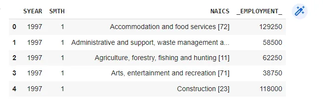

now we want to check if data contain null values or not

```python
d2_dataframe.info()
d2_dataframe.shape
```

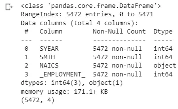

as we shown there is no null value in our data.

**create code column**

as we see in the data the **NAICS** column is a composition of the Industry name and associated NAICS code in the bracket so We need to create a new column with only code extracted from the NAICS column

```python
def extractCode(df):
    df['code'] = df.NAICS.str.extract(r'\[(.+)\]', expand=False)
    df['code'] = df.code.str.replace('-', ',').astype('str')
    df['code'] = df.code.str.split(',')
    return df
```

this function aim to split the NAICS column to two column Name and code so I take the code in new column his name is code then i need to apply this function on D2 & D3 Data

```python
d2_dataframe = extractCode(d2_dataframe)
d2_dataframe.head()
```

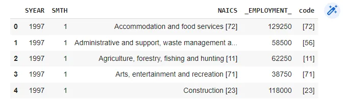

```python
d3_dataframe = extractCode(d3_dataframe)
d3_dataframe.head()
```

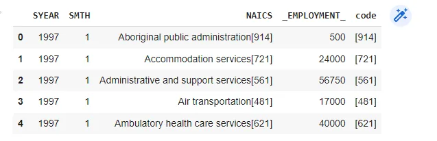

**Get Date**

now I need to get the Date from 'SYEAR, SMTH' columns so I use Get Date function

```python
def Getdate(df):
  df['date'] = pd.to_datetime(df.SYEAR.astype('str') + df.SMTH.astype('str'), format='%Y%m')
  df= df.sort_values('date')
  return df
```

then I apply it to all data

-2D data

```python
d2_dataframe = Getdate(d2_dataframe)
d2_dataframe.head()
```

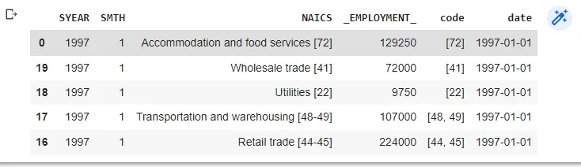

and do the same for 3D &4D data

now I want to explore LMO_Detailed_Industries_by_NAICS file

```python
d=pd.read_excel('/content/LMO_Detailed_Industries_by_NAICS.xlsx')
d.head()
```

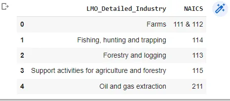

we need to explore that if null values exist or not

```python
d.info()
d.shape
```

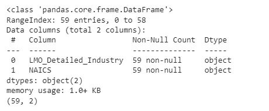

now we need to collect each value to the industry, and match each of the industries mentioned depends on the number of digits.

```python
industry_dic = {
    'two_dic' : {},
    'three_dic' : {},
    'four_dic' : {}
}
```

this is the empty dictionary contain 3 empty dictionaries

```python
code = []
for name, numbers in zip(d['LMO_Detailed_Industry'], d['NAICS']):
    num_list = numbers.split(',')
    num_list = [x.strip() for x in num_list]
    code.append(num_list)
    for i in range(len(num_list)):
        if len(num_list[i]) == 2:
            industry_dic['two_dic'][num_list[i]] = name
        elif len(num_list[i]) == 3:
            industry_dic['three_dic'][num_list[i]] = name
        elif len(num_list[i]) == 4:
            industry_dic['four_dic'][num_list[i]] = name
d['code'] = code
```

now we need to take required rows from the industry tables

```python
df_2d = pd.DataFrame()
df_3d = pd.DataFrame()
df_4d = pd.DataFrame()
for l in d['code']:
    for i in l:
        if len(i) == 2:
            df_2d = check(i, d2_dataframe, df_2d)
        elif len(i) == 3:
            df_3d = check(i, d3_dataframe, df_3d)
        elif len(i) ==4:
            df_4d = check(i, d4_dataframe, df_4d)
df_2d = df_2d.transpose()
df_3d = df_3d.transpose()
df_4d = df_4d.transpose()
```

**Get industry name by using code**

now I need to get the name of industry depend on the code

```python
def GetName(df):
    df['code'] = df['code'].map(lambda x:x[0])
    x = df['code'].iloc[-1]
    if len(x) == 2:
        df['name'] = df['code'].map(industry_dic['two_dic'])
    elif len(x) == 3:
        df['name'] = df['code'].map(industry_dic['three_dic'])
    return df
```

then I apply this function on the data I have

```python
df_4d.head()
```

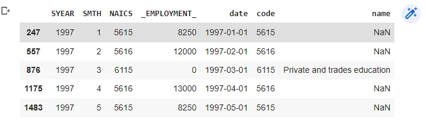

now I want to drop unnecessary columns from the data

```python
df_2d.drop(columns = ['SYEAR','SMTH', 'NAICS'], inplace = True)
```

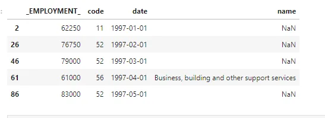

Now I want to Know Which industry has the biggest number of employment in each category of data ?

```python
sns.barplot(x='_EMPLOYMENT_', y='name', data=df_2d,palette = "Blues")plt.title('Two digit Employees by Industry')plt.xlabel('Employee')plt.ylabel('Industry')plt.show()
```

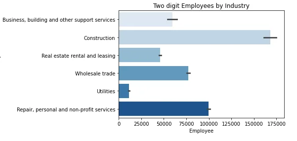

as shown in the graph above the biggest number of employment in 2D data is construction

```python
plt.figure(figsize=(7,17))sns.barplot(x='_EMPLOYMENT_', y='name', data=df_3d,palette = "Reds")plt.title('Two digit Employees by Industry')plt.xlabel('Employee')plt.ylabel('Industry')plt.show()
```

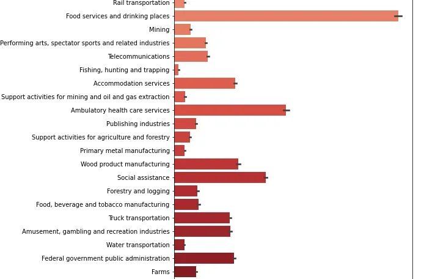

as shown in the graph above the biggest number of employment in 3D data is Food services

```python
sns.barplot(x='_EMPLOYMENT_', y='name', data=df_4d,palette = "Reds")plt.title('Two digit Employees by Industry')plt.xlabel('Employee')plt.ylabel('Industry')plt.show()
```

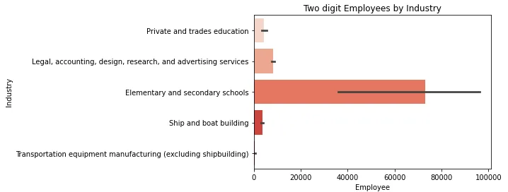

as shown in the graph above the biggest number of employment in 4D data is Elementary and secondary school

Now I will merge all categories of data in one data frame

```python
merge_data = pd.concat([df_2d, df_3d, df_4d])merge_data.set_index('date', inplace=True)
```

then I need to drop NaN values from our data

```python
merge_data = merge_data.dropna(axis=0, how='any')
```

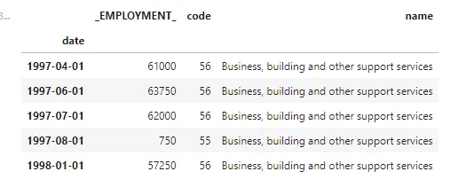

```python
now I want to Know Top 10 Employment Industries
```

```python
industry_summary = merge_data.groupby(["name"])["Employment"].sum()industry_summary.head()
```

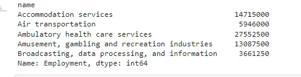

```python
industry_summary.sort_values(ascending=False)[:10].plot(kind='barh')plt.xlabel("Employment")plt.title(" Top 10 Industries Bar plot")
```

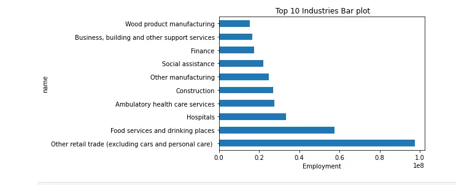

Now I want to Compare the total employees every month in food &Hospitals

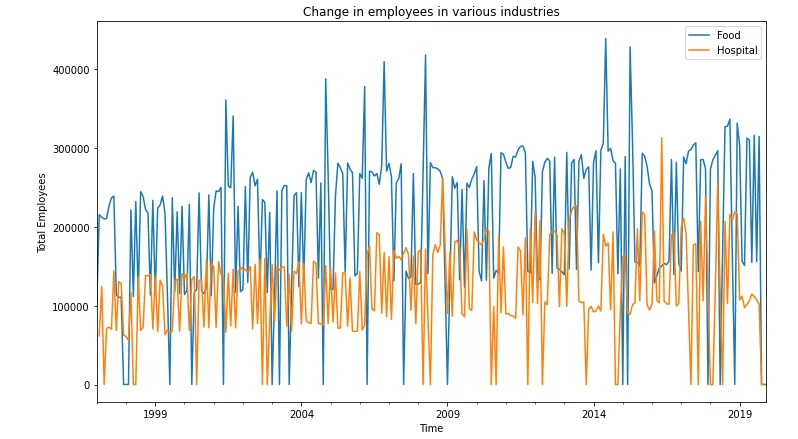

finally The NAICS data is very wonderful data to explore you as a Data analyst. I hope you enjoyed reading the article and that it helped you even a little

You can get the code and the data at :

<https://github.com/alaa-mohamed98/NACIS-time_series_analysis>

resources :

thanks for Thiha Naung blog it help me more to understand the data more
