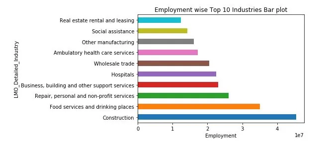
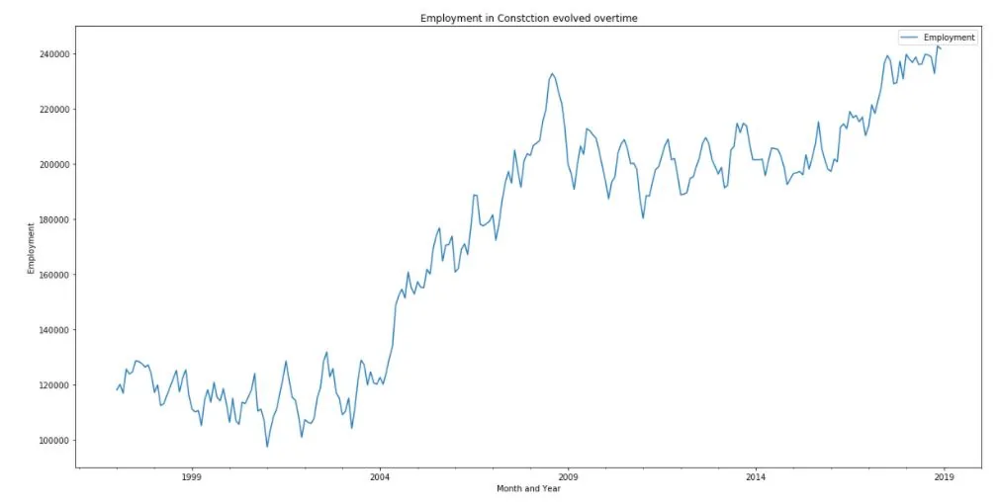
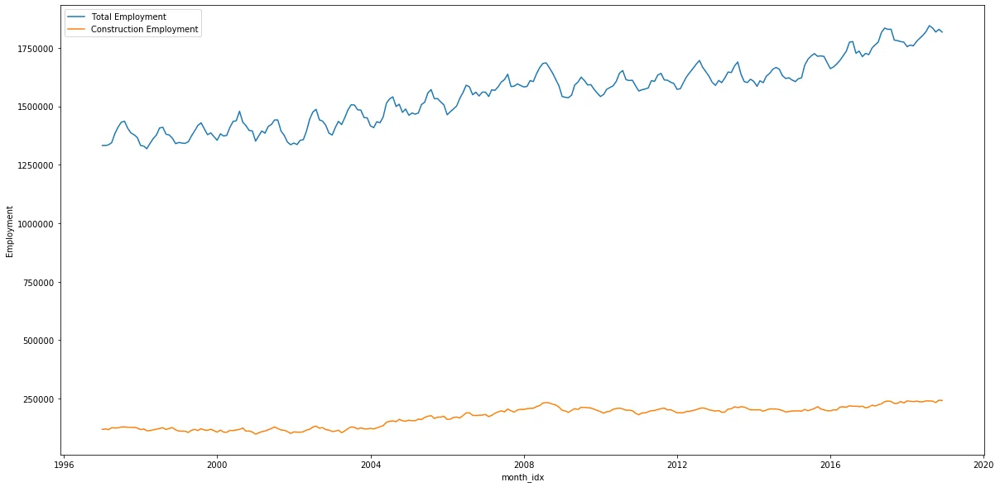
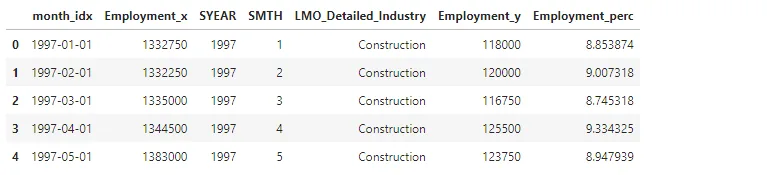
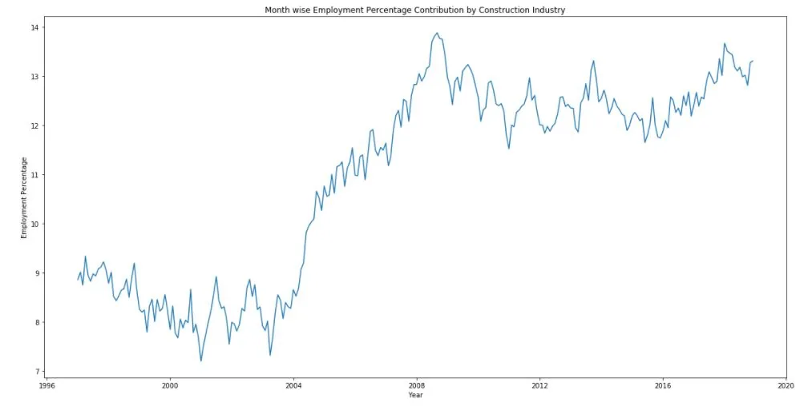
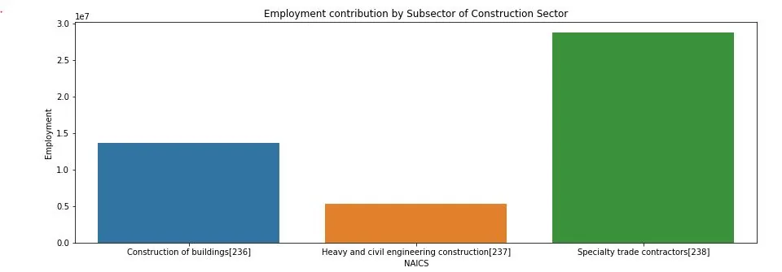
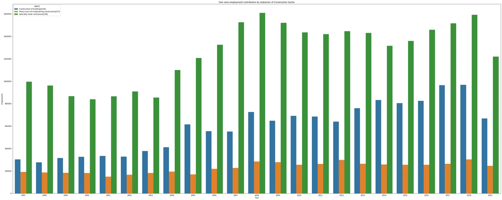
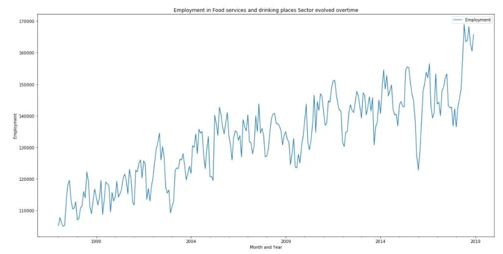
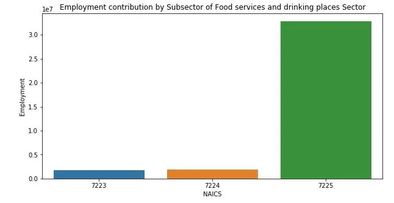
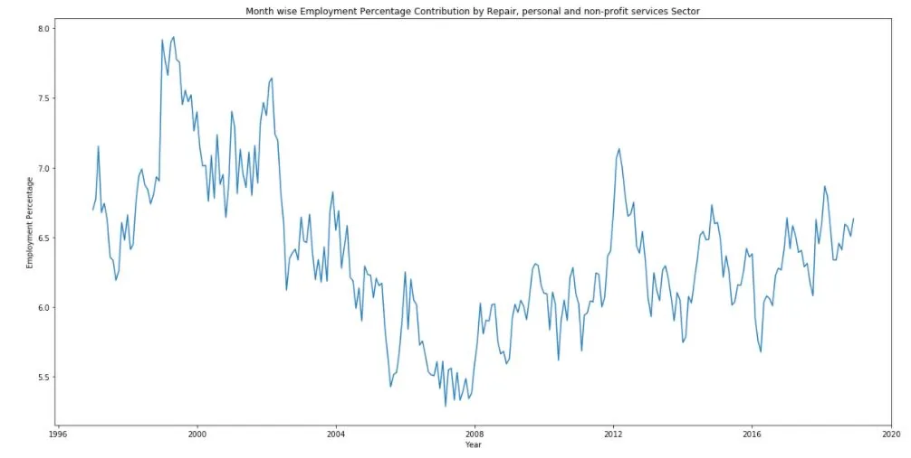

**Introduction**

The North American Industry Classification System (NAICS) represents a continuing cooperative effort among Statistics Canada, Mexico's Instituto Nacional de Estadística y Geografía (INEGI), and the Economic Classification Policy Committee (ECPC) of the United States, acting on behalf of the Office of Management and Budget, to create and maintain a standard industry classification system. With its inception in 1997, NAICS replaced the existing classification of each country, the Standard Industrial Classification (1980) of Canada, the Mexican Classification of Activities and Products (1994), and the Standard Industrial Classification (1987) of the United States. Since 1997, the countries have collaborated in producing 5-year revisions to NAICS to keep the classification system current with changes in economic activities. The NAICS changes for 2017 represent a minor revision, and all occur within sector boundaries.

The North American Industry Classification System is unique among industry classifications in that it is constructed within a single conceptual framework. Economic units with similar production processes are classified in the same industry, and the lines drawn between industries demarcate differences in production processes to the extent practicable. This supply-based, or production-oriented, the economic concept was adopted for NAICS because an industry classification system is a framework for collecting and publishing information on inputs and outputs for statistical uses that require that inputs and outputs be used together and classified consistently. Examples of such services include measuring productivity, unit labor costs, and capital intensity of production, estimating employment-output relationships, constructing input-output tables, and other uses that imply the analysis of production relationships.

## Data
The files from the data set are flat files, Excel (.xlsx), and CSV (.csv) files, we will merge and append data from several files to make a Data Output file. Our first task would be to carry out some data wrangling processes before we can make an analysis, ask questions, and gain insights.

15 CSV files beginning with RTRA. These files contain employment data by industry at different levels of aggregation; 2-digit NAICS, 3-digit NAICS, and 4-digit NAICS. Columns mean as follows:

(i) SYEAR: Survey Year

(ii) SMTH: Survey Month

(iii) NAICS: Industry name and associated NAICS code in the bracket

(iv) _EMPLOYMENT_: Employment

**Loading NAICS data**

```python
%matplotlib inline
import pandas as pdimport numpy as np
import seaborn as sns
import matplotlib.pyplot as plt

data_dir = './A_NEWLY_HIRED_DATA_ANALYST/'
# Loading LMO_Detailed_Industries_by_NAICS data
lmo_detailed_industries_data = pd.read_excel(data_dir+'LMO_Detailed_Industries_by_NAICS.xlsx')
lmo_detailed_industries_data.head()
```


**Exploratory Analysis**

Using the exploratory data analysis, we find out the top 10 Industry sectors contributing to Total Employment.

```python
# Plotting employment wise top 10 Industries.industry_wise_summary.sort_values(ascending=False)[:10].plot(kind='barh')
plt.xlabel("Employment")
plt.title("Employment wise Top 10 Industries Bar plot")
```



**Time Series Analysis of Employment in Construction Sector**

The construction sector is the topmost employment contribution sector. The following line plot shows the Employment of the Construction Sector evolved.

Let's plot time series data of the employment in Construction evolved overtime.

```python
construction_data = month_wise_employment_summary[month_wise_employment_summary["LMO_Detailed_Industry"] == "Construction"]
construction_data.head()
```


```python
construction_data.plot(y="Employment", title="Employment in Constction evolved overtime", figsize=(20,10))
plt.xlabel("Month and Year")
plt.ylabel("Employment")
```



Employment in Construction is rapidly increased from 2004 till the global crisis EmploymentinEmployment 2008. As the global crisis started, Employment there was a decline in EmploymentEmployment. Still, recentlytopmost it could catch up, and now it is the top industry contributing towards total Employment.

**Comparing employment in Construction with Total employment across all industries**

```python
total_employment_summary = month_wise_employment_summary.groupby("month_idx")["Employment"].sum()total_employment_summary = total_employment_summary.reset_index()
# total_employment_summary.head()
plt.figure(figsize=(20,10))
sns.lineplot(x="month_idx", y="Employment", data=total_employment_summary, label="Total Employment")
sns.lineplot(x="month_idx", y="Employment", data=construction_data, label="Construction Employment")
plt.title("")
plt.show()
```



```python
# Calculating the percentage of Employment contributed by Construction Industry
construction_perc_df = pd.merge(left=total_employment_summary, right=construction_data, left_on="month_idx", right_on="month_idx", how="left")construction_perc_df["Employment_perc"] = construction_perc_df["Employment_y"] / construction_perc_df["Employment_x"] * 100construction_perc_df.head()
```



```python
plt.figure(figsize=(20,10))
sns.lineplot(x="month_idx", y="Employment_perc", data=construction_perc_df)
plt.xlabel("Year")
plt.ylabel("Employment Percentage")
plt.title("Month wise Employment Percentage Contribution by Construction Industry")
plt.show()
```

The following line plot shows the percentage of Employment contributed by Construction Sector to the total employment over time The following.



Following the bar, the plot shows the various subsector's contributions towards the Employment of Construction Sector.

```python
plt.figure(figsize=(15,5))
# construction_subsector.
plot(kind="bar")
sns.barplot(x="NAICS", y="_EMPLOYMENT_", data=construction_subsector)
plt.ylabel("Employment")
plt.title("Employment contribution by Subsector of Construction Sector")
plt.show()
```



This shows that the Specialty trade Contractors subsector is the most significant employment contributor for the Construction Sector.

**The year with the most employment**

```python
plt.figure(figsize=(50,20))
sns.barplot(x="SYEAR", y="_EMPLOYMENT_", hue="NAICS", data=construction_subsector_summary)
plt.xlabel("Year")plt.ylabel("Employment")
plt.title("Year wise employment contribution by Subsector of Construction Sector")
plt.show()
```



**Time Series Employment in Food services and drinking places Sector**

The food services and drinking places sector is the second largest employment contributor.

```python
food_sector_data = month_wise_employment_summary[month_wise_employment_summary["LMO_Detailed_Industry"] == "Food services and drinking places"]
food_sector_data.plot(y="Employment", title="Employment in Food services and drinking places Sector evolved overtime", figsize=(20,10))
plt.xlabel("Month and Year")
plt.ylabel("Employment")
```



```python
plt.figure(figsize=(10,5))
sns.barplot(x="NAICS", y="_EMPLOYMENT_", data=food_subsector_summary)
plt.ylabel("Employment")
plt.title("Employment contribution by Subsector of Food services and drinking places Sector")
plt.show()
```

Following bar, the plot shows the various subsector's contribution of Employment for Food services and drinking places Sector.



**Time series Employment Analysis of Repair, personal and non-profit services Sector**

The repair, personal and non-profit services Sector is the third-largest employment contributor. Following the line, the graph shows the percentage of Employment contributed by this Sector.

```python
plt.figure(figsize=(20,10))
sns.lineplot(x="month_idx", y="Employment_perc", data=repair_sector_perc_df)
plt.xlabel("Year")plt.ylabel("Employment Percentage")
plt.title("Month wise Employment Percentage Contribution by Repair, personal and non-profit services Sector")
plt.show()
```



**Subsector Contribution towards Employment of Repair, personal and non-profit services**

```python
lmo_detailed_industries_data[lmo_detailed_industries_data["LMO_Detailed_Industry"] == "Repair, personal and non-profit services"]
```


```python
# Subsectors contibution towards the employment of Repair, personal and non-profit services
repair_subsector_data = dataframe_3_naics[dataframe_3_naics["lower_code"].str.match(r'81[0-9]') == True]
repair_subsector_summary = repair_subsector_data.groupby(["NAICS"])["_EMPLOYMENT_"].sum()
repair_subsector_summary = repair_subsector_summary.reset_index()
repair_subsector_summary.head()
```


```python
plt.figure(figsize=(15,5))
sns.barplot(x="NAICS", y="_EMPLOYMENT_", data=repair_subsector_summary)
plt.ylabel("Employment")
plt.title("Employment contribution by Subsector of Repair, personal and non-profit services Sector")
plt.show()
```


**Conclusion**

Overall, the top three largest employment contributor sectors contribute almost 20 to 25% of Total Employment. More than 11% of Employment is donated by Construction Industry towards total Employment every month from 2008. The contribution of Food services and drinking places Sector towards full Employment fluctuates between 7.5 to 9%.

**References**
[NAICS code description](https://github.com/mahmudmursi/Time-Series-Analysis-of-NAICS/blob/main/time_series_analycis_of_naics.ipynb)
