### Project Overview

The North American Industry Classification System (NAICS) is an industry classification system developed by the statistical agencies of Canada, Mexico and the United States. NAICS is designed to provide common definitions of the industrial structure of the three countries and a common statistical framework to facilitate the analysis of the three economies.

Following chart gives the analysis of NAICS codes:

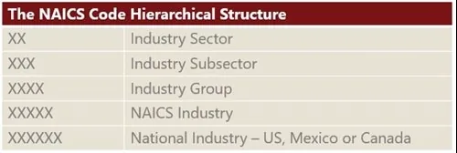

For this project prepared data using the following files

1. **NAICS 2017 – Statistics Canada:** This file contains all the NAICS codes for the respective sectors and subsectors and their descriptions.
2. **Raw Data:** 15 CSV files and the file name beginning with word "RTRA". These files contain employment data by industry at different level of aggregation; 2-digit NAICS, 3-digit NAICS, and 4-digit NAICS. Columns mean as follows:

   1. SYEAR: Survey Year
   2. SMTH: Survey Month
   3. NAICS: Industry name and associated NAICS code in the bracket
   4. _EMPLOYMENT_: Employment
3. **LMO Detailed Industries by NAICS:** An excel file for mapping the RTRA data to the desired data. The first column of this file has a list of 59 industries that are frequently used. The second column has their NAICS definitions. Using these NAICS definitions and RTRAdata, you would create a monthly employment data series from 1997 to 2020 for these 59 industries.
4. **Data Output Template:** An excel file for the analysis output with an empty column for employment.

### Preparing Data

Loading and exploring the *LMO_Detailed_Industries_by_NAICS* data.

```python
%matplotlib inline
import pandas as pd
import numpy as np
import seaborn as sns
import matplotlib.pyplot as plt

# Loading LMO_Detailed_Industries_by_NAICS data
lmo_detailed_industries_data = pd.read_excel('LMO_Detailed_Industries_by_NAICS.xlsx')

# create a list of NAICS for industries
naic_lists = lmo_detailed_industries_data['NAICS'].astype(str).str.replace(' &', ',').str.split(', ')
lmo_detailed_industries_data['NAICS_list'] = naic_lists
lmo_detailed_industries_data.head()
```

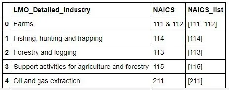

**2-Digit NAICS Industries data:**

Get the data of 2-digit NAICS industries from the Raw data.

```python
# Get the data of 2digit NAICS industries
dataframe_2_naics = pd.read_csv('RTRA_Employ_2NAICS_00_05.csv')

file_2_naics = ['RTRA_Employ_2NAICS_06_10.csv',
                'RTRA_Employ_2NAICS_11_15.csv',
                'RTRA_Employ_2NAICS_16_20.csv',
                'RTRA_Employ_2NAICS_97_99.csv']

for file_p in file_2_naics:
    df = pd.read_csv(file_p)
    dataframe_2_naics = dataframe_2_naics.append(df, ignore_index=True)

# Append the lower_code and upper_code columns to the 2digits NAICS dataframe
dataframe_2_naics["lower_code"] = df1["lower_code"]
dataframe_2_naics["upper_code"] = df1["upper_code"]
dataframe_2_naics.head()
```

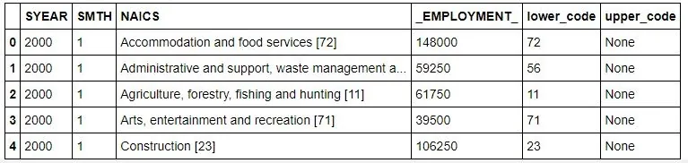

Created a function to get the '*LMO_Detailed_Industry*' values for a NAICS code in RTRA files:

```python
# Function to get the 'LMO_Detailed_Industry' values for a NAICS code in RTRA files
def add_lmo_industry(df):
    lmo_df = lmo_detailed_industries_data.apply(lambda y: y["LMO_Detailed_Industry"]
                                                if ((df['lower_code'] in y['NAICS_list']) or (df['upper_code'] in y['NAICS_list']))
                                                else np.nan, axis=1)
    lmo_df = lmo_df.dropna(how='all', axis=0)
    if lmo_df.empty:
        lmo_df = np.nan
    else:
        lmo_df = lmo_df.to_string(index=False)
    return lmo_df
```

Using the above function get the corresponding '*LMO_Detailed_Industry*' values for 2-digit NAICS dataframe

```python
# Get the LMO_Detailed_Industry for the 2digit NAICS RTRA file
dataframe_2_naics["LMO_Detailed_Industry"] = dataframe_2_naics.apply(add_lmo_industry, axis=1)
dataframe_2_naics.head(10)
```

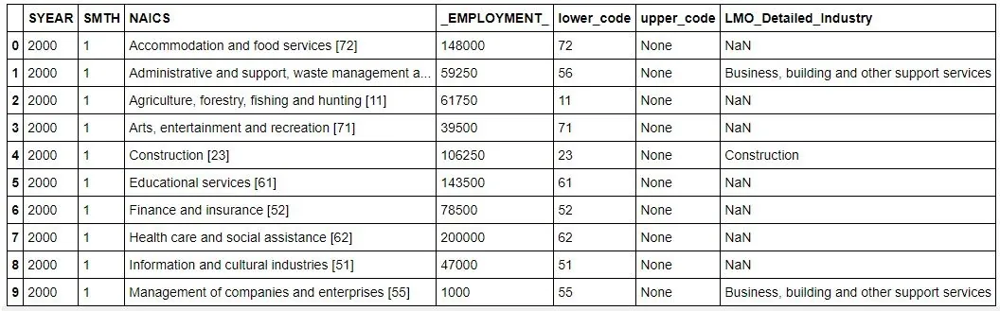

Similarly got the '*LMO_Detailed_Industry*' values for 3-digit and 4-digit NAICS codes in RTRA files.

**3-Digit NAICS Industry data:**

```python
# Get the data of 3-digit NAICS industries
dataframe_3_naics = pd.read_csv('RTRA_Employ_3NAICS_00_05.csv')

file_3_naics = ['RTRA_Employ_3NAICS_06_10.csv',
                'RTRA_Employ_3NAICS_11_15.csv',
                'RTRA_Employ_3NAICS_16_20.csv',
                'RTRA_Employ_3NAICS_97_99.csv']

for file_p in file_3_naics:
    df = pd.read_csv(file_p)
    dataframe_3_naics = dataframe_3_naics.append(df, ignore_index=True)

# Separate the Industry description and NAICS code
df1 = pd.DataFrame(dataframe_3_naics['NAICS'].str.split('[').tolist(), columns=["NAICS", "CODE"])
df1["CODE"] = df1['CODE'].str.replace(']', '')

# Maintaining the table consistent as of 2-digit NAICS dataframe
dataframe_3_naics["lower_code"] = df1["CODE"]
dataframe_3_naics["upper_code"] = None

# Get the LMO_Detailed_Industry for the 3-digit NAICS RTRA file
dataframe_3_naics["LMO_Detailed_Industry"] = dataframe_3_naics.apply(add_lmo_industry, axis=1)
dataframe_3_naics.head(10)
```

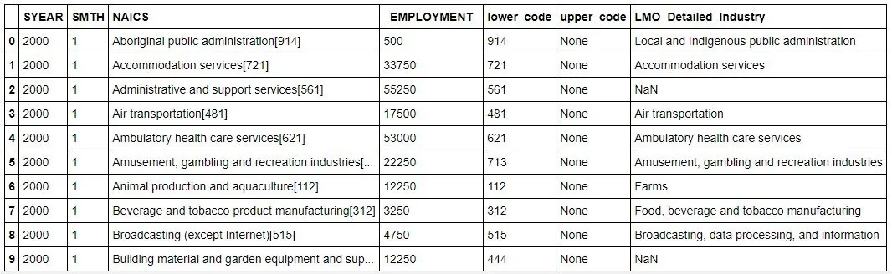

**4-Digit NAICS Industries data:**

```python
# Get the data of 4-digit NAICS industries
dataframe_4_naics = pd.read_csv('RTRA_Employ_4NAICS_00_05.csv')

file_4_naics = ['RTRA_Employ_4NAICS_06_10.csv',
                'RTRA_Employ_4NAICS_11_15.csv',
                'RTRA_Employ_4NAICS_16_20.csv',
                'RTRA_Employ_4NAICS_97_99.csv']

for file_p in file_4_naics:
    df = pd.read_csv(file_p)
    dataframe_4_naics = dataframe_4_naics.append(df, ignore_index=True)

# Maintaning the shape of dataframe_4_naics as of dataframe_2_naics
dataframe_4_naics["lower_code"] = dataframe_4_naics["NAICS"]
dataframe_4_naics["upper_code"] = None

# Get the LMO_Detailed_Industry for the 4-digits NAICS RTRA file
dataframe_4_naics["LMO_Detailed_Industry"] = dataframe_4_naics.apply(add_lmo_industry, axis=1)
dataframe_4_naics.head(10)
```

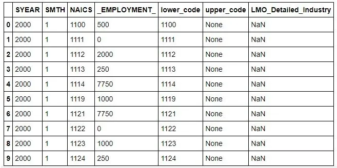

**Calculating Industry wise Employment Summary**

Combining all the 2, 3 and 4 digit NAICS dataframes into a single dataframe and then calculating the month wise employment summary per '*LMO Industry*'.

```python
cols = ["SYEAR", "SMTH", "LMO_Detailed_Industry", "_EMPLOYMENT_"]

# Creating a single dataframe with the columns Year, Month and LMO Industry and Employment from all the 2, 3 and 4 digits NAICS
naics_employment_detail_df = dataframe_2_naics[cols]
naics_employment_detail_df = naics_employment_detail_df.append(dataframe_3_naics[cols], ignore_index=True)
naics_employment_detail_df = naics_employment_detail_df.append(dataframe_4_naics[cols], ignore_index=True)

# drop rows with NaN values
naics_employment_detail_df = naics_employment_detail_df.dropna(axis=0, how='any')

# Calculate the Employment summary by Year, Month and LOM Industry
naics_employment_summary = naics_employment_detail_df.groupby(["SYEAR", "SMTH", "LMO_Detailed_Industry"], as_index=False).sum()
print(naics_employment_summary.shape)
naics_employment_summary.head()
```

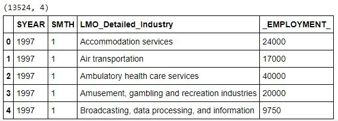

Converting the data as per the '*Data_Output_Template*' file:

```python
# Read 'Data_Output_Template' file
data_output = pd.read_excel('Data_Output_Template.xlsx')
# Crate Year, Month and LMO_Detailed_industry combined idx to get the data_output formatted result naics_employment_summary1 = naics_employment_summary.copy() naics_employment_summary1['idx'] = naics_employment_summary1["SYEAR"].astype(str) + '-' + naics_employment_summary1["SMTH"].astype(str) + '-' + naics_employment_summary1["LMO_Detailed_Industry"]

data_output1 = data_output.copy()
data_output1['idx'] = data_output1["SYEAR"].astype(str) + '-' + data_output1["SMTH"].astype(str) + '-' + data_output1["LMO_Detailed_Industry"]

# Merge the two dataframes data_output1 and naics_employment_summary1
combined_data = pd.merge(data_output1, naics_employment_summary1, left_on='idx', right_on='idx', how='left')

# Fille tha NaN values with zero in '_EMPLOYMENT_' column
combined_data["_EMPLOYMENT_"] = combined_data["_EMPLOYMENT_"].fillna(0)

# Get the month wise employment summary data into "Employment" column of dat_output dataframe
data_output["Employment"] = combined_data["_EMPLOYMENT_"].astype(np.int)
data_output.head()
```

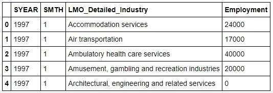

## Exploratory Data Analysis
Here for the exploratory data analysis calculated Industry wise the employment summary.

```python
# create a dataframe with industry wise employment summary
industry_wise_summary = data_output.groupby(["LMO_Detailed_Industry"])["Employment"].sum()
industry_wise_summary.head()
```

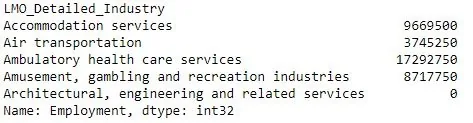

Plotting employment wise top 10 industries using bar plot.

```python
# Plotting employment wise top 10 Industries.
industry_wise_summary.sort_values(ascending=False)[:10].plot(kind='barh')
plt.xlabel("Employment")
plt.title("Employment wise Top 10 Industries Bar plot")
```

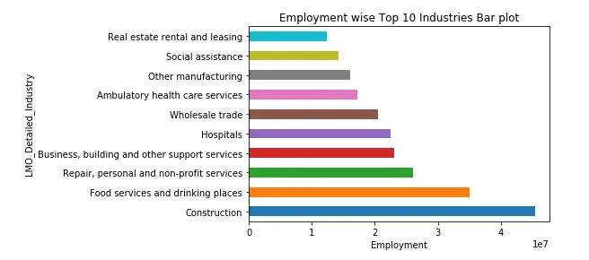

```python
# Create a dataframe with Year and Month as index
month_wise_employment_summary = data_output.copy()
month_wise_employment_summary['month_idx'] = pd.to_datetime([f'{y}-{m}' for y, m in zip(month_wise_employment_summary.SYEAR, month_wise_employment_summary.SMTH)])
month_wise_employment_summary.index = month_wise_employment_summary["month_idx"]
month_wise_employment_summary.head()
```

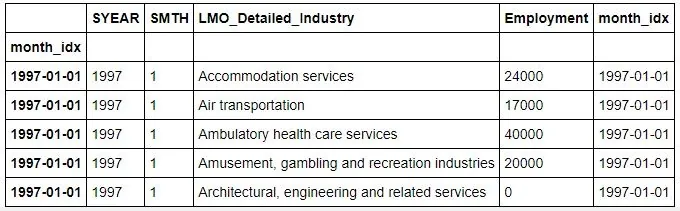

## Time series employment in Construction Industry, the top contributor of Employment
Let's plot time series data of the employment in Construction sector evolved overtime.

```python
construction_data = month_wise_employment_summary[month_wise_employment_summary["LMO_Detailed_Industry"] == "Construction"]

construction_data.plot(y="Employment", title="Employment in Constction evolved overtime", figsize=(20,10))
plt.xlabel("Month and Year")
plt.ylabel("Employment")
```

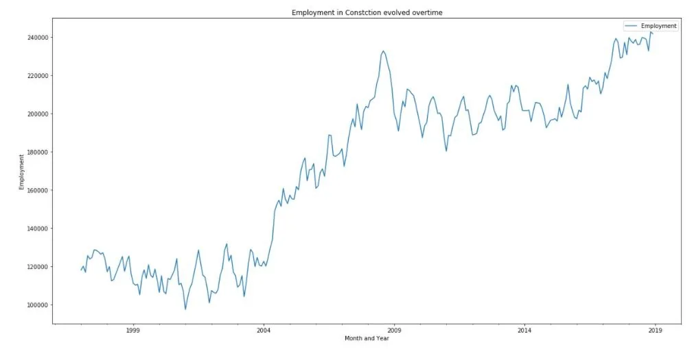

The employment in Construction is rapidly increased from 2004 till the global crisis mid 2008. As the global crisis started there is decline in employment but recently it could able to catch up and now it is the top most industry contributing towards total employment.

**Comparing employment in Construction with Total employment across all industries**

Let's compare the employment of Construction with Total employment across all industries. Also, let's plot the percentage of employment contributed by Construction sector to the total employment.

```python
total_employment_summary = month_wise_employment_summary.groupby("month_idx")["Employment"].sum()
total_employment_summary = total_employment_summary.reset_index()
# total_employment_summary.head()
plt.figure(figsize=(20,10))
sns.lineplot(x="month_idx", y="Employment", data=total_employment_summary, label="Total Employment")
sns.lineplot(x="month_idx", y="Employment", data=construction_data, label="Construction Employment")
plt.show()
```

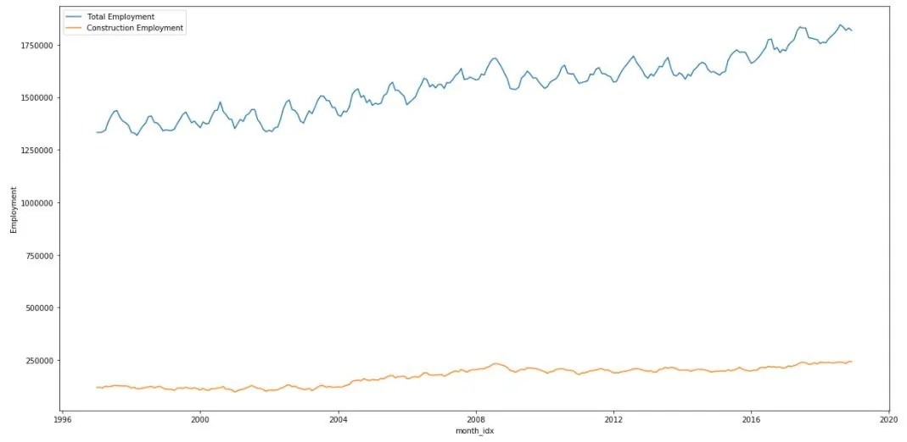

```python
# Calculating the percentage of Employment contributed by Construction Industry
construction_perc_df = pd.merge(left=total_employment_summary, right=construction_data, left_on="month_idx", right_on="month_idx", how="left")
construction_perc_df["Employment_perc"] = construction_perc_df["Employment_y"] / construction_perc_df["Employment_x"] * 100

plt.figure(figsize=(20,10))
sns.lineplot(x="month_idx", y="Employment_perc", data=construction_perc_df)
plt.xlabel("Year")
plt.ylabel("Employment Percentage")
plt.title("Month wise Employment Percentage Contribution by Construction Industry")
plt.show()
```

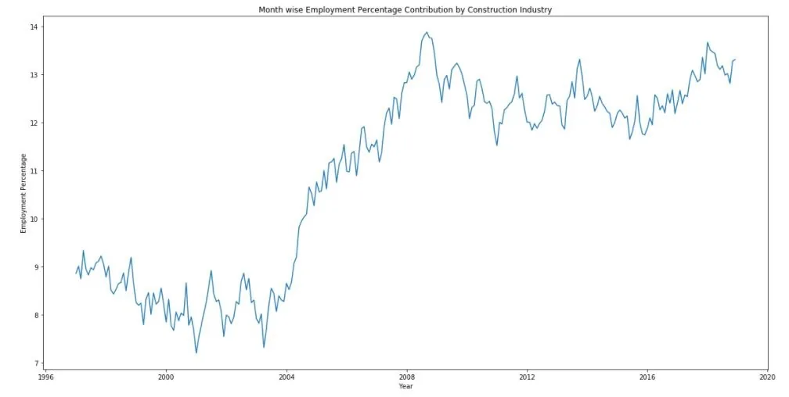

More than 11% of employment is contributed by Construction Industry towards total employment every month from 2008 till now.

**Subsector Contribution towards Employment of Construction Sector:**
In this section we can explore all the subsctors contributed towards the employment of Construction sector. We will check year wise and overall contribution of subsectors. The NAICS code of Construction sector is `23`.

```python
# Subsectors contibution towards the Construction Industry Sector
construction_subsector_data = dataframe_3_naics[dataframe_3_naics["lower_code"].str.match(r'23[0-9]') == True]
construction_subsector_summary = construction_subsector_data.groupby(["SYEAR", "NAICS"])["_EMPLOYMENT_"].sum()
construction_subsector_summary = construction_subsector_summary.reset_index()

plt.figure(figsize=(50,20))
sns.barplot(x="SYEAR", y="_EMPLOYMENT_", hue="NAICS", data=construction_subsector_summary)
plt.xlabel("Year")
plt.ylabel("Employment")
plt.title("Year wise employment contribution by Subsector of Construction Sector")
plt.show()
```

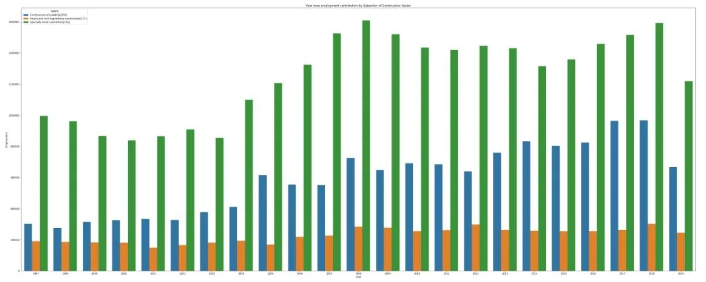

```python
# Subsectors contibution towards the Construction Industry Sector
construction_subsector = construction_subsector_data.groupby(["NAICS"])["_EMPLOYMENT_"].sum()
construction_subsector = construction_subsector.reset_index()

plt.figure(figsize=(15,5))
sns.barplot(x="NAICS", y="_EMPLOYMENT_", data=construction_subsector)
plt.ylabel("Employment")
plt.title("Employment contribution by Subsector of Construction Sector")
plt.show()
```

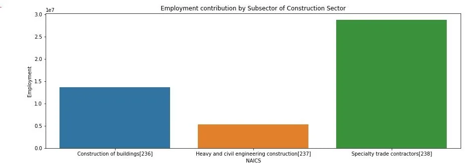

`Specialty trade contractors[238]` subsector is the largest contributor towards the employment of Construction sector.

**Time Series Employment in Food services and drinking places Sector**

Food services and drinking places sector is the second largest employment contributor.

```python
food_sector_data = month_wise_employment_summary[month_wise_employment_summary["LMO_Detailed_Industry"] == "Food services and drinking places"]

food_sector_data.plot(y="Employment", title="Employment in Food services and drinking places Sector evolved overtime", figsize=(20,10))
plt.xlabel("Month and Year")
plt.ylabel("Employment")
```

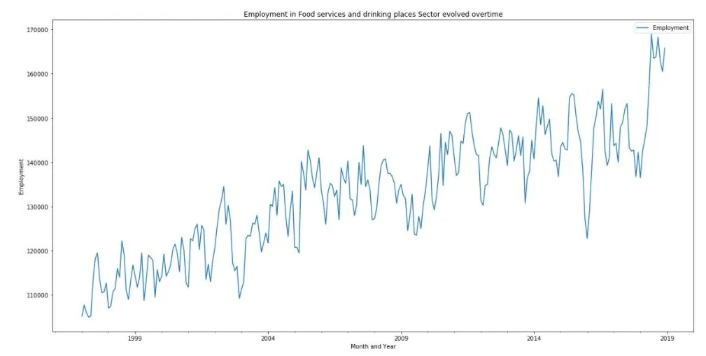

**Contribution of Employment by Food services and drinking places Sector**

```python
# Calculating the percentage of Employment contributed by Food services and drinking places Sector
food_sector_perc_df = pd.merge(left=total_employment_summary, right=food_sector_data, left_on="month_idx", right_on="month_idx", how="left")
food_sector_perc_df["Employment_perc"] = food_sector_perc_df["Employment_y"] / food_sector_perc_df["Employment_x"] * 100

plt.figure(figsize=(20,10))
sns.lineplot(x="month_idx", y="Employment_perc", data=food_sector_perc_df)
plt.xlabel("Year")
plt.ylabel("Employment Percentage")
plt.title("Month wise Employment Percentage Contribution by Food services and drinking places Sector")
plt.show()
```

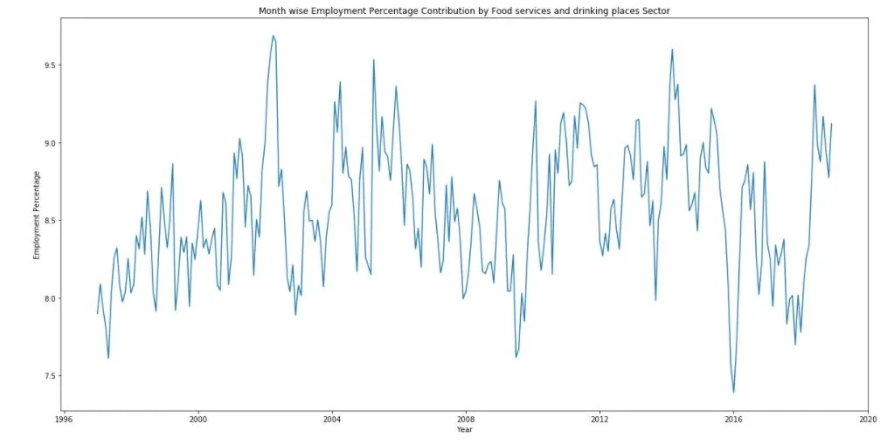

The contribution of Food services and drinking places Sector towards total employment is highly fluctuating between 7.5 to 9%.

**Subsector Contribution towards Employment of Food services and drinking places**

The NAICS code of Food services and drinking places sector is `722`.

```python
# Subsectors contibution towards the Food services and drinking places Sector
food_subsector_data = dataframe_4_naics[dataframe_4_naics["NAICS"].astype(str).str.match(r'722[0-9]') == True]
food_subsector_summary = food_subsector_data.groupby(["NAICS"])["_EMPLOYMENT_"].sum()
food_subsector_summary = food_subsector_summary.reset_index()

plt.figure(figsize=(10,5))
sns.barplot(x="NAICS", y="_EMPLOYMENT_", data=food_subsector_summary)
plt.ylabel("Employment")
plt.title("Employment contribution by Subsector of Food services and drinking places Sector")
plt.show()
```

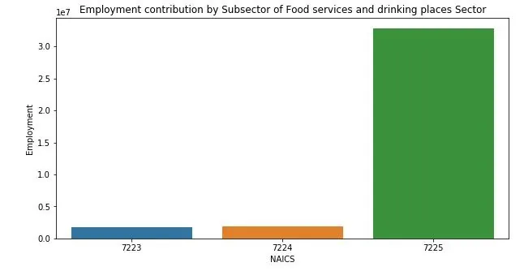

The subsector `7225` is the largest contributor of employment for the Food services and drinking places sector.

**Time series Employment Analysis of Repair, personal and non-profit services Sector, the 3rd largest employment contributor**

The NAICS code of Repair, personal and non-profit services sector is `81`.

```python
repair_sector_data = month_wise_employment_summary[month_wise_employment_summary["LMO_Detailed_Industry"] == "Repair, personal and non-profit services"]
# repair_sector_data.head()
repair_sector_data.plot(y="Employment", title="Employment in Repair, personal and non-profit services Sector evolved overtime", figsize=(20,10))
plt.xlabel("Month and Year")
plt.ylabel("Employment")
```

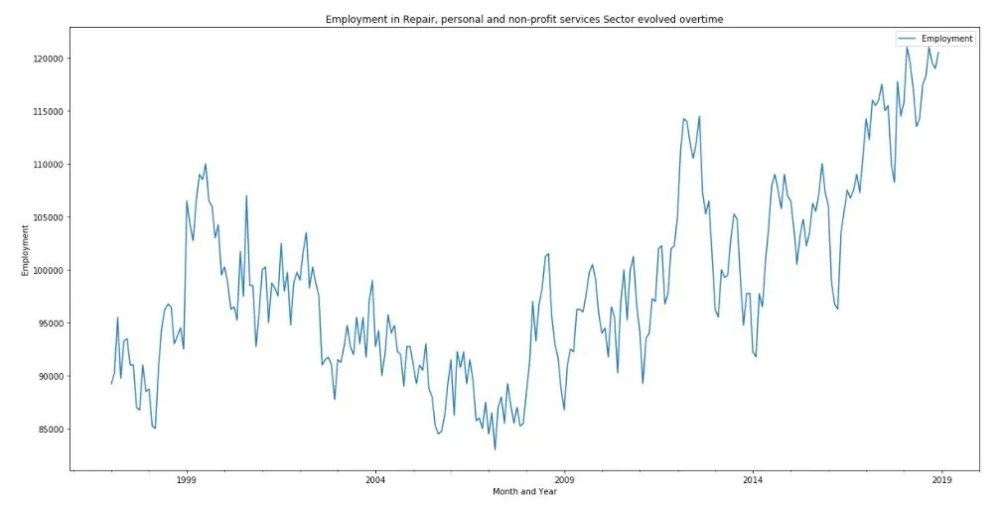

After the Global Financial Crisis this sector average employment rate per year is continuously increasing.

**Contribution of Repair, personal and non-profit services Sector towards total employment**

```python
# Calculating the percentage of Employment contributed by Food services and drinking places Sector
repair_sector_perc_df = pd.merge(left=total_employment_summary, right=repair_sector_data, left_on="month_idx", right_on="month_idx", how="left")
repair_sector_perc_df["Employment_perc"] = repair_sector_perc_df["Employment_y"] / repair_sector_perc_df["Employment_x"] * 100

plt.figure(figsize=(20,10))
sns.lineplot(x="month_idx", y="Employment_perc", data=repair_sector_perc_df)
plt.xlabel("Year")
plt.ylabel("Employment Percentage")
plt.title("Month wise Employment Percentage Contribution by Repair, personal and non-profit services Sector")
plt.show()
```

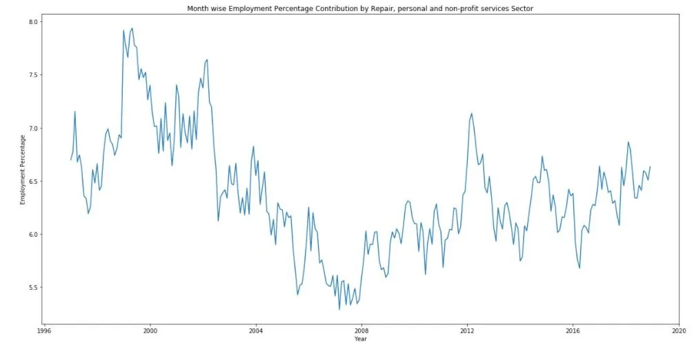

This Repair, personal and non-profit services sector was greatly effected by the Global Financial Crisis. Now this sector is slowly increasing its contribution towards employment.

**Subsector Contribution towards Employment of Repair, personal and non-profit services**

```python
# Subsectors contibution towards the employment of Repair, personal and non-profit services
repair_subsector_data = dataframe_3_naics[dataframe_3_naics["lower_code"].str.match(r'81[0-9]') == True]
repair_subsector_summary = repair_subsector_data.groupby(["NAICS"])["_EMPLOYMENT_"].sum()
repair_subsector_summary = repair_subsector_summary.reset_index()

plt.figure(figsize=(15,5))
sns.barplot(x="NAICS", y="_EMPLOYMENT_", data=repair_subsector_summary)
plt.ylabel("Employment")
plt.title("Employment contribution by Subsector of Repair, personal and non-profit services Sector")
plt.show()
```

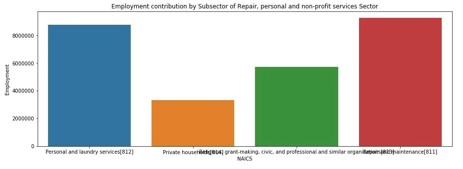

## Conclusion
The Global Financial Crisis greatly affected all the sectors. Now the sectors also managing to increase their employment contribution. The top three largest employment contributor sectors are contributing almost 20 to 25% of Total employment. The Construction sector is the largest contributor with more than 11% contribution.

For more details on this project checkout my [GitHub repository](https://github.com/govind-savara/Time-Series-Employment-Analysis-of-NAICS).
