## Introduction
Bitcoin (BTC) was the first cryptocurrency ever created. It is a peer-to-peer technology which allows operations between its users without a central authority or bank. Transactions (issuing bitcoin, managing peer-to-peer transfers) on bitcoin network are collectively powered by users, leveraging the power of the blockchain technology. Bitcoin price (in USD) overcame the value of $1 for the first time in April 2012. Since then it has been fluctuating almost randomly and it reached its highest value on November 10, 2021: $68,790. In this post, we will load and explore bitcoin historical timeseries daily data (from Sep 17, 2014 to Oct 03, 2022) downloaded from [yahoo finace.](https://finance.yahoo.com/quote/BTC%3DF/history?p=BTC%3DF) Furthermore, we will build, train, test an ARIMA (Auto Regressive Integrated Moving Average) model on the data in order to forecast bitcoin daily closing price for the current month (October 2022).

## Import necessary packages
```python
import pandas as pd
import numpy as np
import datetime
# classical Time Series Tools
from statsmodels.tsa.stattools import adfuller
from statsmodels.tsa.statespace.sarimax import SARIMAX
from statsmodels.tsa.seasonal import seasonal_decompose
from statsmodels.stats.diagnostic import acorr_ljungbox
# plotting
import matplotlib.pyplot as plt
plt.style.use('seaborn')
from tqdm import tqdm_notebook
from itertools import product
from typing import Union
import warnings
warnings.filterwarnings('ignore')
```

## Load, explore and prepare data
### Loading and exploring data
Timeseries forecasting is special in that the data must be absolutely chronological with a rigorous sampling frequency. For this sake we will use the Data as dataframe index, then tell pandas that the data is daily sampled, thanks to pandas dataframe **asfreq** method. Furthermore, when it comes to split data into training, test and eventually validation subsets, shuffling is prohibited.

```python
data_path = './data/btc-usd.csv'
def read_data(data_path):
    cols = ['Date', 'Close']
    df = pd.read_csv(data_path, parse_dates=['Date'])#, usecols=cols)
    df.Date = df.Date.apply(lambda x: x.date())
    df = df.set_index('Date')
    df = df.asfreq(freq='D')
    return df

df = read_data(data_path)
df.head()
```

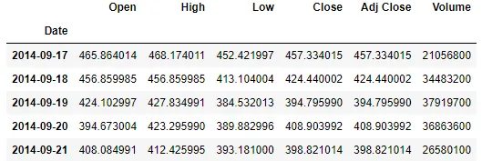

Once the data is set as frequential, it is a good practice to check for missing values. Fortunately there's no missing value in our data, as we can see below.

```python
df.isna().sum()
```

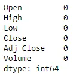

#### Highest value of bitcoin price
```python
df[df.High == df.High.max()][['High']]
```

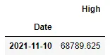

Since we are only interested by closing price and date, we will not consider the other columns of the data.

```python
df = df[['Close']]
fig, ax = plt.subplots(figsize=(8,3))
df.plot(ax=ax, legend=False)
ax.set_title('Bitcoin historical price')
plt.tight_layout()
plt.show()
```

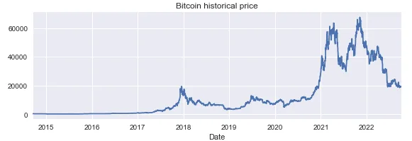

### Preparing data for forecasting
We will start by decomposing the time series into its different components: trend, seasonal and residual, for a visual apreciation its characteristics.

The figure below shows the flowchart of data preparation.

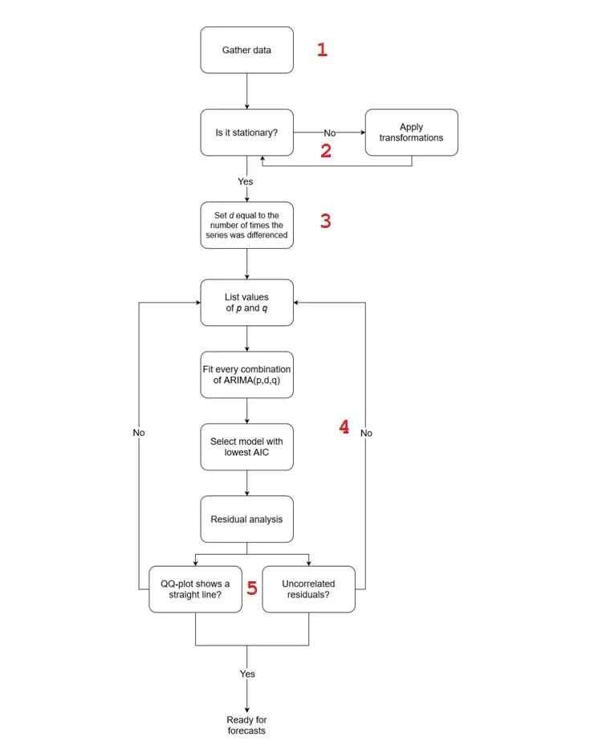

```python
seasonal = seasonal_decompose(df, period=365)
g = seasonal.plot()
g.axes[0].set_ylabel('Observed')
g.set_figheight(8)
i = 1
for ax in g.axes:
    ax.set_title(f'fig {i}')
    i +=1
plt.tight_layout()
plt.show()
```

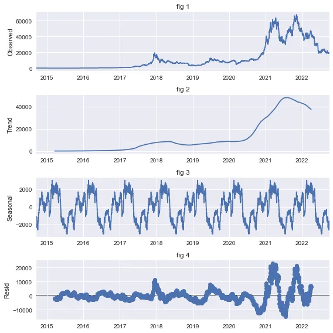

Fig. 1, labelled as **Observed** shows the original data exactly as plotted earlier above.

Fig. 2: **Trend** shows that it starts out flat until about 2018 then smoothly goes up globally until the beginning of 2021 from where it steeply increases until end 2021 before going down from there. This suggest that the data doesn't have a constant trend.

Up next, in Fig. 3: **Seasonal** describes the seasonal behavior of our data, that is the periodic trend in the data. The period here is a year, denoted by the value 365 for the period parameter in **seasonal_decompose** function. We can see that every year the bitcoin price starts low, globally increases till the middle of the year then decreases at the end.

Fig. 4: **Resid** represents the residuals, simply put, the difference between trend and seasonal components of the data. It represents the data that can't be predicted because it is completely random.

```python
ad_fuller_result = adfuller(df.Close.values)
print(f'ADF Statistic: {ad_fuller_result[0]}')
print(f'p-value: {ad_fuller_result[1]}')
```

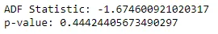

## Interpretation of the ADF (Augmented Dickey-Fuller) test
The null hypothesis for this test is : "the data is non stationary". For this hypothesis to be rejected that is to assume our data is stationary, we must have a p-value less than the standard threshold of 0.05 and a large negative ADF test statistic. In our case we have a p-value of 0.44 meaning that we fail to reject the null hypothesis so our data is non stationary. In order to make the data stationary, we must differentiate it and evaluate its stationarity again and again until we reach our goal (see code below). The order of differentiation required to make the data stationary represents the **order of integration (d)** of the ARIMA model. The block of code below shows that our data is stationary after the first differentiation, so d = 1.

```python
d = 0
p_value = 10

while p_value >= 0.05:
    eps_diff = np.diff(df.Close.values, n=d)
    ad_fuller_result = adfuller(eps_diff)
    adf = ad_fuller_result[0]
    p_value = ad_fuller_result[1]
    print(f'd: {d}')
    print(f'ADF Statistic: {adf}')
    print(f'p-value: {p_value}\n')
    d+=1
```

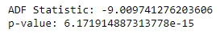

The other parameters (p,q) are determined by listing many possible values, fitting the model on every set of (p,d,q) values and evaluating the Akaike Information Criteria (AIC) to select the best model, the one with lowest AIC, the search_best_ARIMA function below does it. However, this procedure is done only on training data so we start by splitting data into training and test sets. For that sake, we hold out the last 30 data points for testing the model and evaluating its accuracy.

```python
# splitting the data into train and test sets
train = df.iloc[:-30]
test = df.iloc[-30:]
def search_best_ARIMA(endog: Union[pd.Series, list], order_list: list, d: int):
    results = []
    for order in tqdm_notebook(order_list):
        try:
            model = SARIMAX(endog, order=(order[0], d, order[1]), simple_differencing=False).fit(disp=False)
        except:
            continue
        aic = model.aic
        results.append([order, aic])
    result_df = pd.DataFrame(results)
    result_df.columns = ['(p,q)', 'AIC']
    result_df = result_df.sort_values(by='AIC', ascending=True).reset_index(drop=True)
    return result_df.head(3)

ps = range(0, 7)
qs = range(0, 7)
d = 1
order_list = list(product(ps, qs))
result_df = search_best_ARIMA(train.Close, order_list, d)
result_df
```

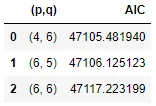

The best model is therefore ARIMA(4,1,6). Before forecasting the bitcoin price, we must fit the model with training data and perform residual analysis to ensure the residuals are completely random and to make sure there isn't significant autocorrelation after one lag.

```python
model = SARIMAX(train.Close, order=(4,1,6))
model_fit = model.fit(disp=False)
# Residual analysis
model_fit.plot_diagnostics(figsize=(10,6))
plt.tight_layout()
plt.show()
```

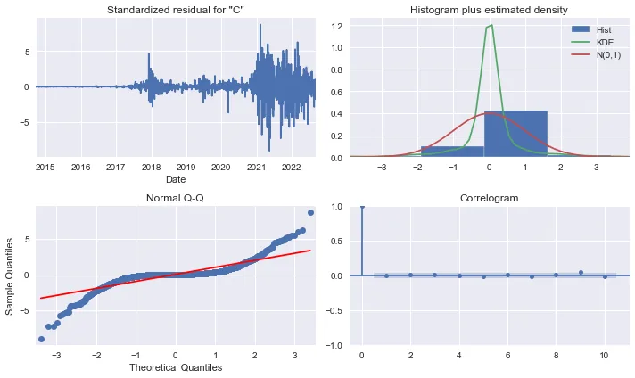

The top-left plot shows the residuals over time. There is no trend in the residuals and the variance does not seem to be constant, this implies a discrepancy in comparison to white noise. At the top right is the distribution of the residuals. We can see its kernel density estimate (KDE) is fairly close to a normal distribution. The Q-Q plot leads us to the same conclusion, as it displays a line that is somewhat straight, meaning that the residuals’ distribution is close a normal distribution. Finally, by looking at the correlogram at the bottom right, we can see that no coefficient seems to be significant after lag 0, just like white noise. From a qualitative standpoint we can conclude that the residuals are completely random.

To support the qualitative conclusion above, we will run a quantitative residual test: the Ljiung-Box test on the first 10 lags of with the null hypothesis : "The residuals are not correlated". The result will be a list 10 values representing the p-values of the test between lag 0 and all the other lags including itself.

```python
residuals = model_fit.resid
lb_df = acorr_ljungbox(residuals, np.arange(1, 11, 1))
pvalues = list(map(lambda x: round(x,3), lb_df.lb_pvalue.tolist()))
print(pvalues)
```

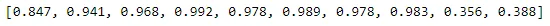

The Ljung-Box test gives us a list of p-values all greater than 0.05, thus failing to reject the null hypothesis. We can therefore conclude that the residuals are not autocorrelated.

Following the above flowchart, our model has passed all the tests, so it is ready for forecasting.

## Bitcoin price forecasting and model accuracy evaluation
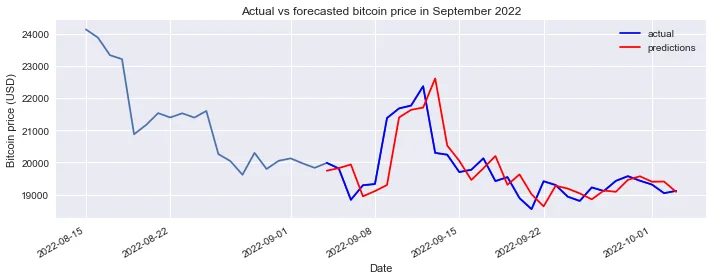

Here we are using **MAPE (Mean Absolute Percentage Error)** to evaluate the model accuracy.

```python
def mape(y_true, y_pred):
    return np.mean(np.abs((y_true - y_pred) / y_true)) * 100
error = mape(test.Close, test['pred'])
print(f"Error: {error:.2f}")
```

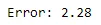

### Forecast Bitcoin prices from Oct 4 to Nov 2, 2022

```python
forecasts = []
for i in tqdm_notebook(range(30)):
    model = SARIMAX(train_hist, order=(4,1,6))
    model_fit = model.fit(disp=False)
    forecast = model_fit.forecast()[0]

    forecasts.append(forecast)
    train_hist.append(forecast)
# Generate dates
dates = [datetime.date(2022, 10, 4) + datetime.timedelta(days=x) for x in range(30)]
fig, ax = plt.subplots(figsize=(8,4))
ax.plot(dates, forecasts)
ax.set_title("Forecasted Bitcoin prices from Oct 4, 2022 to Nov 2, 2022")
ax.set_ylabel('Bitcoin Price (USD)')
plt.xticks(rotation=45)
plt.show()
```

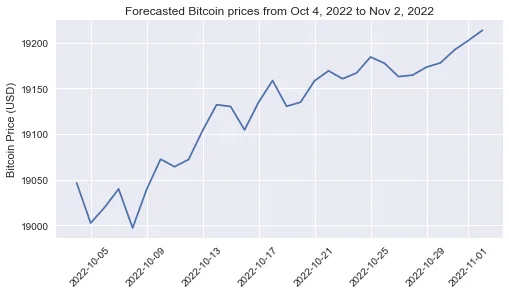

## Conclusion
In this post we attempted to guess the closing prices of Bitcoin in US Dollars for the remaining days of the current month (October 2022). We used historical and chronological Bitcoin daily closing prices from September 17, 2014 to October 03, 2022. In order to prepare the data for forecasting, we performed a seasonal decomposition to appreciate its different components then an Augmented Dickey-Fuller test helped us evaluate data stationarity in order to fix it since an ARIMA model requires the data to be non-stationary. An exhaustive search in a given range of integers allowed us to determine the best parameters of the model then a residual analysis confirmed the effectiveness of this model. We could achieve a Mean Absolute Percentage Error(MAPE) of 2.28. The ideal model would yield a MAPE of 0.0. Finally we generated forecasts for 30 days from October 4, 2022 to November 3, 2022. Time will witness the real effectiveness of our model.

Would a model taking into account the seasonality have performed better?

Find the related notebook [here](https://github.com/tem-ctrl/bitcoin_price_prediction).
