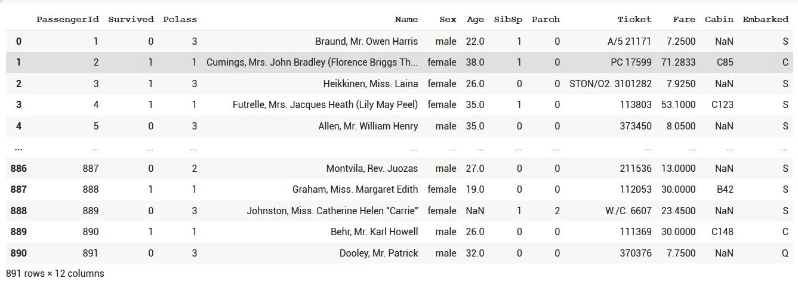
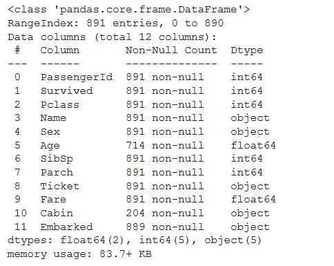
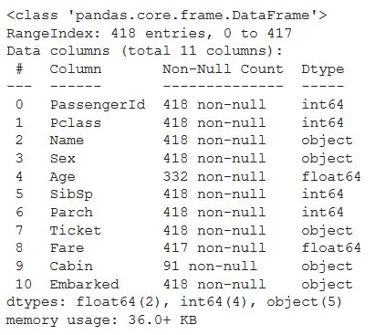
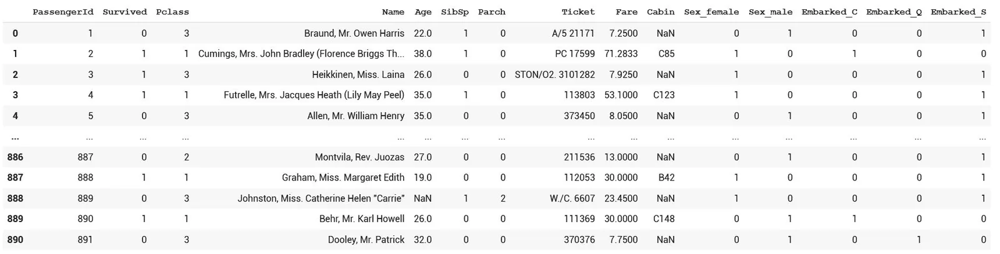
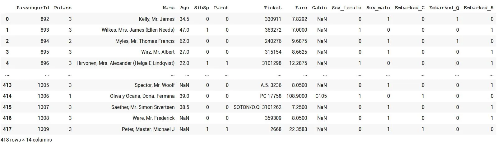
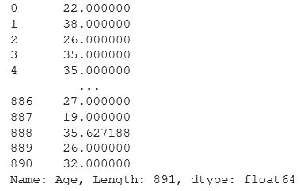

## Hello and welcome to the famous Titanic dataset article hope you enjoy it and get some useful info from it let's first start with an introduction to the problem.

#### The Titanic Problem

The objective of the Titanic problem defined on the Kaggle website as stated in the following:

"The sinking of the Titanic is one of the most infamous shipwrecks in history.

On April 15, 1912, during her maiden voyage, the widely considered “unsinkable” RMS Titanic sank after colliding with an iceberg. Unfortunately, there weren’t enough lifeboats for everyone onboard, resulting in the death of 1502 out of 2224 passengers and crew.

While there was some element of luck involved in surviving, it seems some groups of people were more likely to survive than others.

In this challenge, we ask you to build a **predictive model** that answers the question: “what sorts of people were more likely to survive?” using passenger data (i.e. name, age, gender, socio-economic class, etc.)."

You can easily find the code and the dataset; [here](https://github.com/omarmohamed2011/Titanic-Survivals-Data-Analysis-and-Modeling).

This dataset couldn't make it this far and useful without the world classy Kaggle set of datasets, check out the source [here](https://www.kaggle.com/competitions/titanic/data).

Let's analyze the challenge itself before getting into the coding and solution phase.

#### The Challenge

The competition is simple: we want you to **use the Titanic passenger data** (name, age, price of ticket, etc.) to try to **predict who will survive and who will die**.

The requirement is to predict passengers’ **survive**. Like many other real data science problems, [Prediction](https://bookdown.org/gmli64/do_a_data_science_project_in_10_days/process.html#predictive) is to build a model which takes input data and produce an output. A prediction model is a mathematical formula that takes input from historical facts reflecting past event and produce a output that to make predictions about future or otherwise unknown events. A simple way to understand model is to think a model in the following three ways:

1. The relationship between input and output can be expressed by some kinds of math formula. It is generally called definable model, the math formula can be as simple as a function of Polynomial expression or as complected as a regression model, or other statistics models.
2. Some models can not be explicitly expressed with a math formula, instead they are expressed in rules. those are rule-based models.
3. Other models can not be expressed in a math formula nor in rules. The solution is build a neural networks to do prediction. An Neural Networks can be regard as a “black box”, which takes input and produce output, the internal connections are transparent to users. Machine learning is more focused on models rooted in Neural networks.

Any model fundamentally expresses relationships between inputs and outputs. So as part of understanding the problem, We could interpret that the Kaggle Titanic challenge is to find creditable relationships between input data and out put data (which is survive or not). Once the relationship is found, we can express using either a math formula, a set of rules or a Neural Network model.

Let's explore the data from the modeling view.

#### The Data

The data has been split into two groups:

- Training set (train.csv)
- Test set (test.csv)

**The training set** should be used to build your machine learning models. For the training set, we provide the outcome (also known as the “ground truth”) for each passenger. Your model will be based on “features” like passengers’ gender and class. You can also use  [feature engineering](https://triangleinequality.wordpress.com/2013/09/08/basic-feature-engineering-with-the-titanic-data/) to create new features.

**The test set** should be used to see how well your model performs on unseen data. For the test set, we do not provide the ground truth for each passenger. It is your job to predict these outcomes. For each passenger in the test set, use the model you trained to predict whether or not they survived the sinking of the Titanic.

We also include **gender_submission.csv**, a set of predictions that assume all and only female passengers survive, as an example of what a submission file should look like.

##### Variable Notes

**pclass**: A proxy for socio-economic status (SES)
 1st = Upper
 2nd = Middle
 3rd = Lower

 **age**: Age is fractional if less than 1. If the age is estimated, is it in the form of xx.5

 **sibsp**: The dataset defines family relations in this way...
 Sibling = brother, sister, stepbrother, stepsister
 Spouse = husband, wife (mistresses and fiancés were ignored)

 **parch**: The dataset defines family relations in this way...
 Parent = mother, father
 Child = daughter, son, stepdaughter, stepson
 Some children travelled only with a nanny, therefore parch=0 for them.

Let's now start the coding phase:

#### The Code

Let's first unzip the dataset getting the three pandas data frames previously explained:

```python
#First unzip the dataset and get the path for it
!unzip /content/titanic.zip
```

Second step is to read those data frames importing pandas as pd and using it to read them:

```python
# read train and test datasets
import pandas as pd
dataset = pd.read_csv('/content/train.csv')
testset= pd.read_csv('/content/test.csv')
```

We don't spend always much time on the test set most of our work concerns the train set, we can now preview the data form and columns:

```python
# preview the dataset and see how it looks like
print(dataset)
```



We can also read the dataset stats and info:

```python
dataset.info()
```



Pretty much most of the data isn't null except for the age of some of the passengers and the Embarked of two among them, note that most of the passengers Cabins are not detected which can lead to this column not being so useful in our analysis.

Let's see the test set as well:

```python
testset.info()
```



Almost the same cases apply here as most of the cabins are null values and some of the age info are lost.

It's a crucial case to eliminate dummies from the 'Sex' and 'Embarked' columns to enforce the readiness of the dataset for the modeling case, let's check out our training data:

```python
data = pd.get_dummies(dataset,columns=['Sex','Embarked'])
df   = pd.get_dummies(trainset,columns=['Sex','Embarked'])
data
```



Now checking the test set:

```python
df
```



We can use the mean age as an imputer for the columns in which age is not given.

```python
import numpy as np
from sklearn.impute import SimpleImputer
x1 = data['Age'].values.reshape(-1,1)
imp_mean = SimpleImputer(missing_values=np.nan, strategy='mean')
imp_mean.fit(x1)

x2 = df['Age'].values.reshape(-1,1)
imp_mean = SimpleImputer(missing_values=np.nan, strategy='mean')
imp_mean.fit(x2)

x3 = df['Fare'].values.reshape(-1,1)
imp_mean = SimpleImputer(missing_values=np.nan, strategy='mean')
imp_mean.fit(x3)
imp_mean.transform(x1)
imp_mean.transform(x2)
```

Now rename each column with a convenient name, and setting X and Y respectively for the training phase:

```python
X = data[['Age','Pclass','SibSp','Parch','Fare','Sex_male','Embarked_C','Embarked_Q','Embarked_S']]
X2  = df[['Age','Pclass','SibSp','Parch','Fare','Sex_male','Embarked_C','Embarked_Q','Embarked_S']]

X['Age'] = imp_mean.transform(x1)
X2['Age']= imp_mean.transform(x2)
X2['Fare']=imp_mean.transform(x3)
y = data['Survived']
X['Age']
```



Now transforming X values range to the (0,1) range:

```python
from sklearn.preprocessing import MinMaxScaler

scaler = MinMaxScaler()
scaler.fit(X)
X = scaler.transform(X)
X2= scaler.transform(X2)
>>> out:
array([[0.4282483 , 1.        , 0.        , 0.        , 0.01528158,
        1.        , 0.        , 1.        , 0.        ],
       [0.58532295, 1.        , 0.125     , 0.        , 0.01366309,
        0.        , 0.        , 0.        , 1.        ],
       [0.77381252, 0.5       , 0.        , 0.        , 0.01890874,
        1.        , 0.        , 1.        , 0.        ],
       [0.33400352, 1.        , 0.        , 0.        , 0.01690807,
        1.        , 0.        , 0.        , 1.        ],
       [0.27117366, 1.        , 0.125     , 0.16666667, 0.0239836 ,
        0.        , 0.        , 0.        , 1.        ],
       [0.17064589, 1.        , 0.        , 0.        , 0.018006  ,
        1.        , 0.        , 0.        , 1.        ],
       [0.37170143, 1.        , 0.        , 0.        , 0.01489121,
        0.        , 0.        , 1.        , 0.        ],
       [0.32143755, 0.5       , 0.125     , 0.16666667, 0.05660423,
        1.        , 0.        , 0.        , 1.        ],
       [0.22090978, 1.        , 0.        , 0.        , 0.01411046,
        0.        , 1.        , 0.        , 0.        ],
       [0.25860769, 1.        , 0.25      , 0.        , 0.04713766,
        1.        , 0.        , 0.        , 1.        ],
       [0.3751268 , 1.        , 0.        , 0.        , 0.01541158,
        1.        , 0.        , 0.        , 1.        ],
       [0.57275697, 0.        , 0.        , 0.        , 0.05074862,
        1.        , 0.        , 0.        , 1.        ],
       [0.28373963, 0.        , 0.125     , 0.        , 0.1605739 ,
        0.        , 0.        , 0.        , 1.        ],
       [0.78637849, 0.5       , 0.125     , 0.        , 0.05074862,
        1.        , 0.        , 0.        , 1.        ],
       [0.58532295, 0.        , 0.125     , 0.        , 0.11940565,
        0.        , 0.        , 0.        , 1.        ],
       [0.2963056 , 0.5       , 0.125     , 0.        , 0.0541074 ,
        0.        , 1.        , 0.        , 0.        ],
       [0.43453129, 0.5       , 0.        , 0.        , 0.02410559,
        1.        , 0.        , 1.        , 0.        ],
       [0.25860769, 1.        , 0.        , 0.        , 0.01410226,
        1.        , 1.        , 0.        , 0.        ],
       [0.33400352, 1.        , 0.125     , 0.        , 0.01546857,
        0.        , 0.        , 0.        , 1.        ],
       [0.560191  , 1.        , 0.        , 0.        , 0.01410226,
        0.        , 1.        , 0.        , 0.        ]])
```

As we see her values ranges are on board. Now let's split our training validation ratios, taking the 80% of our data as training data and the rest as a valdiation set.

```python
from sklearn.model_selection import train_test_split
X_train,X_test,y_train,y_test = train_test_split(X, y, test_size=0.2)
```

Let's start with the gradient boosting classifier:

Gradient Boosting for classification: GB builds an additive model in a forward stage-wise fashion; it allows for the optimization of arbitrary differentiable loss functions. In each stage n_classes_ regression trees are fit on the negative gradient of the binomial or multinomial deviance loss function. Binary classification is a special case where only a single regression tree is induced.

```python
from sklearn.ensemble import GradientBoostingClassifier

clf = GradientBoostingClassifier(random_state=0)
clf.fit(X, y)
clf.score(X_test,y_test)
>>>
0.9217877094972067
```

We can also try other models like Random Forest Classifier, Ada Boost Classifier and SVMs, but this has the best result.

Now, use the classifier trained to predict the output and submit it:

```python
y_pred = clf.predict(X2)
results = ids.assign(Survived = y_pred[:])
results.to_csv("/content/gender_submission.csv", index=False)
```

That's all for our analysis and modeling hope it was useful and helpful for everyone, until next article.
