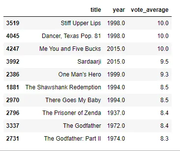
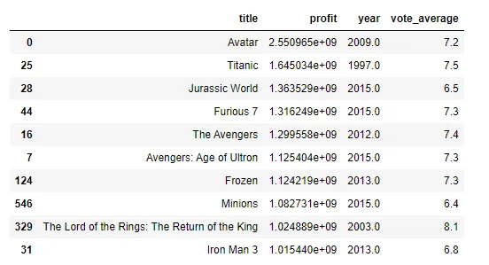
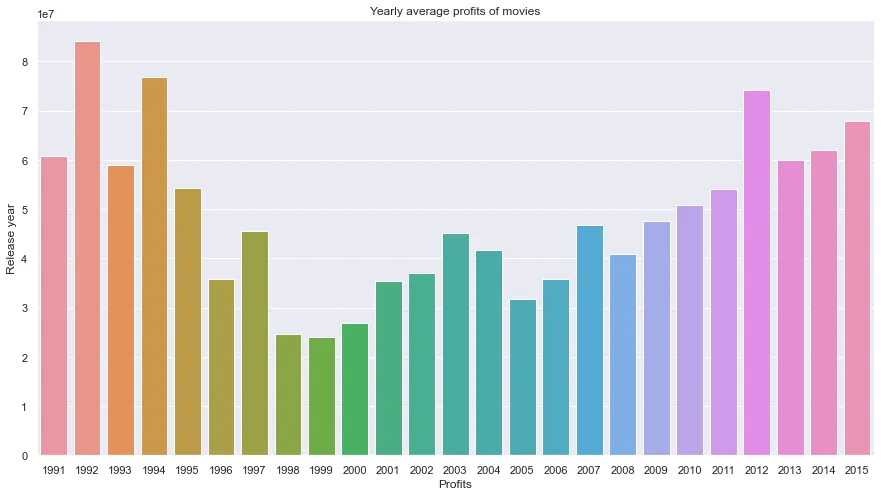
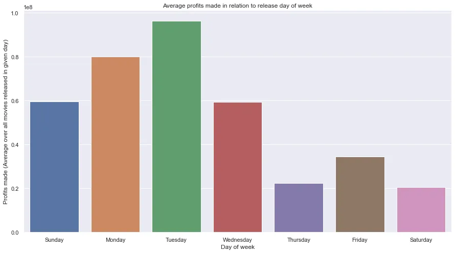
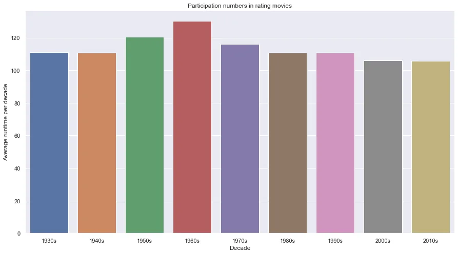
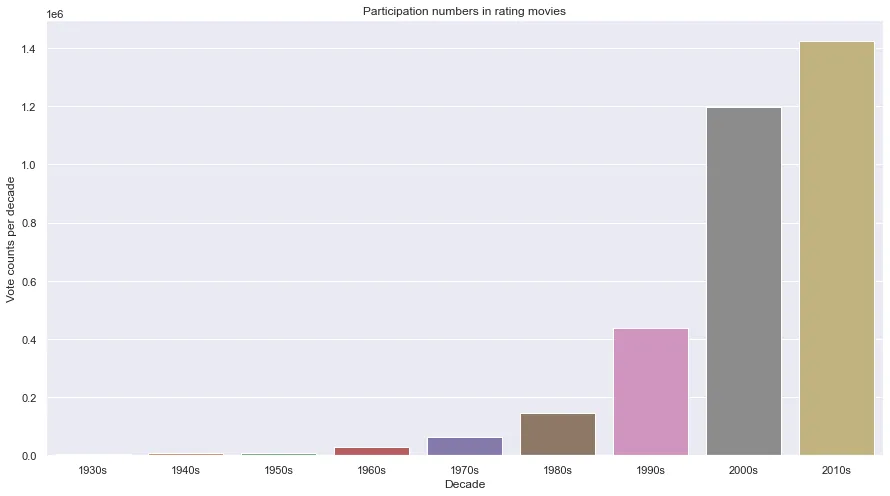
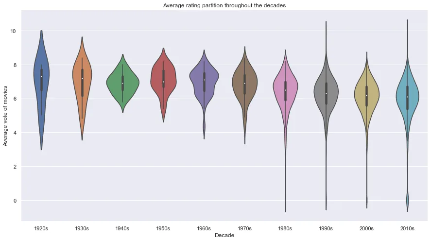
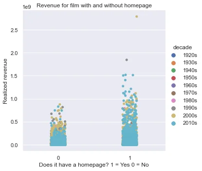

So, I bet everyone loves movies and we love the hype while waiting for a hot release (I'm projecting my current state!).

Throughout this post, we'll be looking at some key insights on a dataset that has information on ~5000 movies. We'll be looking at the profits, votes, popularity, and other variables. One of the first things to learn about is obviously, what is **EDA (Exploratory Data Analysis)**?

Well, according to Wikipedia:

> In statistics, exploratory data analysis is an approach of analyzing data sets to summarize their main characteristics, often using statistical graphics and other data visualization methods.

Most likely, wherever you go, that's the definition you'll stumble upon. To restate the definition in pipeline steps to go through an EDA:

1. **Load and preprocess your data**
2. **Extracting Statistical summaries**
3. **Visualize your data**

Throughout this post, we'll be going through these steps while we work on our dataset. Therefore, let's learn a bit about our dataset first.

This is the general intro description of the TMDB-5000:

> What can we say about the success of a movie before it is released? Are there certain companies (Pixar?) that have found a consistent formula? Given that major films costing over $100 million to produce can still flop, this question is more important than ever to the industry. Film aficionados might have different interests. Can we predict which films will be highly rated, whether or not they are a commercial success?

> This is a great place to start digging in to those questions, with data on the plot, cast, crew, budget, and revenues of several thousand films.

You can find the dataset (along with that description) on [Kaggle.](https://www.kaggle.com/datasets/tmdb/tmdb-movie-metadata)

Some of the fields (not all) in the dataset are as follows:

- **Data Description id** - Integer unique id of each movie
- **belongs_to_collection** - Contains the TMDB Id, Name, Movie Poster, and Backdrop URL of a movie in JSON format. You can see the Poster and Backdrop Image like this: <https://image.tmdb.org/t/p/original/>. Example: <https://image.tmdb.org/t/p/original//iEhb00TGPucF0b4joM1ieyY026U.jpg>
- **budget**: Budget of a movie in dollars. 0 values mean unknown.
- **genre**: Contains all the Genres Name & TMDB Id in JSON Format
- **homepage** - Contains the official homepage URL of a movie. Example: <http://sonyclassics.com/whiplash/>, this is the homepage of the Whiplash movie.
- **imdb_id** - IMDB id of a movie (string). You can visit the IMDB Page like this: <https://www.imdb.com/title/>
- **original_language** - Two-digit code of the original language, in which the movie was made. Like: en = English, fr = french.
- **original_title** - The original title of a movie. The title & Original title may differ if the original title is not in English.
- **overview** - Brief description of the movie.
- **popularity** - Popularity of the movie in float.
- **poster_path** - Poster path of a movie. You can see the full image like this: <https://image.tmdb.org/t/p/original/>
- **production_companies** - All production company names and TMDB id in JSON format of a movie.
- **production_countries** - Two-digit code and the full name of the production company in JSON format.
- **release_date** - The release date of a movie in mm/dd/yy format.
- **runtime** - Total runtime of a movie in minutes (Integer).
- **spoken_languages** - Two-digit code and the full name of the spoken language.
- **status** - Is the movie released or rumored?
- **tagline** - Tagline of a movie
- **title** - English title of a movie
- **Keywords** - TMDB Id and name of all the keywords in JSON format.
- **cast** - All cast TMDB id, name, character name, gender (1 = Female, 2 = Male) in JSON format
- **crew** - Name, TMDB id, profile path of various kind of crew members job like Director, Writer, Art, Sound, etc.
- **revenue** - Total revenue earned by a movie in dollars.

The dataset is comprised of two files:

- **tmdb_5000_movies.csv:** Contains the general information of movies and performance indicators (name, data, id, popularity, vote_count, vote_average, revenue, budget, etc.)
- **tmdb_5000_credits.csv:** Contains the credits that more or less you see at the end of a movie, which is comprised of the crew and the cast that participated in the movies.

**Loading and preprocessing the data:**

The first step is **joining the tables.** This action goes by cross-referencing the ids on the left table(movie_df) and matching it with the corresponding line in the right table(credits_df). This can be done with the **merge** function from pandas.

```python
movie_df = pd.read_csv('data/movies/tmdb_5000_movies.csv')
credits_df = pd.read_csv('data/movies/tmdb_5000_credits.csv')
combine = pd.merge(movie_df, credits_df, left_on = 'id', right_on = 'movie_id') #Left merge by id
```

The next step is to work on preprocessing our new table with the goal of using it later for information extraction. One of the first things we can notice in the table is that there are **JSON** columns as shown in the figure. We have to make the values in the JSON values accessible. This can be done via the **json.loads** function. The result will be a dictionary having the same keys and values as the initial json format (it's inside a list but that wouldn't add in too much difficulty for values access).

The goal is the iterate through the columns in each line that contain JSON values and extract them via the **apply** method. Applying functions to columns is an easy way of processing a whole column without having manually iterate through the values ourselves. All you'd need is a function that has a clear input and output defined (In our case, json.loads fits that condition). the next step is to get rid of the extra columns from our merge operation.

```python
def process_df(df):
    df['release_date'] = pd.to_datetime(df['release_date'])
    json_cols = ['genres', 'keywords', 'production_countries', \
                 'production_companies', 'spoken_languages', 'cast', 'crew']
    for col in json_cols:
        df[col] = df[col].apply(json.loads) #Load the JSON columns
    return df
final_movies_df = process_df(combine)

del final_movies_df['movie_id'], final_movies_df['id'] #No need for the id of the movies once the tables are joined

del final_movies_df['title_x'] #not needed (rendundancy of two titles because of merge)

del final_movies_df["tagline"]  #it doesn't really hold any information

final_movies_df.rename(columns={'title_y':'title'}, inplace=True) #rename col

final_movies_df = final_movies_df[final_movies_df['status'] == 'Released'] #keep only released movies

del final_movies_df['status'], final_movies_df['original_title'] #no need for these columns anymore
```

Now we proceed into the preprocessing that would help us visualize some information.

One of the variables we'll be studying, later on, is the effect of having a homepage on the revenue of a movie. Given that we have a column that contains the homepage URL(link) of the movie's homepage, we'll be setting it in a binary manner. If there is a link then the movie made use of a homepage, if it doesn't then there was no website advertisement.

```python
final_movies_df['has_homepage'] = 0
final_movies_df.loc[final_movies_df['homepage'].isnull() == False, 'has_homepage'] = 1
final_movies_df = final_movies_df.drop(['homepage'], axis = 1) #no need for the link anymore
```

Cleaning the budget and runtime columns is also of utmost importance for later visualizations. As stated in the description, some movies have unknown budgets and/or revenues which are set to 0 in the dataset. For our purposes, we can be content with **setting the mean value of the columns to the undefined values**. This can also be done with the **fillna** method of pandas.

```python
final_movies_df.loc[final_movies_df["budget"] == 0.0,  a"budget"] = final_movies_df["budget"].mean() #mean for null values
final_movies_df.loc[final_movies_df["runtime"] == 0.0, "runtime"] = final_movies_df["runtime"].mean() #mean for null values
```

Next, we extract some new variables related to the release date. We'll be using the **datetime(dt) functions** to extract the year, month, day, and day of week information related to the release date.
We'll also be creating the **profit** variable to study the monetary success of movies.

```python
final_movies_df["year"] = final_movies_df["release_date"].dt.year #get year
final_movies_df["month"] = final_movies_df["release_date"].dt.month #get month
final_movies_df["day"] = final_movies_df["release_date"].dt.day #get day
final_movies_df["dow"] = final_movies_df["release_date"].dt.dayofweek #get dow for visualization
final_movies_df["profit"] = final_movies_df["revenue"] - final_movies_df["budget"] #calculate profit
```

Just like music, movies are also viewed based on the decade they released in. "Oh the 90s movies were so much better than 2000s and 2010s". We'll see how that statement holds on later on ;). **We'll be creating a transformation function that takes the year as input and changes it to a decade (by removing the last digit of the year and changing it with a 0) then we apply it to the release year to create our "decade" column.**

```python
def extract_decade(x):
    return str(floor(x/10)*10)+"s" #Change the last digit with 0 and add "s" => 2015 => "2010s"

final_movies_df= final_movies_df.fillna(0)
final_movies_df["decade"] = final_movies_df["year"].apply(extract_decade)
final_movies_df = final_movies_df[(final_movies_df['decade'] != '1910s') & (final_movies_df['decade'] != '0s')] #outliers
final_movies_df = final_movies_df.sort_values(by=['decade'], ascending=True)
```

Well, that takes care of our preprocessing step. Now it's time to create some random fun facts about the dataset via some numbers.

**Runtime statistics of movies:** One of the metrics that we can look at is the description runtime of movies. As that statement just mentioned, Pandas offers a function that describes a column via some key statistics.

We can achieve this task with the following code:

```python
print('The run time statistics are as follows')
print(final_movies_df["runtime"].describe()[['mean','std','25%','50%','75%','max']])
max_runtime_id = final_movies_df["runtime"].idxmax()
print(final_movies_df.loc[max_runtime_id][['title','runtime','year']])
```

The resulting output is as follows:

- The run time statistics are as follows
  **mean** 107.610098
  **std** 20.758394
  **25%** 94.000000
  **50%** 104.000000
  **75%** 118.000000
  **max**  338.000000

The **average run time of movies is ~107-108 minutes** and shares a median relatively close to the average. While the standard deviation and 25%-75% ranges indicate that the runtime can still vary by a long shot from the mean/median. This is proven by the length of max length which is at a huge 338 minutes. Of course, out of curiosity, I wanted to know about the movie that ran for **more than 5 and a half hours**! This can be done via the **idxmax** function that can extract the index of the maximum value.

```python
max_runtime_id = final_movies_df["runtime"].idxmax() #locate the movie with the max runtime
print(final_movies_df.loc[max_runtime_id][['title','runtime','year']])
```

**\*drumrolls\*** the movie with the highest runtime is:

- **title:**  [Carlos](https://fr.wikipedia.org/wiki/Carlos_(film,_2010))
  **runtime:** 338.0
  **year:**  2010.0

I am not as much of a movie enthusiast as I wouldn't really go into the details about the movie. But, I left the link for the truly curious ones ;).

**The most popular movie:** On another note, let's explore the most popular movie according to the **popularity metric** of the dataset. We'll do the locating the same way we figured out the longest movie in the dataset.

```python
pop = final_movies_df["popularity"].idxmax()
print(final_movies_df.loc[pop][['title','profit','year','vote_average']])
```

This yields the following:

- **title** Minions
  **profit**  1082730962.0
  **year** 2015.0
  **vote_average** 6.4

Somehow am not even surprised, that movie blew up really hard (and that's why now it's a whole franchise). But one thing really stands out, the **average rating is 6.4**. By no means I'd go as far as saying a movie with 6.5 stars would be bad, but somehow it's the most popular one. One thing I can think of is the fact that movies blew up with children more than adults. Yet, I highly doubt most kids would have access to voting movies nor would they really care about doing that. This might be why the vote average is weighed down by the "harsher" criticism of adults. What do you think?

Vote average: On our next stop, let's explore more the **vote average metric** and look at the **top 10 movies in regards to rating**. How many movies do you think over many decades have a perfect rating? To do this, we'll exploit the **nlargest** methods which extract the "n" rows' associated with the largest values in a certain column.

```python
top = final_movies_df.nlargest(10,'vote_average')
print('Most voted')
top[['title','year','vote_average']]
```

This gives us the following result:



There are two things that stood out to me. First one, the hailing of the 1900s movies is still quite a dominant opinion as I thought it is. 8 out of the top 10 movies are from before the 21st century. And the second one is that **out of almost 5000 movies, only 3 made it with a perfect rating!! And that's no exaggeration considering that the 4th is at 9.5.** One would imagine that there would be a competition in the high 9 stars. **Be reminded though, that this is only limited to the movies in the dataset. I am pretty sure that TMDB's current website would show different results.**

Finally, we'll do the same exploring for the **most profitable movies** in the dataset. Code-wise the only difference is that we'll be using the **profits** column that we created earlier.

```python
most_profits = final_movies_df.nlargest(10,'profit')
most_profits[['title','profit','year','vote_average']]
```

We get the following result:



I think we all know how huge the avatar movie was (Even though I myself didn't watch the movie). The most amazing thing to see here is that the **Titanic movie is standing tall at 2nd place even though most of its popularity was in the 2000s**. This is a huge feat because we have to take into account the inflation of money throughout the last 2 decades. Another thing to note is the fact that the vote_average and profit aren't really correlated(when it comes to the top movies at least).

Now for some fun before we go into the visualizations. Let's create a word cloud of the genres in our dataset and see the most prominent ones.

```python
list_of_genres = list(final_movies_df['genres'].apply(lambda x: [i['name'] for i in x] if x != {} else []).values) #Our columns are now lists with dictionnaries embedded (we extract the names from them)
print(len(list_of_genres))
plt.figure(figsize = (12, 8))
text = ' '.join([i for j in list_of_genres for i in j]) #we get a final long word list that contains all the present genres
# print(text)
wordcloud = WordCloud(max_font_size=None, background_color='white', collocations=False,
                      width=1200, height=1000).generate(text)
plt.imshow(wordcloud)
plt.title('Top genres')
plt.axis("off")
plt.show()
```

Word cloud analyses the frequency of words in a given text and generates an image that shows the size of words weighed by their frequency.


According to the word cloud, the most present genres in the dataset are **Drama, Comedy, Thriller, and romance**.

Now, we can move on to the last part of our EDA. It's the visualizations.

**Average yearly profits:** One thing of interest would be how profits from movies are evolving yearly. We'll be grouping our movies by their release year and averaging out their profits. To achieve this we'll be using the **groupby** method from pandas. When grouping by certain columns we have to specify whether we want to **aggregate** other columns. Aggregating means summarizing the results instead of keeping separate lines. One aggregate operation would be **averaging the values,** extracting **the max/min of the lines in a certain group.**

```python
profits_per_year = final_movies_df[(final_movies_df["year"]>1990) & (final_movies_df["year"] <2016)].groupby("year").agg({"profit":"mean"})
profits_per_year.index = profits_per_year.index.astype(int)

sns.barplot(profits_per_year.index,y='profit',data=profits_per_year)
plt.xlabel('Profits')
plt.ylabel('Release year')
plt.title('Yearly average profits of movies')
plt.show()
```

The result is as follows:



The one thing that simply stood out to me, was the downward curve of before climbing back in profits later in the 2000s and 2010s. I thought the inflation of money would play a big role in the skewing of the results. But because some movies can live for a long time in cinemas (Example: Titanic) They keep on racking profits throughout the years.
Although to be completely fair, one can also assume that there might be some unbalanced yearly samples of movies in the dataset and some years would be missing a lot of profitable movies. But this graph proves yet again that the 90s movies are something not to be reckoned with.

**Day of week release:** While we're at the subject of time and profits. Let's check the effect of day-of-week release on the profits of a movie. We'll be using the **groupby** operation but using the "dow" column instead we created in the preprocessing phase.

```python
profit_by_dow = final_movies_df[final_movies_df["year"]>1990].groupby(["dow"]).profit.mean().reset_index()
days = ['Sunday','Monday','Tuesday','Wednesday','Thursday','Friday','Saturday']
sns.barplot(x=days,y='profit',data=profit_by_dow)
plt.xlabel('Day of week')
plt.ylabel('Profits made (Average over all movies released in given day)')
plt.title('Average profits made in relation to release day of week')
plt.show()
```

The result is as follows:



This result at first felt quite counter-intuitive at first. My assumption was that it would be more skewed towards the weekend rather than the early weekdays. One of the reasons I can think of is that movies released on the early weekdays create a lot of "hype" and word-of-mouth advertisement which has a lot more people excited for the weekend to watch the movie.

**Average runtime:** Seeing the standard deviation on the runtime from the early results made me curious about how it faired up throughout the years. I guess now we'll figure that out. One key difference, we'll be grouping by **decade** instead this time.

```python
df = final_movies_df #temp manipulation
df_by_vote = df.groupby(['decade']).runtime.mean().reset_index()[1:] #remove 0s decade
sns.barplot(x='decade',y='runtime',data=df_by_vote)
plt.xlabel('Decade')
plt.ylabel('Average runtime per decade')
plt.title('Participation numbers in rating movies')
plt.show()
```

The result is as follows:



I guess overall, that's the interval of time where you can captivate a viewer's attention. From the looks of it, the result coincides with the **107 minutes** overall average we discovered earlier. although after a high peak in the 1960s it started decreasing steadily. Especially in the 2000s as they have an all-time low average. Considering, that the trend is that we have shorter video content that we consume every day, we might be converging to even lower time intervals in the future.

**Viewers' participation in voting:** For this part (and the next one) we'll be studying the viewers' reviews. The first metric will be studying their engagement in actually voting and rating the movies they watched. We'll be checking these metrics partitioned throughout decades.

```python
df = final_movies_df #temp manipulation
df_by_vote = df.groupby(['decade']).vote_count.sum().reset_index()[1:] #remove 0s decade
sns.barplot(x='decade',y='vote_count',data=df_by_vote)
plt.xlabel('Decade')
plt.ylabel('Vote counts per decade')
plt.title('Participation numbers in rating movies')
plt.show()
```

The result is as follows:



I think for once, the result was as I envisioned. We can clearly see the role technology plays in the vote counts as it evolved through time. One can only guess that at first, rating a movie would've been a tedious process for the viewers or only left to critics. But as time went by and the internet became accessible to everyone, more people became able to participate in the rating process. Also, some movies' popularities died in their decades so one can imagine that they didn't get the chance to be rated later on.

**Average ratings per decade:** Now that we know the evolution of viewers' participation in the rating process, one can only wonder how the rating itself evolved through time. For this, we'll be using a **violin plot.** this plot allows us to see the distribution of the votes while grouped by certain criteria. In this case, we'll be splitting them through the decades to match them with the participation.

```python
sns.violinplot(x='decade',y='vote_average',data=final_movies_df)
plt.title('Average rating partition throughout the decades')
plt.xlabel('Decade')
plt.ylabel('Average vote of movies')
plt.show()
```

The result is as follows (You can scroll up a bit to match it with the other plot but you can just note earlier, we witnessed an exponential increase in the vote counts):



This actually matches very well with a timeline where technology evolved and movie production became more accessible, as well as rating became more accessible. Through 1920s-1970s we can see a tight distribution of votes which corresponds to the low participation of viewers' in the voting process. As well as the fact that there isn't as many movies in that time compared to the last part of the 20th century and the start of the 21th century. But later on, as the industry grew, we can the spread of the ratings (especially the lows and highs) going as low as 0. As the barrier of entry became lower, we were bound to see catastrophically bad movies.

**The effect of homepage:** As a final part, we'll be looking at one of the advertising tools movies use to appeal to their viewers. That being the homepage dedicated for the movie's release. If you remember earlier, we created a column where we note if a movie has a homepage or not by scanning the URLs in the "homepage" column. For this plot, we'll be using seaborn's **catplot (**categorical plot). It's quite similar to the bar plot in a visual sense, but it holds much more information as it plots individual samples. We'll be also separating the samples by decade. We'll be measuring the contribution of the homepage via the revenue of movies.



The first thing to notice is that there seems to be an actual benefit to having a homepage as an advertisement tool. But, this effect seems to be limited to the movies from the 21st century as we can see in the second bar. All the movies that profited the most whilst having a homepage are from the 21st century aside from one movie from the 1990s.

On the last note, I hope reading this post was fun and worthwhile for you. Feel free to check out the [notebook](https://github.com/zqngetsu96/DataInsight_Assignments_and_projects/blob/main/Capstone/TMDB-5000%20EDA.ipynb) and explore more results.

Thank you for your time, and see you in my next post!
