## 1)Measures of Central Tendency
#### measures of Central Tendency is a summary measure that describes a whole set of data with a single value that represents the middle or centre of its distribution. we have 3 measures of central tendency: the mode, the median and the mean

1)Mode: is the most commonly occurring value in a distribution.

2)median : is the middle value in distribution when the values are arranged in ascending or descending order.(used when there is outliers)

3)mean : is the sum values in a dataset over the the number of values in a dataset ( is sutable for unifrom dataset , affected by ouliers)

```python
import pandas as pd
import numpy as np
import matplotlib.pyplot as plt
```

```python
df = pd.read_csv('loan_data_set.csv')
df.head()
```

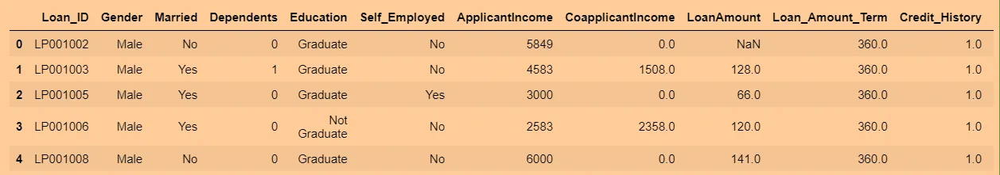

```python
df['ApplicantIncome'].agg([np.mean , np.median ])
```

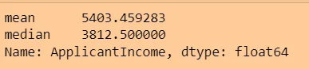

```python
df['ApplicantIncome'].hist()

plt.axvline(df['ApplicantIncome'].mean(), color='k', linestyle='dashed', linewidth=1)
plt.axvline(df['ApplicantIncome'].median(), color='r', linestyle='dashed', linewidth=1)

plt.show()
```

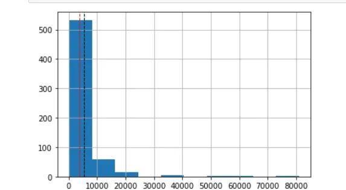

```python
df['ApplicantIncome'].mode()
```

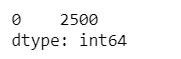

## 2)Confidence Interval
### Confidence Interval :a confidence interval displays the probability that a parameter will fall less or more than the mean.

### measure the degree of uncertainty or certainty in a sampling method. They can take any number of probability limits, with the most common being a 95% or 99% confidence level. Confidence intervals are conducted using statistical methods, such as a t-test.

## 3)central limit theorem
### The central limit theorem (CLT) states that the distribution of sample means approximates a normal distribution as the sample size gets larger

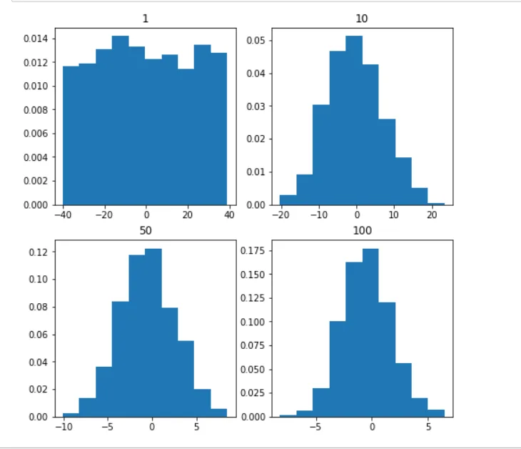

## 4)covariance and correlation
### Covariance:Covariance signifies the direction of the linear relationship between the two variables. By direction we mean if the variables are directly proportional or inversely proportional to each other. (Increasing the value of one variable might have a positive or a negative impact on the value of the other variable).

### correlation:Correlation analysis is a method of statistical evaluation used to study the strength of a relationship between two, numerically measured, continuous variables. It not only shows the kind of relation (in terms of direction) but also how strong the relationship is.

```python
df = pd.read_csv('loan_data_set.csv')
#the correlation between every numeric value in dataset
df.corr(method = 'kendall')
```

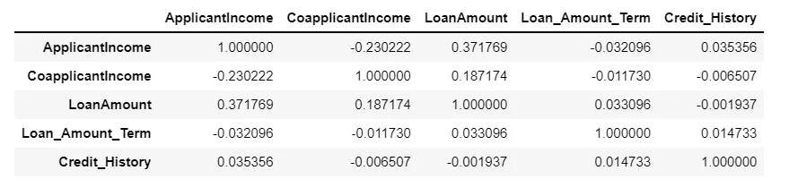

```python
#bringing the covariance between each numric varaibles
df.cov()
```

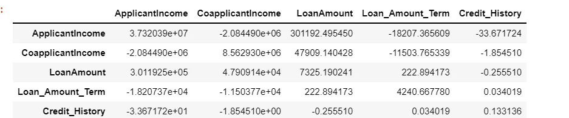

## 5)Normal distribution
### normal distribution = a probability distribution that is symmetric about the mean

```python
mu, sigma = 0, 0.1 # mean and standard deviation
s = np.random.normal(mu, sigma, 1000)
```

```python
#Verify the mean and the variance:
abs(mu - np.mean(s))
```

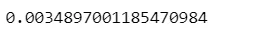

```python
abs(sigma - np.std(s, ddof=1))
```

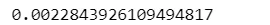

```python
#Display the histogram of the samples, along with the probability density function:
import matplotlib.pyplot as plt
count, bins, ignored = plt.hist(s, 30, density=True)
plt.plot(bins, 1/(sigma * np.sqrt(2 * np.pi)) *
               np.exp( - (bins - mu)**2 / (2 * sigma**2) ),
         linewidth=2, color='r')
plt.show()
```

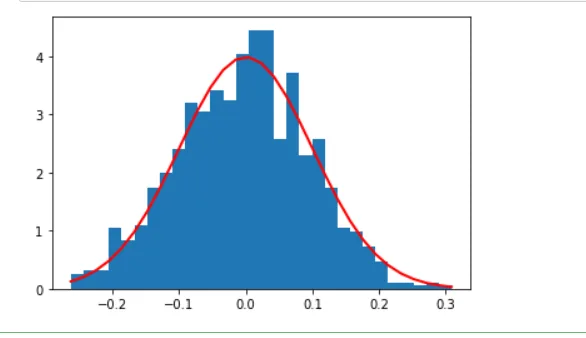

## 6)population and samples
### population and sample population is the whole dataset ,sample is a subset of the population

### Samples are used when : The population is too large to collect data. The data collected is not reliable. The population is hypothetical and is unlimited in size.

### there are 2 ways of taking samples: 1)with replacement 2)without replacement.

```python
sample =df.sample(n=100)
sample.head()
```

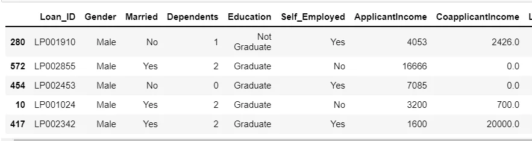

## 7)Regression
regression: determine the strength of the relationship between one dependent variable (usually denoted by Y) and a series of independent variables.

Linear regression:its the relationship between a numeric depndent variable and one or more independent variables.

Logistic regression: its relationship between the binary dependent variable and one or more independent variables.

## 8)standerd devition
Standard Deviation: It is a statistic that calculates the dispersion of a data set as compared to its mean.

```python
sd = np.std(df['ApplicantIncome'], ddof=1)
print("Standard Deviation:", sd)
```

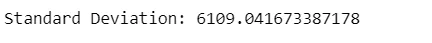

## 9)Statistical bias
Statistical bias:it calculates the differences between results and facts , Bias implies that the data selection may have been skewed by the collection criteria.

for example to investigate people's selling habits. If the sample size is not large enough, the results may not be representative of the selling habits of all the people. That is, there may be big difference between the survey results and the actual results. Therefore, understanding the source of statistical bias can help to assess whether the observed results are close to the real results.

## 10)Variance
is a measure of variability. It is calculated by taking the average of squared distance between data point and the mean. Variance tells you the degree of spread in your data set. The more spread the data, the larger the variance is in relation to the mean.

```python
var = np.var(df['ApplicantIncome'] ,ddof = 1)
print("Variance:", var)
```


