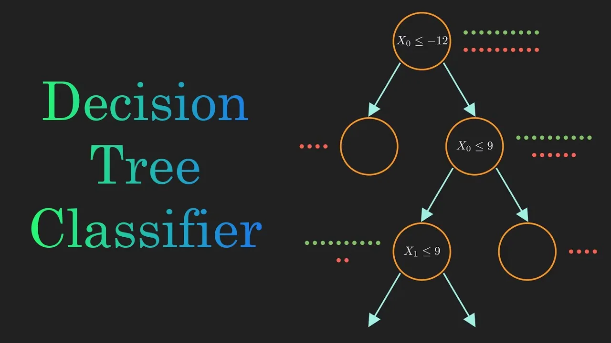
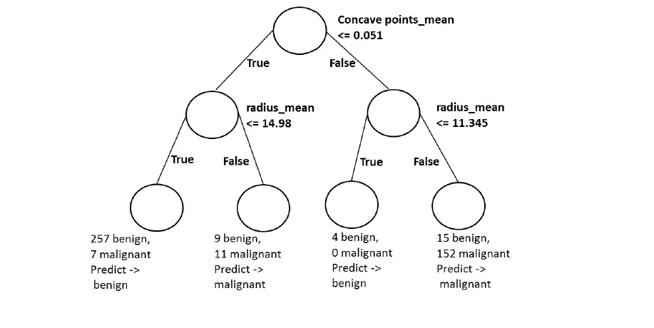
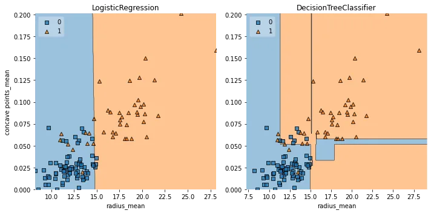

## Classification Tree
A classification tree is a structural mapping of binary decisions that lead to a decision about the class (interpretation) of an object. Although sometimes referred to as a decision tree, it is more properly a type of decision tree that leads to categorical decisions.

- Objective: infer class labels
- Able to capture non-linear relationships between features and labels.
- Don't require feature scaling (ex: Standardization)



## Decision Tree
Decision Tree is the most powerful and popular tool for classification and prediction. A Decision tree is a flowchart-like tree structure, where each internal node denotes a test on an attribute, each branch represents an outcome of the test, and each leaf node (terminal node) holds a class label.

## Decision Tree in Scikit-Learn
```python
import pandas as pd
import numpy as np
import matplotlib.pyplot as plt
```

```python
# Load data
df = pd.read_csv("/content/wbc.csv")
df.head(20)
```

We'll predict whether a tumor is malignant or benign based on two features: the mean radius of the tumor (radius_mean) and its mean number of concave points (concave points_mean)

```python
X = df[["radius_mean", "concave points_mean"]]
y = df["diagnosis"]
y = y.map({'M':1, 'B':0})
```

```python
# Split the dataset
from sklearn.model_selection import train_test_split
X_train, X_test, y_train, y_test = train_test_split(X, y,
    test_size = 0.2, random_state=1, stratify = y)
```

```python
# Import DecisionTreeClassifier from sklearn.tree
from sklearn.tree import DecisionTreeClassifier
# Instantiate a DecisionTreeClassifier 'dt' with a maximum depth of 6
dt = DecisionTreeClassifier(max_depth=6, random_state=1)
# Fit dt to the training set
dt.fit(X_train, y_train)
# Predict test set labels
y_pred = dt.predict(X_test)
print(y_pred[0:5])
```

```python
[0 0 0 1 0]
```

```python
# Import accuracy_score
from sklearn.metrics import accuracy_score
# Predict test set labels
y_pred = dt.predict(X_test)
# Compute test set accuracy
acc = accuracy_score(y_test, y_pred)
print("Test set accuracy: {:.2f}".format(acc))
```

```python
Test set accuracy: 0.89
```

## Logistic regression vs classification tree
A classification tree divides the feature space into rectangular regions. In contrast, a linear model such as logistic regression produces only a single linear decision boundary dividing the feature space into two decision regions.

```python
# Import LogisticRegression from sklearn.linear_model
from sklearn.linear_model import  LogisticRegression
# Instatiate logreg
logreg = LogisticRegression(random_state=1)
# Fit logreg to the training set
logreg.fit(X_train, y_train)
# Define a list called clfs containing the two classifiers logreg and dt
clfs = [logreg, dt]
# Review the decision regions of the two classifiers
plot_labeled_decision_regions(X_test, y_test, clfs)
```



## Classification tree Learning
Building Blocks of a Decision-Tree Decision-Tree: data structure consisting of a hierarchy of nodes

- Node: question or prediction Three kinds of nodes
- Root: no parent node, question giving rise to two children nodes. Internal node: one parent node, question giving rise to two children nodes.
- Leaf: one parent node, no children nodes --> prediction.

## Criteria to measure the impurity of a note :
- gini index
- entropy etc...

```python
# Entropy
from sklearn.tree import DecisionTreeClassifier
# Instantiate dt_entropy, set 'entropy' as the information criterion
dt_entropy = DecisionTreeClassifier(max_depth=8, criterion='entropy', random_state=1)
# Fit dt_entropy to the training set
dt_entropy.fit(X_train, y_train)
```

```python
# Ginidt_gini = DecisionTreeClassifier(max_depth=8, criterion='gini', random_state=1)
dt_gini.fit(X_train, y_train)
```

## Entropy vs Gini index
```python
from sklearn.metrics import accuracy_score
# Use dt_entropy to predict test set labels
y_pred = dt_entropy.predict(X_test)
y_pred_gini = dt_gini.predict(X_test)
# Evaluate accuracy_entropy
accuracy_entropy = accuracy_score(y_test, y_pred)
accuracy_gini = accuracy_score(y_test, y_pred_gini)
# Print accuracy_entropy
print("Accuracy achieved by using entropy: "accuracy_entropy)
# Print accuracy_gini
print("Accuracy achieved by using gini: ", accuracy_gini)
```

```python
Accuracy achieved by using entropy:  0.8859649122807017
Accuracy achieved by using gini:  0.9210526315789473
```

Most of the time, the gini index and entropy lead to the same results. But here are few diffrence. The gini index is slightly faster to compute and is the default criterion used in the DecisionTreeClassifier model of scikit-learn.

[GitHub Link](https://github.com/abubinfahd/Data-Insight/blob/main/Assignments/Tree_Based_Model_Classification_Tree_.ipynb)
