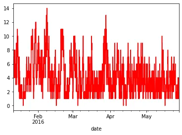
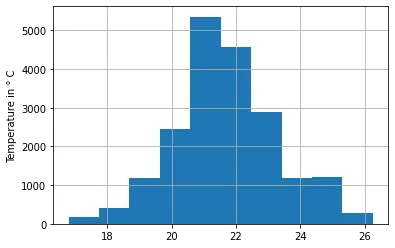
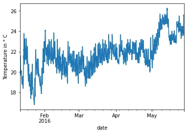

After cleaning the data, the visualization follows to facilitate the understanding. To do this, we need to draw curves. These in Python are not enough and we need the NumPy and matplotlib libraries.

We use dataset from [https://archive.ics.uci.edu](https://archive.ics.uci.edu/).

**Dataset description**: The data set is at 10 min for about 4.5 months. The house temperature and humidity conditions were monitored with a ZigBee wireless sensor network. Each wireless node transmitted the temperature and humidity conditions around 3.3 min. Then, the wireless data was averaged for 10 minutes periods. The energy data was logged every 10 minutes with m-bus energy meters. Weather from the nearest airport weather station (Chievres Airport, Belgium) was downloaded from a public data set from Reliable Prognosis (rp5.ru), and merged together with the experimental data sets using the date and time column. Two random variables have been included in the data set for testing the regression models and to filter out non predictive attributes (parameters).

```python
import pandas as pd
import numpy as np
import matplotlib.pyplot as plt

path = "https://archive.ics.uci.edu/ml/machine-learning-databases/00374/energydata_complete.csv"

df_energy = pd.read_csv(path)
display(df_energy.head(5))
```

We will change the data type and also put it as an index. The code belows illustrate it:

```python
#change data type
df_energy["date"] = pd.to_datetime(df_energy["date"], dayfirst=True)
df_energy.head(5)

#date as an index
df_energy = df_energy.set_index(['date'])
```

the curve below shows the evolution of the wind as a function of the date.

```python
df_energy["Windspeed"].plot(color="red")
```



There is anplot which present the disdribution of the temperature as a function of the date.

```python
df_energy["T1"].hist()
plt.ylabel("Temperature in ° C")
plt.show()
```



There is anothe plot which shows also the evolution of the temperature as a function of the date.

```python
df_energy["T1"].plot()
plt.ylabel("Temperature in ° C")
plt.show()
```


