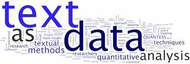

***“Torture the data, and it will confess to anything.”***

***– Ronald Coase***

One of the biggest breakthroughs when it comes to preprocessing your data in order to feed it to your model so that you can achieve very relevant predictions, is dealing with text data.

It is imperative for any organization to have a structure in place to extract actionable insights from text. From social media analytics to risk management and cybercrime protection, dealing with text data has never been more crucial.

Throughout this blog we’ll be working with the [***IMDB DATASET OF MOVIES REVIEWS***](https://www.kaggle.com/datasets/lakshmi25npathi/imdb-dataset-of-50k-movie-reviews?select=IMDB+Dataset.csv), let’s first explore it and see what’s in it:

```python
imdb = pd.read_csv('/content/drive/MyDrive/IMDB Dataset.csv')[:20001]
imdb
```

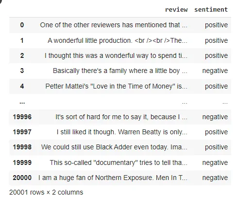

Before doing anything, let's try and feed this data to a NaiveBayes Model and see what we're going to get as a result:

- First, we split the data:

```python
# Split the dataset according to the class distribution of category_desc, using the filtered_text vector
train_X, test_X, train_y, test_y = train_test_split(imdb1['review'],imdb1['sentiment'],test_size=0.2, random_state=42)
```

- Then, fit the model:

```python
#create your model
nb = GaussianNB()

# Fit the model to the training data
nb.fit(train_X,train_y)

#predict
y_pred = nb.predict(Test_X)

print(nb.score(Test_X,test_y))
print(accuracy_score(test_y,y_pred))
```

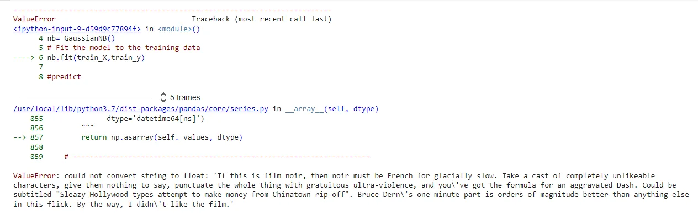

We get a ValueError, what for? because, It is easier for any programming language to understand textual data in the form of numerical value, but he can't just process it alone. So, it's up to us to do the dirty work!

**- Encoding categorical variables:** contained in sentiment column, we can use pd.get_dummies() and the OneHotEncoder() for that purpose. Or, you can do it like me: apply a lambda funtion to the sentiment columns by replacing positive by 1 and negative for 0. Then put the new variables into a new column called 'labels':

```python
imdb['labels'] = imdb['sentiment'].apply(lambda s: 1 if s == 'positive' else 0)
imdb
```

Then, drop the sentiment column, because we no longer need it:

```python
imdb=imdb.drop('sentiment',axis=1)
imdb.head()
```

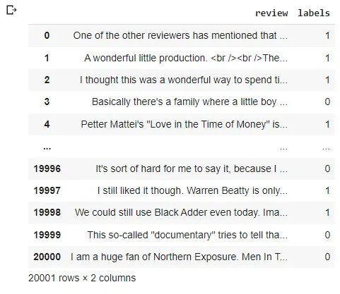

**- Basic Feature Extraction using text data:** Before you can leverage text data in ML models, you must transform it into a series of culumns of numbers or vectors:

- Number of Words: Generally, the negative reviews have lesser amount of words than the positive ones. So, we can start by extracting the number of words from each review:

```python
#Calculate the number of words
imdb['word_cnt'] = imdb['review'].str.split().str.len()
imdb.head()
```

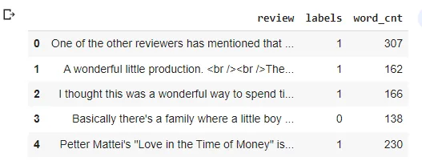

- Number of Characters:It is done by calculting the length of each review:

```python
#Calculate the number of chars in each text
imdb['char_cnt'] = imdb['review'].str.len()
imdb.head()
```

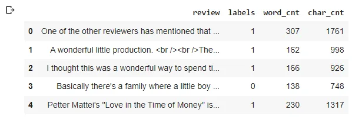

- Average Word Length: We simply take the number of char and divide them by the number of words:

```python
#Average word length
imdb['avg'] = imdb['char_cnt']/imdb['word_cnt']
imdb.head()
```

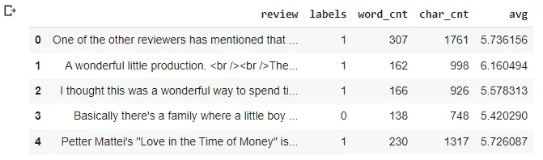

- Number of Numerics: We can also calculate the number of numerics present in each review:

```python
imdb['numerics'] = imdb['review'].apply(lambda x: len([x for x in x.split() if x.isdigit()]))
imdb.head()
```

-Number of Uppercase Words: The ANGER is usually expressed in uppercase words because it is found more expresssive of the tension going on! So it is a good step to identify those words:

```python
imdb['upper'] = imdb['review'].apply(lambda x: len([x for x in x.split() if x.isupper()]))
imdb.head()
```

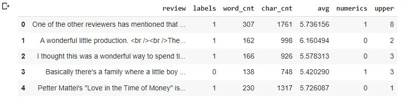

**- Basic Preprocessing:** Now, that we are aware that there's numerics values contained in out reviews and uppercas words..etc, we need to do some cleaning in order to get better features.

- Lower Case: The first pre-processing step which we will do is transform our reviews into lower case. This avoids having multiple copies of the same words: Family and family we'll be taken for different words.

```python
imdb['review'] = imdb['review'].str.replace('[^a-zA-Z]',' ').str.lower()
```

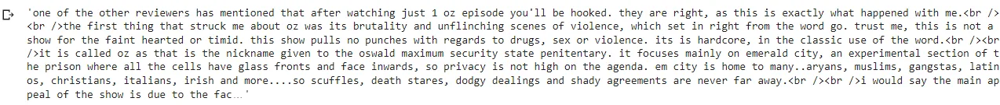

- Removing non-letter words: we mean by it numerical values, special characters, ponctuation...etc

```python
imdb['review'] = imdb['review'].str.replace('[^a-zA-Z]',' ')
imdb['review'].iloc[0]
```

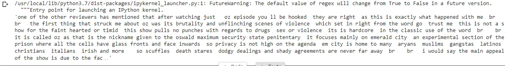

-Common Words Removal: Let' check the 15th most occuring words in the reviews:

```python
common = pd.Series(' '.join(imdb['review']).split()).value_counts()[:15]
common
```

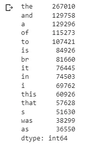

We can see that these words are meaningless and will not add anything into our analysis yet the performance of our model so we need to remove them:

```python
imdb['reviews'] = imdb.review.apply(lambda x: " ".join(x for x in x.split() if x not in common))
imdb['reviews'].iloc[0]
```

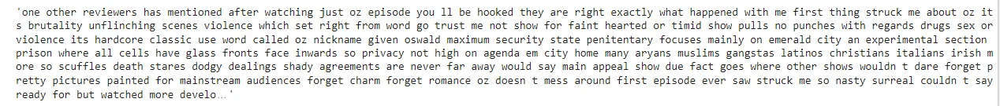

- Rare Words Removal: Similarly to the common words, the rare words can be no more useful and bring nothing but noise, so we need to remove them: lets' check for the top hundred rare words:

```python
rare = pd.Series(' '.join(imdb['review']).split()).value_counts()[-100:]
rare
```

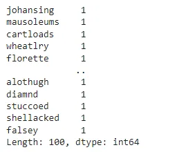

```python
imdb['reviews'] = imdb.review.apply(lambda x: " ".join(x for x in x.split() if x not in rare))
imdb['reviews'].iloc[0]
```

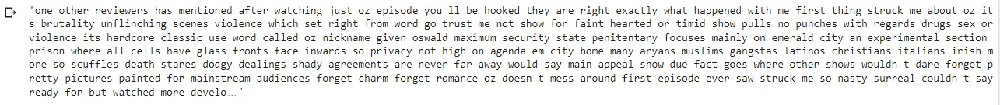

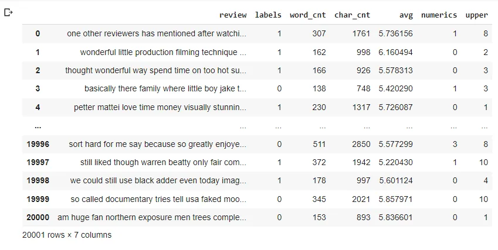

**- Advance Text Processing:**

- N-Grams: N-grams are the combination of multiple words used together. Ngrams with N=1 are called unigrams. Similarly, bigrams (N=2), trigrams (N=3) and so on can also be used.

Unigrams do not usually contain as much information as compared to bigrams and trigrams. The basic principle behind n-grams is that they capture the language structure, like what letter or word is likely to follow the given one. The longer the n-gram (the higher the *n*).

For example, for the sentence *“The cow jumps over the moon”*.

If N=2 (known as bigrams), then the ngrams would be:

- the cow
- cow jumps
- jumps over
- over the
- the moon

- Term Frequency: F

**F = (Number of times term T appears in the particular row) / (number of terms in that row)**

Let's get each word frequency for the first 2 rows:

```python
tf1 = (imdb['review'][1:3]).apply(lambda x: pd.value_counts(x.split(" "))).sum(axis = 0).reset_index()
tf1.columns = ['words','tf']
tf1
```

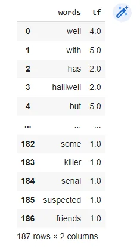

-Inverse Document Frequency: The basic idea behind it is that a word is not of much use to us if it’s appearing in all the documents.

Therefore: **IDF = log(N/n)**, where, N is the total number of rows and n is the number of rows in which the word was present.

```python
for i,word in enumerate(tf1['words']):
  tf1.loc[i, 'idf'] = np.log(imdb.shape[0]/(len(imdb[imdb['review'].str.contains(word)])))
tf1
```

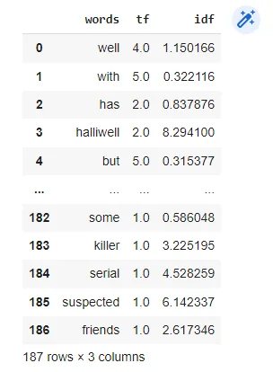

-Term Frequency/Inverse Document Frequency: TF-IDF is the multiplication of the TF and IDF which are calculated above.

```python
tf1['tfidf'] = tf1['tf'] * tf1['idf']
tf1
```

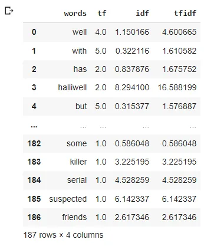

We can see that words like: with, but,some are penalized with the lowest weights while halliwell got a bigger one, which means that it will have a major importance in our analysis.

Lucky for us, scikit learn put all of this together for us in one function:

```python
from sklearn.feature_extraction.text import TfidfVectorizer
```

```python
tv = TfidfVectorizer(max_features=100 , ngram_range=(1,1), stop_words='english')
tv_transformed = tv.fit_transform(imdb['review'])
```

max_features: Maximum number of columns created from tf-idf

ngram_range: take consideration of the N word before word

stop_words: list of common words to ommit.

```python
new_df = pd.DataFrame(tv_transformed.toarray(), columns = tv.get_feature_names()).add_prefix('TFIDF')
new_df.head()
```

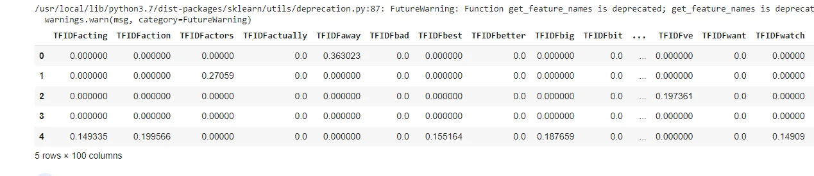

and toget the list of the highest weighted words:

```python
tv_sum = new_df.sum()
print(tv_sum.sort_values(ascending=False))
```

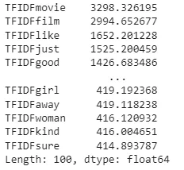

Now, after vectorizing our text data we can now feed it to our model,without generating errors:

```python
# Split the dataset according to the class distribution of category_desc, using the filtered_text vector
train_X, test_X, train_y, test_y = train_test_split(tv_transformed.toarray(),imdb['labels'],test_size=0.2, random_state=42)
```

```python
#create your model
#nb = GaussianNB()
#br = BernoulliNB()
mlm = MultinomialNB()
# Fit the model to the training data
mlm.fit(train_X,train_y)

#predict
y_pred = mlm.predict(test_X)
print(mlm.score(test_X,test_y))
print(accuracy_score(test_y,y_pred))
```

```python
0.7213196700824793
```

**- End Notes:** Here we reach the end of this blog, I hope that you have now at least a basic knowledge of how to extract features from text so it can help you improve your model.

For further knowledge:

[N-grams](https://kavita-ganesan.com/what-are-n-grams/)

[Deal with text data](https://www.analyticsvidhya.com/blog/2018/02/the-different-methods-deal-text-data-predictive-python/)

[Way to be a data scientist](https://datascience103579984.wordpress.com/2020/01/03/feature-engineering-for-machine-learning-in-python-from-datacamp/4/)

You can find the code [HERE](https://github.com/asmakrl/datacampstd/blob/main/Dealing%20With%20Text%20Data/Dealing_With_text_data.ipynb).
