### Introduction

The North American Industry Classification System (NAICS) is an industry classification system developed by the statistical agencies of Canada, Mexico and the United States. NAICS is designed to provide common definitions of the industrial structure of the three countries and a common statistical framework to facilitate the analysis of the three economies.

NAICS works as a hierarchical structure for defining industries at different levels of aggregation. For example a 2-digit NAICS industry (e.g., 23 - Construction) is composed of some 3-digit NAICS industries (236 - Construction of buildings, 237 - Heavy and civil engineering construction, and a few more 3-digit NAICS industries). Similarly, a 3-digit NAICS industry (e.g., 236 - Construction of buildings), is composed of 4-digit NAICS industries (2361 - Residential building construction and 2362 -Non-residential building construction).

15 CSV files beginning with RTRA. These files contain employment data by industry at different levels of aggregation; 2-digit NAICS, 3-digit NAICS, and 4-digit NAICS. Columns mean as follows:

(i) SYEAR: Survey Year

(ii) SMTH: Survey Month

(iii) NAICS: Industry name and associated NAICS code in the bracket

(iv) _EMPLOYMENT_: Employment

We explore each hierarchy level of NAICS individually and then as a whole. Firstly we import required package's as follow:

```python
import pandas as pd
import os
import glob
import matplotlib.pyplot as plt
```

### Analysis of 2-digit NAICS

We first merge all 2-digit NAICS RTRA file using the globe library by matching the string **2NAICS** to all RTRA files to get there paths and names as follow:

```python
m=os.getcwd()
joined_files = os.path.join(m, "*2NAICS*.csv")
joined_list = glob.glob(joined_files)
df_2= pd.concat(map(pd.read_csv, joined_list), ignore_index=True)
df_2.shape
#Output
(5472,4)
```

We inspect some of the rows using the head function.

```python
df.head()
```

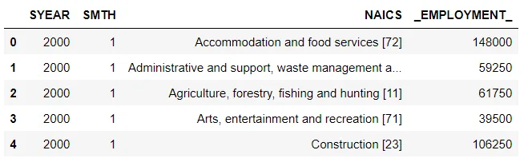

Listing out the unique 2-digit NAICS industries as follow:

```python
df_2.NAICS.unique()
#Output
array(['Accommodation and food services [72]','Administrative and support, waste management and remediation services [56]','Agriculture, forestry, fishing and hunting [11]',Arts, entertainment and recreation [71]', 'Construction [23]','Educational services [61]', 'Finance and insurance [52]','Health care and social assistance [62]','Information and cultural industries [51]','Management of companies and enterprises [55]','Manufacturing [31-33]','Mining, quarrying, and oil and gas extraction [21]','Other services (except public administration)[81]','Professional, scientific and technical services [54]','Public administration [91]','Real estate, rental and leasing [53]', 'Retail trade  [44-45]', 'Transportation and warehousing [48-49]', 'Utilities [22]','Wholesale trade  [41]'], dtype=object)
```

Total number of 2-digit NAICS is 20

```python
len(df_2.NAICS.unique())
#Output
20
```

We group on the basis of NAICS and find the top 5 largest 2 digit sectors providing employment as follow :

```python
df2_naic=df_2.groupby('NAICS')['_EMPLOYMENT_'].sum()
df2_naic.nlargest(5)
#Output
NAICS
Retail trade  [44-45]                     71565000
Health care and social assistance [62]    66872000
Manufacturing [31-33]                     49336250
Construction [23]                         47616500
Accommodation and food services [72]      46411000
Name: _EMPLOYMENT_, dtype: int64
```

We plot the employee count of each NAICS sector as follow:

```python
df2_naic.plot(kind='bar',figsize=(10,6),title='Employee Count at diffrent  2 digit NAICS')
plt.ylabel("Employment")
```

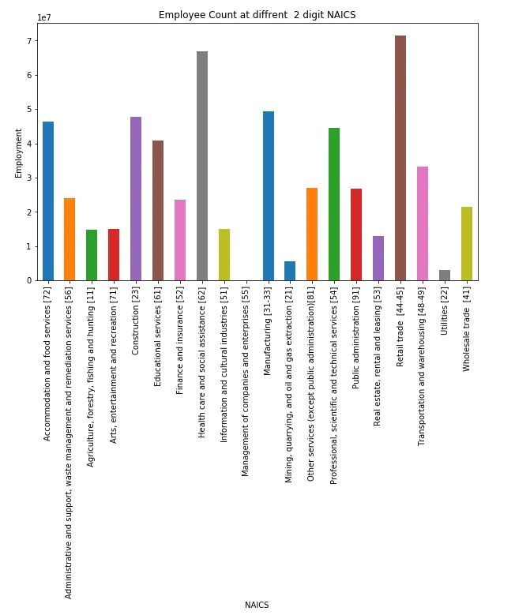

We can observe the highest employee count for 2-digit NAICS is of Retail trade having code 44-45 and employee count of 71565000.

So we further investigate Retail trade and observe employee count per year as follow:

```python
df_2_retail=df_2[df_2.NAICS=='Retail trade  [44-45]']
df_2_retail.groupby('SYEAR')['_EMPLOYMENT_'].sum()
#Output
SYEAR
1997    2742250
1998    2766750
1999    2719500
2000    2836500
2001    2832500
2002    2956250
2003    2991750
2004    2970250
2005    3015000
2006    3155250
2007    3288000
2008    3200750
2009    3282000
2010    3449750
2011    3317750
2012    3185000
2013    3342000
2014    3330250
2015    3216000
2016    3362250
2017    3484750
2018    3434750
2019    2685750
Name: _EMPLOYMENT_, dtype: int64
```

We create the line plot of the same a follow

```python
df_2_retail.groupby('SYEAR'['_EMPLOYMENT_'].sum().plot(kind='line',figsize=(7,6))
plt.xlabel('year')
plt.ylabel('numbe of employees')
```

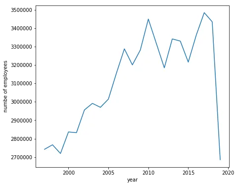

We can find that there is a sharp rise from late 90s to 2010 in employee for Retail sector. From 2010-2015 fluctuation can be seen. More interestingly there is a steep decline in the last year (2019). So we observe the last year of Retail trade in depth a follow

```python
df_2_retail[df_2_retail.SYEAR==2019]
```

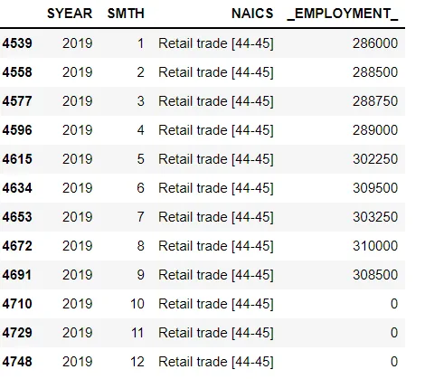

We can see that the employee count is missing (zero) for months October to December. So we inspect the entire 2 digit NACIS sectors and sum up there Employe count for year 2019 and months October to December.

```python
df_2[(df_2.SYEAR==2019) & (df_2.SMTH>9)]._EMPLOYMENT_.sum()
#Output
0
```

Since the sum is zero we can conclude that employee count data is only provided till 2019 September for all 2 digit NACIS.

Another sector of interest is Construction so we further analyze on that sector.

```python
df_2_construction=df_2[df_2.NAICS=='Construction [23]']
df_2_construction.groupby('SYEAR'['_EMPLOYMENT_'].sum().plot(kind='line',figsize=(7,7))
plt.xlabel('year')
plt.ylabel('numbe of employees')
```

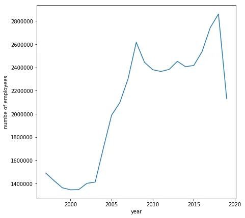

Line plot of Construction Sector employee count per year is similar in pattern to that of the general NAICS plot shown above.

```python
df_2_nonconstruction=df_2[df_2.NAICS!='Construction [23]']
c=df_2_construction.groupby('SYEAR')['_EMPLOYMENT_'].sum()
d=df_2_nonconstruction.groupby('SYEAR')['_EMPLOYMENT_'].sum()
df = pd.DataFrame({"Construction":c,"Others":d})
4ax = df.plot.bar(color=["SkyBlue","IndianRed"],  title="Construction Vs Other Sectors Employee Count Year graph",figsize=(15,7),width=0.8,stacked=True)
ax.set_xlabel("Year")
ax.set_ylabel("Employee")
plt.show()
```

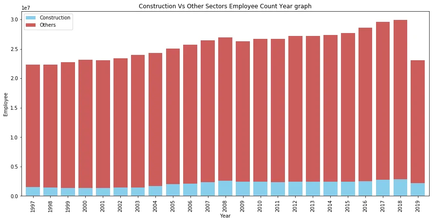

The stack bar chart was plotted to showcase yearly Employee count of Construction Sector as compared to other NAICS sectors.

```python
c.mean()/d.mean()*100
#Output
8.784898531299422
```

On an average 8.75% of total employees from 2 digit NAICS are from Construction Sector.

We also check the employee count each month from 1997 to 2019 for all 2 digit NAICS.

```python
df2_smth=df_2.groupby('SMTH')['_EMPLOYMENT_'].sum()
df2_smth.plot(kind='bar',figsize=(8,6))
plt.xlabel('Month')
plt.ylabel('No of employees')
```

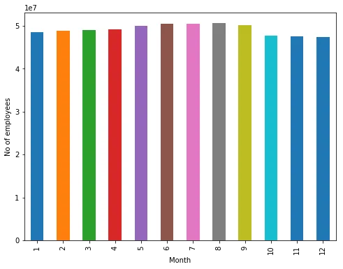

Not much information can be grasped from the plot.

We also check the employee count each year from 1997 to 2019 for all
 2 digit NAICS.

```python
df2_year=df_2.groupby('SYEAR')['_EMPLOYMENT_'].sum()
df2_year.plot(kind='bar',figsize=(10,6))
plt.xlabel('Year')
plt.ylabel('No of employees')
```

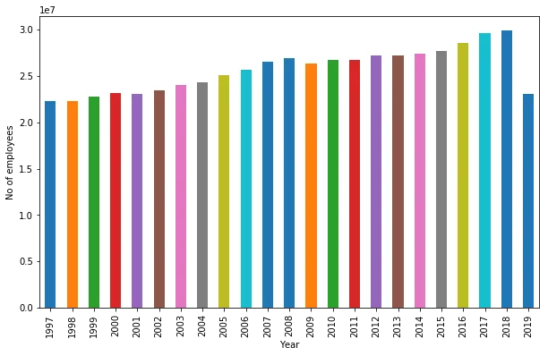

We observed gradual steady rise in employee and the sharp decline in year 2019 is due to missing values as concluded earlier above in this blog.

### Analysis of 3-digit NAICS

Similar to 2 digit NAICS we merge all 3-digit NAICS RTRA files as follow

```python
joined_list=[]
joined_files = os.path.join(m, "*3NAICS*.csv")
joined_list = glob.glob(joined_files)
df_3= pd.concat(map(pd.read_csv, joined_list), ignore_index=True)
df_3.head()
```

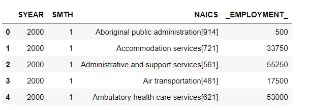

There are total of 103 3 digit NAICS.

```python
len(df_3.NAICS.unique())
#Output
103
```

So we select only top 15 3 digit NAICS based on employee count and plot there employee count as follow.

```python
df3_naic=df_3.groupby('NAICS'['_EMPLOYMENT_'].sum().nlargest(15)
df3_naic.plot(kind='bar',figsize=(10,6),title='Employee Count at diffrent 3 digit NAICS')
plt.ylabel("Employment")
```

i

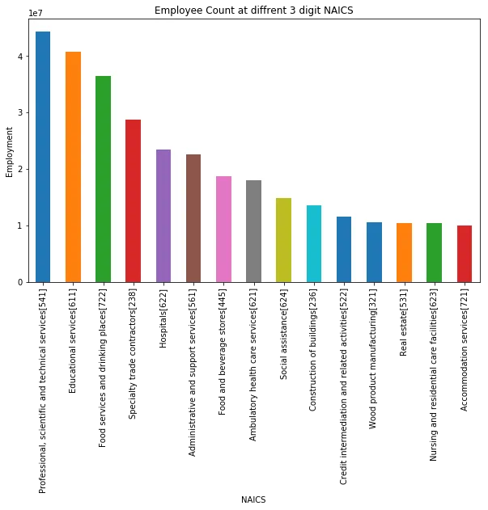

Professional, scientific and technical services with code 541 has the highest employee count of about 44 milllion.So we further dig into it.

```python
df_3_top_naic=df_3[df_3.NAICS=='Professional, scientific and technical services[541]']
df_3_top_naic.groupby('SYEAR')['_EMPLOYMENT_'].sum().plot(kind='line',figsize=(7,7))
plt.xlabel('year')
plt.ylabel('numbe of employees')
```

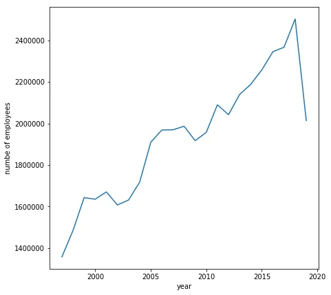

A steep rise can be observed and a fall in 2019. So we zoom into the year 2019.

```python
df_3_top_naic[df_3_top_naic.SYEAR==2019]
```

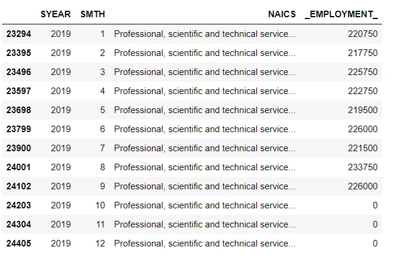

Here also for the year 2019 on months 10 ,11 and 12 employee data is missing. We investigate for all other 3 digit NAICS as follow

```python
df_3[(df_3.SYEAR==2019) & (df_3.SMTH>9)]._EMPLOYMENT_.sum()
#Output
0
```

So we can corroborate that like 2 digit NAICS, In 3 digit NACIS for the year 2019 and months 10 ,11 ,12 the employee data is missing.

Similarly the yearly and monthly employee count plots across all 3 digit NAICS are as follow

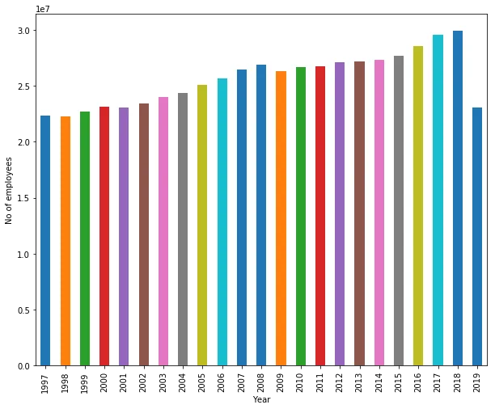


### Analysis of 4-digit NAICS

We merge all 4 digit NAICS RTRA files similar to previous two as follow

```python
joined_list=[]
joined_files = os.path.join(m, "*4NAICS*.csv")
joined_list = glob.glob(joined_files)
df_4= pd.concat(map(pd.read_csv, joined_list), ignore_index=True)
df_4.head()
```

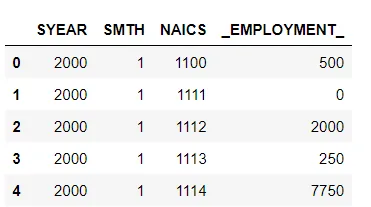

Here we can observe that the NAICS only contains the NAICS code and no other further textual description.

There is total of 314 4 digit NAICS present in the data set.

```python
len(df_4.NAICS.unique())
# Output
314
```

We select only the top 15 4 digit NAICS based on employee count for further analysis.

```python
df4_naic=df_4.groupby('NAICS'['_EMPLOYMENT_'].sum().nlargest(15)
df4_naic.plot(kind='bar',figsize=(8,10),title='Employee Count at diffrent 3 digit NAICS')
plt.ylabel("Employment")
```

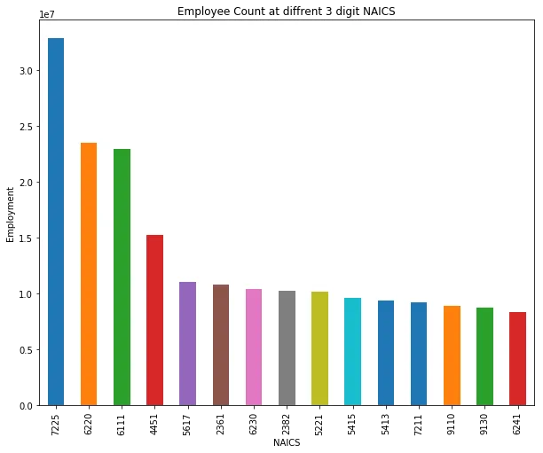

Here sector 7225 has the highest employee count of about 33 million. So we further dive into it for analysis.

```python
df_4_top_naic=df_3[df_4.NAICS==7225]
df_4_top_naic.groupby('SYEAR')['_EMPLOYMENT_'].sum().plot(kind='line',figsize=(7,7))
plt.xlabel('year')
plt.ylabel('number of employees')
```

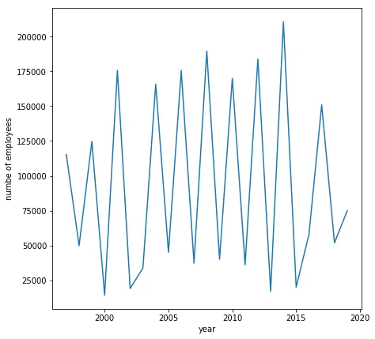

The line plot is extremely fluctuating so we further dive into it.

```python
 df_4_top_naic[df_4_top_naic.SYEAR==2019]
```

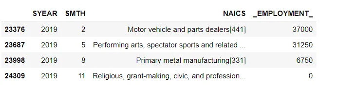

Here 7225 NAICS is available only for the months 2,5,8,11 for year 2019. So we again look for the year 2018 similarly.

```python
df_4_top_naic[df_4_top_naic.SYEAR==2018]
```

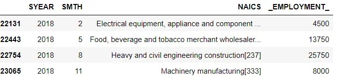

Same is the case for year 2018. So we can conclude that there is alot of missing data for 4 digit NAICS

Yearly and monthly employee count plots across all 4 digit NAICS are as follow:

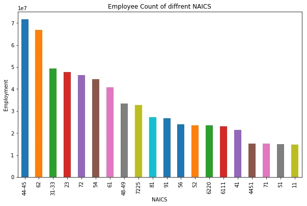

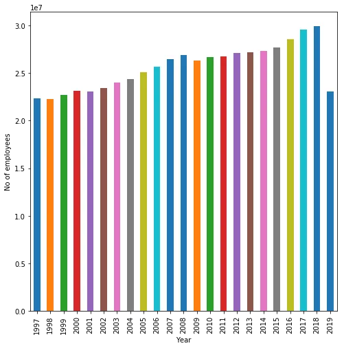

### Combined Analysis

For combined analysis we firstly preprocess 2 and 3 digit NIACS by extracting there codes only from NIACS column as follows

```python
 df_2['NAICS']=df_2.NAICS.str.extract('\[(.*?)\]')
 df_2.head()
```

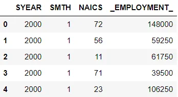

```python
df_3['NAICS']=df_3.NAICS.str.extract('\[(.*?)\]')
df_3.head()
```

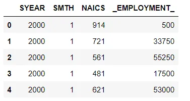

For 4 digit NAICS no processing is required a direct code is provided in the NAICS column.

We merge all three of the dataframe as follows:

```python
final=pd.concat([df_2,df_3,df_4],axis=0)
final.info()
#Output
<class 'pandas.core.frame.DataFrame'>
Int64Index: 119184 entries, 0 to 85571
Data columns (total 4 columns):
SYEAR           119184 non-null int64
SMTH            119184 non-null int64
NAICS           118632 non-null object
_EMPLOYMENT_    119184 non-null int64
dtypes: int64(3), object(1)
memory usage: 4.5+ MB
```

We can observe that many NAICS rows have nan value. So we remove these rows before further analysis.

```python
final.dropna(subset = ["NAICS"],inplace=True)
final.info()
#Output
<class 'pandas.core.frame.DataFrame'>
Int64Index: 118632 entries, 0 to 85571
Data columns (total 4 columns):
SYEAR           118632 non-null int64
SMTH            118632 non-null int64
NAICS           118632 non-null object
_EMPLOYMENT_    118632 non-null int64
dtypes: int64(3), object(1)
memory usage: 4.5+ MB
```

We select the top 15 highest employee based NAICS and plot there count as follow

```python
final_top_naic=final.groupby('NAICS'['_EMPLOYMENT_'].sum().nlargest(20)
final_top_naic.plot(kind='bar',figsize=(10,6),title='Employee Count of diffrent NAICS')
plt.ylabel("Employment")
```

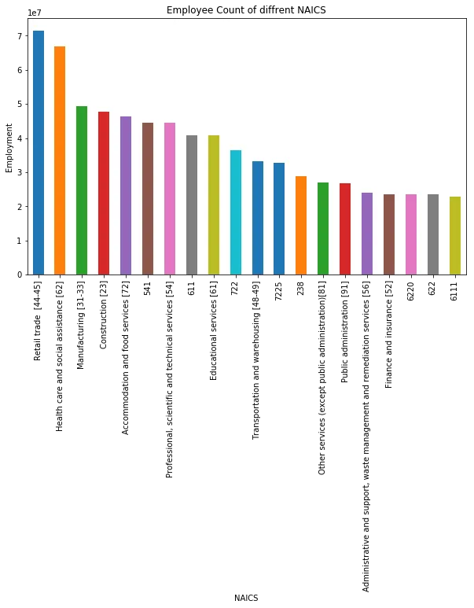

We observe mostly 2 digit NAICS are at the top, few 3 digit NAICS and interestingly two 4 digit NAICS.

### Conclusion

Hence we performed exploratory data analysis on NAICS dataset at different hierarchy level and combined as well and stated a few findings.

The github link to the code is as [follow](https://github.com/rubash9849/data_inisghts/blob/main/A_NEWLY_HIRED_DATA_ANALYST/NAICS.ipynb).
