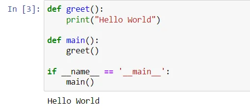
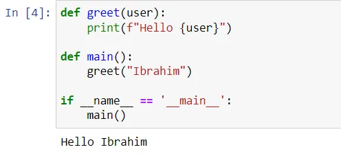
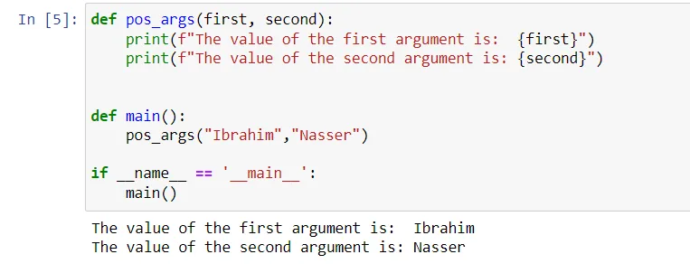
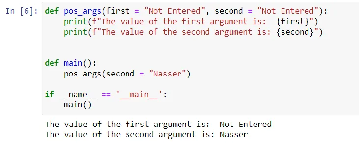
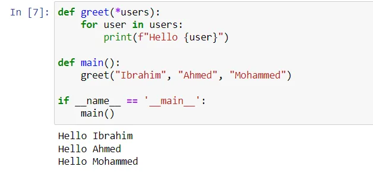
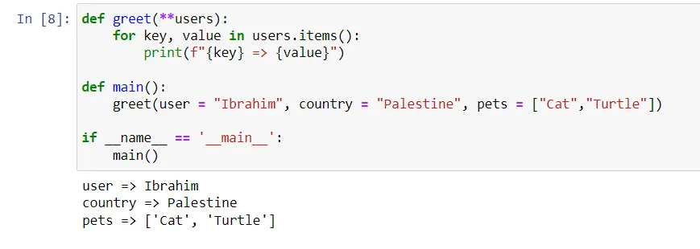

In this blog post, we will dive into some details about the functions and arguments in Python.

## Understand Basic Functions
In order to understand the use of arguments in python, we must know how to write functions first. Functions are considered as the building blocks of any programming language. Functions help us write modular code in smaller chunks as such it becomes much easier for us to isolate individual working parts and debug the code if there are any errors in it.

The previous simple function prints Hello World to the user on the screen when executed. Notice how the *greet()* function is triggered from the *main()* function upon execution of the python file. These are very simple functions and there are no arguments passed to these functions yet.

Now, let us enhance the above *greet()* function, to accept the name of the user as a parameter and print it to the screen.

## Positional and Keyword Arguments in Python
So far, we have understood how to define simple functions and pass arguments to the functions and print them during the execution. Now, let’s take a step further and understand the two important types of arguments in python; the **positional** and the **keyword** arguments.

- The positional arguments are defined by the single asterisk (\*) before the parameter name, e.g. “*\*args*”.
- The keyword arguments are defined by placing a double asterisk (\*\*) in front of the parameter name, e.g. “*\*\*kwargs*”.

An important point worth mentioning here is that the names *args* and *kwargs* are just placeholders and can be replaced with any other meaningful names. However, as a best practice, it is left as the same so that it’s easier for others to understand that the function accepts a positional or a keyword argument.

### Positional Arguments in Python
These are the simplest type of arguments to pass in a function in python. You can define as many parameters in a function and then provide the arguments in the same order as defined in the function. The python program will read the arguments accordingly and perform the necessary actions. You can consider the following snippet to understand what a positional argument is used in a function.

As you can see in the output above, the arguments are printed in the order they are passed into the function. If you alter the position of the arguments while calling the function, then the output will change.

Also, in this case, you need to provide all three arguments while calling the function. In case, one or more arguments are missing, the function will throw an error during execution as there are no optional parameters defined.

**Let us now try to make the function a bit more flexible by making all three parameters optional. This can be done by assigning default values to the function as follows.**

As you can see above, we have specified the argument for the parameters *second* but not for *first*. Notice how we have explicitly mentioned the parameter name *second* while assigning the argument. This is done because, by default, the positional argument will be assigned to the parameter *first* instead of *second.*

We can **extend** this functionality of providing *positional arguments* by declaring a **single asterisk \* operator.**

When you run the above code, all the three users passed as arguments in the main function are iterated and the message is displayed for each of the users separately.

Although we have defined only one parameter in the *greet()* function, the **\*** operator takes the input as a positional argument and is then iterated using the for a loop. This is dynamic in nature as it can automatically handle multiple argument values and the programmer doesn’t need to define the parameter separately.

### Keyword Arguments in Python

Now that we know what the positional arguments are and how to use those, using the keyword arguments will be quite easy. This is also something similar to the positional arguments, however, it is denoted by a \*\*, a double asterisk in front of the parameter name also known as the **dictionary** unpacking operator.

As you can see, we used the dictionary unpacking operator (*\*\*kwargs)* as an argument to the function and printed out the values on the console. It is evident from the above example that you can pass as many items as you want and all those will be unpacked and used by the function.

## Conclusion
In this blog post, we have seen how to define functions and use arguments in Python. In any programming language, we must define our functions correctly so that messages or data can be passed on from one function to another very easily. We have also seen what are \*args and \*\*kwargs in python and how to implement these while programming. As a best practice, you should always define as few parameters as required by your function. This helps to keep the function simpler and easy to implement. \*args take in positional arguments in a function, whereas the \*\*kwargs takes in keyword arguments.

**Note:** All the code blocks are available on my [GitHub](https://github.com/96ibman/datainsight_datascience_program/blob/main/args%20and%20kwargs.ipynb)

Happy Learning!
