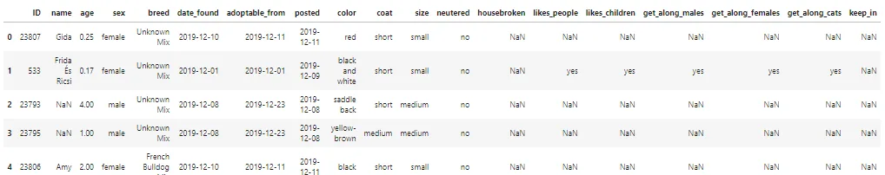
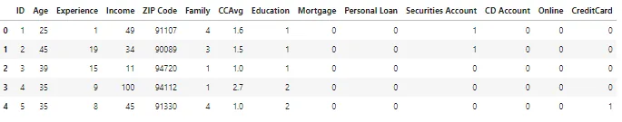
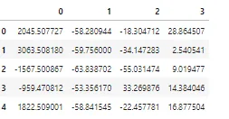

There has been so much confusion online on the subject of dimensionality reduction as I have tried to enter into the data science space with different resources so I am writing this to hopefully clear the air and explain in simple English.

Re-introducing a dataset;

A dataset is usually presented in a dataframe and the records are usually the rows why the features are the column. For example we can have a dataset of dogs and the rows represent different dogs while the column represents different attributes or features of the dogs e.g. the color, the weight, the fur type etc. There are 19 features for each dog and 5 records in the dataframe below.

The dimension of the data set is usually the number of features contained in that data. In the image above we can conclude that the dog data set has 19 dimensions.

**What is dimension reduction and why is it needed?**

Dimension reduction is any technique or process used to reduce the number of features or the dimension of a data set. This usually done before training a model.

It is necessary because a dataset with very high dimension usually trains a very complex model with takes much time, space and computation power... worse of all it leads to overfitting as the model becomes too dependent on the training data because of the several features and finds it difficult to generalize.

It's also important to note that when we are reducing the number of features or dimensions of a dataset, we want to reduce it in such a way that the features left behind still captures a majority or even the entirety of the information in the data. So we can drop columns that are correlated as they are a form of redundancy.

In this this blog, I'll discuss two ways which we can achieve dimensionality reduction;

- Principal Component Analysis

- Non-Negative Matrix Factorization

Principal Component Analysis (PCA): PCA uses a statistic concept of factorizing a matrix to the simplest, most representative form called the principal component. Theoretically, the pca can be calculated using eigen values and vectors and statistic concepts.

Some disadvantages of PCA though is that the data to be converted must only contain numerical values and the components are not interpretable, and it uses linear combination to re-express our data, so non-linear relationships between variables are ignored. PCA be implemented using a package from sklearn library as shown below;

We have been able to use PCA to reduce the number of features or dimensions of this dataset to 4! This 4 features capture majority of the information represented in the original dataset. To evaluate the components generated we can use the explained_variance_ratio_ attribute of the PCA object.

**NMF-Non-Negative Matrix Factorization**

This technique for dimension reduction only allows positive features to be used. i.e. All the elements in each column to be reduced must be positive.

It is widely used in facial recognition and NLP algorithms.

The main advantage of the NMF method is its explainability, it intuitively breaks down large data into smaller reoccurring components that can be recombined to form the original matrix e.g. an article is broken into topics, images are broken into patterns.

When implementing with python, using an input dataset of documents... say about 30 documents. We can set the number of components to 5... this automatically reduces the word frequencies to topics by grouping similar words together.
