## What Is Statistics?
**Statistics** is a form of mathematical analysis that uses quantified models and representations for a given set of experimental data or real-life studies. The main advantage of statistics is that information is presented in an easy way. In this blog, we will be looking at 10 fundamental statistical concepts in data science that will help a lot in the journey.

The main data used in the analysis is weight-height dataset from Kaggle. You can find the link here: <https://www.kaggle.com/mustafaali96/weight-height>.

The **10** fundamental concepts to be discussed are:

1. Normal Distribution
2. Populations and Sample
3. Measures of Central Tendency
4. Measures of Dispersion
5. Bayes' Theorem
6. Binomial Distribution
7. Poisson Distribution
8. Regression
9. Z-Score
10. Bernoulli Distribution

### 1. Normal Distribution
**Normal distribution**, also known as the **Gaussian distribution**, is a probability distribution that is symmetric about the **mean**, showing that data near the mean are more frequent in occurrence than data far from the mean. In graph form, normal distribution will appear as a **bell curve**.

An example will be that; when there is an mathematics examination where the lowest mark was 35 and the highest was 85, a normal distribution will have only a few people having 35 and 85 with majority having having marks within the average range.

In data science, **normal distribution** together with **standard deviation** to help eliminate outliers during data cleaning. Below is a code for it:

```python
#importing the needed libraries
import numpy as np #creating a range of x values
import matplotlib.pyplot as plt #for plotting
from scipy.stats import norm #analyze the normal distribution

# Plot between -10 and 10 with .001 steps.
x_axis = np.arange(-10, 10, 0.01)

# Calculating mean and standard deviation
mean = np.mean(x_axis)
sd = np.std(x_axis)

#Plotting the graph
plt.plot(x_axis, norm.pdf(x_axis, mean, sd))
plt.show()
```

Output:

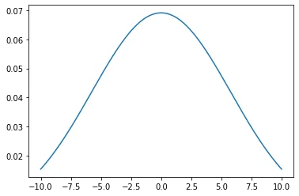

### 2. Populations and Sample
**Population** is a collection of all items of interest to our study and is usually denoted with an uppercase **N**. The numbers we have obtained using a population are called **parameters**.

**Sample** is a subset of the population and is denoted with a lowercase **n**, and the numbers we have obtained when working with a sample are called **statistics**. Below is a code for more understanding:

```python
import numpy as np
np.random.seed(10)
population=np.arange(1,201) #creating a population of 200
sample= np.random.choice(population, 10) #A random sample of 10 from the population

print(f'Population is {population}\n')
print(f'Sample is {sample}')
```

Output:

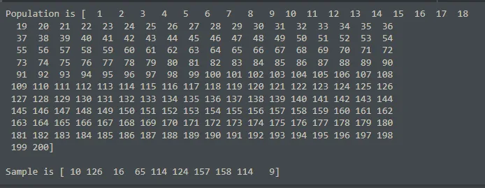

### 3. Measures of Central Tendency
A **central tendency**  is a central or typical value for a probability distribution. There are **3** main measures of central tendency: **the mode**, **the median**, and **the mean**. Each of these measures describes a different in the distribution. A measure of central tendency is a single value that attempts to describe a set of data by identifying the central position within that set of data.

**Mean** is also called **average**. It is the most popular and well known measure of central tendency. It is used in both discrete and continuous data, although its use is most often with continuous data. The mean is equal to the sum of all values in the dataset divided by the number of values in the dataset. As the data becomes skewed, the mean loses its ability to provide the best central location for the data.

**Median** is the middle score of a set of data that has been arranged in order of magnitude. The median is less affected by outliers and skewed data.

**Mode** is the most frequent score in a dataset. On a histogram, it represents the highest bar in a chart or histogram. You can, therefore, sometimes consider consider the mode as being the most popular option.

They can be well-explained in the code below:

```python
#Calculating the mean height and weight
mean_height = np.mean(df['Height'])
mean_weight = np.mean(df['Weight'])

#Calculating the median height and weight
median_height = np.median(df['Height'])
median_weight = np.median(df['Weight'])

#Calculating mode of the gender column
mode = df['Gender'].value_counts()[0]

#Printing the various values
print(f'The mean height is {mean_height}')
print(f'The mean weight is {mean_weight}')
print(f'The median of the heights is {median_height}')
print(f'The median of the weights is {median_weight}')
print(f'The mode of the genders is male which has a count of {mode}')
```

Output:

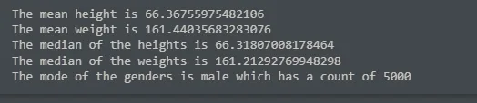

### 4. Measures of Dispersion
A **measure of dispersion** indicates the scattering of data. It explains the disparity of data from one another, delivering a precise view of their distribution. The measure of dispersion displays and gives us an idea about the variation and the central value of an individual item.

The **5** most commonly used measures of dispersion are: **range**, **variance**, **standard deviation**, **mean deviation**, and **quartile deviation**.

**Range** is the difference between the lowest and the highest value in a dataset. Difference here is specific, the range of a set of data is the result of subtracting the sample maximum and minimum. It is measured in the same units as the data. Since it only depends on two of the observations, it is most useful in representing the dispersion of small data sets.

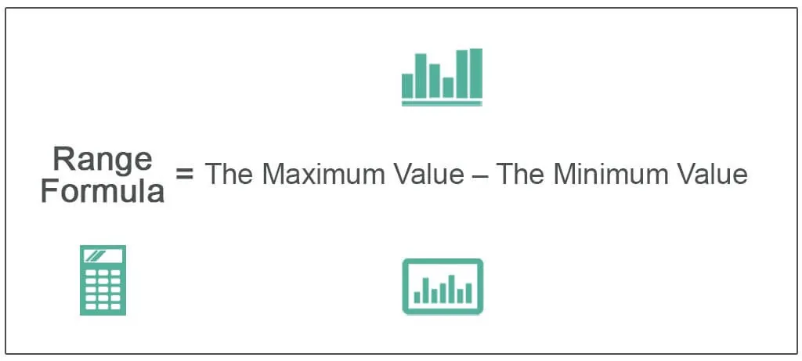

Below is some code to show how the range is calculated:

```python
#Calculating range
max_height = df['Height'].max()
min_height = df['Height'].min()

range = max_height - min_height
print(f'The range of the Height column is {range}.')
```

Output:

The range of the Height column is **24.735609021292504**.

**Variance** is a measure of dispersion that takes into account the spread of all data points in a data set. It's the measure of dispersion the most often used, along with the standard deviation, which is simply the square root of the variance.

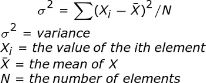

Below is some code to show how the variance is calculated:

```python
#Calculating variance of the Height column
var = np.var(df['Height'])

print(f'The variance of the Height column of the dataset is {var}.')
```

Output:

The variance of the Height column of the dataset is **14.801992292876786**.

**Standard deviation** is a measure of the amount of variation or dispersion of a set of values. A low standard deviation indicates that the values tend to be close to the mean (also called the expected value) of the set, while a high standard deviation indicates that the values are spread out over a wider range.

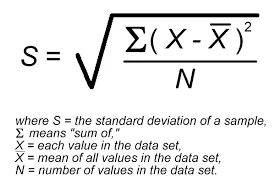

Below is some code to show how the standard deviation is calculated:

```python
#Calculating standard deviation of the Height column
std = np.std(df['Height'])

print(f'The standard deviation of the Height column is {std}')
```

Output:

The standard deviation of the Height column is **3.847335739557543**.

**Mean deviation** is defined as a statistical measure that is used to calculate the average deviation from the mean value of the given data set. It is the average of the absolute deviations from a central point. It is a summary statistic of statistical dispersion or variability.


Below shows the code for calculating the **mean deviation**:

```python
data = [12, 42, 53, 13, 112]
# Find mean value of the sample
M = np.mean(data)
print("Sample Mean Value = ",np.mean(data))
sum = 0
# Calculate mean absolute deviation
for i in data:
   dev = np.absolute(i - M)
   sum = sum + round(dev,2)
print("Mean Absolute Deviation: ", sum/len(data))
```

Output:

**Sample Mean Value = 46.4**

**Mean Absolute Deviation: 28.879999999999995**

**Quartile deviation** is a statistic that measures the deviation in the middle of the data. Quartile deviation is also referred to as the **semi interquartile range** and is half of the difference between the third quartile and the first quartile value. The formula for quartile deviation of the data is **Q.D = (Q3 - Q1)/2**. Below shows the code for calculating the **quartile deviation**:

```python
#Calculating the 1st quartile (Q1) of the Height column
q1 = np.percentile(df['Height'], 0.25)

#Calculating the 3rd quartile (Q3) of the Height column
q3 = np.percentile(df['Height'], 0.75)

#Calculating the quartile deviation/interquartile range of the Height column
IQR = q3 - q1

#Printing the quartile deviation of the Height column
print(IQR)
```

Output:

**1.0409445943350022**

### 5. Bayes' Theorem
**Bayes' Theorem** states that the conditional probability of an event, based on the occurrence of another event, is equal to the likelihood of the second event given the first event multiplied by the probability of the first event. This will be shown using the **titanic dataset** from Kaggle. Below shows how the theorem is expressed in code:

```python
#Reading the dataset
df = pd.read_csv("titanic.csv")
df.head()
```

Output:


```python
#Dropping some specific columns
df.drop(['PassengerId','Name','SibSp','Parch','Ticket','Cabin','Embarked'],axis='columns',inplace=True)
df.head()
```

Output:

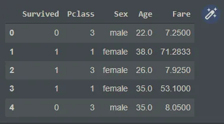

```python
#Specifying the inputs and targets
inputs = df.drop('Survived',axis='columns')
target = df.Survived

dummies = pd.get_dummies(inputs.Sex)
dummies.head(3)
```

Output:

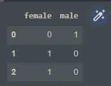

```python
#Concatenation between inputs and dummies
inputs = pd.concat([inputs,dummies],axis='columns')
inputs.head(3)
```

Output:

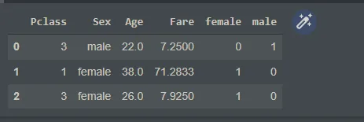

```python
#Dropping Sex and male columns of the dataset
inputs.drop(['Sex','male'],axis='columns',inplace=True)
inputs.head(3)
```

Output:

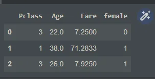

```python
#Checking columns to see if there are any NaN
inputs.columns[inputs.isna().any()]

#Displaying the columns with imput NaN
inputs.Age[:10]
```

Output:

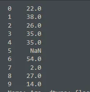

```python
#Filling missing values of Age with the average student rates
inputs.Age = inputs.Age.fillna(inputs.Age.mean())
inputs.head()
```

Output:

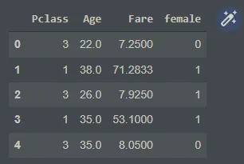

```python
from sklearn.model_selection import train_test_split
X_train, X_test, y_train, y_test = train_test_split(inputs,target,test_size=0.3)

from sklearn.naive_bayes import GaussianNB
model = GaussianNB()

model.fit(X_train,y_train)

model.score(X_test,y_test)

X_test[0:10]

y_test[0:10]

model.predict(X_test[0:10])
```

Output:

**array([0, 0, 0, 0, 0, 1, 0, 0, 0, 0])**

```python
from sklearn.model_selection import cross_val_score
cross_val_score(GaussianNB(),X_train, y_train, cv=5)
model.predict_proba(X_test[:10])
```

Output:

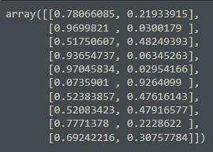

### 6. Binomial Distribution
**Binomial distribution** summarizes the number of trials, or observations when each trial has the same probability of attaining one particular value. The binomial distribution determines the probability of observing a specified number of successful outcomes in a specified number of trials. Below is code for the explanation:

```python
import pandas as pd
from scipy.stats import binom
number_of_trials = 15
prob_of_success = 0.7

#Binomial distribution of 15 trials with a probability of success 0.7. Computing the probability of sucess of 2
binom.pmf(10, number_of_trials, prob_of_success)
```

Output:

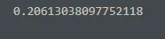

### 7. Poisson Distribution
**Poisson distribution** is a discrete probability distribution that expresses the probability of a given number of events occurring in a fixed interval of time or space if these events occur with a known constant mean rate and independently of the time since the last event. Below explains more in code:

```python
#Importing the needed libraries
import pandas as pd
import numpy as np
from scipy.stats import poisson
import matplotlib.pyplot as plt

x_rvs = pd.Series(poisson.rvs(1.2, size=100000, random_state=2))

data = x_rvs.value_counts().sort_index().to_dict()
data

#Plotting the poisson distribution graph
fig, ax = plt.subplots(figsize=(16, 6))
ax.bar(np.arange(0,len(data)), list(data.values()), align='center')
plt.xticks(np.arange(0, len(data)), list(data.keys()))
plt.show()
```

Outputs:

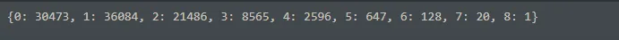

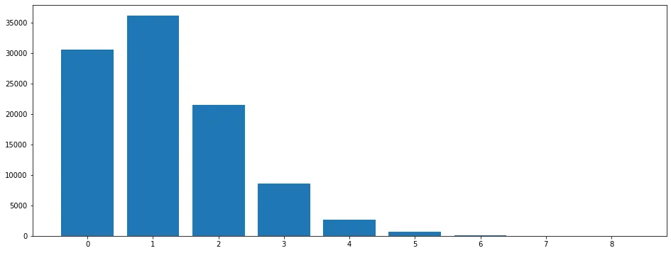

### 8. Regression
**Regression** is a statistical method used in finance, investing, and other disciplines that attempts to determine the strength and character of the relationship between one dependent variable (usually denoted by Y) and a series of other variables (known as independent variables). Below shows how the concept works:

```python
#importing the necessary libraries
import pandas as pd
import numpy as np
from sklearn import linear_model
import matplotlib.pyplot as plt

#Reading the file
df = pd.read_csv('homeprices.csv')
df
```

Output:

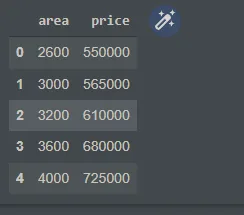

```python
#Plotting the points
%matplotlib inline
plt.xlabel('area')
plt.ylabel('price')
plt.scatter(df.area,df.price,color='red',marker='+')
```

Output:

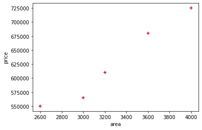

```python
#Dropping the price column to form a new dataset called new_df
new_df = df.drop('price',axis='columns')
new_df
```

Output:


```python
#Creating a dataset consisting of only the price column
price = df.price
price
```

Output:

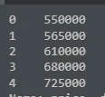

```python
# Create linear regression object
reg = linear_model.LinearRegression()
reg.fit(new_df,price)

#Predict price of a home with area = 3300 sqr ft
reg.predict([[3300]])
```

Output:

**array([628715.75342466])**

The above shows that our model predicts an area of 3300 sqr ft to cost 628715.75342466

### 9. Z-Score
**Z-score** is a numerical measurement that describes a value's relationship to the mean of a group of values. Z-score is measured in terms of standard deviations from the mean. If a Z-score is 0, it indicates that the data point's score is identical to the mean score.

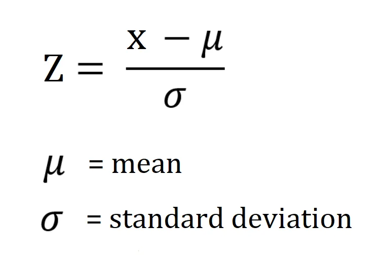

Explaining in code:

```python
#Calculating and adding a z score column based on the height column
df['zscore'] = ( df.Height - df.Height.mean() ) / df.Height.std()
df.head(5)
```

Output:

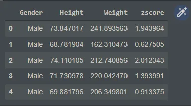

### 10. Bernoulli Distribution
**Bernoulli distribution** is s the discrete probability distribution of a random variable which takes the value 1 with probability **p** and the value 0 with probability ***q=1-p***. Below is a code to explain:

```python
#Importing the libraries
import matplotlib.pyplot as plt
from scipy.stats import bernoulli
import seaborn as sns

#Generating the data
sample = bernoulli.rvs(size=500, p=0.5)

#Plotting the data
by = sns.distplot(sample, kde=True, color='blue', hist_kws={"linewidth":30, "alpha":1})
by.set(xlabel='Bernoulli', ylabel='Frequency', title='Bernoulli Distribution Representation')
plt.show()
```

Output:

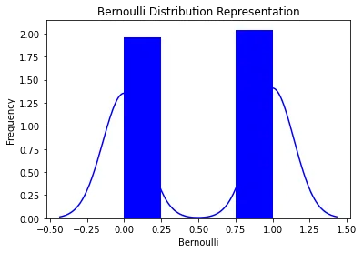

Locate the GitHub repository with the code here: <https://github.com/Jegge2003/data_science_statistical_concepts>
