## Introduction to NAICS and NAICS time series dataset
The North American Industry Classification System (NAICS) is an industry classification system developed by the statistical agencies of Canada, Mexico and the United States. It is created against the background of the North American Free Trade Agreement. It is based on supply-side or production-oriented principles and provides common definitions of the industrial structure of the three countries so that statistical analysis can be facilitated. It has a hierarchical structure as shown in figure 1. The initial 2 digit of the code indicates the sector and the third digit further divides the sector into subsectors, this division continues till the sixth digit as illustrated in the figure 1.

- 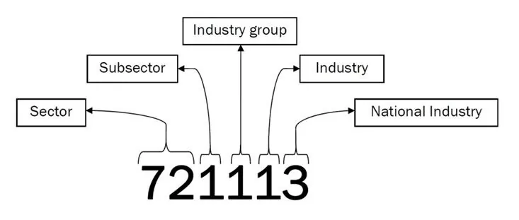

*figure 1: An example illustrating the* *hierarchical structure of NAICS*

The dataset consists of 15 different files of monthly employment data of each code from 1997 to 2019 for 2 digit code, 3 digit code and 4 digit code. The attributes of the dataset is the year, NAICS (code), month and employment number.

```python
import numpy as np
import pandas as pd
import seaborn as sns
data1=pd.read_csv('RTRA_Employ_2NAICS_00_05.csv')
print(data1.head())
df1 = pd.DataFrame(data1.NAICS.str.split('[').tolist(), columns="NAICS CODE".split())
print(df1.head())
```

- 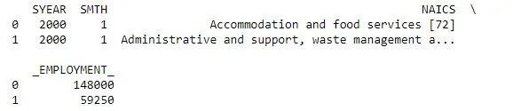

## Data Preprocessing
The data consist of NAICS industry name and code surrounded by square brackets , so the code is separated using the starting square bracket and the ending square bracket was also cleared to obtain the code. Some rows of 2 digit code file consist of a range for the NAICS code so the upper range was also extracted. The above mentioned step is performed for all the 15 dataset and the rows where the NAICS code was missing was removed.

```python
data1=pd.read_csv('RTRA_Employ_2NAICS_00_05.csv')
df1 = pd.DataFrame(data1.NAICS.str.split('[').tolist(), columns="NAICS CODE".split())
df1['CODE'] = df1['CODE'].replace({']':''}, regex=True)
df1= pd.DataFrame(df1.CODE.str.split('-').tolist(), columns="lower_code upper_code".split())
data1['NAICS']=df1['lower_code']
data1['upper_code']=df1['upper_code']
print(data1.head(2))
```

- 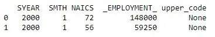

```python
data2=pd.read_csv('RTRA_Employ_2NAICS_06_10.csv')
df1 = pd.DataFrame(data2.NAICS.str.split('[').tolist(), columns="NAICS CODE".split())
df1['CODE'] = df1['CODE'].replace({']':''}, regex=True)
df1= pd.DataFrame(df1.CODE.str.split('-').tolist(), columns="lower_code upper_code".split())
data2['NAICS']=df1['lower_code']
data2['upper_code']=df1['upper_code']
data3=pd.read_csv('RTRA_Employ_2NAICS_11_15.csv')
df1 = pd.DataFrame(data3.NAICS.str.split('[').tolist(), columns="NAICS CODE".split())
df1['CODE'] = df1['CODE'].replace({']':''}, regex=True)
df1= pd.DataFrame(df1.CODE.str.split('-').tolist(), columns="lower_code upper_code".split())
data3['NAICS']=df1['lower_code']
data3['upper_code']=df1['upper_code']
data4=pd.read_csv('RTRA_Employ_2NAICS_16_20.csv')
df1 = pd.DataFrame(data4.NAICS.str.split('[').tolist(), columns="NAICS CODE".split())
df1['CODE'] = df1['CODE'].replace({']':''}, regex=True)
df1= pd.DataFrame(df1.CODE.str.split('-').tolist(), columns="lower_code upper_code".split())
data4['NAICS']=df1['lower_code']
data4['upper_code']=df1['upper_code']
data5=pd.read_csv('RTRA_Employ_2NAICS_97_99.csv')
df1 = pd.DataFrame(data5.NAICS.str.split('[').tolist(), columns="NAICS CODE".split())
df1['CODE'] = df1['CODE'].replace({']':''}, regex=True)
df1= pd.DataFrame(df1.CODE.str.split('-').tolist(), columns="lower_code upper_code".split())
data5['NAICS']=df1['lower_code']
data5['upper_code']=df1['upper_code']
```

```python
data6=pd.read_csv('RTRA_Employ_3NAICS_00_05.csv')
data6['NAICS'],data6['CODE'] =data6.NAICS.str.split('[').str
data6['CODE'].replace({']': ''},inplace =True, regex= True)
data6 = data6.dropna(how='any',axis=0)
data7=pd.read_csv('RTRA_Employ_3NAICS_06_10.csv')
data7['NAICS'],data7['CODE'] =data7.NAICS.str.split('[').str
data7['CODE'].replace({']': ''},inplace =True, regex= True)
data7 = data7.dropna(how='any',axis=0)
data8=pd.read_csv('RTRA_Employ_3NAICS_11_15.csv')
data8['NAICS'],data8['CODE'] =data8.NAICS.str.split('[').str
data8['CODE'].replace({']': ''},inplace =True, regex= True)
data8 = data8.dropna(how='any',axis=0)
data9=pd.read_csv('RTRA_Employ_3NAICS_16_20.csv')
data9['NAICS'],data9['CODE'] =data9.NAICS.str.split('[').str
data9['CODE'].replace({']': ''},inplace =True, regex= True)
data9 = data9.dropna(how='any',axis=0)
data10=pd.read_csv('RTRA_Employ_3NAICS_97_99.csv')
data10['NAICS'],data10['CODE'] =data10.NAICS.str.split('[').str
data10['CODE'].replace({']': ''},inplace =True, regex= True)
data10 = data10.dropna(how='any',axis=0)
```

```python
data12=pd.read_csv('RTRA_Employ_4NAICS_06_10.csv')
data12 = data12.dropna(how='any',axis=0)
data13=pd.read_csv('RTRA_Employ_4NAICS_11_15.csv')
data13 = data13.dropna(how='any',axis=0)
data14=pd.read_csv('RTRA_Employ_4NAICS_16_20.csv')
data14 = data14.dropna(how='any',axis=0)
data15=pd.read_csv('RTRA_Employ_4NAICS_97_99.csv')
data15 = data15.dropna(how='any',axis=0)
```

Individual datasets for 2 digit , 3 digit and 4 digit were created. A combined data frame was also created. For the combined dataset the 2 digit , 3 digit and 4 digit indicating columns CODE_2, CODE_3 and CODE_4 respectively were created. The dataset also has a LMO_Detailed_Industries_by_NAICS file which consist of few important industries with the industry name and code. The industry code from the file was also separated and stored in 3 lists according to the number of digits of the NAICS code.

```python
frames=[data2,data3,data4,data5]
df_2N= data1.append(frames, ignore_index=True)
frames=[data7,data8,data9,data10]
df_3N= data6.append(frames, ignore_index=True)
df_3N['NAICS']=df_3N['CODE']
df_3N['CODE']=None
df_3N.columns =['SYEAR','SMTH','NAICS','_EMPLOYMENT_','upper_code']
frames=[data12,data13,data14,data15]
df_4N= data11.append(frames, ignore_index=True)
df_4N['upper_code']=None
frames=[df_3N,df_4N]
df_combined=df_2N.append(frames, ignore_index=True).sort_values(['SYEAR', 'SMTH','NAICS'])
df_combined['NAICS'] = df_combined.NAICS.astype('int64')
df_combined['CODE_2']=df_combined['NAICS'].astype(str).str[0:2].astype('int64')
df_combined['CODE_3']=df_combined['NAICS'].astype(str).str[0:3].astype('int64')
df_combined['CODE_4']=df_combined['NAICS'].astype(str).str[0:4].astype('int64')
df_combined['upper_code'].replace([None], 0, inplace=True)
print(df_combined.sort_values(['SYEAR', 'SMTH','NAICS']).head())
```

- 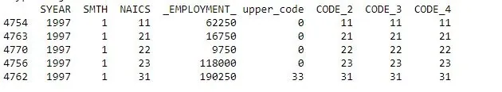

```python
lmo=pd.read_excel("LMO_Detailed_Industries_by_NAICS.xlsx")
lmo['NAICS'] = lmo['NAICS'].apply(lambda _: str(_)
lmo.replace(to_replace ="Farms",  value ="Omega Warrior")
lmo.NAICS.replace('(&)',',',regex=True, inplace = True)
from itertools import chain
df=lmo.NAICS.str.split(',',expand=True)
l_2d = df.values.tolist()
l_2d=list(chain.from_iterable(l_2d))
res = list(filter(None, l_2d))
res = list(map(int, res))
list_2N=[x for x in res if x<100]
list_3N=[x for x in res if x>99 and x<1000]
list_4N=[x for x in res if  x>999]
print(list_2N)
print(list_3N)
print(list_4N)
df_combined_2N=df_combined.loc[df_combined['NAICS'].isin(list_2N)]
df_combined_3N=df_combined.loc[df_combined['CODE_3'].isin(list_3N)]
df_combined_4N=df_combined.loc[df_combined['CODE_4'].isin(list_4N)]
```

- 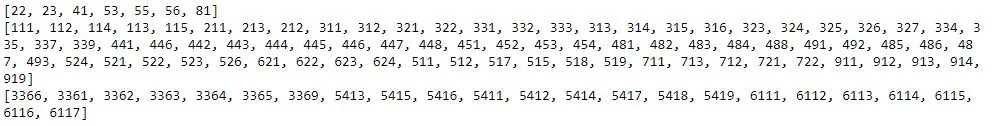

## Exploratory Data Analysis of NAICS
Initially the data was grouped as per NAICS code and the sum of employment was sorted in descending order. It was found that the top 3 sectors with highest employment opportunities created were Retail trade (44) ,Health care and social assistance (62) and Food manufacturing (31). While the lowest sectors contributing to employment were Mining, quarrying, and oil and gas extraction (21),Utilities:(22), Management of companies and enterprises (55).This blog will continue to look into these 6 fields in detail.

```python
df_combined_2N=df_combined.loc[df_combined['NAICS'].isin(list_2N)]
df_combined_3N=df_combined.loc[df_combined['CODE_3'].isin(list_3N)]
df_combined_4N=df_combined.loc[df_combined['CODE_4'].isin(list_4N)]
df_final=df_combined.loc[df_combined['NAICS'].isin(res)]
df_upper=df_combined.loc[df_combined['upper_code'].isin(res)]
df_final = df_final.append(df_upper, ignore_index=True)
df_2N['NAICS']=df_2N['NAICS'].astype('category')
df_2N_sum=df_2N.groupby(['NAICS'])["_EMPLOYMENT_"].sum()
print(df_2N_sum.sort_values(ascending = False) )
print(type(df_2N_sum))
plt.ylabel("Employment")
df_2N_sum.plot(kind='bar')
```

- 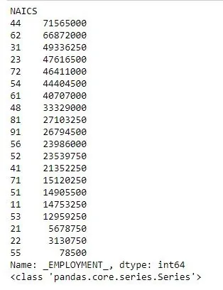

- 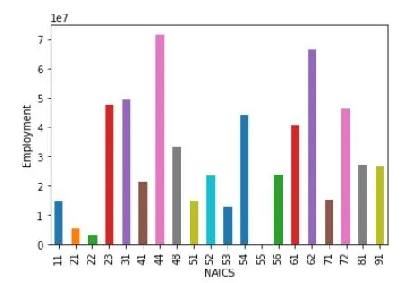

*figure 2: Bar graph illustrating NAICS Code vs Employment*

### Analysis of top 3 highest employment generating sector
By analyzing the bar chart of yearly employment it is clear that the 44 sector has had a constant growth in employment since 1997 till early 2010’s and then some decline but gain sharp increase from mid 2010s.Furthure looking which sub sector had contributed it was clear that subsection Food and beverage stores (445), Motor vehicle and parts dealers (441) and Clothing and clothing accessories stores (448) were the most prominent ones. Also yearly and monthly box plot were also generated.

```python
df_2N['Date'] =pd.to_datetime([f'{y}-{m}' for y, m in zip(df_2N.SYEAR,df_2N.SMTH)])
df_2N.index = df_2N['Date']
del df_2N['Date']
rslt_df = df_2N.loc[df_2N['NAICS'] == '44']
df_2N_ysum=rslt_df.groupby(['SYEAR'])["_EMPLOYMENT_"].sum()
print(df_2N_ysum.sort_values(ascending = False) )
plt.ylabel("Employment")
plt.xlabel("Year")
df_2N_ysum.plot()
df=rslt_df.groupby('SYEAR')['_EMPLOYMENT_']
```

- 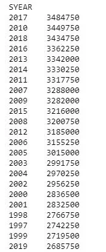

- 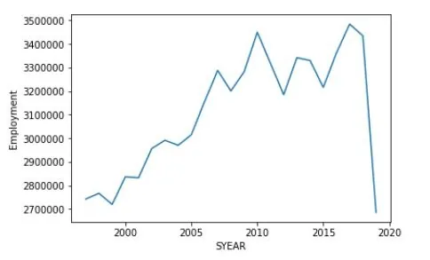

*figure 3: Line graph displaying Employment vs Year for NAICS code sector 44*

```python
df1_2N=df_final[df_final['CODE_2']==44]
df_2N_sum=df1_2N.groupby(['CODE_3'])["_EMPLOYMENT_"].sum()
print(df_2N_sum.sort_values(ascending = False) )
df_2N_sum.plot(kind="bar", figsize=(12,6))
plt.ylabel("Employment")
plt.xlabel("NAICS Code")
plt.show()
```

- 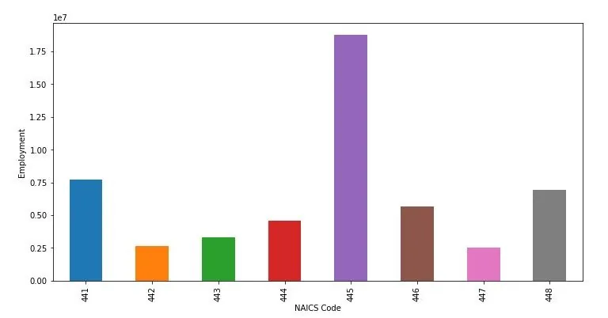

*figure 4: Bar graph illustrating various subsectors contributing to employment of sector 44*

```python
rslt_df = df_2N.loc[df_2N['NAICS'] == '44']
rslt_df['year'] = [d.year for d in rslt_df.index]
rslt_df['month'] = [d.strftime('%b') for d in rslt_df.index]
years = rslt_df['year'].unique()
fig, axes = plt.subplots(1, 2, figsize=(25,8), dpi= 80,)
sns.boxplot(x='year',y='_EMPLOYMENT_',data=rslt_df, ax=axes[0])
sns.boxplot(x='month',y='_EMPLOYMENT_',data=rslt_df, ax=axes[1])
plt.show()
```

- 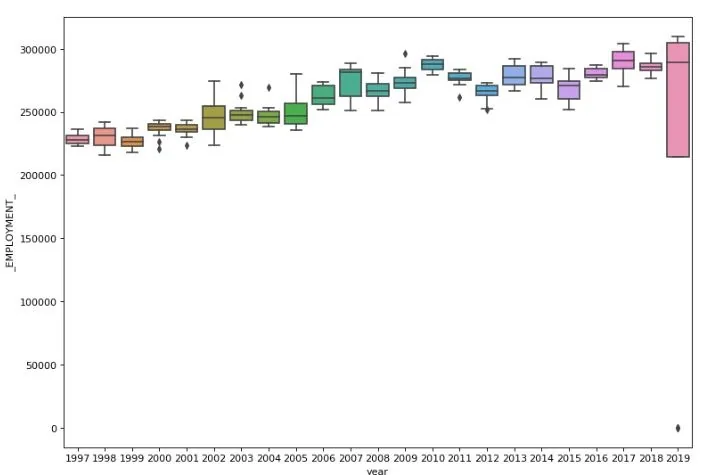

*figure 5:Box plot displaying Employment vs Year for NAICS code sector 44*

- 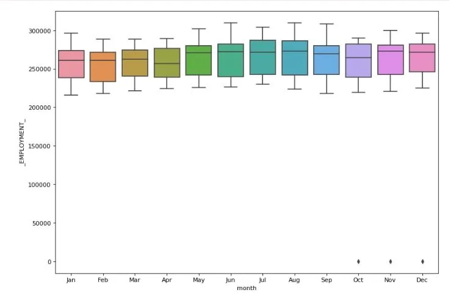

*figure 6:Box plot displaying Employment vs Month for NAICS code sector 44*

For sector with code 62 we can clearly witness that there has been a constant increase in employment. Even though differences on average can be seen in yearly data but for monthly data it seems to be almost constant. The most contributing sub sectors were Ambulatory health care services (621) and Hospitals (622) for this sector.

As for sectors with 31 code we can observe fluctuation with sharp decreases since the late 2000s till early 2010s, and a slow increase since mid 2010s.The average yearly and monthly box plot followed the same pattern as sector 44.The sub sector with code 311( Food manufacturing) contributed to almost 70% to the sectors employment.

```python
rslt_df = df_2N.loc[df_2N['NAICS'] == '62']
df_2N_ysum=rslt_df.groupby(['SYEAR'])["_EMPLOYMENT_"].sum()
df_2N_ysum.plot()
plt.ylabel("Employment")
plt.xlabel("Year")
```

- 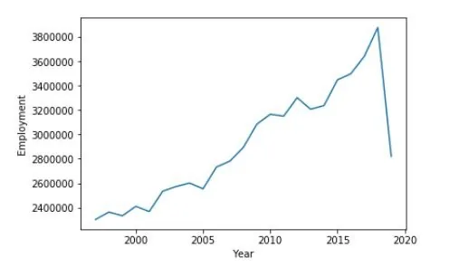

*figure 7: Line graph displaying Employment vs Year for NAICS code sector 62*

```python
df1_2N=df_final[df_final['CODE_2']==62]
df_2N_sum=df1_2N.groupby(['CODE_3'])["_EMPLOYMENT_"].sum()
print(df_2N_sum.sort_values(ascending = False) )
df_2N_sum.plot(kind="bar", figsize=(10,5))
plt.ylabel("Employment")
plt.xlabel("NAICS Code")
plt.show()
```

- 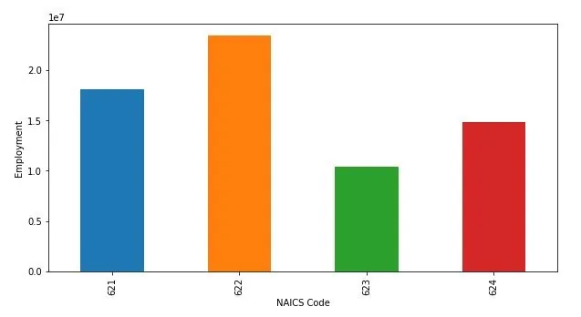

*figure 8: Bar graph illustrating various subsectors contributing to employment of sector 62*

```python
rslt_df = df_2N.loc[df_2N['NAICS'] == '62']
rslt_df['year'] = [d.year for d in rslt_df.index]
rslt_df['month'] = [d.strftime('%b') for d in rslt_df.index]
years = rslt_df['year'].unique()
fig, axes = plt.subplots(1, 2, figsize=(25,8), dpi= 80,)
sns.boxplot(x='year',y='_EMPLOYMENT_',data=rslt_df, ax=axes[0])
sns.boxplot(x='month',y='_EMPLOYMENT_',data=rslt_df, ax=axes[1])
plt.show()
```

- 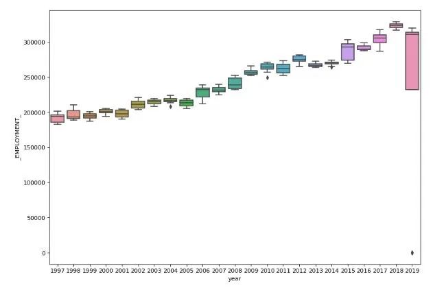

*figure 9:Box plot displaying Employment vs Year for NAICS code sector 62*

- 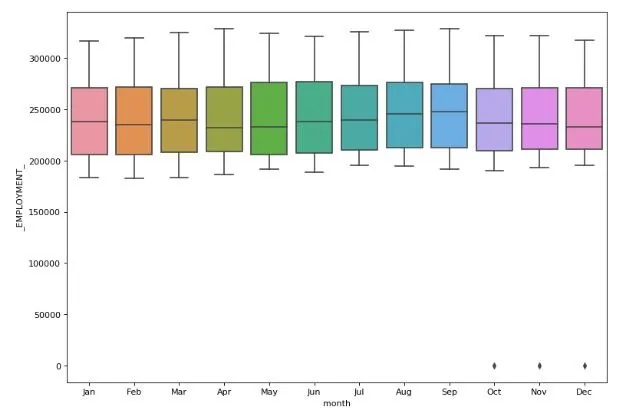

*figure 10:Box plot displaying Employment vs Month for NAICS code sector 62*

As for sectors with 31 code we can observe fluctuation with sharp decreases since the late 2000s till early 2010s, and a slow increase since mid 2010s.The average yearly and monthly box plot followed the same pattern as sector 44.The sub sector with code 311( Food manufacturing) contributed to almost 70% to the sectors employment.

```python
rslt_df = df_2N.loc[df_2N['NAICS'] == '31']
df_2N_ysum=rslt_df.groupby(['SYEAR'])["_EMPLOYMENT_"].sum()
df_2N_ysum.plot()
plt.ylabel("Employment")
plt.xlabel("Year")
```

- 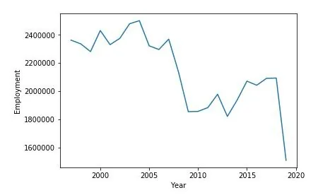

*figure 11: Line graph displaying Employment vs Year for NAICS code sector 31*

```python
df1_2N=df_final[df_final['CODE_2']==31]
df_2N_sum=df1_2N.groupby(['CODE_3'])["_EMPLOYMENT_"].sum()
print(df_2N_sum.sort_values(ascending = False) )
df_2N_sum.plot(kind="bar", figsize=(10,5))
plt.ylabel("Employment")
plt.xlabel("NAICS Code")
plt.show()
```

- 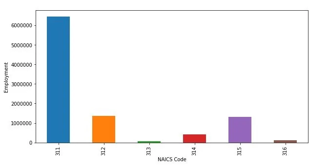

*figure 12: Bar graph illustrating various subsectors contributing to employment of sector 31*

```python
rslt_df = df_2N.loc[df_2N['NAICS'] == '31']
rslt_df['year'] = [d.year for d in rslt_df.index]
rslt_df['month'] = [d.strftime('%b') for d in rslt_df.index]
years = rslt_df['year'].unique()
fig, axes = plt.subplots(1, 2, figsize=(25,8), dpi= 80,)
sns.boxplot(x='year',y='_EMPLOYMENT_',data=rslt_df, ax=axes[0])
sns.boxplot(x='month',y='_EMPLOYMENT_',data=rslt_df, ax=axes[1])
plt.show()
```

- 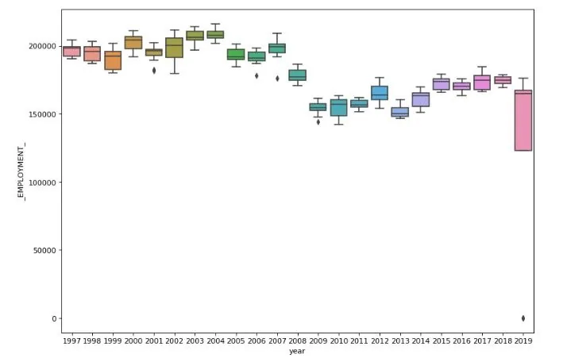

*figure 13:Box plot displaying Employment vs Year for NAICS code sector 31*

- 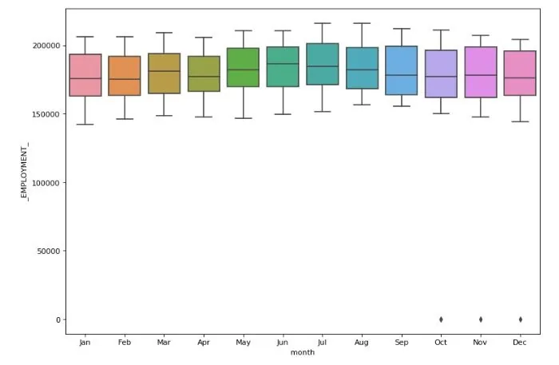

*figure 14:Box plot displaying Employment vs Month for NAICS code sector 31*

### Analysis of top 3 lowest employment generating sector
Considering the sector with code 22 it can be noticed that there is a dip of employment generated by the sector till the mid 200s which is then followed by a gradual increase till late 2010s. The data doesn’t seem to have any sub sector employment generation record for code 22. Even though differences on average can be seen in yearly data but for monthly data it seems to be very similar.

```python
rslt_df = df_2N.loc[df_2N['NAICS'] == '22']
df_2N_ysum=rslt_df.groupby(['SYEAR'])["_EMPLOYMENT_"].sum()
df_2N_ysum.plot()
plt.ylabel("Employment")
plt.xlabel("Year")
```

- 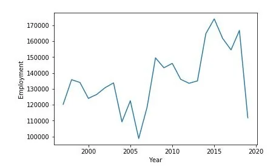

*figure 15: Line graph displaying Employment vs Year for NAICS code sector 22*

```python
df1_2N=df_final[df_final['CODE_2']==22]
df_2N_sum=df1_2N.groupby(['CODE_3'])["_EMPLOYMENT_"].sum()
print(df_2N_sum.sort_values(ascending = False) )
df_2N_sum.plot(kind="bar", figsize=(12,6))
plt.ylabel("Employment")
plt.xlabel("NAICS Code")
plt.show()
```

- 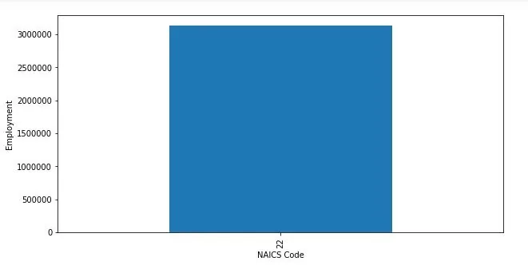

*figure 16: Bar graph illustrating various subsectors contributing to employment of sector 22*

```python
rslt_df = df_2N.loc[df_2N['NAICS'] == '22']
rslt_df['year'] = [d.year for d in rslt_df.index]
rslt_df['month'] = [d.strftime('%b') for d in rslt_df.index]
years = rslt_df['year'].unique()
fig, axes = plt.subplots(1, 2, figsize=(25,8), dpi= 80,)
sns.boxplot(x='year',y='_EMPLOYMENT_',data=rslt_df, ax=axes[0])
sns.boxplot(x='month',y='_EMPLOYMENT_',data=rslt_df, ax=axes[1])
plt.show()
```

- 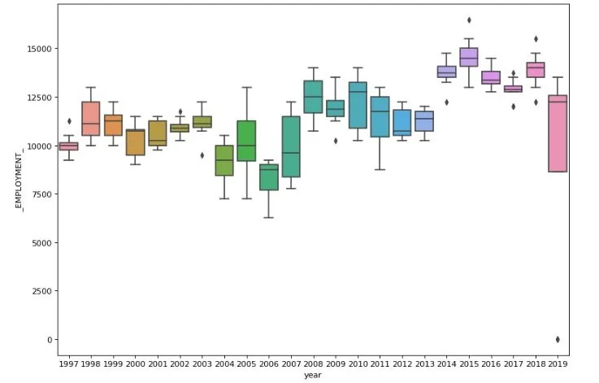

*figure 17:Box plot displaying Employment vs Month for NAICS code sector 22*

- 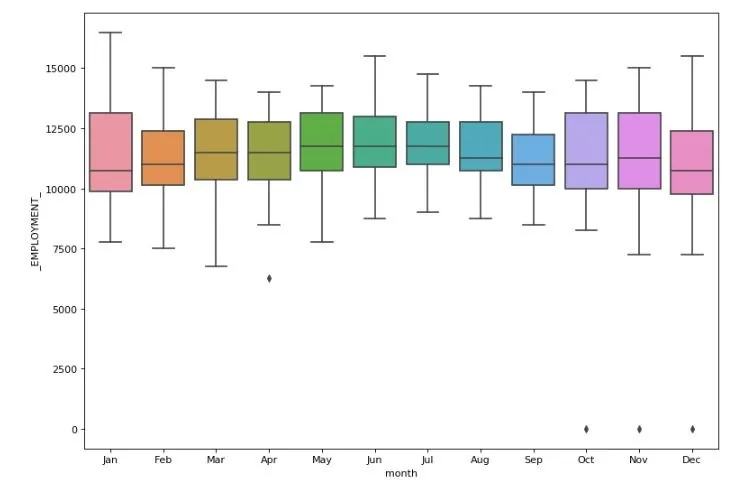

*figure 18:Box plot displaying Employment vs Month for NAICS code sector 22*

Looking at the sector with code 21 it we can note the constant sharp fall of employment till early 200s and then late 2010s there seems to be an exponential increase. The sub sector with code Oil and gas extraction (211), Mining and quarrying [except oil and gas] (212) and Support activities for mining, and oil and gas extraction (213) have contributed to the sector with the above 50% contribution by the sub sector 212.The average yearly and monthly box plot followed the similar pattern as sector 22.

```python
rslt_df = df_2N.loc[df_2N['NAICS'] == '21']
df_2N_ysum=rslt_df.groupby(['SYEAR'])["_EMPLOYMENT_"].sum()
df_2N_ysum.plot()
plt.ylabel("Employment")
plt.xlabel("Year")
```

- 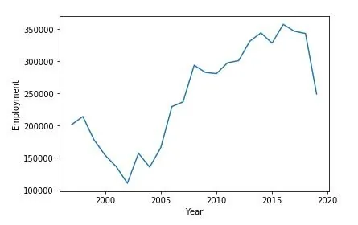

*figure 19: Line graph displaying Employment vs Year for NAICS code sector 22*

```python
df1_2N=df_final[df_final['CODE_2']==21]
df_2N_sum=df1_2N.groupby(['CODE_3'])["_EMPLOYMENT_"].sum()
print(df_2N_sum.sort_values(ascending = False) )
df_2N_sum.plot(kind="bar", figsize=(12,6))
plt.ylabel("Employment")
plt.xlabel("NAICS Code")
plt.show()
```

- 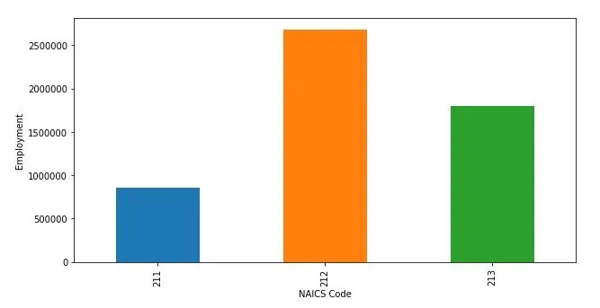

*figure 20: Bar graph illustrating various subsectors contributing to employment of sector 21*

```python
rslt_df = df_2N.loc[df_2N['NAICS'] == '21']
rslt_df['year'] = [d.year for d in rslt_df.index]
rslt_df['month'] = [d.strftime('%b') for d in rslt_df.index]
years = rslt_df['year'].unique()
fig, axes = plt.subplots(1, 2, figsize=(25,8), dpi= 80,)
sns.boxplot(x='year',y='_EMPLOYMENT_',data=rslt_df, ax=axes[0])
sns.boxplot(x='month',y='_EMPLOYMENT_',data=rslt_df, ax=axes[1])
plt.show()
```

- 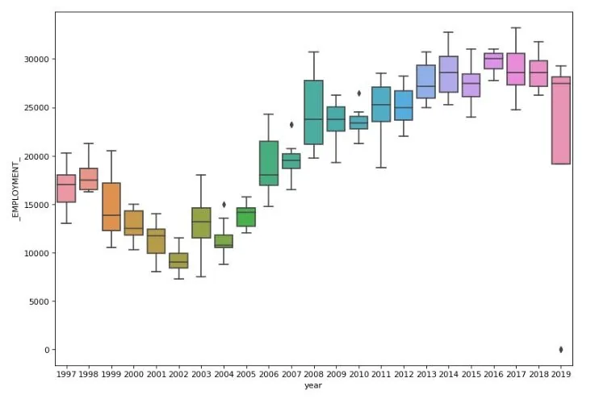

*figure 21:Box plot displaying Employment vs Year for NAICS code sector 21*

- 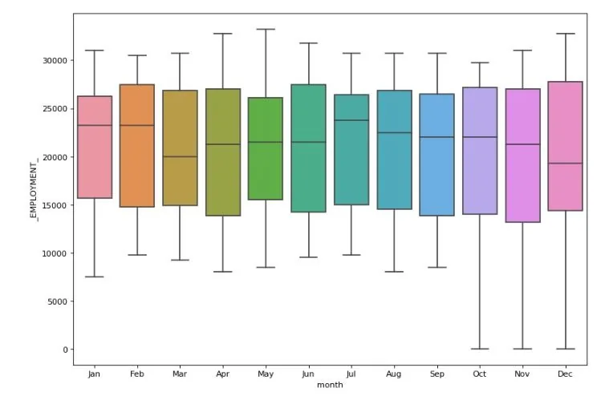

*figure 22:Box plot displaying Employment vs Month for NAICS code sector 21*

As for the sector with code 55, it contributes the overall minimum employment opportunities with no data from 2015. The data doesn’t seem to have any sub sector employment generation record for code 55 same as for code 22. The average yearly and monthly box plot didn't follow the similar pattern as sector 22 and 21 and consist of fluctuating values for both the box plots.

```python
rslt_df = df_2N.loc[df_2N['NAICS'] == '55']
df_2N_ysum=rslt_df.groupby(['SYEAR'])["_EMPLOYMENT_"].sum()
df_2N_ysum.plot()
plt.ylabel("Employment")
plt.xlabel("Year")
```

- 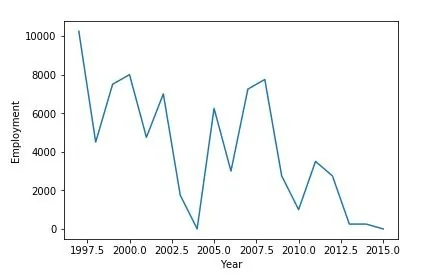

*figure 23: Line graph displaying Employment vs Year for NAICS code sector 55*

```python
df1_2N=df_final[df_final['CODE_2']==55]
df_2N_sum=df1_2N.groupby(['CODE_3'])["_EMPLOYMENT_"].sum()
print(df_2N_sum.sort_values(ascending = False) )
df_2N_sum.plot(kind="bar", figsize=(12,6))
plt.ylabel("Employment")
plt.xlabel("NAICS Code")
plt.show()
```

- 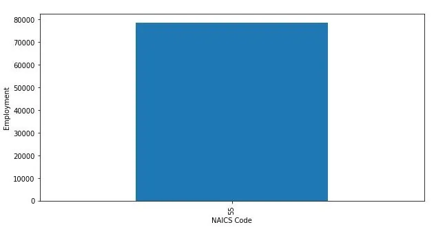

*figure 24: Bar graph illustrating various subsectors contributing to employment of sector 55*

```python
rslt_df = df_2N.loc[df_2N['NAICS'] == '55']
rslt_df['year'] = [d.year for d in rslt_df.index]
rslt_df['month'] = [d.strftime('%b') for d in rslt_df.index]
years = rslt_df['year'].unique()
fig, axes = plt.subplots(1, 2, figsize=(25,8), dpi= 80,)
sns.boxplot(x='year',y='_EMPLOYMENT_',data=rslt_df, ax=axes[0])
sns.boxplot(x='month',y='_EMPLOYMENT_',data=rslt_df, ax=axes[1])
plt.show()
```

- 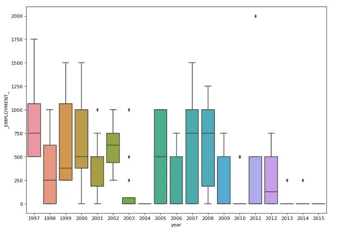

*figure 25:Box plot displaying Employment vs Year for NAICS code sector 55*

- 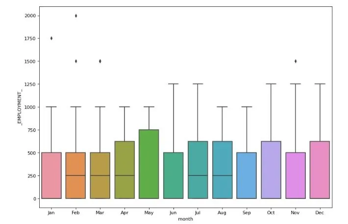

*figure 26:Box plot displaying Employment vs Month for NAICS code sector 55*

### Analysis of construction sector

For better interpretation of result the sector construction (23) is also analyzed. For this sector we can observe continuous growth of employment from the beginning till late 2010s with some exceptions as plateau from the mid 2000s till mid 2010s. It also had no further sub sector contribution like the low employment generating sectors. However the average yearly and monthly box plot didn't follow the similar pattern as of the high employment generating sectors.

```python
rslt_df = df_2N.loc[df_2N['NAICS'] == '23']
df_2N_ysum=rslt_df.groupby(['SYEAR'])["_EMPLOYMENT_"].sum()
df_2N_ysum.plot()
plt.ylabel("Employment")
plt.xlabel("Year")
```

- 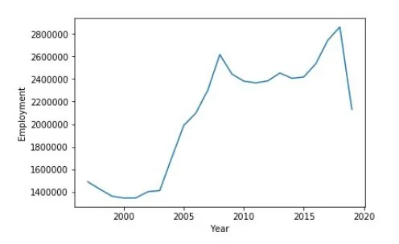

*figure 27: Line graph displaying Employment vs Year for NAICS code sector 23*

```python
df1_2N=df_final[df_final['CODE_2']==23]
df_2N_sum=df1_2N.groupby(['CODE_3'])["_EMPLOYMENT_"].sum()
print(df_2N_sum.sort_values(ascending = False) )
df_2N_sum.plot(kind="bar", figsize=(12,6))
plt.ylabel("Employment")
plt.xlabel("NAICS Code")
plt.show()
```

- 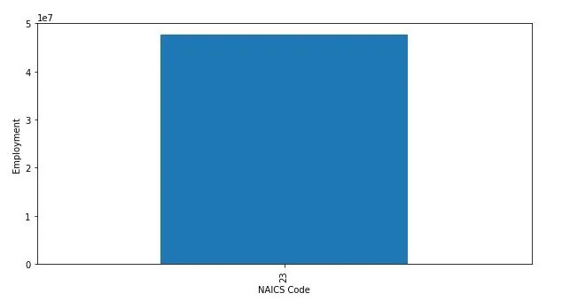

*figure 28: Bar graph illustrating various subsectors contributing to employment of sector 23*

```python
rslt_df = df_2N.loc[df_2N['NAICS'] == '23']
rslt_df['year'] = [d.year for d in rslt_df.index]
rslt_df['month'] = [d.strftime('%b') for d in rslt_df.index]
years = rslt_df['year'].unique()
fig, axes = plt.subplots(1, 2, figsize=(25,8), dpi= 80,)
sns.boxplot(x='year',y='_EMPLOYMENT_',data=rslt_df, ax=axes[0])
sns.boxplot(x='month',y='_EMPLOYMENT_',data=rslt_df, ax=axes[1])
plt.show()
```

- 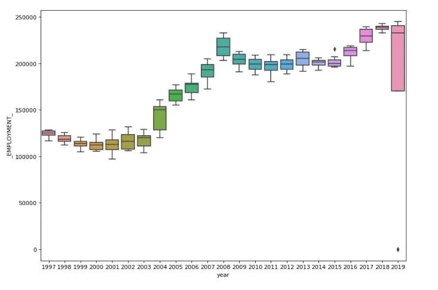

*figure 29:Box plot displaying Employment vs Year for NAICS code sector 23*

- 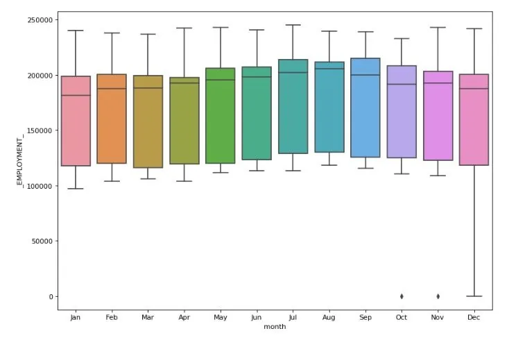

*figure 30:Box plot displaying Employment vs Month for NAICS code sector 23*

## Conclusion:
It is clear from the above analysis that for most of the highest employment generating sector there seems to be a sharp rise from the mid 2010s. On the contrary the two out of three sectors with lowest employment seem to have a dip from the mid 2010s, while the sector Mining, quarrying, and oil and gas extraction (21) seems have been creating better employment opportunities since mid 2010s. It can also be observed that out of the the 3 sector with lowest employment , two sector had no further sub sector division. So we can logical reason that sector having no further division can generate low employment chances.

Another interesting insight can be noticed that the top 3 highest employment generating sectors had differences on average in yearly data but for monthly data the averages seem to be very similar. As for the top 3 lowest employment generating sectors the trend couldn't be noticed. This may be due to very less to no data at times for such sectors. Further looking into the 4th highest employment generating sector construction(23) it could be noted that there had been a steady rise of employment opportunities due to this field even though no other sub sectors were contributing to this sector. This sector also followed the usual trend of pattern in the box plot which does suggest that there is sufficient amount of data for analysis.
