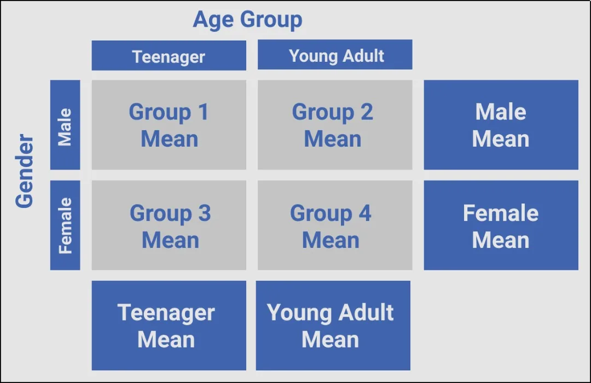

As a sequel to the[article](https://www.datainsightonline.com/post/understanding-two-factor-factorial-design) on two-factor factorial design intuition, this article will go a step further with the aid of visualizations to explain the possible results of the design. (You can go through the first article linked above if you are new to factorial design).

To plot the graphs, we will be using simple, hypothesized and aggregated datasets, as the focus of this is much more on the basic understanding of the design than the analysis itself. However, we will be using **Plotly** and **Datapane** to render pictorial tables, plots, and source codes to the visualizations.

## A Quick Recap of the Problem
A movie rental company wishes to understand how age (grouped into teenager and young adult) and gender influence the consumption of anime so as to make better advertising decisions. The picture below should serve a quick guide to how the problem was designed:

## Results of the Two-factor Factorial Experiment
There are basically three possible results from a factorial experiment: the **null**, **main**, and **interactive** effects. However further breakdown is possible with the latter two depending on the number of factors. In the case of two-factor design, the subdivision is 8, all of which we will explore.

### 1. Null Effect

In this case, neither age group nor gender would have any effect on the rate of consumption of anime. That's why the hypothesized data below shows equal average consumption of anime across all intersections.

Also, this total lack of effect from the two factors is why the effect lines are in exactly the same position and with no unit change.

*It is important to note that real data would not necessarily have exactly equal means for a null effect to hold. Conversely, differences in mean values (as will be seen in later examples) do not automatically translate to effect. The purpose of the values is to ease illustration.*

### 2. Main Effect of Age Group

Main effect basically happens when one factor changes consistently across the levels of the second factor, the latter being the significant factor.

Here, we can see how the average consumption of anime by gender changes from teenager to young adult, which can be loosely translated as young adults watching more anime than teenagers. The lines are also in the same position but with a slope to signify change by age group.

### 3. Main Effect of Gender

This is similar to the case above, just that the variables switch importance. Here we can see that females watch more anime than males across all age group.

### 4. Main Effect of Age Group and Gender

It is also possible to have independent main effects from both factors. Here, the result shows that while there is a consistent change for all levels of gender across age, so also is a consistent change for the levels of age group across gender.

### 5. Main Effect of Age Group and Spreading Interaction

Contrary to the previous example, the effect of one factor on the dependent variable can also depend on the level of the other factor. This is called the **interaction** effect.

This interaction happens in different ways. In the image below, we notice that gender changes consistently across age groups. However, the change in the male category is much more stronger than that of the female. We can say the **male young adult** population is a very good target for the company.

So essentially, when one of the factors causes noticeable change on one level of the other factor and at the same time causes less or no change at all on the level, then we have what is called a **spreading interaction.**

### 6. Main Effect of Gender and Spreading Interaction

Same phenomenon noticed above is here, but across gender. For instance, the company would be wary of female young adults as against worrying about the whole female level.

*Another important point that differentiates main effects from spreading interaction as can be seen in the line plots is that while main effects are parallel in direction, spreading effect has the tendency to spill and mingle over time*

### 7. Cross-over Interaction

Unlike the spreading interaction that is usually an offshoot of the main effect, the cross-over interaction system appears to nullify the chances of the main effect.

In our example, we can see that anime consumption by the male and female levels changes across age groups but in the opposite direction. Similarly, teenagers and young adults lose and gain count respectively as we move from male to female. Now, while this looks like a cancellation of the main effect, it does not necessarily mean so. The case is just a little more complicated than meets the eye.

### 8. Main Effect of Age Group, Gender and Interaction

Here, aside from the noticeable effect of both factors, we also see that female consumption of anime is smaller across age groups the same way teenager consumption is smaller across gender. That way, the company can clearly see not just how potentially favorable the interaction of male and young adults is but also how female teenagers presently do not perform well.

## Summary
This article merely lists the possible results of a two-factor factorial design. The ideas provided here are not sufficient enough to make any business or scientific decision. To do that, one would need to employ statistical techniques like ANOVA.

Thanks for reading.
