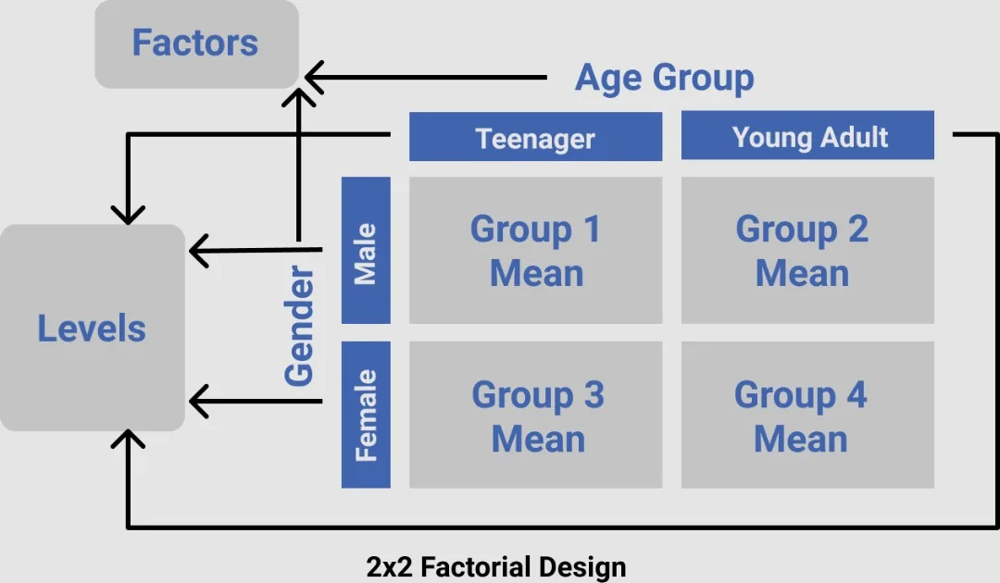

## Introduction
Human, being a creature of not just need but want, is in an eternal bid to improve his living condition. To achieve this, he daily evaluates the key aspects of his life. From individuals to entities to businesses, whether knowingly or not, we set up processes to understand not only if things work but also why they work or not. Simply put, we are always experimenting. However, to make this whole process much more effective and the result more reliable, scientists came up with the idea of not just experimenting but making a conscious, step-by-step effort to plan the experiment. And this is the birth of the concept of **design of experiment**!

*Against the usual misconception that experiment is something carried out in a laboratory, experiment can be carried out in virtually any field and in different settings.*

With the foregoing, a baker might want to know what cake recipe will earn the best review among her customers and thus produce more of it. A medical researcher might want to know which combination of diet and lifestyle would be beneficial to diabetic patients. A quality analyst for a manufacturing company might test what combination of materials and work shift would help his company optimize production. An online educational platform might choose to investigate whether or not course duration and course level have a significant effect on the amount subscribers are willing to pay.

Each of the scenarios painted above are problems that can be solved with experimental design. However, like in every area of knowledge, there’s no one-size-fit-all methodology to employ and what to choose is a subject of what one aims to achieve. But for this particular write-up, we’d be looking at **factorial design**, precisely the 2-factor between-subject factorial design

## Two-Factor Factorial Design
First, factorial design is a design that improves upon the single-factor design by studying the effect of two or more independent variables on a dependent variable of interest. It also goes a step further to study the interaction effects these independent variables can have on the dependent variable.

So two-factor factorial design simply employs two independent variables to carry out this test.

### A Simple Case Study

For intuition, let’s look at a very simple example. A movie rental company would like to know which age group watches anime more so as to know where to focus its advertisement campaign. The company would also like to know if there’s any major difference by gender. To achieve this, the company decided to run an experiment by giving free access to the recruited respondents to watch movies (of relatively equal duration) for three months and record the number of anime movies seen by the respondents.

### Definition of Terms

Before delving proper into the two-factor factorial design for this problem, let's refresh our memories with the common terms we are going to come across:

- **Experimental unit**: this is a respondent or a participant in an experiment
- **Response variable**: this is the dependent variable upon which effects are checked
- **Factor**: this is the independent variable whose effects are tested on the dependent variable
- **Level**: level is a subdivision of a factor
- **Treatment**: this is a unique level (single-factor experiment) or combination of levels (factorial experiment) to which experimental units are assigned

### Numbering Notation
It is also worth understanding the numbering notation in factorial design. In our case, we have a *2 x 2* factorial design problem. Generally the number of digits tells how many factors there are in the experiment while the values of the digits tell the number of levels under each factor. In *2 x 2*, we have two digits, so that means we have two factors. Same as in *2 x 3*. For levels however, *2 x 2* is saying the two factors each have two levels under them. Whereas, *2 x 3* is saying the first factor has two levels while the second factor has three levels. The number of treatment groups in the design can be easily obtained by multiplying the number notation. In our *2 x 2* case for instance, we have 4 treatment groups, as shown in the image below.

*The order of the digits does not matter. 2 x 3 is the same as 3 x 2*

### Pictorial Representation of the Two-factor Factorial Design Problem

Back to the movie rental problem. The company decides to group the age of its experimental units into two: teenagers (13-19) and young adults (20-26), in addition to gender division. The figure below represents the two-factor factorial design of the problem.

So essentially the company has four different possible treatments/groups to assign the experimental units to:

1. **Group 1**: male teenager
2. **Group 2**: male young adult
3. **Group 3**: female teenager
4. **Group 4**: female young adult

After this grouping, the company would then take the average number of movies each group watched to run the needed statistical analysis.

In the [second part of this article](https://www.datainsightonline.com/post/understanding-two-factor-factorial-design-visualization-of-results), we will discuss the possible outcomes of the statistical analysis with the aid of graphical illustrations using Python.

Thank you for reading. Stay tuned!
