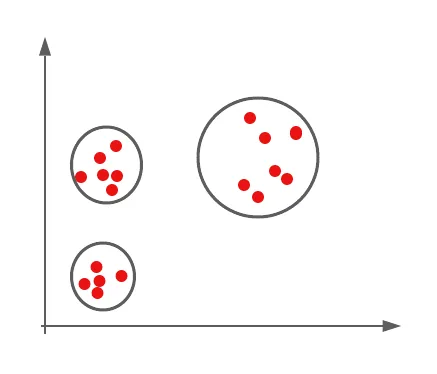
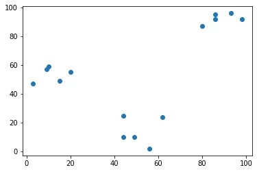
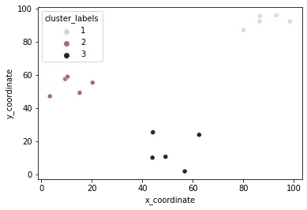
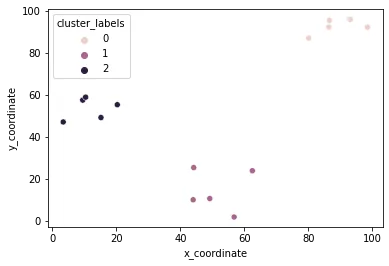
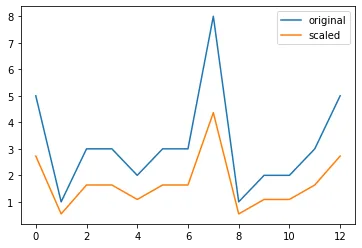

## What is unsupervised learning?
- A group of machine learning algorithms that find patterns in data
- Data for algorithms has not label, classified or characterized
- The objective of the algorithm is to interpret any structure in the data
- Common unsupervised learning algorithms: clustering, neural networks, anomaly detection

## What is clustering?
- The process of grouping items with similar characteristics
- Items in groups similar to each other than in other groups
- Example: distance between points on a 2D plane

## Plotting data for clustering - Pokemon sightings
```python
from matplotlib import pyplot as plt
x_coordinates = [80, 93, 86, 98, 86, 9, 15, 3, 10, 20, 44,
                                56, 49, 62, 44]
y_coordinates = [87, 96, 95, 92, 92, 57, 49, 47, 59, 55, 25,
                                2, 10, 24, 10]
plt.scatter(x_coordinates, y_coordinates)
plt.show()
```



Data are separated into three parts!!!

## Basic of cluster analysis
## What is a cluster?
- Group of items with similar characteristics
- Google News: articles where similar words and word associations appear together
- Customer Segments

## Clustering algorithms
- Hierarchical clustering
- K means clustering
- Other clustering algorithms: DBSCAN, Gaussian Methods

## Hierarchical clustering in SciPy
```python
from scipy.cluster.hierarchy import linkage, fcluster
from matplotlib import pyplot as plt
import seaborn as sns, pandas as pd

x_coordinates = [80.1, 93.1, 86.6, 98.5, 86.4, 9.5, 15.2,
    3.4, 10.4, 20.3, 44.2, 56.8, 49.2, 62.5, 44.0]
y_coordinates = [87.2, 96.1, 95.6, 92.4, 92.4, 57.7, 49.4,
     47.3, 59.1, 55.5, 25.6, 2.1, 10.9, 24.1, 10.3]

df = pd.DataFrame({'x_coordinate': x_coordinates,
        'y_coordinate': y_coordinates})

Z = linkage(df, 'ward') # ward: based on the sum of squares
df['cluster_labels'] = fcluster(Z, 3, criterion='maxclust')

sns.scatterplot(x='x_coordinate', y='y_coordinate', hue='cluster_labels', data = df)
plt.show()
```



## K-means clustering in SciPy
```python
from scipy.cluster.vq import kmeans, vq
from matplotlib import pyplot as plt
import seaborn as sns, pandas as pd
import random
random.seed((1000,2000))

x_coordinates = [80.1, 93.1, 86.6, 98.5, 86.4, 9.5, 15.2,
    3.4, 10.4, 20.3, 44.2, 56.8, 49.2, 62.5, 44.0]
y_coordinates = [87.2, 96.1, 95.6, 92.4, 92.4, 57.7, 49.4,
    47.3, 59.1, 55.5, 25.6, 2.1, 10.9, 24.1, 10.3]

df = pd.DataFrame({'x_coordinate': x_coordinates,
      'y_coordinate': y_coordinates})

centroids,_ = kmeans(df, 3)
df['cluster_labels'], _ = vq(df, centroids) # centroid: based on the geometric mean of all objects

sns.scatterplot(x='x_coordinate', y='y_coordinate',
      hue='cluster_labels', data = df)
plt.show()
```



## Data preparation for cluster analysis
## Why do we need to prepare data for clustering?
- Variables have incomparable units (product dimensions in cm, price in $)
- Variables with the same units have vastly different scales and variances (expenditures oncereals, travel)
- Data in raw form may lead to bias in clustering
- Clusters may be heavily dependent on one variable
- Solution: normalization of individual variables

## Normalization of data
Normalization: the process of rescaling data to a standard deviation of 1

```python
from scipy.cluster.vq import whiten
data = [5, 1, 3, 3, 2, 3, 3, 8, 1, 2, 2, 3, 5]
scaled_data = whiten(data)
print(scaled_data)
```

```python
[2.72733941 0.54546788 1.63640365 1.63640365 1.09093577 1.63640365
 1.63640365 4.36374306 0.54546788 1.09093577 1.09093577 1.63640365
 2.72733941]
```

```python
# Import plotting library
from matplotlib import pyplot as plt

# Initialize original, scaled data
plt.plot(data,label="original")
plt.plot(scaled_data,label="scaled")# Show legend and display
                                                         plot

plt.legend()
plt.show()
```



[GitHub Link](https://github.com/abubinfahd/Data-Insight/blob/main/Assignments/Unsupervised_Learning_Basics_of_Clustering.ipynb)
