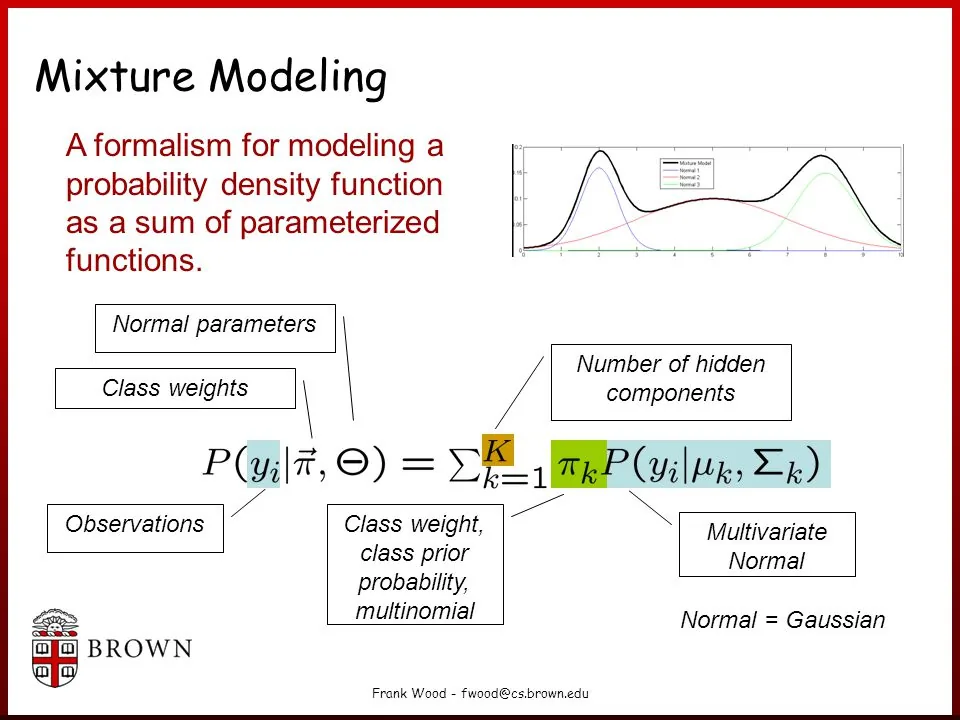
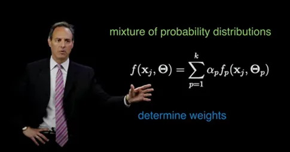
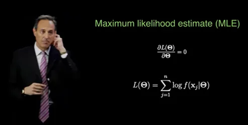
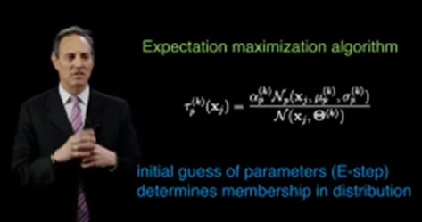
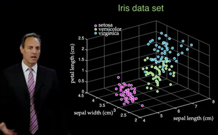
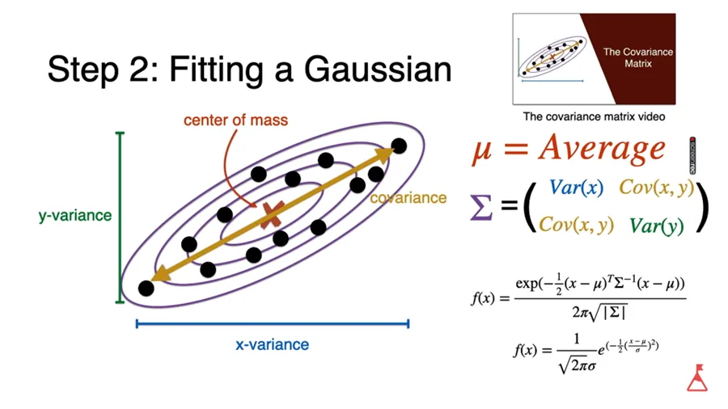
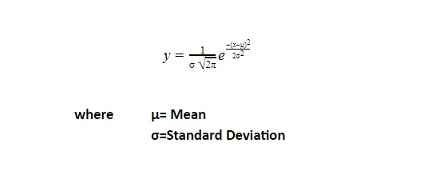
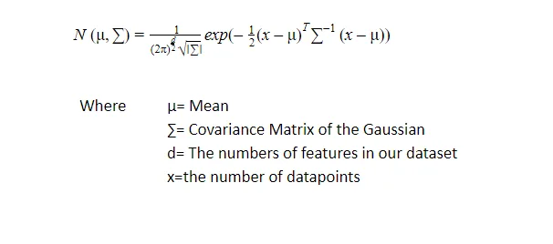

#### There are two types of clustering:

**Hard clustering methods** where clusters do not overlap, the data point either belongs to a cluster or it does not such as: k-means.

**Soft clustering methods** where clusters may overlap, where data points or instances and clusters have association strength such as mixture models, points have probabilities for their clusters.

If the data is normal observation, we use gaussian, if the data is discrete, we use multinomial distribution.

If it is 1 dimensional task, we only need to estimate the man and the variance, this in case we know which point comes from which distribution, like in the following figure:

But what if we do not know which point comes from which source or which k gaussian, this is what expectation maximization algorithm EM does, and for each point it is going to do a soft clustering which means it computes a probability.

Gaussian is used for more than 1 dimension data.

#### Gaussian Mixture Models for Clustering

A mixture of probability distributions, where it assumes the form of the data for multiple random processes, each has its own distribution, a mixture of models.

F is the distribution with its parametric dependency theta Θ, and k is the threshold of how many distributions you are going need for that data, what is the form of that distribution, normally we make f of p as a gaussian model.

Sum is the summation of different probability distribution weighted by alpha α which help making the entire probability distribution.

So, we need to determine Θ for each distribution and α , and we can do this through optimization:

This is a regression problem, we have input and output data, in that we need to find the parameters of the problem. We assume it is normally distributed as GMM gaussian mixture model, which is parametrized by the mean and the variance, so our first choice unless we have a reason for choosing another complex probability distribution.

So, we need to determine:

· Wights

· Variances

· Means

For each distribution.

If I have two gaussian then I need to determine 6parameters, in order to find the best fit for the data.

We do this optimization problem using **maximum likelihood estimate algorithm,**

To optimize it or saying minimizing the error we take the derivative to the parameter and set it to zero. The log here is of probability distributions, because the log cancels the e, in case we have the e.

This represents the mean of the distribution which is easier to compute using this log.

Another algorithm was developed to do the above, which is basically an iterative procedure, consists of e step and an m step, first the expectation then the maximization.

In here we initial guess the parameters randomly seeding theses distributions and their weights, and from here we are going to compute the probability of which membership and which distribution they belong to. This means random distribution with random means and variances and every point must associate with each of these distributions.

Now in the second step m step, we update the weights, the mean and the variances based on the memberships of these points and calculate the center of mass.

We keep updating until those converges well.

**Example:**

Compared to k means and hierarchical methods, there were not an optimization in them, but in Gaussian the e and m algorithm is trying to find an approximated probability distribution.

When choosing the parameters or weights their sums must be 1.

And because we work in higher dimensions, so we have a mean vector and covariance matrix instead of simply mean and variance.

These means and variances specify the location and the shape and the orientation of these different distributions or ellipsis.

**for further explanation for the equation:**

The formula used for Gaussian distribution called the **Probability Density Function, it depends on** mean and the standard deviation:

A function of a continuous random variable that gives the probabilities.

Multiple Gaussian distributions has multiple distributions, such as:

**so, why do we need covariance matrix?**

As in the covariance which computes how two variables relate to each other, covariance matrixes compute how multiple variables relate to each others' as vectors.

**what is exactly a covariance matrix?**
**we will discuss this** [**here**](https://www.datainsightonline.com/post/co-variance-matrix-in-detail)**.**

**References:**

Wood, F. (1999). *Gentle introduction to infinite gaussian mixture modeling - ppt video online download*. SlidePlayer. Retrieved May 6, 2022, from https://slideplayer.com/slide/1580047/

databookuw.com. (2020). *Unsupervised Learning: Mixture Models*. *YouTube*. Retrieved May 6, 2022, from https://www.youtube.com/watch?v=5amKlNtIoT0.

Serrano.Academy. (2020). *Gaussian Mixture Models*. *https://www.youtube.com/watch?v=q71Niz856KE*. YOUTUBE.

Solanki, G. (2022, March 4). *Understanding gaussian mixture model*. GreatLearning Blog: Free Resources what Matters to shape your Career! Retrieved May 6, 2022, from https://www.mygreatlearning.com/blog/gaussian-mixture-model/
