**Pandas** is a broadly used Python library for data analysis. It gives easy-to-use functions to load data from several sources, manipulate them and perform simple visualizations.

In this blog post, we are going to explore three pandas' techniques for data manipulation. Step by step, we are going to follow this outline:

1. **Loading and exploration of the dataset**
2. **Usage of apply function in data manipulation with pandas**
3. **Iterating over rows of Pandas DataFrame**
4. **Visualize data quickly with Pandas**

We are going to use the Kaggle datasets "**internet users in Africa"**. To follow along, you must download it [here](https://www.kaggle.com/raunakingcoder/internet-users-in-africa?select=AfricaInternetUsers.csv). If you are comfortable where you are, we can start our exploration.

## 1. Loading and exploration of the dataset
**Kaggle** is a library with a ton of datasets. When we download one from there, we must first explore its structure before going further. To do that, we will import pandas and load data from the CSV file.

```python
import pandas as pd
data = pd.read_csv("AfricaInternetUsers.csv")
data
```

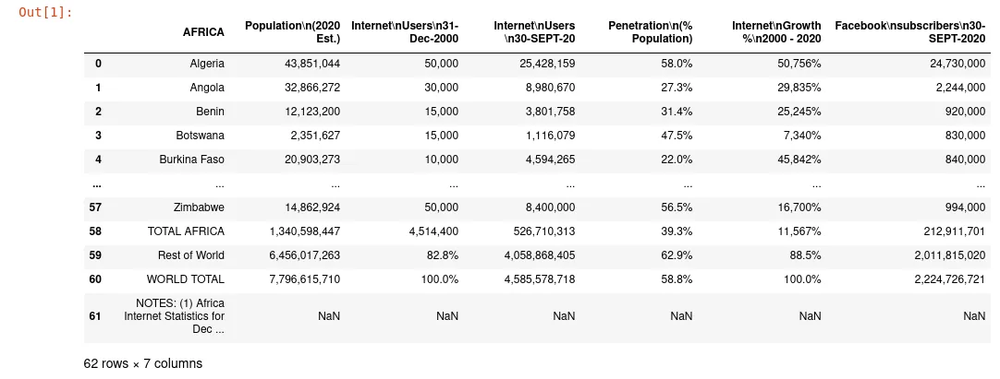

When we take a look at the last rows of DataFrame, we can notice that they only contain information about some statistics and summary informations. We are going to remove them because there are not useful for us.

```python
data = data[:-4]
data.tail()
```

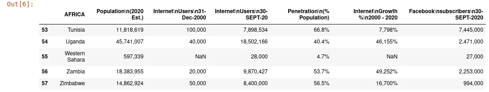

The columns have a name with space plus other characters, then we will rename them for easy manipulation.

```python
data = data.rename(columns={"Population\n(2020 Est.)":"Population_2020_Est", "Internet\nUsers\n31-Dec-2000":"Internet_Users_31_Dec_2000","Internet\nUsers\n30-SEPT-20":"Internet_Users_30_SEPT_20","Penetration\n(% Population)":"Penetration_Population","Penetration_Population 	Internet\nGrowth %\n2000 - 2020":"Penetration_Population"})

data = data.rename(columns={"Internet\nGrowth %\n2000 - 2020":"Internet_Growth_2000_2020","Facebook\nsubscribers\n30-SEPT-2020":"Facebook_subscribers_30_SEPT_2020"})
```

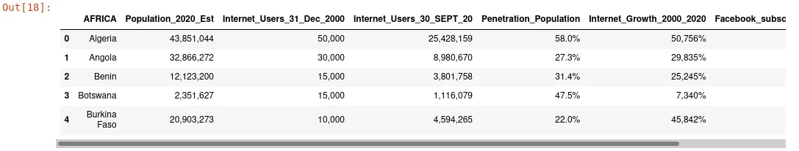

One tour in column **"Internet_Growth_2000_2020"** shows us that certain values are too large to be considered as a percentage. We will drop this column because we can't effectively use it.

```python
data.drop('Internet_Growth_2000_2020', axis=1, inplace=True)
```

Now, we have eight non-defined values in the dataset. To handle these missing values, we will ingenuously fill them with 0.

```python
data = data.fillna(0)
```

At this level, the DataFrame only contains object datatype.

```python
data.info()
```

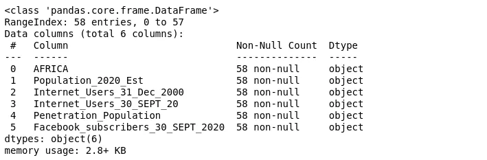

We will convert each value to good pandas datatype in the next section when we explore **DataFrame.apply()** method.

## 2. Usage of apply function in data manipulation with pandas
**apply()**  is a pandas method used both in pandas Series and DataFrame. In DataFrame, the function takes in parameter by this method apply it on the axis of DataFrame while his usage with pandas series works on the entire series.

### a. apply() with pandas series

Pandas Series is known as a one-dimensional array where the axes are labeled. As a reminder, Series is a column in pandas DataFrame. To access pandas Series, we can use the following syntax.

```python
<dataframe>.<column_name>
```

In our dataset, to access the list of Africa countries, we use

```python
data.AFRICA
```

Let's suppose we want to create a new column containing the length of each countries name. We can use the code below.

```python
data['countries_name_length'] = data.AFRICA.apply(len)
data.head()
```

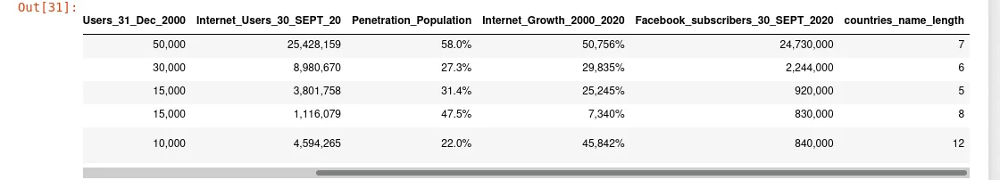

We can create our custom function and passed it to apply method.

```python
def upercase(string):
    return string.upper()

data.AFRICA.apply(upercase).head()
```

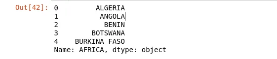

In practice, it is not common to write an entire function to pass to apply method because it is not usually reusable. Instead of doing that, we use anonymous function through python lambda function. We can make the same previous transformation with this single line of code:

```python
data.AFRICA.apply(lambda x: x.upper()).head()
```

To know more about lambda, you can check [this post](https://www.datainsightonline.com/post/lambda-expression-in-python-and-his-usage-in-data-science) that I wrote. For further explanation and usage about apply method on pandas Series, you can check [pandas documentation](https://pandas.pydata.org/docs/reference/api/pandas.Series.html) on that subject and adjust it according to your study case.

### b. apply() with pandas DataFrame

With pandas DataFrame, the principal option we saw with series remains the same with the only difference that with DataFrame, we can work at the same time on multiple columns or rows. We are going to demonstrate how apply() method work on DataFrame.

In our DataFrame, we observe that data in column **"Penetration_Population"** end with the **%** sign at the end of each value. We are going to remove it and convert the whole column to the type float.

```python
data['Penetration_Population']= data['Penetration_Population'].apply(lambda x: str(x).strip("%")).astype(float)
```

To do that, we use lambda function on every value in this column. We use **String strip** method to remove **% sign**  and **astype** pandas method to cast the result to the type float.

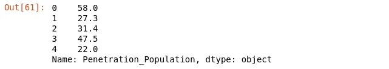

As the remaining data in DataFrame have the same structure, we will convert all of them to the type float.

```python
name_columns = ['Population_2020_Est','Internet_Users_31_Dec_2000','Internet_Users_30_SEPT_20','Facebook_subscribers_30_SEPT_2020']
for col in name_columns:
    data[col] = data[col].apply(lambda x: str(x).replace(",","")).astype(float)

data.head()
```

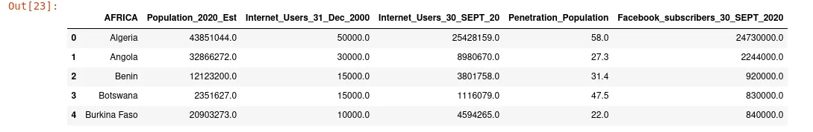

Now, our DataFrame looks good, we have an appropriate pandas datatype for each column.

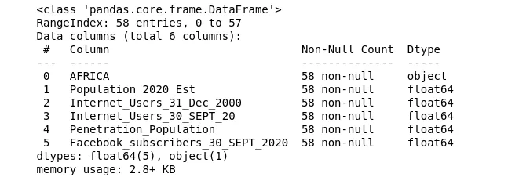

We can also use aggregation function into apply method. We can pass aggregation function to apply method as :

- **Simple string**

```python
print(data['Penetration_Population'].apply('min'))
4.7
```

- **A dictionary**

```python
print(data['Penetration_Population'].apply({'The mean is:':'mean',"Median is:":"median"}))
```

```python
Output:

The mean is:    37.02623
Median is:      37.80000
Name: Penetration_Population, dtype: float64
```

- **A list of aggregation function**

```python
print(data['Penetration_Population'].apply(['std','min','max','median','sum']))
```

```python
Output:
std         21.655953
min          4.700000
max         87.200000
median      37.800000
sum       2258.600000
Name: Penetration_Population, dtype: float64
```

In this section, we have covered many things about apply method on pandas DataFrame and Series. There are many other things that we can talk about this method but we are going to stop here. You can go through the documentation to find other stuff specific to your needs. In the next section, we will cover **iteration over pandas rows.**

## 3. Iterating over rows of Pandas DataFrame

Pandas have three main data structures: **Series, DataFrame, and Panel.**  Series has one dimension and is considered as a column of data. DataFrame instead is a set of Series while Panel is a collection of multiple DataFrame. In this section, we will cover iteration over pandas DataFrame.

Pandas have three principal methods to iterate over DataFrame rows. We have **iterrows(), itertuples() and items().**

### a. Iterrows() method

To iterate over pandas DataFrame with **iterrows()** method, we will combine it with a **for** loop. When we call **DataFrame.iterrows()**, it returns two results: The **index** of the row and **data** of the rows as Series. The following line of code print the indexes and rows of DataFrame containing internet users in Africa.

```python
for index, row in data.iterrows():
   print(index, '\n')
   print(row)
```

We can check the datatype of index and row return by iterrows() like this.

```python
for index, row in data.iterrows():
   print(type(index), type(row))
```

```python
Output:

<class 'int'> <class 'pandas.core.series.Series'>
<class 'int'> <class 'pandas.core.series.Series'>
<class 'int'> <class 'pandas.core.series.Series'>
<class 'int'> <class 'pandas.core.series.Series'>
```

The output shows us that indexes are integers and rows are series. The index can be another type than an integer. We can set AFRICA column as the index in our DataFrame.

```python
data = data.set_index("AFRICA")
for index, row in data.iterrows():
   print(type(index), type(row))
```

```python
Output:
<class 'str'> <class 'pandas.core.series.Series'>
<class 'str'> <class 'pandas.core.series.Series'>
<class 'str'> <class 'pandas.core.series.Series'>
<class 'str'> <class 'pandas.core.series.Series'>
<class 'str'> <class 'pandas.core.series.Series'>
```

The output shows us that indexes are now a string instead of an integer. With row return by iterrows(), you can directly access values. For our DataFrame, we will print values of **Population_2020_Est, and Penetration_Population**  columns.

```python
for index, row in data.iterrows():
   print(index," : ", row[['Population_2020_Est','Penetration_Population']])
```

```python
Output:
Algeria  :  Population_2020_Est       43,851,044
Penetration_Population          58.0
Name: Algeria, dtype: object

Angola  :  Population_2020_Est       32,866,272
Penetration_Population          27.3
Name: Angola, dtype: object

Benin  :  Population_2020_Est       12,123,200
Penetration_Population          31.4
Name: Benin, dtype: object
```

### b. itertuples() method

Itertuples() offers an alternative way to iterate over DataFrame. With itertuples(), each row is not returned as a series but in form of a named tuple where we can easily access each element.

```python
for row in data.itertuples():
    print(row)
```

```python
Output:
Pandas(Index=0, AFRICA='Algeria', _2='43,851,044', _3='50,000', _4='25,428,159', _5='58.0%', _6='50,756%', _7='24,730,000')

Pandas(Index=1, AFRICA='Angola', _2='32,866,272', _3='30,000', _4='8,980,670', _5='27.3%', _6='29,835%', _7='2,244,000')
```

With the result, we can confirm that each row return but itertuples() is effectively a tuple. We can access each element just by its name in the tuple.

```python
for row in data.itertuples():
    print(row.AFRICA, row._2, row._3)
```

```python
Output:
Algeria 43,851,044 50,000
Angola 32,866,272 30,000
Benin 12,123,200 15,000
Botswana 2,351,627 15,000
Burkina Faso 20,903,273 10,000
Burundi 11,890,784 3,000
```

Now, we have one problem. **Why pandas replace the name of our columns with numbers like "_<number>"?**  The answer is simple. Before giving it, let's take a look at our DataFrame indexes in two instants:

- When we load our DataFrame

```python
data = pd.read_csv("AfricaInternetUsers.csv")
data.head()
```

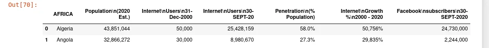

- After we rename the columns

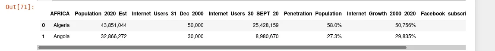

We can note that they are one differences between these two moments. After loading data from the CSV file, we can remark that the column's names have space. In a tuple, we cannot have a key name with space, thus pandas rename all column names like "**_<position_of_columns>"**  when rendering the tuple. It is the reason that we have our result in that form.

The output of DataFrame.itertuples() on data where we are already renaming columns is :

```python
for row in data.itertuples():
    print(row)
```

```python
Output:
Pandas(Index=0, AFRICA='Algeria', Population_2020_Est='43,851,044', Internet_Users_31_Dec_2000='50,000', Internet_Users_30_SEPT_20='25,428,159', Penetration_Population='58.0%', Internet_Growth_2000_2020='50,756%', Facebook_subscribers_30_SEPT_2020='24,730,000')
```

we can now access each element of tuple like **tuple.Internet_Users_31_Dec_2000.**  Moreover, we can also change the name of the returning tuple and disable the index in each of them.

```python
for row in data.itertuples(index=False, name="Data"):
    print(row)
```

```python
Output
Data(AFRICA='Algeria', Population_2020_Est='43,851,044', Internet_Users_31_Dec_2000='50,000', Internet_Users_30_SEPT_20='25,428,159', Penetration_Population='58.0%', Internet_Growth_2000_2020='50,756%', Facebook_subscribers_30_SEPT_2020='24,730,000')
```

### c. items() method

DataFrame.items() is another way to iterate over rows. it returns a pair of column name and series content. It has another variant called DataFrame.iteritems() which work as the same.

```python
for label, content in data.items():
    print(type(label),type(content))
```

```python
Output:
<class 'str'> <class 'pandas.core.series.Series'>
<class 'str'> <class 'pandas.core.series.Series'>
<class 'str'> <class 'pandas.core.series.Series'>
```

In this section, we saw three principal manners to iterate over rows in DataFrame. We can conclude that pandas offer various methods to explore data and each one is used depending on the case. In the following section, we will go through plotting with pandas

## 4. Visualize data quickly with Pandas
Pandas is a great tool for data analysis but it also allows us to quickly visualize data before going in in-depth visualization with a dedicated library like matplotlib or seaborn. For the following plotting, note that we have set column AFRICA as the index of DataFrame.

### a. Line plot

A line plot is a default plot offered by pandas. It shows the relationship between two variables and it is used only for numerical data.

```python
data['Penetration_Population'].plot()
```

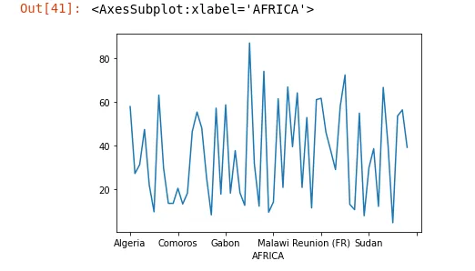

When we call DataFrame.plot(), by default, pandas plot a line plot. We can also plot the same line plot with the following code:

```python
data.plot(y="Penetration_Population")
```

where y represents the column of DataFrame which will be on the y-axis. We can make further customization like this:

```python
data.plot(y="Penetration_Population", figsize=[12,7], title="Percentage of penetration of internet in Africa", xlabel="Africa Countries", ylabel="Percentage in %", fontsize=20,style="--", rot=90, colormap="Accent")
```

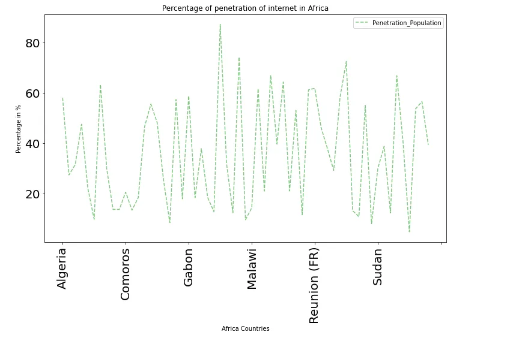

Let's explain what we made in this customization.

- **figsize** define the size of the visualization as follow : **figsize=[width, height]**
- **title** to give the title of graph
- **xlabel**  to define the title of x-axis and **ylabel** for the title for y-axis.
- **fontsize** give the size of labels on x and y axis
- **style** is used to set the line style for drawing. ([line style reference](https://matplotlib.org/3.0.3/gallery/lines_bars_and_markers/line_styles_reference.html))
- **rot** rotate the axis label with corresponding value.
- **colormap**  set the color of the diagram. The color accept here come from matplotlib. ( [matplotlib color list reference](https://matplotlib.org/stable/tutorials/colors/colormaps.html))

### b. Histogram

**A histogram** is a schema that represents a group of data points into range for easy interpretation of data. We can plot histogram with pandas like this:

```python
data.plot(kind="bar", figsize=[12,9], subplots=True, grid=True)
```

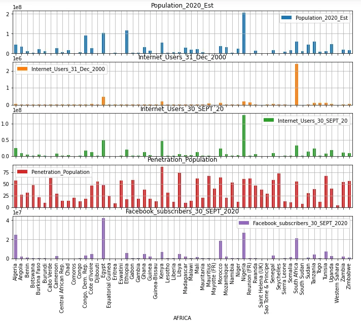

For this plot, we passed some additional parameters.

- **subplots** which tell pandas to make separate plot for each column
- **grid**  to add axis grid line for better reading.

### c. Pie plot

**A pie plot** is a circular representation of data that divide them into different proportion. We are going to plot a circular representation of Facebook subscribers on 30 SEPT 2020 for Africa countries where the number of subscribers is greater than the mean of all facebook subscribers in Africa on this date.

```python
df = data[data['Facebook_subscribers_30_SEPT_2020'] > data['Facebook_subscribers_30_SEPT_2020'].mean()]
df.plot(kind="pie", y="Penetration_Population",legend=True, figsize=[11,11])
```

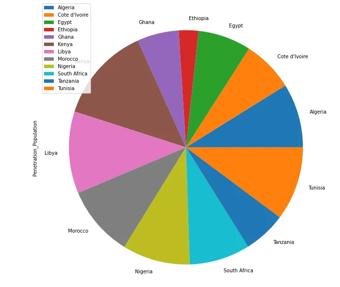

In this section, we saw how to plot data using pandas. We can't make all plots possible with pandas in this blog post. Instead, we only choose **line plot, histogram, and pie plot** to show you how the thing works. You can go through [pandas plot documentation](https://pandas.pydata.org/docs/reference/api/pandas.DataFrame.plot.html) to see many other plots you can do. For further customization, we must use matplotlib to overcome certain limitations of pandas plot method.

## Conclusion
Throughout this article, we have explained three pandas techniques for data manipulation. We saw how to use **apply** method both in DataFrame and Series. After, we explore the iteration over pandas DataFrame row and finally the plotting using pandas. You can find the source code [here](https://github.com/tderick/datainsightonelineprogram/tree/main/Pandas%20technique%20for%20datascience:%20blog%201). Hope you enjoy it! 👏
