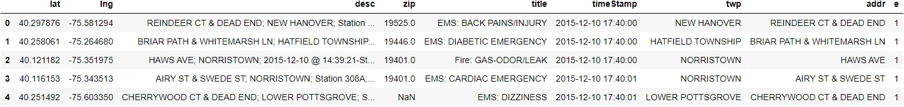
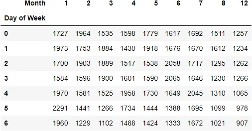
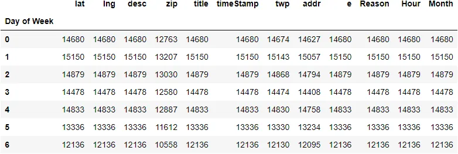

I bet you know that real-world data is a messy one. And we can not make inferences from messy data. That is why Python has libraries such as the **Pandas** to make it easier for us**.**

Before we dive right into it, let's talk about **Pandas**.

*What is Pandas in Python?*

**pandas** is a necessary python programming library, it is a fast, powerful, flexible, and easy-to-use open-source tool that is used for data analysis and manipulation. The pandas tool is one of the most popular data-wrangling and data manipulation packages. The tool pandas work well with many other data science modules inside the Python ecosystem.

Pandas make it simple to perform the following data manipulations with ease

- Extracting
- Filtering
- Transforming data into DataFrame
- Clearing a path for a quick and reliable data
- etc.

*You know there are a lot of Pandas Functions for data manipulation in python and it is also a very powerful library for data wrangling.*

Let's focus on five of these Functions;

1. pandas.apply()
2. pandas to_datatime()
3. pandas pivot_table()
4. pandas groupby()
5. pandas value_counts()

**Let's get started;**

In this blog, we will explore some of the functions that are very useful for the day-to-day data science journey. We will use the famous [911 dataset](https://www.kaggle.com/mchirico/montcoalert) from Kaggle for this work.

*A must-know is that all the examples we will use in this blog are that of the 911 dataset*.

The first thing first is for to us import the needed library which is pandas

```python
# import pandas library
import pandas as pd
```

Now, we can load the file. Since the file is a CSV we use the function ***read _csv()***

# load the data

```python
df = pd.read_csv('911.csv')
df.head()
```



Now, on our main focus let us talk about the pandas functions

## PANDAS .apply()

The pandas function, Pandas .apply() is a function that allows us to pass a function and apply that function on every single value of the Pandas series. It allows us to manipulate the columns and rows of DataFrame.

**Syntax:**

```python
df['s'] = df['s'].apply()
```

The Pandas function acts as a map() function in Python. It takes a function as an input and applies that function to an entire DataFrame.

Let's take an example;

*In this case, we are iterating over all the rows in the series and get getting letters before the colon This will help us create a new column called reason thus the reason why people call the police.*

```python
df['title']
```

**Output:**

```python
0             EMS: BACK PAINS/INJURY
1            EMS: DIABETIC EMERGENCY
2                Fire: GAS-ODOR/LEAK
3             EMS: CARDIAC EMERGENCY
4                     EMS: DIZZINESS
                    ...
99487    Traffic: VEHICLE ACCIDENT -
99488    Traffic: VEHICLE ACCIDENT -
99489               EMS: FALL VICTIM
99490           EMS: NAUSEA/VOMITING
99491    Traffic: VEHICLE ACCIDENT -
Name: title, Length: 99492, dtype: object
```

Look here;

```python
df['Reason'] = df['title'].apply(lambda title: title.split(':')[0])
```

```python
df['Reason']
```

**Output:**

```python
0            EMS
1            EMS
2           Fire
3            EMS
4            EMS
          ...
99487    Traffic
99488    Traffic
99489        EMS
99490        EMS
99491    Traffic
Name: Reason, Length: 99492, dtype: object
```

The example above with the code snippets demonstrates how to apply the .apply() function.

Moving on to the next,

## PANDAS to_datetime()

When we import a CSV file and a Data Frame is made, the Date Time objects in the file are read as a string rather than a Date Time object. Because of that, it makes it very difficult to perform operations like Time difference on a string. Pandas **to_datetime()** function allows us to covert an argument in a string Date time into Python Date time object.

This is going to help us to extract some useful information such us, time, days of the week, month, year, from the string.

**Syntax:**

```python
df['s'] = pd.to_datetime(arg)
```

**Parameters:**

```python
arg: An integer, string, float, list, or dict object to convert into a Date time object.
```

Let us look at how we are going to apply the to_datetime() function here,

*Looking at an example to demonstrate how to use the .to_datetime()*

From the code below, we want to know the hour, month and day of the

week that people call the police.

```python
df['timeStamp'] = pd.to_datetime(df['timeStamp'])
df['timeStamp']
```

**Output:**

```python
0       2015-12-10 17:40:00
1       2015-12-10 17:40:00
2       2015-12-10 17:40:00
3       2015-12-10 17:40:01
4       2015-12-10 17:40:01
                ...
99487   2016-08-24 11:06:00
99488   2016-08-24 11:07:02
99489   2016-08-24 11:12:00
99490   2016-08-24 11:17:01
99491   2016-08-24 11:17:02
Name: timeStamp, Length: 99492, dtype: datetime64[ns]
```

Lets continue coding;

```python
df['Hour'] = df['timeStamp'].apply(lambda time: time.hour)
df['Month'] = df['timeStamp'].apply(lambda time: time.month)
df['Day of Week'] = df['timeStamp'].apply(lambda time: time.dayofweek)
```

```python
df['Day of Week']
```

**Output:**

```python
0        3
1        3
2        3
3        3
4        3
        ..
99487    2
99488    2
99489    2
99490    2
99491    2
Name: Day of Week, Length: 99492, dtype: int64
```

Loading the DataFrame for Hour

```python
df['Hour']
```

**Output:**

```python
0        17
1        17
2        17
3        17
4        17
         ..
99487    11
99488    11
99489    11
99490    11
99491    11
Name: Hour, Length: 99492, dtype: int64
```

Moving on to the next function,

## PANDAS pivot_table()

Pivot_table() function is a pandas function that is used to create a spreadsheet-style pivot table as a DataFrame and operate in tabular data. Marking the data more reading and easy to understand.

**Syntax:**

```python
pd.pivot_table()
```

Let's work on an example, of how to apply the .pivot_table()

What we want to do in our case is to create a table such that, the days of the week will be the index, the month will be the column, and then populate each cell with the count of various user call reasons.

```python
dayMonth = pd.pivot_table(df,index='Day of Week',values='Reason',columns='Month',aggfunc='count')
```

```python
dayMonth
```

**Output:**



Next,

## Pandas groupby

Groupby function is a versatile function in python. This function allows us to group our data into different groups to enable us to perform analytical computation for better understanding.

A groupby operation involves combining the objects which have been split, then applying a function to it, and after combining the results. The pandas groupby function is used to group different large amounts of data and after that operates on these groups created.

Pandas groupby is used for grouping the data according to the categories and applying a function to the categories.

It gives a better idea and understanding of the groups, for further analysis.

**Syntax:**

```python
DataFrame.groupby()
```

Let's find the day people call the police the most. We can do that by simply grouping the data by the day of the week the field then we apply the count on it.

```python
df.groupby(['Day of Week']).count()
```

**Output:**



*We are now Combining another function called unstack() we can generate the same spread-sheet table created with pivot_table above.*

```python
df.groupby(['Day of Week','Month']).count()['Reason'].unstack()
```

**Output:**


Last but not the least function is the;

**PANDAS value_counts()**

Another useful pandas function is the value_counts(). Essentially, what the value_counts does is that it counts the objects in the DataFrame with unique values. This technique pd.value_counts() is mostly used for data wrangling, and data exploration in Python.

The **value_counts()** function in **Pandas** returns the output which contains counts of unique values. The results will be in descending order so that the element which occurs frequently comes first.

Again, It excludes Not Available (**NA)** values by default.

The value_counts() method returns an output containing counts of unique values in sorted order.

**Syntax:**

```python
df.value_counts()
```

Let's go-ahead to find out the top 20 towns that call the police a lot. By applying the value_counts and the head function, we have been able to get the top 20 towns with the most calls in descending order of magnitude. Using the .head() function.

```python
df['twp'].value_counts().head(20)
```

We can go ahead to get the percentage of each town by just setting the normalize attribute to True

```python
df['twp'].value_counts(normalize=True).head(20)
```

**Output:**

```python
LOWER MERION         0.084898
ABINGTON             0.060101
NORRISTOWN           0.059226
UPPER MERION         0.052560
CHELTENHAM           0.046003
POTTSTOWN            0.041690
UPPER MORELAND       0.034530
LOWER PROVIDENCE     0.032429
PLYMOUTH             0.031755
HORSHAM              0.030196
MONTGOMERY           0.027129
UPPER DUBLIN         0.026 526
WHITEMARSH           0.025400
UPPER PROVIDENCE     0.023258
LIMERICK             0.022846
SPRINGFIELD          0.022142
WHITPAIN             0.021468
EAST NORRITON        0.020493
LANSDALE             0.017527

HATFIELD TOWNSHIP    0.017416
Name: twp, dtype: float64
```

**Conclusion:**

The above are some Tutorials on Useful Pandas Techniques in Dealing with Data Using python.

**Note:**

A full glance at the code snippets can be found on my GitHub repository.

Feel free to check them out [here](https://github.com/Johnson-a-hash/Useful-Pandas-Techniques-in-Dealing-with-Data-Using-python)

HAPPY READING!!!!

Reference:

1. <https://www.geeksforgeeks.org/> - For more explanation on the pandas function and others
2. Data manipulation with pandas - DataCamp
